# Module 01: AlloyDB and BigQuery Interoperability

## Motivation:

Shoonya, our (hypothetical) retail store chain needs a variety of "fit for purpose" databases. Of focal importance to Shoonya are relational/transactional/operational database flavor and analytical database flavor. Shoonya is impressed with Google Cloud's database portfolio (including support for vector embeddings, subject area flavors such as graph, and geospatial), and Shoonya's Architecture board, after careful review of options for databases and considerations has landed on AlloyDB (postgres managed) as its operational datastore, and BigQuery as its Analytical datastore. Shoonya's data engineers need to ensure that data is in sync across the their operational datastore and analytical datastore and want a simplified solution to run data reconciliation without data movement or switiching database logins. 

This module covers a solution for AlloyDB and BigQuery interop for such seamless exploration and synchronization checks.

## Scope:

This features showcased are:<br>
1. **BigQuery federation into AlloyDB** - ability to query AlloyDB seamlessly from BigQuery without data movement.
2. **AlloyDB BigQuery Foreign Data Wrapper** - a postgres extension that enables a user logged onto AlloyDB to query data residing in BigQuery in real time, sealmessly, without data movement. Currently, read-only.

**This module includes:**
1. Creation of AlloyDB tables & ingesting CSV into tables
2. Creation of BigQuery tables & ingesting CSV into tables 
3. Interoperability configuration 
4. Querying tables in BigQuery from AlloyDB studio
5. Querying tables in AlloyDB from BigQuery studio
<hr>

## Duration:

This module should take no more than 15 minutes.

<hr>

## Private Documentation as of Dec 1, 2025:

Redacted 
<hr>

## Prerequisites:

1. Completion of [Module-00-provisioning](Module-00-Provisioning.md) unless its already automated for you/or you completed the Terraform scripts.
2. Cloning of the lab git repo if not completed already

```
git clone https://github.com/anagha-google/retail-supply-chain-workshop.git
```

<hr>

## Table of contents

| # | Learning unit | 
| -- | :--- | 
| 1 | [Create & load tables in AlloyDB](Module-01-AlloyDB-BQ-Interop.md#1-create-and-load-tables-in-alloydb) |
| 2 | [Create & load tables in BigQuery](Module-01-AlloyDB-BQ-Interop.md#2-create-and-load-tables-in-bigquery) |
| 3 | [BQ federation into AlloyDB](Module-01-AlloyDB-BQ-Interop.md#31-bigquery-federation-into-alloydb) |
| 4 | [AlloyDB Foriegn Data Wrapper for BigQuery](Module-01-AlloyDB-BQ-Interop.md#32-alloydb-foriegn-data-wrapper-for-bigquery) |

<hr>
<hr>


# Lab module

## Unit 1. Create and load tables in AlloyDB

### 1.1. Logon to AlloyDB

Follow the screenshots to login to rscw_db, rscw_schema.

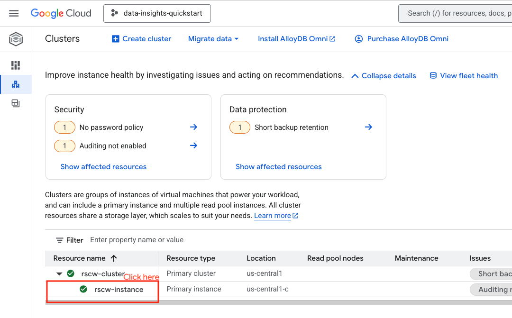   

<br>

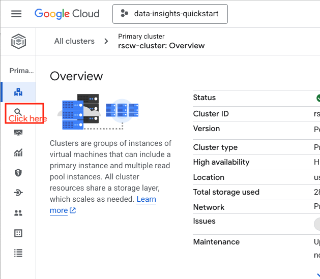   

<br>

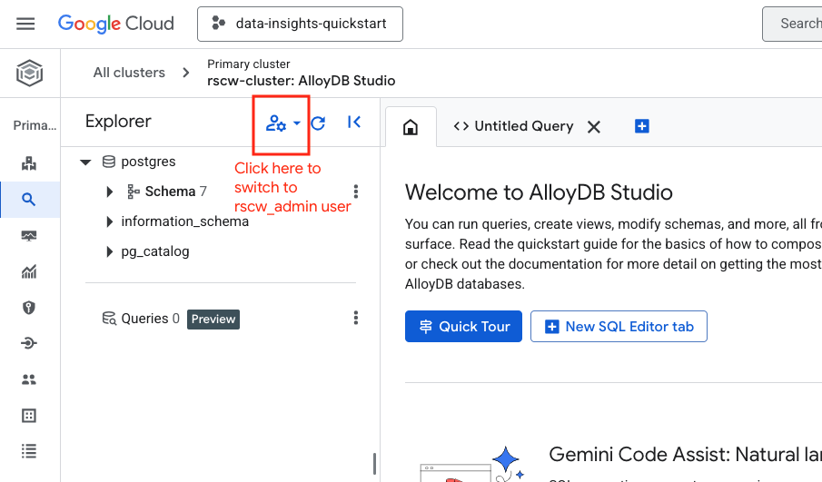   

<br>

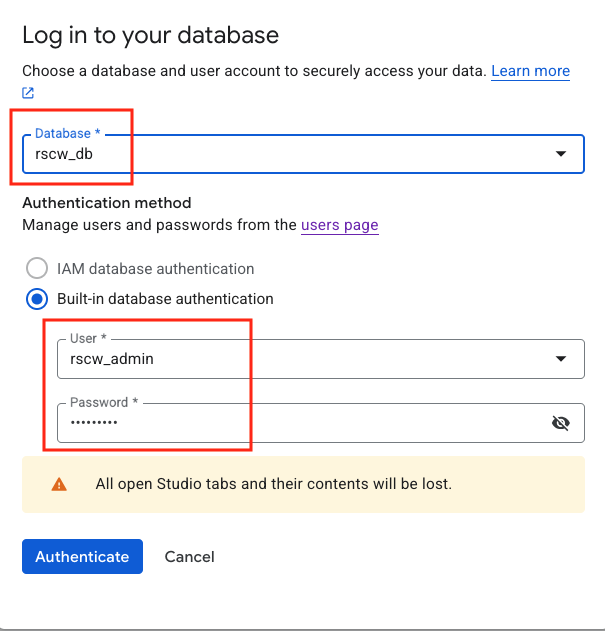  

<br>

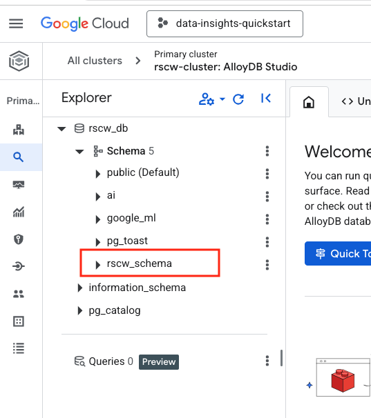   

<br>

<hr>


### 1.2. Create tables in AlloyDB 

Login to AlloyDB studio, to the rscw_db as the rscw_admin user and run the below DDLs to create tables.

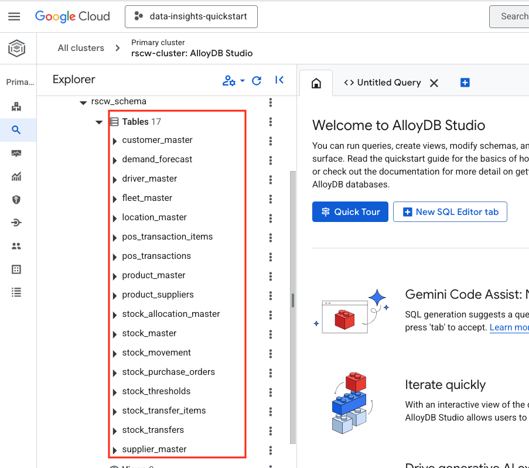   


```
-- customer_master
CREATE TABLE IF NOT EXISTS rscw_schema.customer_master
(
  customer_id TEXT,
  first_nm TEXT,
  last_nm TEXT,
  email TEXT,
  address TEXT,
  city TEXT,
  state_cd TEXT,
  zip_cd TEXT,
  country_cd TEXT,
  phone_nbr TEXT,
  PRIMARY KEY (customer_id)
);


-- product_master
CREATE TABLE IF NOT EXISTS rscw_schema.product_master
(
  product_id TEXT NOT NULL,
  product_nm TEXT,
  category_id TEXT,
  category_nm TEXT,
  height_cm INTEGER,
  length_cm INTEGER,
  width_cm INTEGER,
  weight_g INTEGER,
  price_dollar NUMERIC,
  safety_qty NUMERIC,
  PRIMARY KEY (product_id)
);

-- supplier_master
CREATE TABLE IF NOT EXISTS rscw_schema.supplier_master
(
  supplier_id TEXT,
  supplier_id_nm TEXT,
  contact_nm TEXT,
  contact_email TEXT,
  address TEXT,
  city TEXT,
  state_cd TEXT,
  zip_cd TEXT,
  country_cd TEXT,
  phone_nbr TEXT,
  PRIMARY KEY (supplier_id)
);


-- location_master
CREATE TABLE IF NOT EXISTS rscw_schema.location_master
(
  location_id TEXT,
  location_nm TEXT,
  location_type TEXT,
  address TEXT,
  city TEXT,
  state_cd TEXT,
  zip_cd TEXT,
  country_cd TEXT,
  phone_nbr TEXT,
  PRIMARY KEY (location_id)
);

-- driver_master
CREATE TABLE IF NOT EXISTS rscw_schema.driver_master
(
  driver_id TEXT,
  employee_id TEXT,
  PRIMARY KEY (driver_id)
  
);

-- fleet_master
CREATE TABLE IF NOT EXISTS rscw_schema.fleet_master
(
  vehicle_id TEXT,
  license_plate TEXT,
  vin TEXT,
  model TEXT,
  status TEXT,
  PRIMARY KEY (vehicle_id)
);

-- stock_master
CREATE TABLE IF NOT EXISTS rscw_schema.stock_master
(
  product_id TEXT,
  location_id TEXT,
  qty_on_hand BIGINT,
  reorder_point_for_loc BIGINT,
  stock_updt_dt TIMESTAMP WITHOUT TIME ZONE,
  PRIMARY KEY (product_id, location_id, stock_updt_dt),
  FOREIGN KEY (product_id) REFERENCES rscw_schema.product_master(product_id),
  FOREIGN KEY (location_id) REFERENCES rscw_schema.location_master(location_id)
  
);

-- stock_allocation_master
CREATE TABLE IF NOT EXISTS rscw_schema.stock_allocation_master
(
  product_id TEXT,
  location_id TEXT,
  total_qty_on_hand BIGINT,
  allocation_dt TIMESTAMP WITHOUT TIME ZONE,
  PRIMARY KEY (product_id, location_id, allocation_dt),
  FOREIGN KEY (product_id) REFERENCES rscw_schema.product_master(product_id),
  FOREIGN KEY (location_id) REFERENCES rscw_schema.location_master(location_id)
);

-- product_suppliers

CREATE TABLE IF NOT EXISTS rscw_schema.product_suppliers
(
  product_id TEXT,
  supplier_id TEXT,
  supplier_type TEXT,
  PRIMARY KEY (product_id, supplier_id),
  FOREIGN KEY (product_id) REFERENCES rscw_schema.product_master(product_id),
  FOREIGN KEY (supplier_id) REFERENCES rscw_schema.supplier_master(supplier_id)
);

-- pos_transactions
CREATE TABLE IF NOT EXISTS rscw_schema.pos_transactions
(
  transaction_id TEXT,
  location_id TEXT,
  customer_id TEXT,
  transaction_status TEXT,
  transaction_dt TIMESTAMP WITHOUT TIME ZONE,
  payment_type TEXT,
  payment_total_dollar NUMERIC,
  PRIMARY KEY (transaction_id),
  FOREIGN KEY (location_id) REFERENCES rscw_schema.location_master(location_id),
  FOREIGN KEY (customer_id) REFERENCES rscw_schema.customer_master(customer_id)
);


-- pos_transaction_items
CREATE TABLE IF NOT EXISTS rscw_schema.pos_transaction_items
(
  transaction_id TEXT,
  transaction_item_id INTEGER,
  product_id TEXT,
  supplier_id TEXT, 
  quantity BIGINT,
  price NUMERIC,
  transaction_item_total NUMERIC,
  PRIMARY KEY (transaction_id, transaction_item_id),
  FOREIGN KEY (transaction_id) REFERENCES rscw_schema.pos_transactions(transaction_id),
  FOREIGN KEY (product_id) REFERENCES rscw_schema.product_master(product_id),
  FOREIGN KEY (supplier_id) REFERENCES rscw_schema.supplier_master(supplier_id)
);

-- demand_forecast
CREATE TABLE IF NOT EXISTS rscw_schema.demand_forecast
( 
  product_id TEXT,
  location_id TEXT,
  total_qty_on_hand BIGINT,
  forecast_dt  TIMESTAMP WITHOUT TIME ZONE,
  PRIMARY KEY (product_id, location_id,forecast_dt),
  FOREIGN KEY (product_id) REFERENCES rscw_schema.product_master(product_id),
  FOREIGN KEY (location_id) REFERENCES rscw_schema.location_master(location_id)
);

-- stock_allocation_master
CREATE TABLE IF NOT EXISTS rscw_schema.stock_allocation_master
(
  product_id TEXT,
  location_id TEXT,
  total_qty_on_hand BIGINT,
  allocation_dt  TIMESTAMP WITHOUT TIME ZONE,
  PRIMARY KEY (product_id, location_id,forecast_dt),
  FOREIGN KEY (product_id) REFERENCES rscw_schema.product_master(product_id),
  FOREIGN KEY (location_id) REFERENCES rscw_schema.location_master(location_id)
);

-- stock_master
CREATE TABLE IF NOT EXISTS rscw_schema.stock_master
(
  product_id TEXT,
  location_id TEXT,
  qty_on_hand BIGINT,
  reorder_point_for_loc BIGINT,
  stock_updt_dt  TIMESTAMP WITHOUT TIME ZONE,
  PRIMARY KEY (product_id, location_id,stock_updt_dt),
  FOREIGN KEY (product_id) REFERENCES rscw_schema.product_master(product_id),
  FOREIGN KEY (location_id) REFERENCES rscw_schema.location_master(location_id)
);

-- stock_purchase_orders
CREATE TABLE IF NOT EXISTS rscw_schema.stock_purchase_orders
(
  stock_purchase_order_id TEXT,
  product_id TEXT,
  supplier_id TEXT,
  qty_ordered NUMERIC,
  qty_received NUMERIC,
  ordered_dt TIMESTAMP WITHOUT TIME ZONE,
  received_dt TIMESTAMP WITHOUT TIME ZONE,
  PRIMARY KEY (stock_purchase_order_id),
  FOREIGN KEY (product_id) REFERENCES rscw_schema.product_master(product_id),
  FOREIGN KEY (supplier_id) REFERENCES rscw_schema.supplier_master(supplier_id)
);

-- stock_movement
CREATE TABLE IF NOT EXISTS rscw_schema.stock_movement
(
  event_time TIMESTAMP WITHOUT TIME ZONE,
  product_id TEXT,
  qty_change BIGINT,
  movement_type TEXT,
  transaction_id TEXT,
  location_id TEXT,
  stock_purchase_order_id TEXT,
  CONSTRAINT unique_val_constraint UNIQUE (event_time, product_id, transaction_id,location_id,stock_purchase_order_id),
  FOREIGN KEY (product_id) REFERENCES rscw_schema.product_master(product_id),
  FOREIGN KEY (location_id) REFERENCES rscw_schema.location_master(location_id),
  FOREIGN KEY (transaction_id) REFERENCES rscw_schema.pos_transactions(transaction_id),
  FOREIGN KEY (stock_purchase_order_id) REFERENCES rscw_schema.stock_purchase_orders(stock_purchase_order_id)
);


-- stock_thresholds
CREATE TABLE IF NOT EXISTS rscw_schema.stock_thresholds
(
  product_id TEXT,
  supplier_id TEXT,
  reorder_point NUMERIC,
  lead_time_days NUMERIC,
  PRIMARY KEY (product_id, supplier_id),
  FOREIGN KEY (product_id) REFERENCES rscw_schema.product_master(product_id),
  FOREIGN KEY (supplier_id) REFERENCES rscw_schema.supplier_master(supplier_id)
);

-- stock_transfer_items
CREATE TABLE IF NOT EXISTS rscw_schema.stock_transfer_items
(
  stock_transfer_id TEXT,
  product_id TEXT,
  qty BIGINT,
  PRIMARY KEY (product_id, stock_transfer_id),
  FOREIGN KEY (product_id) REFERENCES rscw_schema.product_master(product_id)
);

-- stock_transfers
CREATE TABLE IF NOT EXISTS rscw_schema.stock_transfers
(
  stock_transfer_id TEXT,
  stock_transfer_type TEXT,
  vehicle_id TEXT,
  driver_id TEXT,
  origin_loc_id TEXT,
  destination_loc_id TEXT,
  status TEXT,
  departutre_timestamp TIMESTAMP WITHOUT TIME ZONE,
  arrival_timestamp TIMESTAMP WITHOUT TIME ZONE, 
  PRIMARY KEY (stock_transfer_id),
  FOREIGN KEY (vehicle_id) REFERENCES rscw_schema.fleet_master(vehicle_id),
  FOREIGN KEY (driver_id) REFERENCES rscw_schema.driver_master(driver_id)

);

```

Here is what the table listing should look like:

   

<hr>


### 1.3. Load data into AlloyDB from CSV files in Cloud Storage


#### 1.3.1. IAM permissions

In the provisioning module, we granted storage object viewer permissions to the AlloyDB service agent account - a permission needed for the next activity.

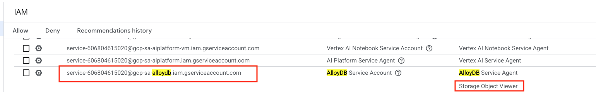   


<br>

<hr>

#### 1.3.2. Variables

```
SRC_BUCKET="gs://rscw-stg/source-stg"
ALLOYDB_CLUSTER_NM="rscw-cluster"
LOCATION="us-central1"
DATABASE="rscw_db"
SCHEMA="rscw_schema"
USER="rscw_admin"
```
<br>

<hr>

#### 1.3.3. Empty tables before ingesting 

**Note**: <br>
This is applicable if you are redoing this module for any reason. Skip this section if you are working on the module for the first time.<br>
Paste the below in AlloyDB studio.<br>


```
--Highlight 2-3 tables at a time and run or the script may timeout
--This step can be skipped if you are running this module the first time around
--Note: Truncate did not work due to foriegn key constraints, therefore the 'delete from' - which is slower - workaround - drop constraints, truncate, reapply constraints
delete from rscw_schema.stock_movement;commit;
delete from rscw_schema.stock_thresholds;commit;
delete from rscw_schema.stock_allocation_master;commit;
delete from rscw_schema.stock_master;commit;
delete from rscw_schema.stock_purchase_orders;commit;
delete from rscw_schema.demand_forecast; commit;
delete from rscw_schema.pos_transaction_items;commit;
delete from rscw_schema.pos_transactions;commit;
delete from rscw_schema.product_suppliers;commit;
delete from rscw_schema.stock_thresholds;commit;
delete from rscw_schema.product_suppliers;commit;
delete from rscw_schema.supplier_master;commit;
delete from rscw_schema.product_master;commit;
delete from rscw_schema.location_master;commit;
delete from rscw_schema.fleet_master;commit;
delete from rscw_schema.driver_master;commit;
delete from rscw_schema.customer_master;commit;
```
<br>

<hr>

#### 1.3.4. Upload CSV files to Cloud Storage

The lab repo you cloned has data in 3NF and should be uploaded to a cloud storage bucket (GCS) for ingestion into AlloyDB. Run the commands below to complete the upload to GCS.<br>

In Cloud Shell, paste the below commands.

1. Navigate to the repo
```
cd retail-supply-chain-workshop
cd 01-data-assets/3nf_ingest
```

2.Declare variables
```
PROJECT_ID=`gcloud config list --format "value(core.project)" 2>/dev/null`
PROJECT_NBR=`gcloud projects describe $PROJECT_ID | grep projectNumber | cut -d':' -f2 |  tr -d "'" | xargs`
PROJECT_NAME=`gcloud projects describe ${PROJECT_ID} | grep name | cut -d':' -f2 | xargs`
UPN_FQN=`gcloud auth list --filter=status:ACTIVE --format="value(account)"`

LOCATION="us-central1"
BQ_TO_ALLOYDB_CONNECTION="rscw-bq-alloydb-conn"

OLTP_STAGE_BUCKET="rscw-oltp-stg-$PROJECT_NBR"
DATAWAREHOUSE_STAGE_BUCKET="rscw-dwh-stg-$PROJECT_NBR"
```

3. Upload to GCS
```
gsutil -m cp *.csv gs://$OLTP_STAGE_BUCKET/3nf_ingest/
```


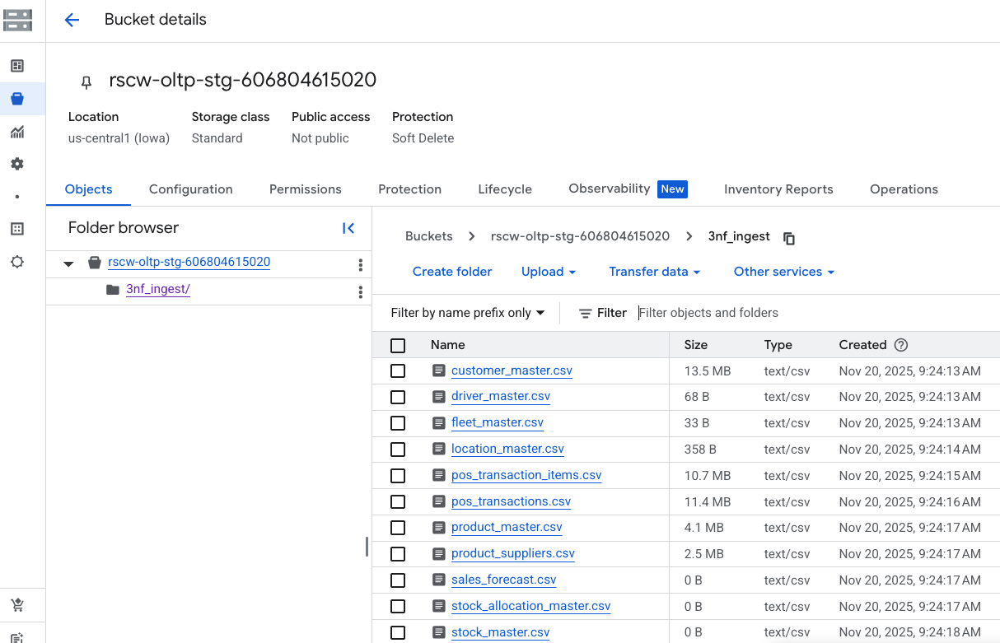   

<hr>

#### 1.3.5. Import the CSV data in GCS into AlloyDB from the CLI

Run the below in Cloud Shell:
```
# 1) Master data - 8 tables
MASTER_TBL_ARRAY=("customer_master"  "driver_master" "fleet_master" "product_master" "location_master" "supplier_master" "product_suppliers" "stock_thresholds") 

for table in "${MASTER_TBL_ARRAY[@]}"; do
  echo "Loading table $table"
  gcloud alloydb clusters import $ALLOYDB_CLUSTER_NM --region=$LOCATION --database=$DATABASE --gcs-uri="$SRC_BUCKET/$table.csv" --user=$USER --table="$SCHEMA.$table" --field-delimiter='7c'  --csv
  echo "Done loading table $table"
  echo "========================="
done
```

```
# 2) Transactional data - 4 tables
TRANSACTIONAL_TBL_ARRAY=("pos_transactions"  "pos_transaction_items" "stock_purchase_orders"  "stock_movement") 
for table in "${TRANSACTIONAL_TBL_ARRAY[@]}"; do
  echo "Loading table $table"
  gcloud alloydb clusters import $ALLOYDB_CLUSTER_NM --region=$LOCATION --database=$DATABASE --gcs-uri="$SRC_BUCKET/$table.csv" --user=$USER --table="$SCHEMA.$table" --field-delimiter='7c'  --csv
  echo "Done loading table $table"
  echo "========================="
done
```
<br>

<hr>


#### 1.3.6. Validate row counts 

In AlloyDB studio, paste the below, uncomment each SQL and ensure the count is accurate:
```
--select count(*) from rscw_schema.customer_master; --99441
--select count(*) from rscw_schema.driver_master; --4
--select count(*) from rscw_schema.fleet_master; --3
--select count(*) from rscw_schema.location_master;--4
--select count(*) from rscw_schema.product_master; --32321
--select count(*) from rscw_schema.supplier_master; --2834
--select count(*) from rscw_schema.product_suppliers; --33639
--select count(*) from rscw_schema.stock_thresholds; --32618
--select count(*) from rscw_schema.pos_transactions; --90644
--select count(*) from rscw_schema.pos_transaction_items; --94127
--select count(*) from rscw_schema.stock_purchase_orders; --34589
```

<br>

<hr>

#### 1.3.6. Query a table or two from AlloyDB studio

```
select distinct category_nm from  rscw_schema.product_master order by 1; 
```

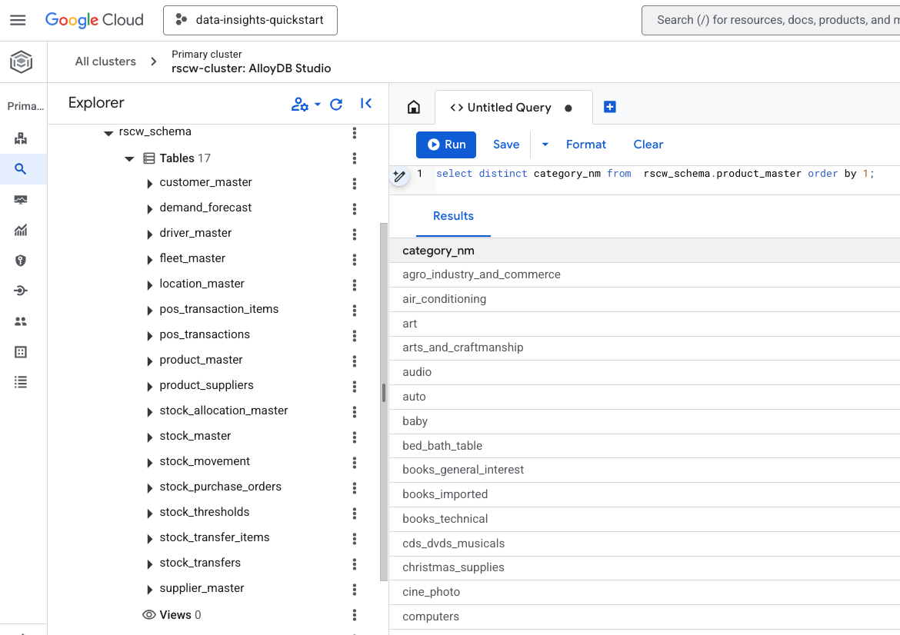   


<br>

<hr>

## Unit 2. Create and load tables in BigQuery

### 2.1. Upload data to Cloud Storage


Similar to the previous exercise, we will complete the data upload to GCS in preparation for ingestion into BigQuery.<br>


In Cloud Shell, paste the below commands.<br>

1. Navigate to the repo<br>
```
cd retail-supply-chain-workshop
cd 01-data-assets/3nf_ingest
```

2.Declare variables<br>
```
PROJECT_ID=`gcloud config list --format "value(core.project)" 2>/dev/null`
PROJECT_NBR=`gcloud projects describe $PROJECT_ID | grep projectNumber | cut -d':' -f2 |  tr -d "'" | xargs`
PROJECT_NAME=`gcloud projects describe ${PROJECT_ID} | grep name | cut -d':' -f2 | xargs`
UPN_FQN=`gcloud auth list --filter=status:ACTIVE --format="value(account)"`

LOCATION="us-central1"
DATAWAREHOUSE_STAGE_BUCKET="rscw-dwh-stg-$PROJECT_NBR"
```

3. Upload to GCS<br>
```
gsutil -m cp *.csv gs://$DATAWAREHOUSE_STAGE_BUCKET/3nf_ingest/
```

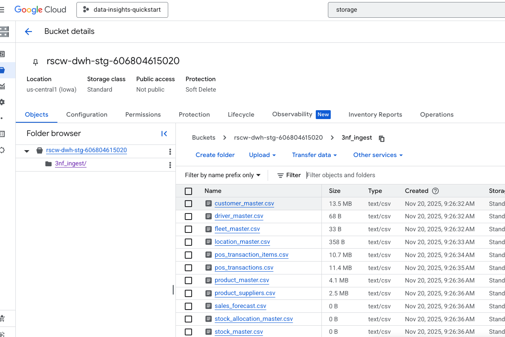 

<br><br>

<hr>

### 2.2. Create tables in BigQuery 

Run the below in BigQuery studio:

```
--- DDL for table: customer_master 
CREATE OR REPLACE TABLE `rscw_oltp_stg_ds.customer_master` (customer_id STRING ,    first_nm STRING ,    last_nm STRING ,    email STRING ,    address STRING ,    city STRING ,    state_cd STRING ,    zip_cd STRING ,    country_cd STRING ,    phone_nbr STRING );
--- DDL for table: driver_master 
CREATE OR REPLACE TABLE `rscw_oltp_stg_ds.driver_master` (driver_id STRING ,    employee_id STRING );
--- DDL for table: fleet_master 
CREATE OR REPLACE TABLE `rscw_oltp_stg_ds.fleet_master` (vehicle_id STRING ,    license_plate STRING ,    vin STRING ,    model STRING ,    status STRING );
--- DDL for table: location_master 
CREATE OR REPLACE TABLE `rscw_oltp_stg_ds.location_master` (location_id STRING ,    location_nm STRING ,    location_type STRING ,    address STRING ,    city STRING ,    state_cd STRING ,    zip_cd STRING ,    country_cd STRING ,    phone_nbr STRING );
--- DDL for table: pos_transaction_items 
CREATE OR REPLACE TABLE `rscw_oltp_stg_ds.pos_transaction_items` (transaction_id STRING ,    transaction_item_id INT64 ,    product_id STRING ,    supplier_id STRING ,    quantity INT64 ,    price FLOAT64 ,    line_item_total FLOAT64 );
--- DDL for table: pos_transactions 
CREATE OR REPLACE TABLE `rscw_oltp_stg_ds.pos_transactions` (transaction_id STRING ,    location_id STRING ,    customer_id STRING ,    transaction_status STRING ,    transaction_dt TIMESTAMP ,    payment_type STRING ,    payment_total_dollar FLOAT64 );
--- DDL for table: product_master 
CREATE OR REPLACE TABLE `rscw_oltp_stg_ds.product_master` (product_id STRING ,    product_nm STRING ,    category_id STRING ,    category_nm STRING ,    height_cm INT64 ,    length_cm INT64 ,    width_cm INT64 ,    weight_g INT64 ,    price_dollar FLOAT64 ,    safety_qty FLOAT64 );
--- DDL for table: product_suppliers 
CREATE OR REPLACE TABLE `rscw_oltp_stg_ds.product_suppliers` (product_id STRING ,    supplier_id STRING ,    supplier_type STRING );
--- DDL for table: sales_forecast 
CREATE OR REPLACE TABLE `rscw_oltp_stg_ds.sales_forecast` (product_id STRING ,    location_id STRING ,    total_qty_on_hand INT64 ,    forecast_dt TIMESTAMP );
--- DDL for table: stock_allocation_master 
CREATE OR REPLACE TABLE `rscw_oltp_stg_ds.stock_allocation_master` (product_id STRING ,    location_id STRING ,    location_type STRING ,    total_qty_on_hand INT64 ,    allocation_dt TIMESTAMP );
--- DDL for table: stock_master 
CREATE OR REPLACE TABLE `rscw_oltp_stg_ds.stock_master` (product_id STRING ,    location_id STRING ,    qty_on_hand INT64 ,    reorder_point_for_loc INT64 ,    stock_updt_dt TIMESTAMP );
--- DDL for table: stock_movement 
CREATE OR REPLACE TABLE `rscw_oltp_stg_ds.stock_movement` (event_time TIMESTAMP ,    product_id STRING ,    qty_change INT64 ,    movement_type STRING ,    transaction_id STRING ,    location_id STRING ,    stock_purchase_order_id STRING );
--- DDL for table: stock_purchase_orders 
CREATE OR REPLACE TABLE `rscw_oltp_stg_ds.stock_purchase_orders` (stock_purchase_order_id STRING ,    product_id STRING ,    supplier_id STRING ,    qty_ordered FLOAT64 ,    qty_received FLOAT64 ,    ordered_dt TIMESTAMP ,    received_dt TIMESTAMP );
--- DDL for table: stock_thresholds 
CREATE OR REPLACE TABLE `rscw_oltp_stg_ds.stock_thresholds` (product_id STRING ,    supplier_id STRING ,    reorder_point FLOAT64 ,    lead_time_days FLOAT64 );
--- DDL for table: stock_transfer_items 
CREATE OR REPLACE TABLE `rscw_oltp_stg_ds.stock_transfer_items` (stock_transfer_id STRING ,    product_id STRING ,    qty INT64 );
--- DDL for table: stock_transfers 
CREATE OR REPLACE TABLE `rscw_oltp_stg_ds.stock_transfers` (stock_transfer_id STRING ,    stock_transfer_type STRING ,    vehicle_id STRING ,    driver_id STRING ,    origin_loc_id STRING ,    destination_loc_id STRING ,    status STRING ,    departure_timestamp TIMESTAMP ,    arrival_timestamp TIMESTAMP );
--- DDL for table: supplier_master 
CREATE OR REPLACE TABLE `rscw_oltp_stg_ds.supplier_master` (supplier_id STRING ,    supplier_nm STRING ,    contact_nm STRING ,    contact_email STRING ,    address STRING ,    city STRING ,    state_cd STRING ,    zip_cd STRING ,    country_cd STRING ,    phone_nbr STRING );

```

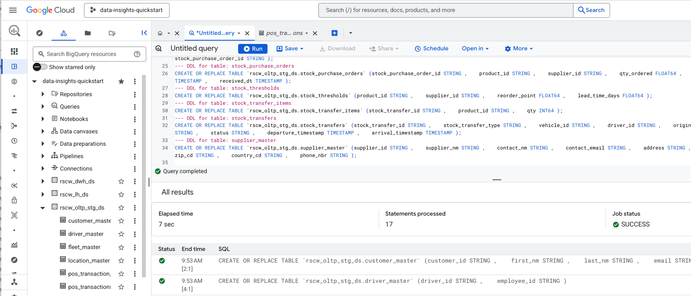 

<br><br>

<hr>

### 2.2. Load data into tables in BigQuery 

Run the below in BigQuery Studio - BUT NOTE - REPLACE AUTHOR's PROJECT_NUMBER WITH YOURS -

```
--NOTE: Replace the (author's) project number suffix at the end of the stage bucket name with your project number.
--E.g. Replace gs://rscw-dwh-stg-606804615020/3nf_ingest/customer_master.csv`
--with
--`gs://rscw-dwh-stg-YOUR_PROJECT_NUMBER/3nf_ingest/customer_master.csv`

LOAD DATA OVERWRITE rscw_oltp_stg_ds.customer_master(
  customer_id STRING,
  first_nm STRING,
  last_nm STRING,
  email STRING,
  address STRING,
  city STRING,
  state_cd STRING,
  zip_cd STRING,
  country_cd STRING,
  phone_nbr STRING
)
FROM FILES(format = 'CSV', uris = ARRAY['gs://rscw-dwh-stg-606804615020/3nf_ingest/customer_master.csv'],
  field_delimiter = '|');


LOAD DATA OVERWRITE rscw_oltp_stg_ds.driver_master(
  driver_id STRING ,    
  employee_id STRING
)
FROM FILES(format = 'CSV', uris = ARRAY['gs://rscw-dwh-stg-606804615020/3nf_ingest/driver_master.csv'],
  field_delimiter = '|');

LOAD DATA OVERWRITE rscw_oltp_stg_ds.fleet_master(
vehicle_id STRING ,    license_plate STRING ,    vin STRING ,    model STRING ,    status STRING 
)
FROM FILES(format = 'CSV', uris = ARRAY['gs://rscw-dwh-stg-606804615020/3nf_ingest/fleet_master.csv'],
  field_delimiter = '|');

LOAD DATA OVERWRITE rscw_oltp_stg_ds.location_master(
location_id STRING ,    location_nm STRING ,    location_type STRING ,    address STRING ,    city STRING ,    state_cd STRING ,    zip_cd STRING ,    country_cd STRING ,    phone_nbr STRING 
)
FROM FILES(format = 'CSV', uris = ARRAY['gs://rscw-dwh-stg-606804615020/3nf_ingest/location_master.csv'],
  field_delimiter = '|');

LOAD DATA OVERWRITE rscw_oltp_stg_ds.pos_transaction_items(
transaction_id STRING ,    transaction_item_id INT64 ,    product_id STRING ,    supplier_id STRING ,    quantity INT64 ,    price FLOAT64 ,    line_item_total FLOAT64  
)
FROM FILES(format = 'CSV', uris = ARRAY['gs://rscw-dwh-stg-606804615020/3nf_ingest/pos_transaction_items.csv'],
  field_delimiter = '|');

LOAD DATA OVERWRITE rscw_oltp_stg_ds.pos_transactions(
transaction_id STRING ,    location_id STRING ,    customer_id STRING ,    transaction_status STRING ,    transaction_dt TIMESTAMP ,    payment_type STRING ,    payment_total_dollar FLOAT64 
)
FROM FILES(format = 'CSV', uris = ARRAY['gs://rscw-dwh-stg-606804615020/3nf_ingest/pos_transactions.csv'],
  field_delimiter = '|');

LOAD DATA OVERWRITE rscw_oltp_stg_ds.product_master(
product_id STRING ,    product_nm STRING ,    category_id STRING ,    category_nm STRING ,    height_cm INT64 ,    length_cm INT64 ,    width_cm INT64 ,    weight_g INT64 ,    price_dollar FLOAT64 ,    safety_qty FLOAT64
)
FROM FILES(format = 'CSV', uris = ARRAY['gs://rscw-dwh-stg-606804615020/3nf_ingest/product_master.csv'],
  field_delimiter = '|');

LOAD DATA OVERWRITE rscw_oltp_stg_ds.product_suppliers(
product_id STRING ,    supplier_id STRING ,    supplier_type STRING 
)
FROM FILES(format = 'CSV', uris = ARRAY['gs://rscw-dwh-stg-606804615020/3nf_ingest/product_suppliers.csv'],
  field_delimiter = '|');

LOAD DATA OVERWRITE rscw_oltp_stg_ds.stock_movement(
event_time TIMESTAMP ,    product_id STRING ,    qty_change INT64 ,    movement_type STRING ,    transaction_id STRING ,    location_id STRING ,    stock_purchase_order_id STRING
)
FROM FILES(format = 'CSV', uris = ARRAY['gs://rscw-dwh-stg-606804615020/3nf_ingest/stock_movement.csv'],
  field_delimiter = '|');

LOAD DATA OVERWRITE rscw_oltp_stg_ds.stock_purchase_orders(
stock_purchase_order_id STRING ,    product_id STRING ,    supplier_id STRING ,    qty_ordered FLOAT64 ,    qty_received FLOAT64 ,    ordered_dt TIMESTAMP ,    received_dt TIMESTAMP
)
FROM FILES(format = 'CSV', uris = ARRAY['gs://rscw-dwh-stg-606804615020/3nf_ingest/stock_purchase_orders.csv'],
  field_delimiter = '|');

LOAD DATA OVERWRITE rscw_oltp_stg_ds.stock_thresholds(
product_id STRING ,    supplier_id STRING ,    reorder_point FLOAT64 ,    lead_time_days FLOAT64
)
FROM FILES(format = 'CSV', uris = ARRAY['gs://rscw-dwh-stg-606804615020/3nf_ingest/stock_thresholds.csv'],
  field_delimiter = '|');

LOAD DATA OVERWRITE rscw_oltp_stg_ds.supplier_master(
supplier_id STRING ,    supplier_nm STRING ,    contact_nm STRING ,    contact_email STRING ,    address STRING ,    city STRING ,    state_cd STRING ,    zip_cd STRING ,    country_cd STRING ,    phone_nbr STRING
)
FROM FILES(format = 'CSV', uris = ARRAY['gs://rscw-dwh-stg-606804615020/3nf_ingest/supplier_master.csv'],
  field_delimiter = '|');

```

### 2.3. Validate data load into tables in BigQuery 

Run a couple SQL in BigQuery to validate the success of the load from BigQuery studio-

```
select count(*) from rscw_oltp_stg_ds.supplier_master;
```


<br>

<hr><hr>


## Unit 3. Interoperability configuration & cross product seamless read access 

### 3.1. BigQuery federation into AlloyDB

#### 3.1.1. Create the connection 

Run the below from Cloud Shell:

```
PROJECT_ID=`gcloud config list --format "value(core.project)" 2>/dev/null`
PROJECT_NBR=`gcloud projects describe $PROJECT_ID | grep projectNumber | cut -d':' -f2 |  tr -d "'" | xargs`
PROJECT_NAME=`gcloud projects describe ${PROJECT_ID} | grep name | cut -d':' -f2 | xargs`
LOCATION="us-central1"
ALLOY_DB_CLUSTER="rscw-cluster"
ALLOY_DB_INSTANCE="rscw-instance"
BQ_TO_ALLOYDB_CONNECTION="rscw-bq-alloydb-conn"

# Switch to the user managed service account
gcloud config set auth/impersonate_service_account $UMSA_FQN

# Create the connection
# **NOTE: Replace project ID with your project ID, same with password**
bq mk \
  --connection \
  --location=$LOCATION \
  --project_id=$PROJECT_ID \
  --connector_configuration '{
    "connector_id": "google-alloydb",
    "asset": {
      "database": "rscw_db",
      "google_cloud_resource": "//alloydb.googleapis.com/projects/YOUR_PROJECT_ID/locations/us-central1/clusters/rscw-cluster/instances/rscw-instance"
    },
    "authentication": {
      "username_password": {
        "username": "rscw_admin",
        "password": {
          "plaintext": "YOUR_PASSWORD"
        }
      }
    }
  }' \
  $BQ_TO_ALLOYDB_CONNECTION

```

Author's output:
```
Connection 606804615020.us-central1.rscw-bq-alloydb-conn successfully created
```

```
# Switch back to your UPN
gcloud config unset auth/impersonate_service_account
```

```
# Should you need to remove the connection
# bq rm --location=$LOCATION --project_id=$PROJECT_ID  --connection  $BQ_TO_ALLOYDB_CONNECTION
```

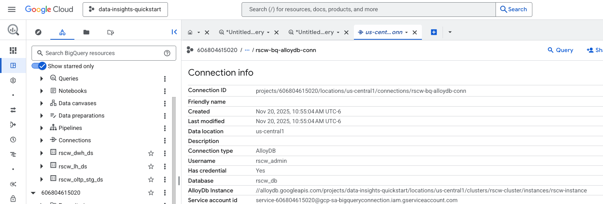 

<br><br>

<hr>

#### 3.1.2. Grant the connection service agent the requisite IAM permissions

Grant the service agent created automatically upon connection creation the requisite roles by running the commands below in Cloud Shell. <br>

**Note:** Ensure you follow the principle of least privilege in yiur enterprise environment.

```
GMSA="service-$PROJECT_NBR@gcp-sa-bigqueryconnection.iam.gserviceaccount.com"
echo $GMSA

gcloud projects add-iam-policy-binding $PROJECT_ID \
  --member="serviceAccount:$GMSA" \
  --role="roles/alloydb.client"

gcloud projects add-iam-policy-binding $PROJECT_ID \
  --member="serviceAccount:$GMSA" \
  --role="roles/alloydb.admin"
```

<br><br>

<hr>

#### 3.1.3. Query AlloyDB from BigQuery Studio

Run the below SQL from BigQuery studio:

```
SELECT * FROM EXTERNAL_QUERY("us-central1.rscw-bq-alloydb-conn",
'select distinct category_nm from  rscw_schema.product_master order by 1;')
```

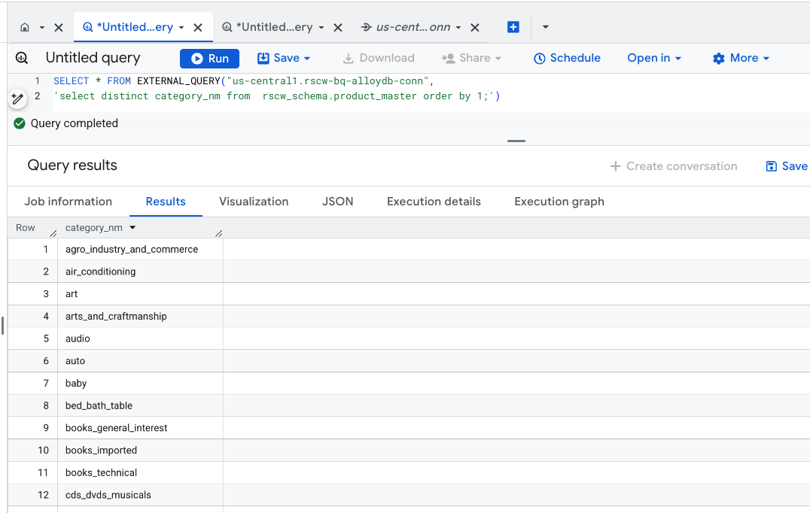 

<br><br>

<hr>

### 3.2. AlloyDB Foriegn Data Wrapper for BigQuery

AlloyDB BigQuery Foreign Data Wrapper is a postgres extension that enables AlloyDB to query data residing in BigQuery in real time. Currently, read-only.<br>
- Uses BigQuery Read API cloud client libraries where communication happens over gRPC
- Supports BigQuery Native Tables, BigLake Iceberg Table in BigQuery; Views are not yet supported
- Currently needs allowlisting at the AlloyDB instance level

**Note**: This feature needs allowlisting with the form:<br>
https://docs.google.com/forms/d/1NIonWtsMgGbbWuVdFKiSIOnsbZ50UX85mL5fBtrmOlw/edit?resourcekey=0-meZ-Wfu1ABNPUPPNsUatcg <br>

**TODO:** Pinged Pulkit Bhanot for expedited allow-listing. Need to explore allow-listing enmasse for Accelerate or descope this<br>

<hr>

#### 3.2.1. Incremental IAM permissions

To grant read access to the BigQuery Dataset to the AlloyDB cluster service account, you need the following permissions. 

1. BigQuery Data Viewer (roles/bigquery.dataViewer) or any custom role with permissions bigquery.tables.get and bigquery.tables.getData. When granted on a table or view, this role provides permissions to read data and metadata from the table or view.
2. BigQuery Read Session User (roles/bigquery.readSessionUser) or any custom role with permissions bigquery.readsessions.create and bigquery.readsessions.getData. Provides the ability to create and use read sessions.

Run the below in Cloud Shell:

```
PROJECT_ID=`gcloud config list --format "value(core.project)" 2>/dev/null`
PROJECT_NBR=`gcloud projects describe $PROJECT_ID | grep projectNumber | cut -d':' -f2 |  tr -d "'" | xargs`

ALLOY_DB_CLUSTER_GMSA=`gcloud beta alloydb clusters describe rscw-cluster --region=us-central1 | grep serviceAccountEmail | cut -d':' -f2 | tr -s ' ' | sed 's/^ //g'`
echo "The cluster service account is: $ALLOY_DB_CLUSTER_GMSA"

gcloud projects add-iam-policy-binding $PROJECT_ID \
  --member="serviceAccount:$ALLOY_DB_CLUSTER_GMSA" \
  --role="roles/bigquery.dataViewer"


gcloud projects add-iam-policy-binding $PROJECT_ID \
  --member="serviceAccount:$ALLOY_DB_CLUSTER_GMSA" \
  --role="roles/bigquery.readSessionUser"

```

#### 3.2.2. Create extension, server and mapping

Run the below in AlloyDB studio, logged into rscw_db as rscw_admin<br>

**NOTE: REPLACE PROJECT ID WITH YOURS** <br> <br>


##### 3.2.2.1. One time activity - set up the interop connection

1. Create an extension
```
CREATE EXTENSION bigquery_fdw;
```

2. Create a server
```
CREATE SERVER BQ_SERVER_IN_ALLOYDB FOREIGN DATA WRAPPER bigquery_fdw;
```

3. Create user mapping
```
CREATE USER MAPPING FOR rscw_admin SERVER BQ_SERVER_IN_ALLOYDB;
```

##### 3.2.2.2. For each table - one time activity

Since this is just a primer, we will run this for just one table.
```
CREATE FOREIGN TABLE customer_master (
  customer_id VARCHAR(50),
  first_nm VARCHAR(50),
  last_nm VARCHAR(50),
  email VARCHAR(50),
  address VARCHAR(200),
  city VARCHAR(100),
  state_cd VARCHAR(2),
  zip_cd VARCHAR(9),
  country_cd VARCHAR(3),
  phone_nbr VARCHAR(15)
) SERVER BQ_SERVER_IN_ALLOYDB OPTIONS (project 'data-insights-quickstart', dataset 'rscw_oltp_stg_ds', table 'customer_master');
```

##### 3.2.2.3. Query any/many times

Run the following query in AlloyDB studio against the table DDL you just ran in 3.2.2.2.
```
SELECT * FROM public.customer_master LIMIT 10;
```

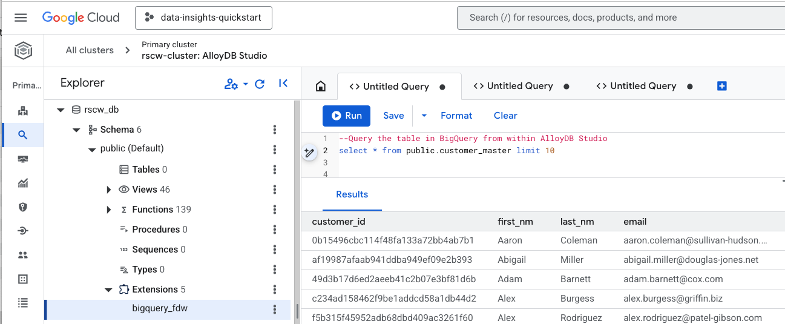 
<br><br>

<hr>

### 3.3 Cross database synchronization checks - sample

From AlloyDB, run the below:
```
SELECT 'BQ-Analytical-Database' as database, count(*) as customer_count FROM public.customer_master
UNION
SELECT 'AlloyDB-Operational-Database' as database, count(*) as customer_count FROM customer_master
```
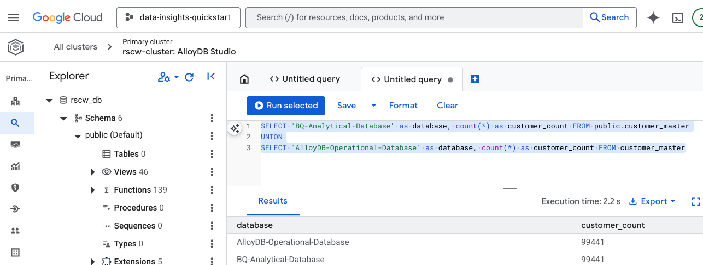 
<br><br>

From Bigquery, run the below:
```
SELECT 'BQ-Analytical-Database' as database, count(*) as customer_count FROM rscw_oltp_stg_ds.customer_master
UNION ALL
SELECT 'AlloyDB-Operational-Database' as database,customer_count FROM EXTERNAL_QUERY("us-central1.rscw-bq-alloydb-conn",
'select count(*) as customer_count FROM  rscw_schema.customer_master;')
```
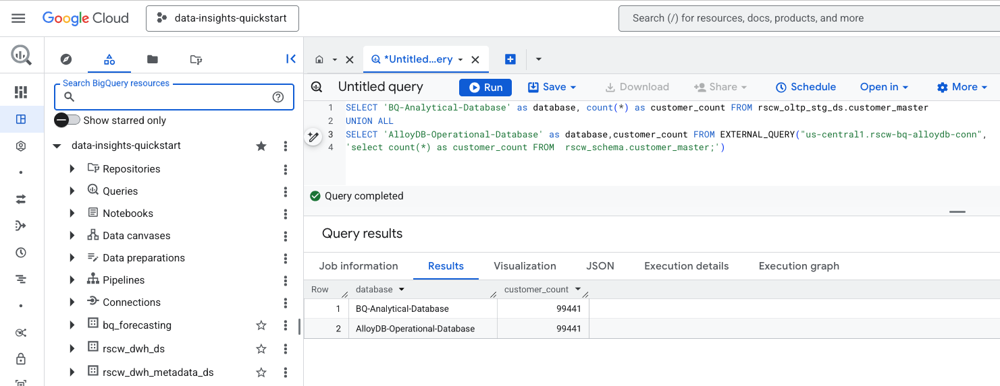 
<br><br>

<hr>

This concludes the module, proceed to the [next module](Module-02a-Data-Insights-API.md).


