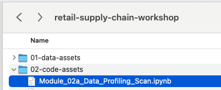
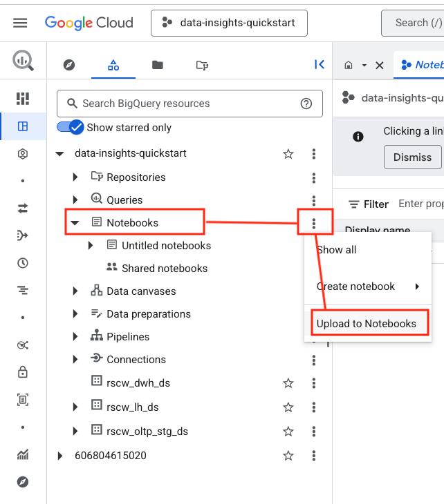
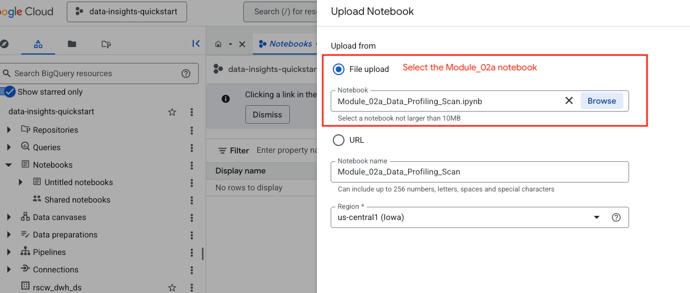
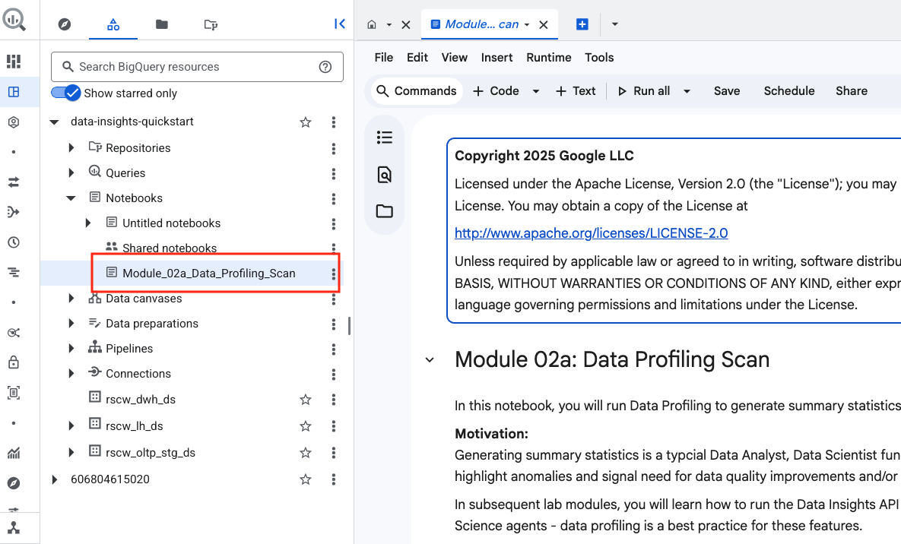
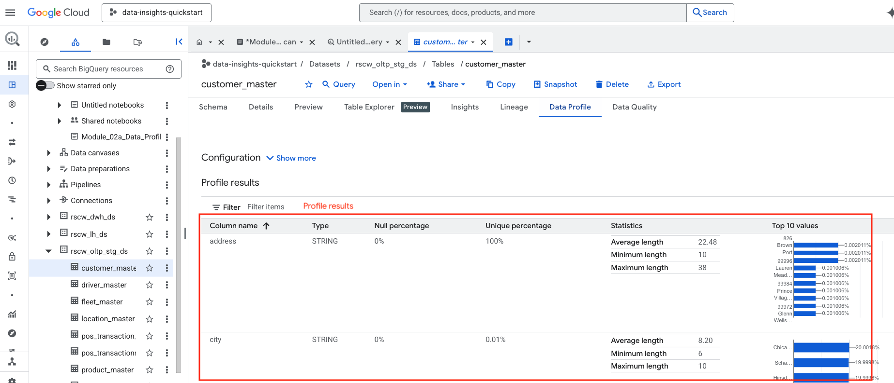
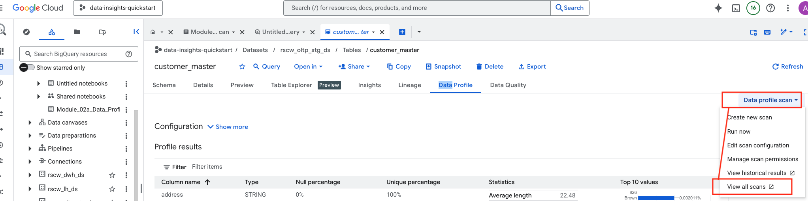
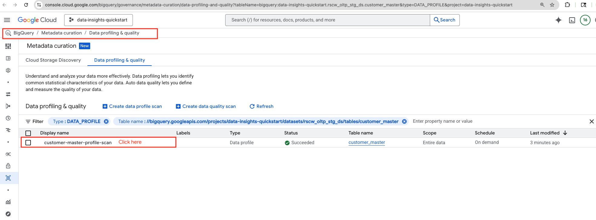
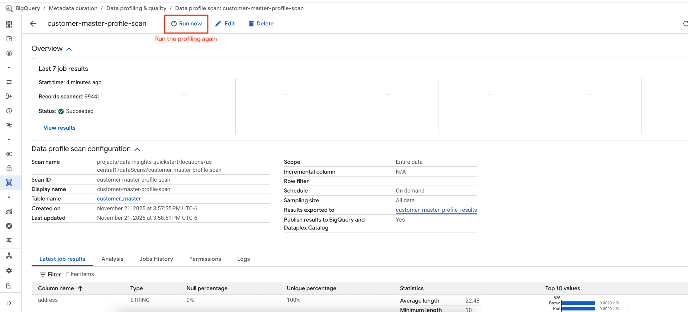
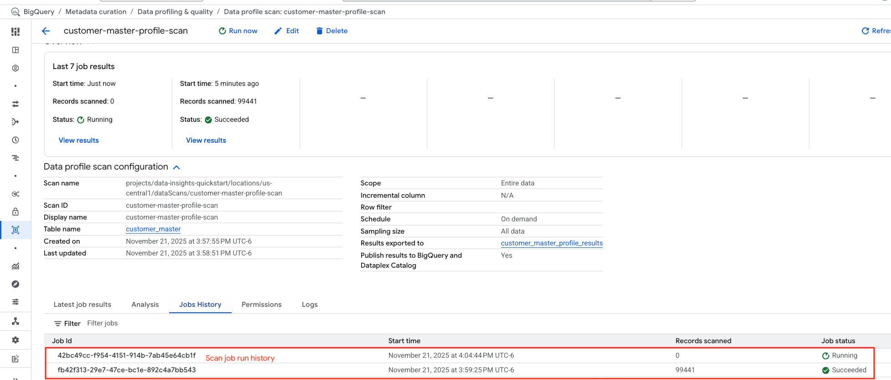
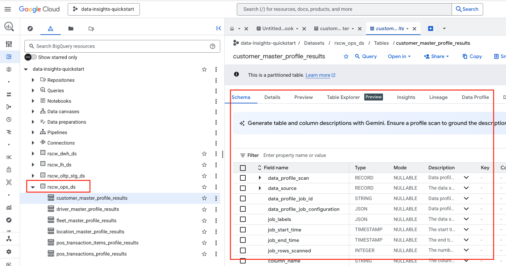

# Module 02a: Data Profiling Scan
## Part 1 of 3 of BigQuery Data Insights API for Agentic Grounding 

<hr>

## Motivation:
Shoonya plans to use a number of LLM powered BigQuery features and the architects at Shoonya realize that agentic grounding is critical for accuracy. They have read about `Data Insights` and want the data engineers to get demystified about Data Insights including understand the value proposition and get hands on and learn to implement Data Insights on sample retail data (from Module 01), in their sandbox GCP environment. 

## Module scope:

This module focuses on generating summary statistics through `Dataplex Data Profiling` in preparation for running Data Insights in module 02b.
<hr>


## About Data Insights:

Data insights is an automated way to explore, understand, and curate your data. With data insights, Gemini in BigQuery generates natural language questions and the SQL queries to answer them, based on table metadata. These insights help you uncover patterns, assess data quality, and perform statistical analysis.<br>

You can also use data insights to generate table and column descriptions based on table metadata and publish them to Dataplex Universal Catalog. This feature helps you document your data for meaningful analysis and improves dataset discoverability.<br>

This module 02 collectively covers across 3 learning units:<br>
1. **Data Profiling Scan** - automated, serverless summary statistics generation for tables, and persistence to specified BigQuery table **[THIS UNIT]**
2. **Documentation Scan** - A Data Insights feature that generates table and column descriptions, and also generates natural language questions and the SQL queries to answer them, based on table metadata
3. **Knowledge Scan** - A Data Insights feature that generates dataset description, and table relationships automaticaly inferred
4. **Dataplex Universal Catalog** - Persisting the descriptions generated, the natural language questions and the SQL queries generated to Dataplex Universal Catalog is covered in the modules as well across module 02b and module 02c.

<br>


<hr>

## Product documentation on Data Profiling

https://docs.cloud.google.com/bigquery/docs/data-profile-scan


<hr>

## Duration:

This module should take no more than 10 minutes.

<hr>

## Prerequisites:

Completion of Module 01 unless its already automated for you.
<br>

<hr>

## Table of contents

| # | Learning unit | 
| -- | :--- | 
| 1 | [Incremental permissions / configurations / lab notebook upload](Module-02a-Data-Insights-API.md#unit-1-incremental-permissions-notebook-uploads--configurations) |
| 2 | [Running profiling scan on your data assets](Module-02a-Data-Insights-API.md#unit-2-data-profiling) |


<hr>
<hr>


# Lab module

## Scope

Once again, this module covers `Data Profiling` - essentially serverless summary statistics generation and persistence to BigQuery in preparation for running Data Insights. 

There are a variety of knobs/configurations (full scan or sampling a an example) possible for Data Profiling and as well scheduling of Data Profiling that are not in scope for the module. These features are useful for Production but are ommited in the module due to time constraints.<br><br>
Also, the creation and execution of the scan is programmatic in the lab. For a comprehensive experience, it is recommended that you try out Data Profiling via the UI as well.<br>

https://docs.cloud.google.com/bigquery/docs/data-profile-scan

<hr>

## Unit 1: Incremental permissions, lab notebook upload & configurations

### 1.1. Grant permissions to the Dataplex Universal Catalog service account

Run the below in Cloud Shell to grant the Dataplex Universal Catalog service account viewer access for running profiling:


```
PROJECT_ID=`gcloud config list --format "value(core.project)" 2>/dev/null`
PROJECT_NBR=`gcloud projects describe $PROJECT_ID | grep projectNumber | cut -d':' -f2 |  tr -d "'" | xargs`
GMSA_DUC="service-$PROJECT_NBR@gcp-sa-dataplex.iam.gserviceaccount.com"

gcloud projects add-iam-policy-binding $PROJECT_ID \
  --member="serviceAccount:$GMSA_DUC" \
  --role="roles/bigquery.dataViewer"

```
<hr>

### 1.2. Upload the lab notebook to BigQuery Studio

The lab notebook for Module 2a is - Module_02a_Data_Profiling_Scan.ipynb<br>


  
<br><br>
Upload these notebooks to BigQuery noteboos from the BigQuery Studio on the cloud console.

 

<br><br>

  

<br><br>

  

<br><br>
 


<hr>

## Unit 2. Data Profiling

In this unit, we will run data profiling in BigQuery on the dataset - `rscw_oltp_stg_ds`.<br>


### 2.1. Developer experience

1. We will run Data Profiling via the notebook - `Module_02a_Data_Profiling_Scan.ipynb` we uploaded in unit 2 in the BigQuery Studio.
2. We will then check a few of the tables in BigQuery studio for the profiling results
3. We will finally review the results persisted to BigQuery for trending over time


### 2.2. Run the notebook Module_02a_Data_Profiling_Scan.ipynb in BigQuery studio

#### 2.2.1. Choose a runtime & network

When you try to run a notebook for the first time, BQ Studio will walk you though creatung a runtime, choose defaults. However choose the network and subnet configured as show in the screenshot below.

 

<br><br>

#### 2.2.2. Review the code and execute all the cells

May take 15-20 minutes. After the customer_master profiling in done, you can proceed to the next unit.

#### 2.2.3. Viewing the customer_master data profile results

Navigate to the table as shown below and to the Data Profiling tab-

  

<br><br>

  

<br><br>

#### 2.2.4. Running profiling again

Anytime there is signifant data inserted into a table, its a good idea to run profiling again. You can do so via the UI or programmatically. Each instance of a scan execution is called a "job" and you can view the job history. The screenshots below walk you through rerunning.

  

<br><br>

  

<br><br>

  

<br><br>

  

<br><br>


### 2.3. Data Profiling Results in BigQuery table

You can view the profiling results in the ops dataset we created.


  

<br><br>

<hr>

### This concludes Lab Module 02a - Data profiling scan. Proceed to the [next page](Module-02b-Data-Insights-API.md) to continue Module 02b - Data Documentation Scan.

<hr>


