# Module 02b: Data Documentation Scan for table-level insights
## Part 2 of 3 of BigQuery Data Insights API for Agentic Grounding

<hr>

## Motivation recap:
Shoonya plans to use a number of LLM powered BigQuery features and the solution architects at Shoonya understand that agentic grounding is foundational for accuracy. They have read about `Data Insights` and want the data engineers to get demystified about Data Insights including understand the value proposition and get hands on and learn to implement Data Insights on sample retail data (from Module 01), in their sandbox GCP environment. This module provides exactly such an immersive learning experience.

## Module scope:

In the [previous Module 02a unit](Module-02a-Data-Insights-API.md), we learned how to run Data Profiling scans. This is prerequisite for accuracy of Data Insights generated.
This module focuses on generating `Data Insights` at a `table level`. (the next module - 02c covers scans at a `dataset level`)
<hr>

## About table-level Data Documentation Scan:

Data Documentation Scan is a LLM powered table-level BigQuery feature that does the following in a code-free and serverless mode WHEN run against a TABLE:
1. Generate table description
2. Generate table column descriptions
3. Generate golden questions and corressponding SQL queries at a table level.
<br>
The insights generated are automatically grounded in the corressponding table's data profiling results if available.

<hr>

## Public documentation

https://docs.cloud.google.com/bigquery/docs/data-insights

<hr>

## Duration:

This module should take no more than 15 minutes.

<hr>

## Prerequisites:

1. Completion of Module 02a.


<hr>

## Table of contents

| # | Learning unit | 
| -- | :--- | 
| 1 | [Incremental permissions / configurations / notebook upload](Module-02b-Data-Insights-API.md#unit-1-incremental-permissions-notebook-uploads--configurations) |
| 2 | [Running documentation scans](Module-02b-Data-Insights-API.md#unit-2-data-documentation-scan) |


<hr>


# Lab module

## Unit 1: Incremental permissions, notebook uploads & configurations

### 1.1. Permissions needed

To create, manage, and retrieve data insights, the following IAM roles are requisite:<br>
1. Dataplex DataScan Editor (roles/dataplex.dataScanEditor) or Dataplex DataScan Administrator (roles/dataplex.dataScanAdmin) on the project where you want to generate insights
2. BigQuery Data Viewer (roles/bigquery.dataViewer) on the BigQuery datasets for which you want to generate insights
<br>
These were already granted in the provisioning module, no further action is needed.
<br><br>

Also, to publish data insights to Dataplex Universal Catalog the following permissions are required:
1. Publish descriptions as aspects: Dataplex Catalog Editor (roles/dataplex.catalogEditor)
2. Publish queries as aspects: Dataplex Entry and EntryLink Owner (roles/dataplex.entryOwner)

Run the below in Cloud Shell-
```
PROJECT_ID=`gcloud config list --format "value(core.project)" 2>/dev/null`
PROJECT_NBR=`gcloud projects describe $PROJECT_ID | grep projectNumber | cut -d':' -f2 |  tr -d "'" | xargs`
UMSA="rscw-umsa"
UMSA_FQN="$UMSA@$PROJECT_ID.iam.gserviceaccount.com"

gcloud projects add-iam-policy-binding $PROJECT_ID \
  --member="serviceAccount:$UMSA_FQN" \
  --role="roles/dataplex.catalogEditor"

gcloud projects add-iam-policy-binding $PROJECT_ID \
  --member="serviceAccount:$UMSA_FQN" \
  --role="roles/dataplex.entryOwner"
```

<br>

Read the documentation for the full list of permissions and APIs to be enabled:<br>
https://docs.cloud.google.com/bigquery/docs/data-insights

<hr>

### 1.2. APIs 

Enabling of the the APIs for Dataplex Universal Catalog is needed - however, this was also completed as part of provisioning.

<hr>

### 1.3. Upload the lab notebooks to BigQuery Studio

The lab notebook for Module 2b is - Module_02b_Data_Documentation_Scan.ipynb<br>


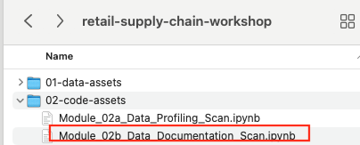  
<br><br>
Upload this notebook to BigQuery notebooks from the BigQuery Studio on the cloud console.

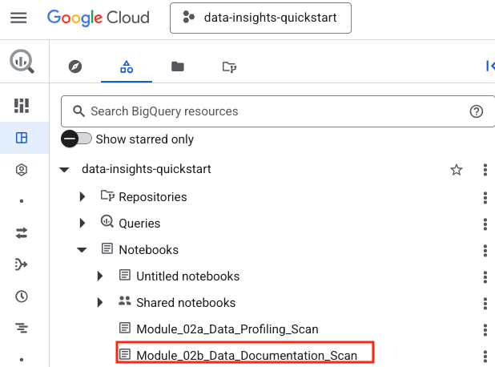 

<br><br>

 
<hr>

## Unit 2. Data Documentation Scan

In this unit, we will run Data Documentation Scan on BigQuery dataset - `rscw_oltp_stg_ds`.<br>


### 2.1. Developer experience

1. We will run Data Documentation Scan via the notebook we uploaded in unit 2 in the BigQuery Studio.
2. We will then check a few of the tables in BigQuery studio for the scan results
3. We will finally review the publishing of the scan results to the Dataplex Universal Catalog

<hr>

### 2.2. Run the notebook Module_02b_Data_Documentation_Scan.ipynb in BigQuery studio


#### 2.2.1. View the schema tab and the insights tab of the product_master table before executing the notebook

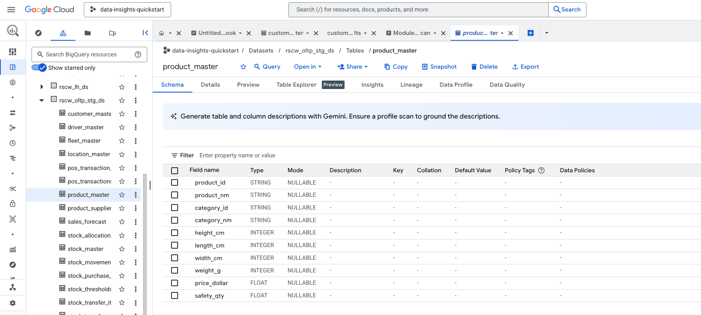  

<br><br>

<hr>

#### 2.2.2. View the Dataplex Universal Catalog before executing the notebook

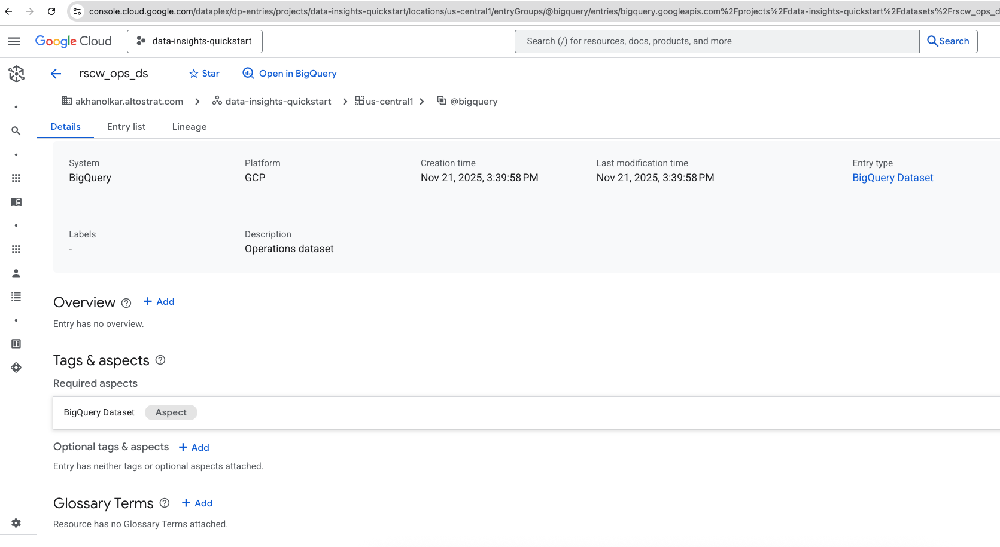  

Note that there are no aspects available.

<br><br>

<hr>

#### 2.2.3. Execute the notebook in its entirety

This will take tens of minutes. Once you see product_master scan as completed, switch from the notebook to the UI to view the results.

<hr>

#### 2.2.4. View the product_master data documentation scan results in the table "Schema" tab

Navigate to the table as shown below and to the schema tab-

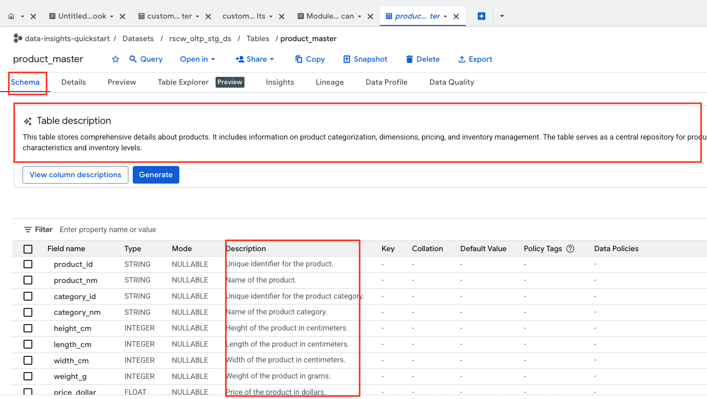  

<br><br>


<hr>

#### 2.2.4. View the product_master data documentation scan results in the table "Insights" tab

Navigate to the table as shown below and to the insights tab-

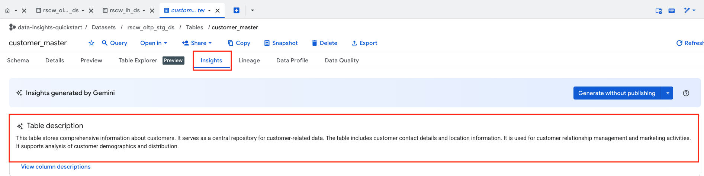  

<br><br>

  

<br><br>


  

<br><br>

<hr>


### 2.3. Run a scan from the UI and publish to Dataplex Universal Catalog

Follow the screenshots to run the scan for the customer_master table from the UI this time and publish to Dataplex Universal Catalog
<br>

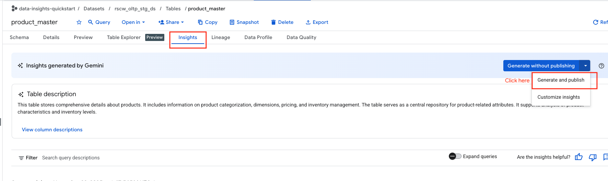  

<br><br>


<hr>


### 2.4. View the entry in the Dataplex Universal Catalog and the aspects published

You can view the profiling results in the ops dataset we created.

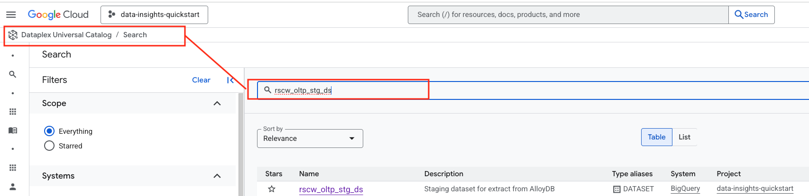  

<br><br>

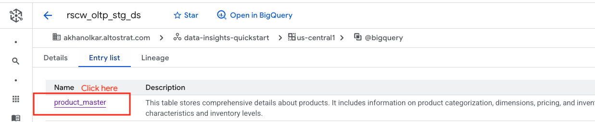  

<br><br>


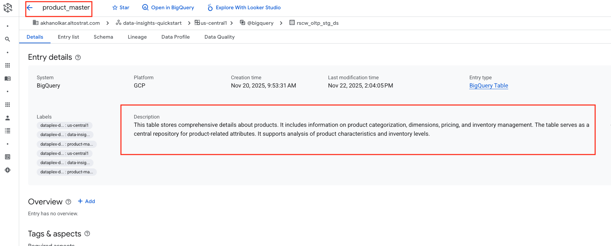  

<br><br>

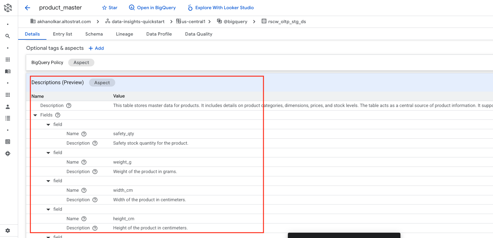  

<br><br>


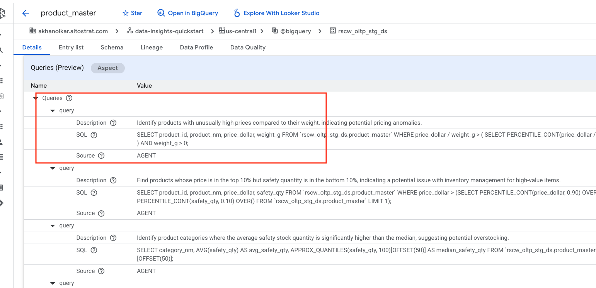  

<br><br>

<hr>

### This concludes Lab Module 02b - table level Data Documentation Scan. Proceed to the next page to continue [Module 02c - dataset level Data Documentation Scan](Module-02c-Data-Insights-API.md).

<hr>


