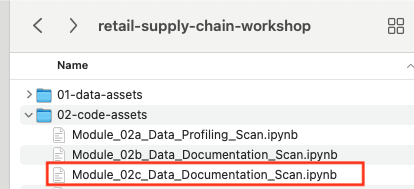
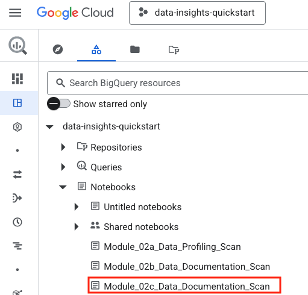
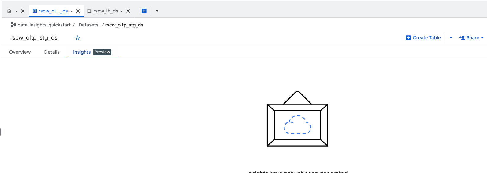
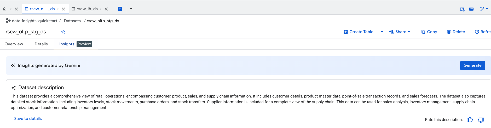
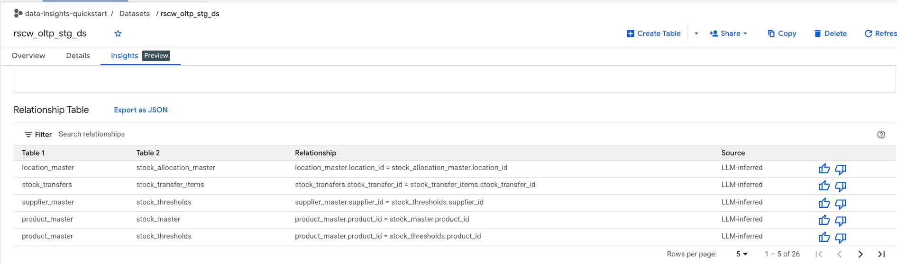
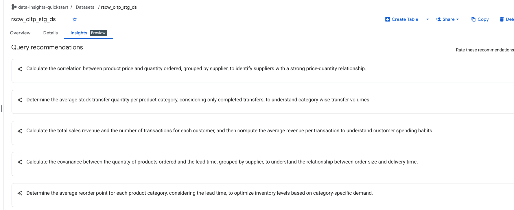
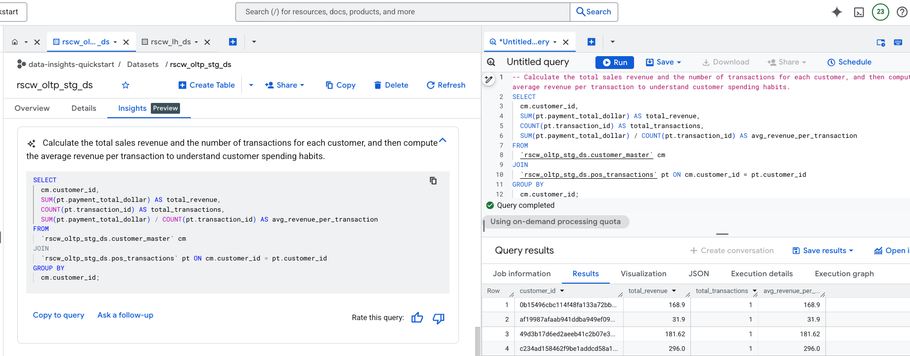

# Module 02c: Data Documentation Scan for dataset-level insights
## Part 3 of 3 of BigQuery Data Insights API for Agentic Grounding

## Motivation recap:
Shoonya plans to use a number of LLM powered BigQuery features and the solution architects at Shoonya understand that agentic grounding is foundational for accuracy. They have read about `Data Insights` and want the data engineers to get demystified about Data Insights including understand the value proposition and get hands on and learn to implement Data Insights on sample retail data (from Module 01), in their sandbox GCP environment. This module provides exactly such an immersive learning experience.

## Module scope:

In the [previous Module 02b unit](Module-02b-Data-Insights-API.md), we learned how to run Data Insights - Data Documentation Scans at a table level. 
This module focuses on generating `Data Insights` at a `dataset level`.

## About Data Insights Documentation SCan at a dataset level:

Data Documentation Scan is a LLM powered BigQuery feature that does the following in a code-free and serverless mode when run against a `DATASET`:
1. Generate dataset description
2. Generate golden questions and corressponding SQL queries at a table level.
3. Generate a table relationship graph and listing of table joins (best effort inference)
 
The insights generated are automatically grounded in the table-level data documentation scan results.

## Public documentation

https://docs.cloud.google.com/bigquery/docs/data-insights

## Duration:

This module should take no more than 5 minutes.

## Prerequisites:

Completion of Module 02b.

## Table of contents

| # | Learning unit | 
| -- | :--- | 
| 1 | [Incremental permissions / configurations / notebook upload](Module-02c-Data-Insights-API.md#unit-1-incremental-permissions-notebook-uploads--configurations) |
| 2 | [Run the documentation scan at the dataset level](Module-02c-Data-Insights-API.md#unit-2-data-documentation-scan) |

# Lab module

## Unit 1: Incremental permissions, notebook uploads & configurations

### 1.1. Permissions needed

Nothing additional

### 1.2. APIs 

Nothing additional

### 1.3. Upload the lab notebooks to BigQuery Studio

The lab notebook for Module 2c is - Module_02c_Data_Documentation_Scan.ipynb 

  
  
Upload this notebook to BigQuery notebooks from the BigQuery Studio on the cloud console.

 

  

 

## Unit 2. Data Documentation Scan

In this unit, we will run Data Documentation Scan on BigQuery dataset - `rscw_oltp_stg_ds`. 

### 2.1. Developer experience

1. We will run Data Documentation Scan via the notebook we uploaded in unit 2 in the BigQuery Studio.
2. We will then look at the rersults in the BigQuery studio

### 2.2. Run the notebook Module_02c_Data_Documentation_Scan.ipynb in BigQuery studio

#### 2.2.1. View the insights tab of rscw_oltp_stg_ds dataset before executing the notebook

  

  

#### 2.2.2. Execute the notebook in its entirety

This will take 5 minutes or less. 

#### 2.2.3. View the data documentation scan results in the table "Insights" tab of the datasey

Navigate to the dataset and view the results as shown below-

  

  

  

  
  

  
  

  
  

  

### This concludes Lab Module 02c - dataset level Data Documentation Scan. Proceed to the [next lab module](Module-03-Data-Engineering-Agent-For-Warehousing.md).

