# Module 04: BigQuery Data Engineering Agent for Reporting

## Motivation recap:
Shoonya, our hypothetical retail chain understands that to stay competitive, adopt cutting edge/innovative technologies and accelerate speed to production, they need to use the latest and greatest LLM powered product features. Shoonya's architecture board has approved the Data Engineering Agent for use not only for Data Warehouse code generation, but also reporting. The IT leadership would like data engineers to get well versed with the BigQuery Data Engineering Agent (DEA) for report generation.

<hr>

## Module scope:

This module features the Data Engineering Agent for `Reporting Data Mart code generation with just prompts`, and against the denormalized data in the warehouse dataset `rscw_dwh_ds`. It also covers executing the generated code in Dataform.

<hr>

## About Data Engineering Agent

### Product overview recap

The Data Engineering Agent lets you use Gemini in BigQuery to build, modify, and manage data pipelines to load and process data in BigQuery. With the Data Engineering Agent, you can use natural language prompts to generate data pipelines from various data sources or adapt existing data pipelines to suit your data engineering needs. <br>

The Data Engineering Agent has the following features:
1. Natural language for pipeline creation: The agent uses Gemini to understand your data and interpret your plain-language instructions. You can use plain-language instructions to have the Data Engineering Agent build or edit data pipelines.

2. Dataform integration: The agent generates and organizes the necessary pipeline code into SQLX files within a Dataform repository. The agent operates in the Dataform workspace, so Dataform pipelines are automatically available to the agent.

3. Custom agent instructions: Create agent instructions in plain-language to define custom rules for the Data Engineering Agent. Agent instructions are persistent across your organization, and can be useful to enforce organization-wide rules, such as naming conventions or style guides.

4. Pipeline validation: The agent validates any generated code to ensure that the data pipelines are functional.
<br>

You can use natural language prompts with the Data Engineering Agent to create tables, views, assertions, declarations and operations SQLX files. For example, you can use the Data Engineering Agent to do the following:

- Load data from external data sources such as Cloud Storage in various formats, like CSV, AVRO, or PARQUET.
- Create or use existing BigQuery routines (UDFs) to perform custom analysis and transformations on your data.
- Define reusable guidelines for the agent in natural language.


### Data Engineering Agent API for programmatic access

The REST endpoint for programmatic execution was being overhauled at the time of the authroing this lab. We will therefore do some pre-work in a notebook and then use the Dataform UI for invoking the Data Engineering Agent to generate the dimensional model.

<hr>

### Best practice

1. Follow the sequence for agentic grounding and to avoid hallucinations - run profiling, then Data Insights table-level, followed by dataset-level and then work with the Data Engineering Agent
2. Be cognizant of the fact that the DEA's code generation is not deterministic and apply due diligence for production workloads. Use it to get a baseline, but firm it up with Reporting specialists for production.
3. Use the DEA for baseline code, but not for `generate and directly deploy to production`.

<hr>


## Public documentation

[https://docs.cloud.google.com/bigquery/docs/data-engineering-agent-pipelines](https://docs.cloud.google.com/bigquery/docs/data-engineering-agent-pipelines)


<hr>

## Duration:

This module should take no more than 20 minutes. Most of the time is spent in Data Insights scans towards agenting grounding information generation.

<hr>

## Prerequisites:

Completion of Module 3.

<hr>

## Table of contents

| # | Learning unit | 
| -- | :--- | 
| 1 | [Incremental permissions / configurations](Module-04-Data-Engineering-Agent-For-Reporting.md#unit-1-incremental-permissions--configurations) |
| 2 | [Developer experience](Module-04-Data-Engineering-Agent-For-Reporting.md#unit-2-developer-experience) |
| 3 | [Author instructions for the Data Engineering Agent (DEA)](Module-04-Data-Engineering-Agent-For-Reporting.md#unit-3-create-instruction-files-for-the-data-engineering-agent) |
| 4 | [Review the instructions](Module-04-Data-Engineering-Agent-For-Reporting.md#41-review-the-instructions-files-generated-from-the-notebook-execution) |
| 5 | [Have the DEA build the reporting mart](Module-04-Data-Engineering-Agent-For-Reporting.md#unit-5-instruct-the-data-engineering-agent-to-generate-the-reporting-mart--review-the-code-generated) |

<hr>


# Lab module

## Unit 1: Incremental permissions, & configurations

### 1.1. Incremental permissions needed

None


<hr>

### 1.2. Incremental APIs to be enabled 

None

<hr>


## Unit 2. Developer Experience

The developer continuum is as follows:<br>
1. Create instructions for the Data Engineering Agent to generate a reports
2. Have the agent generate code
3. Review the code
4. Run the code
5. Review the reporting tables created, forecasts generated for accuracy
6. Tweak, refine instructions and rerun #1/ or tweak/fix the code until you see the desired results
7. Operationalize the code to run on schedule


<hr>

## Unit 3. Create instruction files for the Data Engineering Agent

For agentic grounding, we learned in Module 02-a-b-c, that as a best practice, we should run Data Insights. <br>
We will create instruction files off of the Data Insights, and also generate a report naming conventions file and persist these to the Dataform workspace.<br>

### 3.1. Lets upload a notebook for this learning unit.

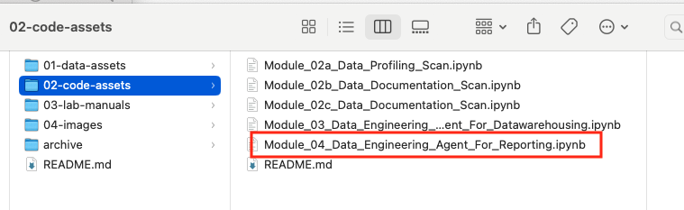  

<br><br>

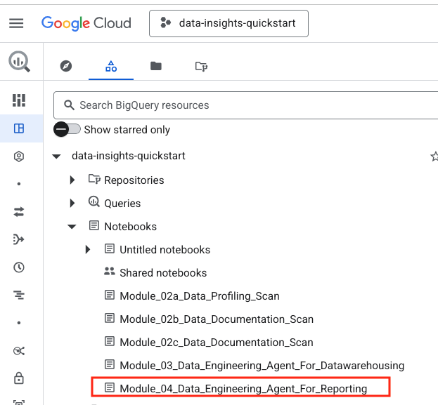  

<br><br>

<hr>

### 3.2. Run the notebook to completion

Once you are done running the notebook, return here for further instructions.

<hr>


## Unit 4: Review the instructions files generated in the Dataform workspace UI


### 4.1. Review the instructions files generated from the notebook execution

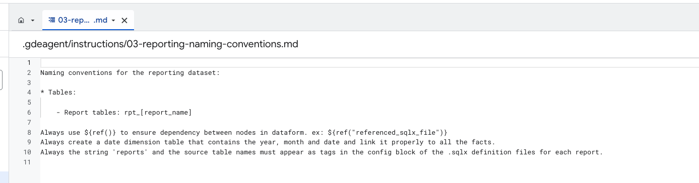  

<br><br>

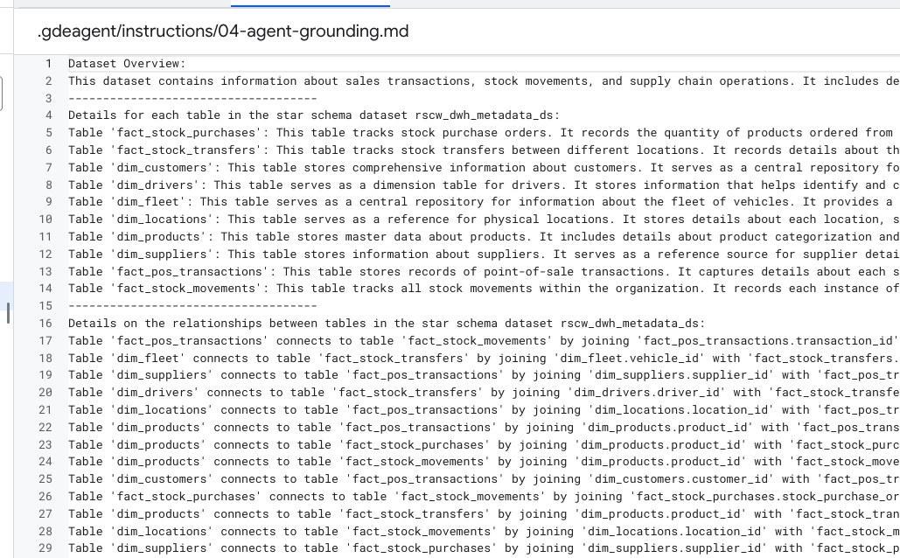  

<br><br>


<hr>

## Unit 5: Instruct the Data Engineering Agent to generate the reporting mart & review the code generated

### 5.1. Prompt for the Data Engineering Agent

The following is the prompt you will use in 5.2.
```
You are an expert warehouse data engineer specialized in reporting. The business context is retail sales and inventory optimization. You are responsible for generating a number of reports for the reporting mart.

Instructions provided to you are: 
(1) Naming conventions are available in: 03-reporting-naming-conventions.md. Strictly follow these conventions.
(2) Metadata for grounding such as dataset description, table descriptions, column descritions and table relationships are provided to you in: 04-agent-grounding.md. 

Note:
1. Look at the tables from the rscw_dwh_ds dataset and at the information in the instruction files.
2. Make sure that the string 'reports' and the source table names appear as tags in the config block of the .sqlx definition files for each report.

Generate the following reports:
a) Generate stockout rate report-
a1) Create a report query to calculate the percentage of time a product is out of stock, by comparing the days a product is out of stock versus the total database time span.
a2) The total database time span is the number of days from minimum to maximum sales order time.
a3) The minimum and maximums of the purchased_date from the sales_orders table are the first and last reporting days respectively.
a4) Include product name 
a5) Delete any existing report table
a6) Run the query and save its contents into a new report table in the rscw_rpt_ds dataset.

b) Generate slow moving products report-
b1) Create a report query to show all the products (product id and name) and the days when they have no sales in the last 365 days compared to the reporting date.
b2) Out of these, filter out products that were not in stock on the day when they had zero sales.
b3) The minimum and maximums of the purchased_date from the sales_orders table are the first and last reporting days respectively.
b4) Include product name
b5) Include quantity movement 
b6) Delete any existing report table
b7) Run the query and save its contents into a new table in the rscw_rpt_ds dataset.

c) Generate actual avergage daily order value report-
c1) Create a report query that computes the daily average order value for each full day that exists in the sales records.
c2) If there are no orders in a day, the average should be zero. The null values should count as zero.
c3) If product ID is in the report, ensure you include product name 
c4) Delete any existing report table
c5) Run the query and save its contents into a new report table in the rscw_rpt_ds dataset.

d) Generate a report on best selling product by category
d1) Create a report query to calculate the most frequently sold product for each product category.
d2) Include product name 
d3) Delete any existing report table
d4) Run the query and save its contents into a new report table in the rscw_rpt_ds dataset.

e) Generate a report on best selling product
e1) Create a report query to calculate the most frequently sold product for the last 90, 180, and 365 days.
e2) Include product name 
e3) Delete any existing report table
e4) Run the query and save its contents into a new report table in the rscw_rpt_ds dataset.

```

### 5.2. Launch the Agent UI in the Dataform workspace & paste the prompt

Follow the screenshots below and paste the prompt from 5.1 into the Agent UI -

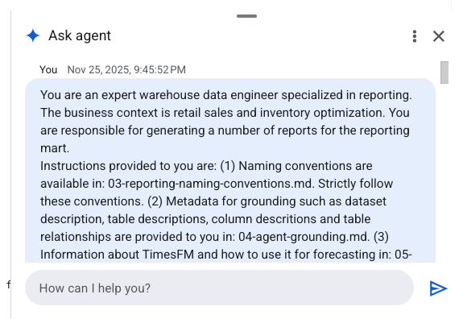  

<br><br>


<hr>

### 5.3. Observe the Agent's posts on what it is thinking/deducing/executing to completion

Here are the author's screen captures.


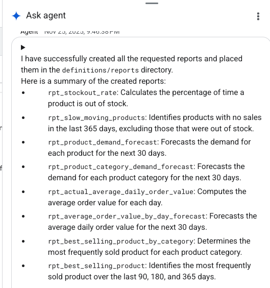  

<br><br>

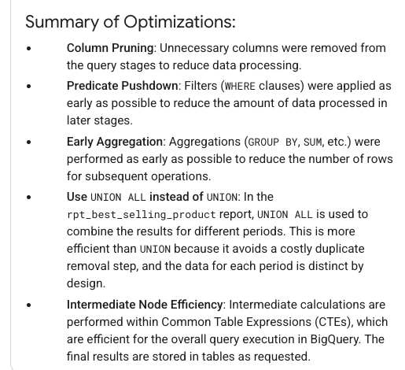  

<br><br>

<hr>

### 5.4. Review the code generated


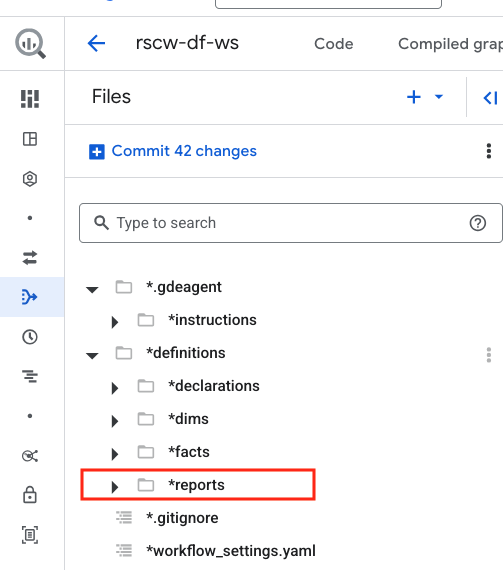  

<br><br>

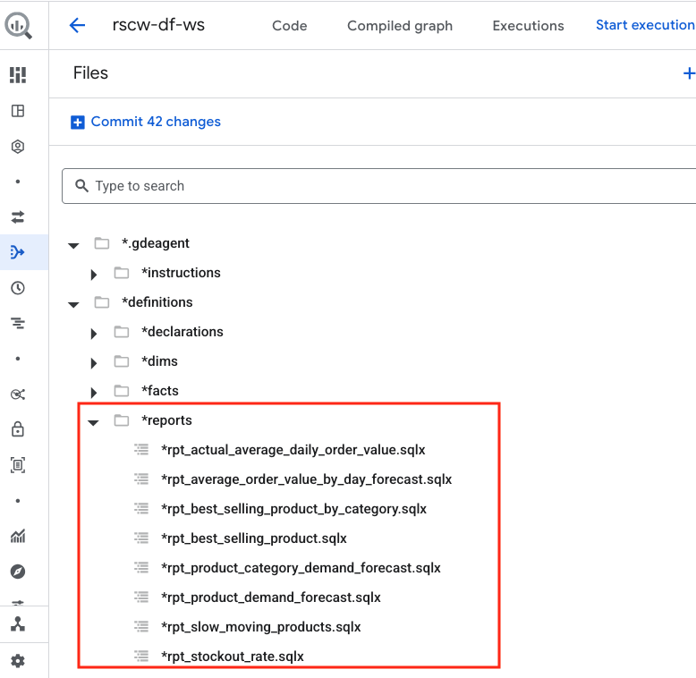  

<br><br>

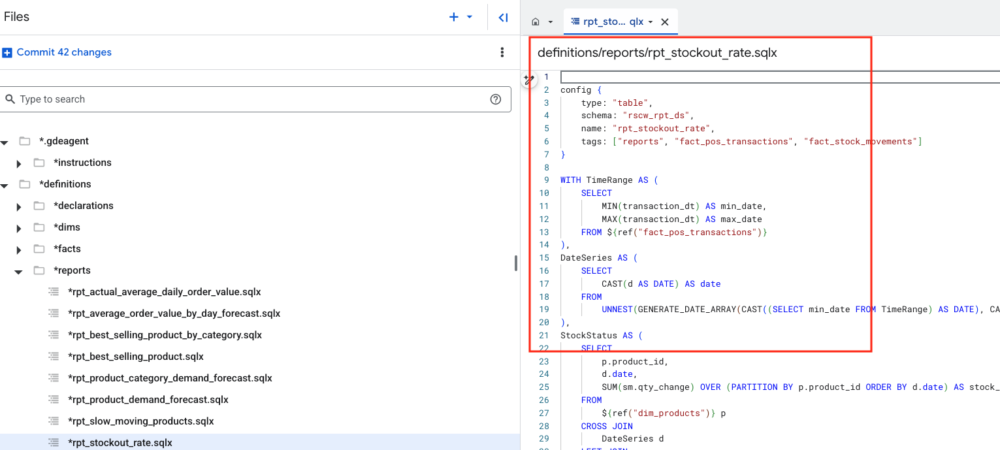  

<br><br>

<hr>


## Unit 6: Execute the Dataform pipeline 

Follow the screenshots below to execute the pipeline, and see the results in Dataform.

  

<br><br>

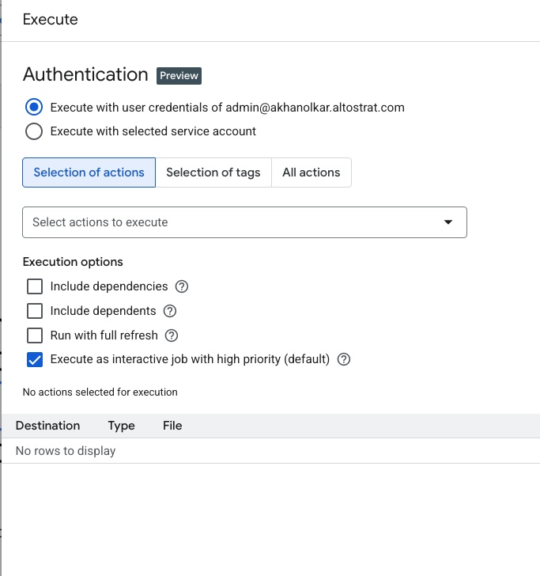  

<br><br>

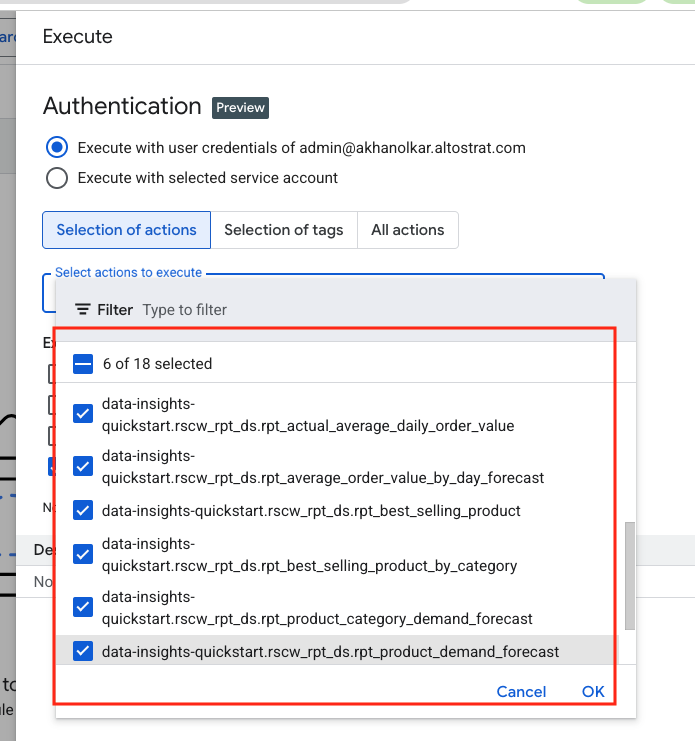  

<br><br>


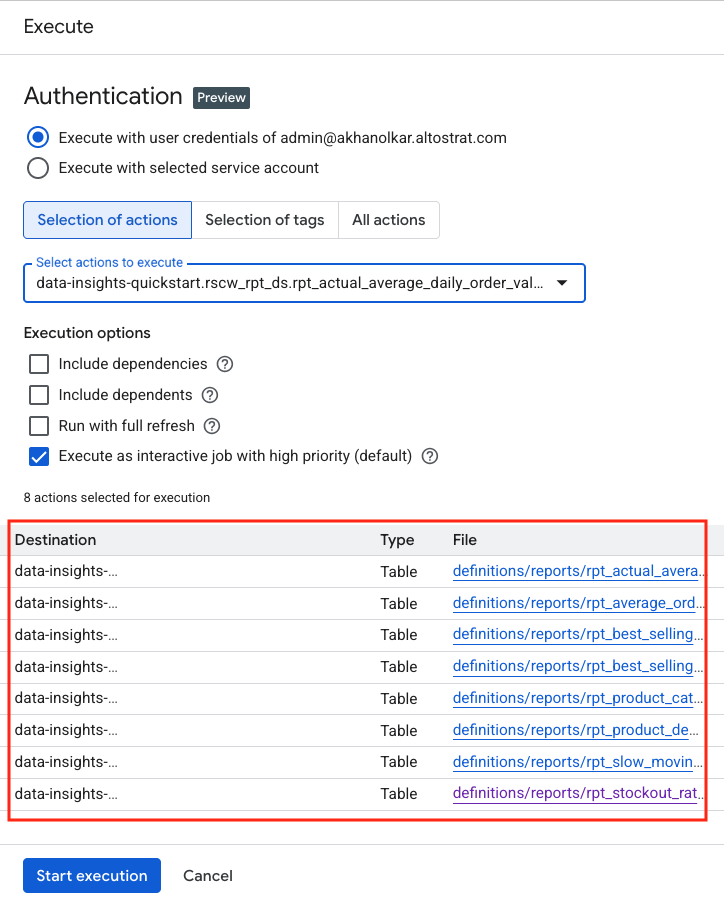  

<br><br>

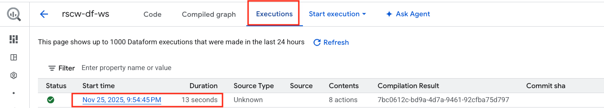  

<br><br>

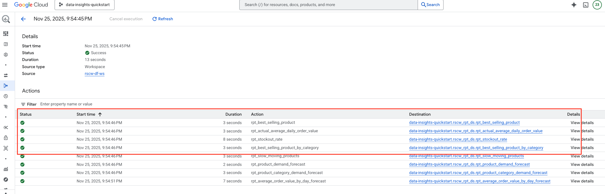  

<br><br>

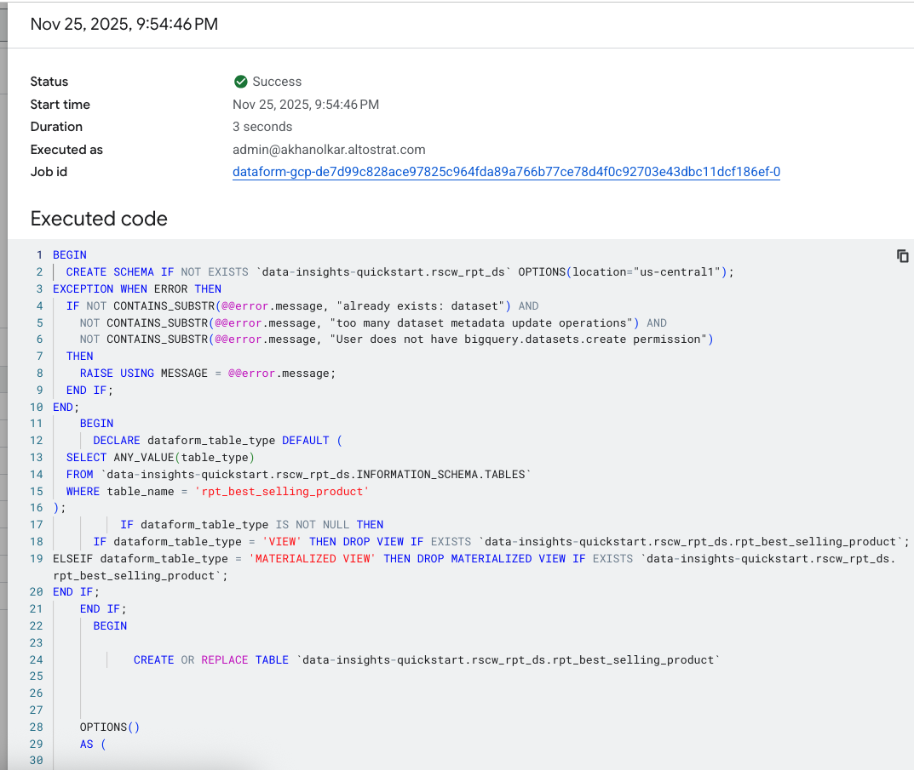  

<br><br>


<hr>


## Unit 7: Validate the reporting mart schema, tables and data loaded

Follow the screenshots below to review the schema, tables generated and the data loaded.

### 7.1. Tables generated

Note the tables that got created in the reporting dataset.

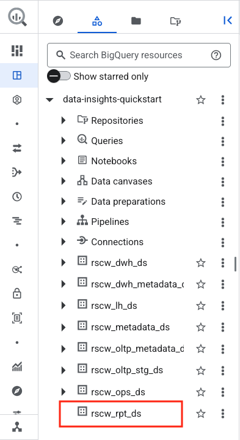  

<br><br>

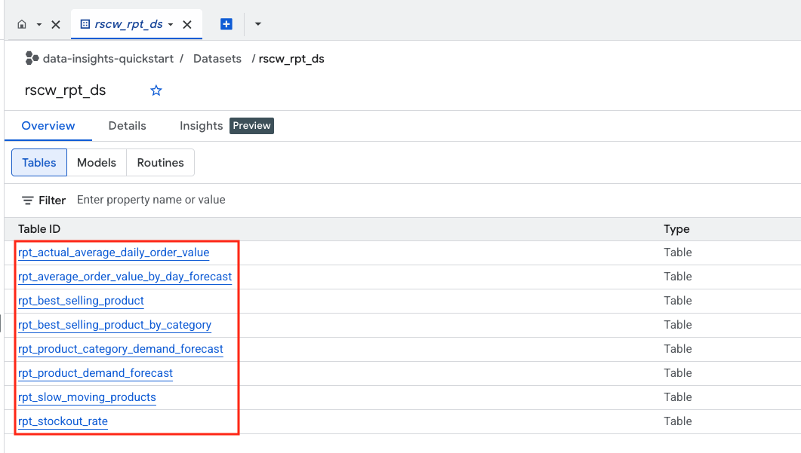  

<br><br>

<hr>

### 7.3. Browse data in a few reports

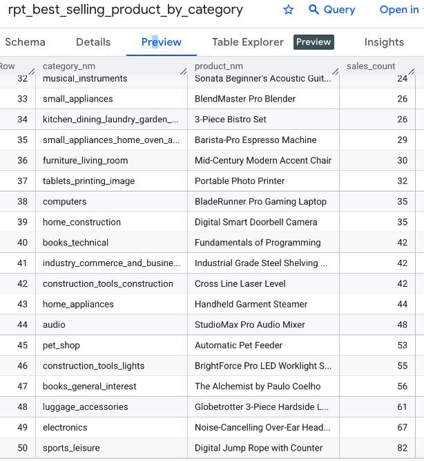  

<br><br>

Note that for highly accurate reports, further prompt tuning is needed.

<hr>


### This concludes Lab BigQuery Data Engineering Agent for Reporting. Proceed to the [next module](Module-05-Conversational-Analytics.md).

<hr>


