# Module 05: Conversational Analytics in BigQuery

## Motivation recap:
Shoonya, our hypothetical retail chain understands that to stay competitive, adopt cutting edge/innovative technologies and accelerate speed to production, they need to use the latest and greatest LLM powered product features. Shoonya's architecture board has approved the BigQuery Conversational Analytics feature for use via the BigQuery UI. The IT leadership would like data analysts, engineers and scientists to get well versed with the feature and explore replacing their bespoke data QnA agent with the BigQuery feature.


<hr>

## Module scope:

This module provides an immersive learning experience of the Gemini powered `Conversational Analytics` feature via the BigQuery UI. In a subsequent learning module, we will cover creating a custom agent with Google Cloud's Agent Development Kit and exposing the BigQuery Conversational Analytics API via the same.


<hr>


## About:

Conversational analytics in BigQuery lets you chat with your data using conversational language. Using conversational analytics, you can create data agents to define context and query processing instructions for a set of data sources. The context and instructions configure the data agents to effectively answer questions for specific use cases. Users can then have conversations with data agents to ask questions about BigQuery data using natural language. Users can also create direct conversations with one or more tables to answer quick, one-off questions.<br>

Conversational analytics is powered by Gemini for Google Cloud.<br>


**Data agents** <br>
Data agents consist of one or more data sources, and a set of use case-specific instructions for processing that data. When you create a data agent, you can configure it by using the following options: <br>
1. Provide table metadata to describe the data in the most appropriate way for the given use case.
2. Provide instructions for interpreting and querying the data, such as defining the following:
3. Synonyms for field names
4. Most important fields
5. Defaults for filtering and grouping
6. Create golden queries that the data agent can use to learn the business logic used by your organization.

Data agents that you create in BigQuery are accessible by other services in the project that support data agents, such as the [Conversational Analytics API](https://docs.cloud.google.com/gemini/docs/conversational-analytics-api/overview) and [Looker Studio](https://docs.cloud.google.com/looker/docs/studio/conversational-analytics-looker-studio).<br>

You can create and manage data agents in BigQuery by using the Google Cloud console. For more information, see [Create data agents](https://docs.cloud.google.com/bigquery/docs/ca/create-data-agents).<br>

<hr>

## Public documentation

**About Conversational Analytics in BigQuery:** <br>
[https://docs.cloud.google.com/bigquery/docs/data-insights](https://docs.cloud.google.com/bigquery/docs/conversational-analytics)

**About Data Agents in BigQuery**: <br>
[https://docs.cloud.google.com/bigquery/docs/create-data-agents](https://docs.cloud.google.com/bigquery/docs/create-data-agents)

**About analyzing data in BigQuery via conversations with the Data Agent**: <br>
[https://docs.cloud.google.com/bigquery/docs/create-conversations](https://docs.cloud.google.com/bigquery/docs/create-conversations)

<hr>

## Duration:

This module should take no more than 5 minutes.

<hr>

## Prerequisites:

Completion of Module 02 a-b-c.

<hr>

## Table of contents

| # | Learning unit | 
| -- | :--- | 
| 1 | [Incremental permissions / configurations](Module-05-Conversational-Analytics.md#unit-1-incremental-permissions--configurations) |
| 2 | [Develper experience](Module-05-Conversational-Analytics.md#unit-2-developer-experience) |
| 3 | [Create a Data Agent](Module-05-Conversational-Analytics.md#unit-3-create-a-data-agent) |
| 4 | [Analyze data by conversing with the data agent](Module-05-Conversational-Analytics.md#unit-4-analyze-data-with-the-data-agent-assistance-in-bigquery) |


<hr>


# Lab module

## Unit 1: Incremental permissions, & configurations

### 1.1. Permissions needed

To work with data agents, you must have one of the following Conversational Analytics API IAM roles:<br>

1. Create, edit, share, and delete all data agents in the project: Gemini Data Analytics Data Agent Owner (roles/geminidataanalytics.dataAgentOwner) on the project.<br>
2. Create, edit, share, and delete your own data agents in the project: Gemini Data Analytics Data Agent Creator (roles/geminidataanalytics.dataAgentCreator) on the project. Users with this role are automatically granted the Gemini Data Analytics Data Agent Owner role on the data agents that they create.<br>
3. View and edit all data agents in the project: Gemini Data Analytics Data Agent Editor (roles/geminidataanalytics.dataAgentEditor) at the project level.<br>
4. View all data agents in the project: Gemini Data Analytics Data Agent Viewer (roles/geminidataanalytics.dataAgentViewer)<br>
5. Additionally, any user that creates or edits a data agent must have the following roles:<br>
- BigQuery Data Viewer (roles/bigquery.dataViewer) on any table that the data agent uses as a data source.
- DataCatalog Search Admin (roles/datacatalog.searchAdmin) on the project.

Let us grant the user managed service account and ourselves the role - `roles/geminidataanalytics.dataAgentOwner` by pasting the below in Cloud Shell:<br>

```
PROJECT_ID=`gcloud config list --format "value(core.project)" 2>/dev/null`
PROJECT_NBR=`gcloud projects describe $PROJECT_ID | grep projectNumber | cut -d':' -f2 |  tr -d "'" | xargs`
UPN_FQN=`gcloud auth list --filter=status:ACTIVE --format="value(account)"`
UMSA="rscw-umsa"
UMSA_FQN="$UMSA@$PROJECT_ID.iam.gserviceaccount.com"

gcloud projects add-iam-policy-binding $PROJECT_ID \
  --member="serviceAccount:$UMSA_FQN" \
  --role="roles/geminidataanalytics.dataAgentOwner"

gcloud projects add-iam-policy-binding $PROJECT_ID \
  --member="user:$UPN_FQN" \
  --role="roles/geminidataanalytics.dataAgentOwner"
```

<hr>

### 1.2. APIs 

Incremental API enabling needed:<br>
1. Data Analytics API with Gemini
2. Gemini for Google Cloud API


Paste the below in Cloud Shell:<br>
```
gcloud services enable geminidataanalytics.googleapis.com
gcloud services enable cloudaicompanion.googleapis.com
```

<hr>


## Unit 2. Developer Experience

The developer continuum is as follows:<br>
1. Create a Data Agent, provide it with what it needs for accuracy
2. Analyze data with coversations with the Data Agent you created in BigQuery UI and Looker Studio, name and save conversations
3. Evaluate the answers generated against a golden setof questions and answers
4. Tune your data agent configs to improve accuracy of answers generated
5. Operatioanalize by integrating the data agent into your ADK (other) agent applications (subsequent lab module)

Note: At the time of authoring this lab was available in BQ UI, via API or via Looker Studio Pro.<br>


<br><br>

<hr>

## Unit 3. Create a Data Agent

For agentic grounding, we learned that as a best practice, we should run Data Insights. And we did. We can proceed straight to configuring out data agent and in less than 5 minutes we will have a data QnA agent up and running. Lets get started. <br>
Follow the instructions below to create a data agent.

### 3.1. Navigate to the Agent UI in BigQuery

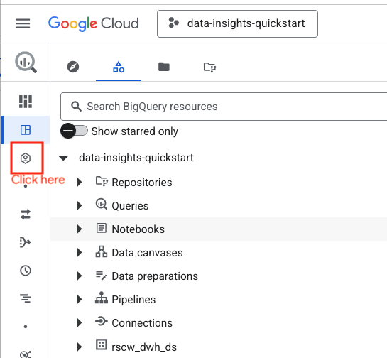  

<br><br>

<hr>


### 3.2. Create a data agent

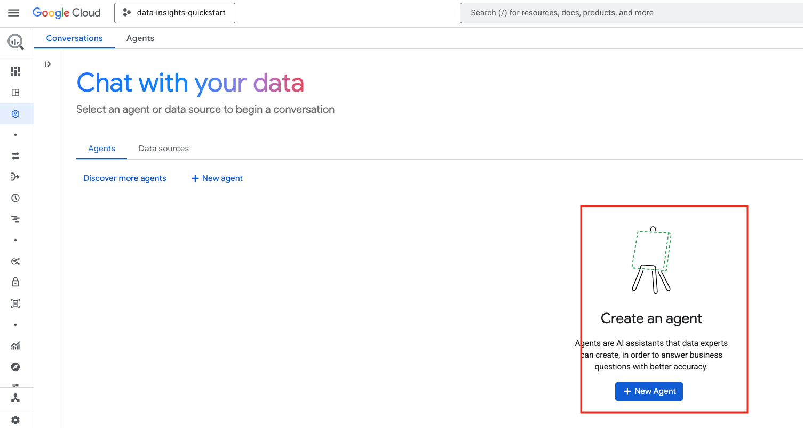  

<br><br>

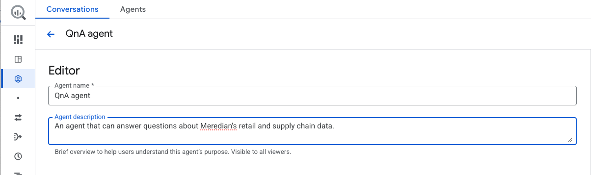  

<br><br>

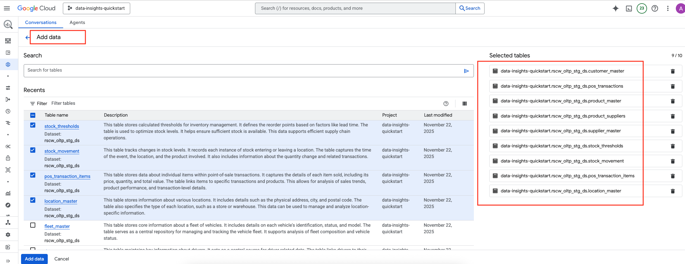  

<br><br>

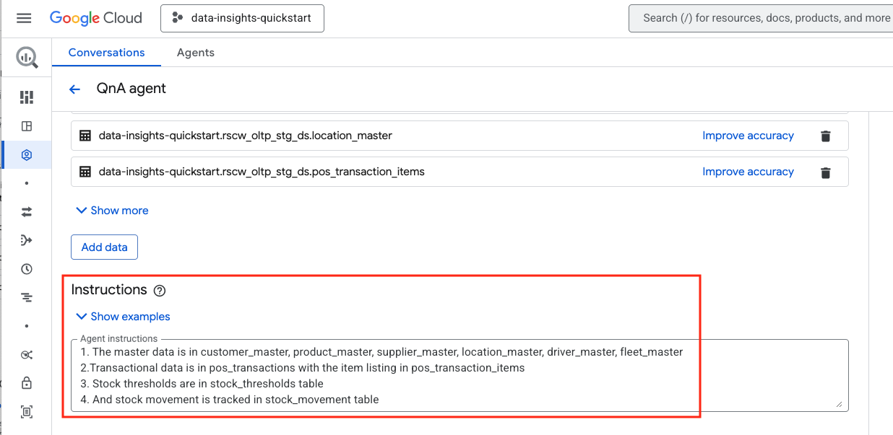  

<br><br>

Here are the minimum instructions provided by the author to the Data Agent:<br>
1. The master data is in customer_master, product_master, supplier_master, location_master, driver_master, fleet_master
2.Transactional data is in pos_transactions with the item listing in pos_transaction_items
3. Stock thresholds are in stock_thresholds table
4. And stock movement is tracked in stock_movement table
5.The temporal field across tables is event_time

<br><br>

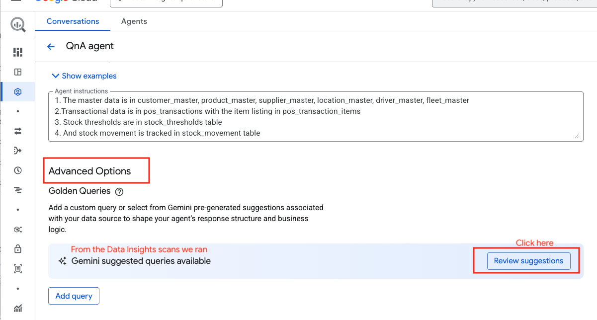  

<br><br>

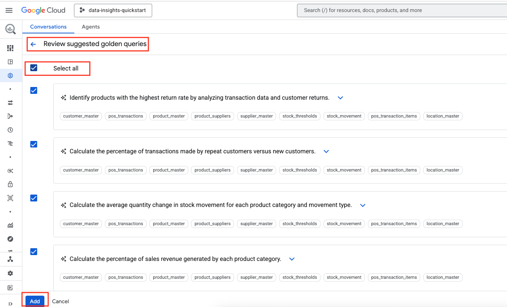  

<br><br>

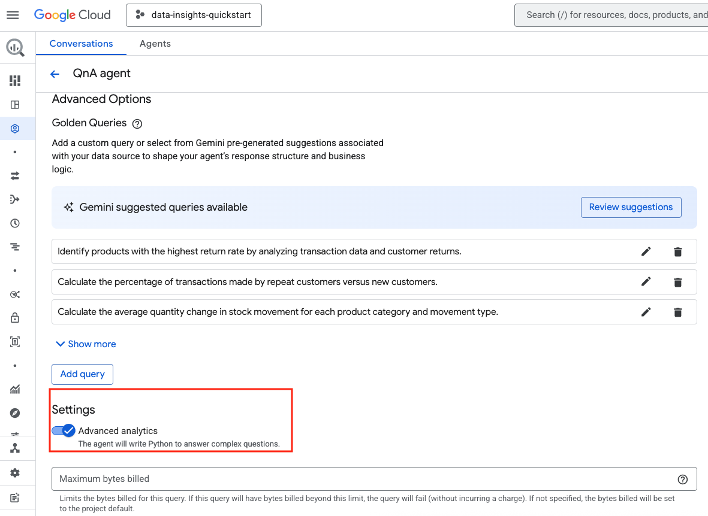  

<br><br>

<hr>

### 3.3. Save and publish the agent

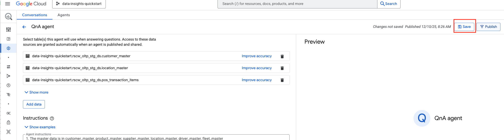  

<br><br>


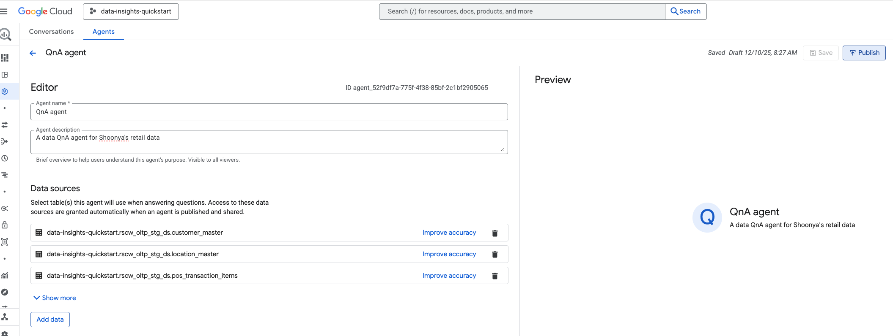  

<br><br>

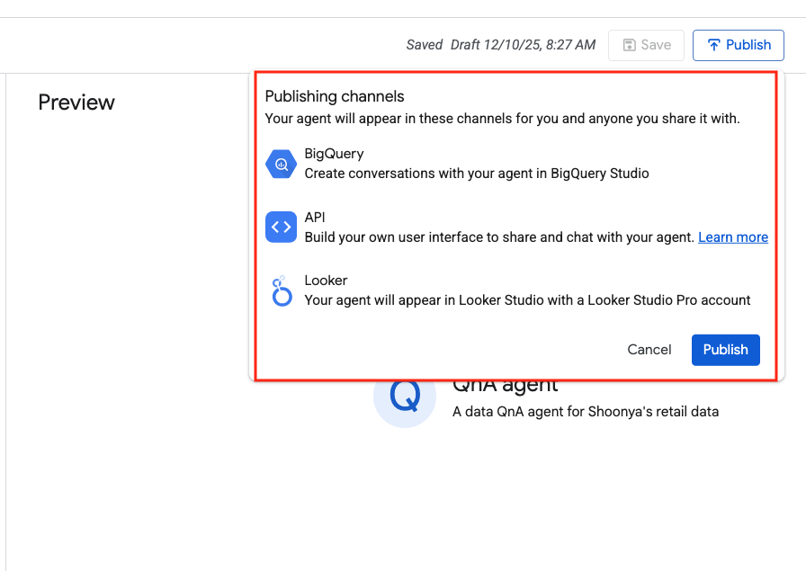  

<br><br>

<hr>


## Unit 4: Analyze data with the Data Agent assistance in BigQuery

### 4.1. Navigate to your agent in BigQuery UI

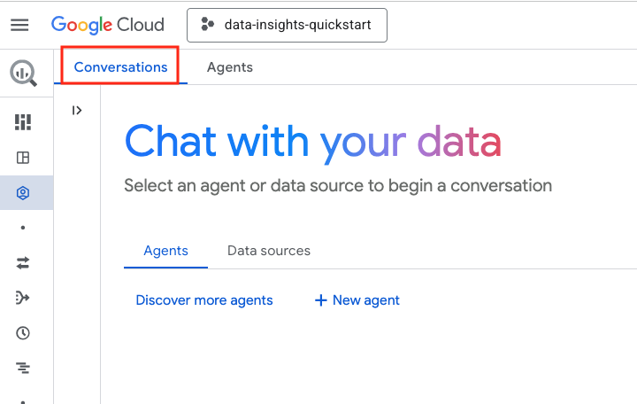  

<br><br>

  

<br><br>

### 4.2. Start a conversation with the agent and name it

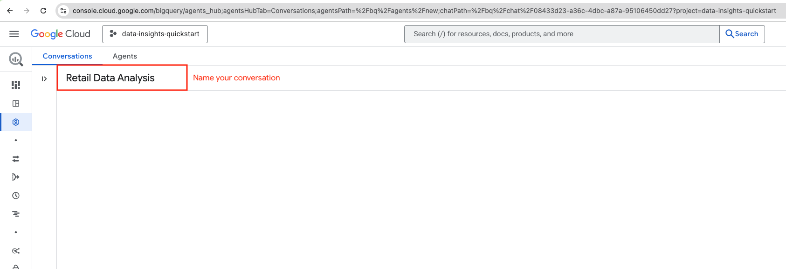  

<br><br>


### 4.3. Analyze data with natural language questions

Ask natural language questions to the agent and review chain of though/ reasoning, queries, response overall and be sure to give a thumbs up and down so that the agent can learn to answer better. Be sure to report any issues as well.<br>

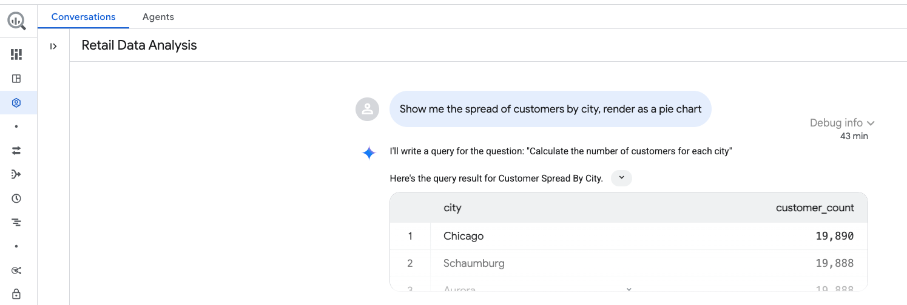  

<br><br>

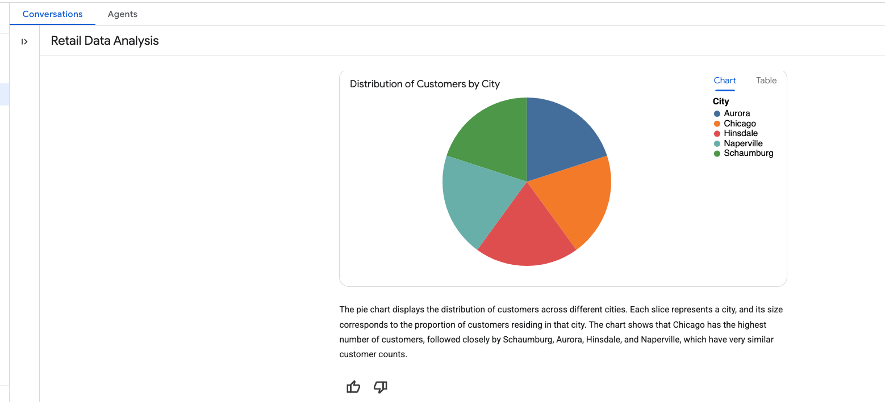  

<br><br>

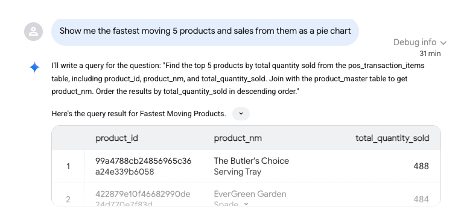  

<br><br>

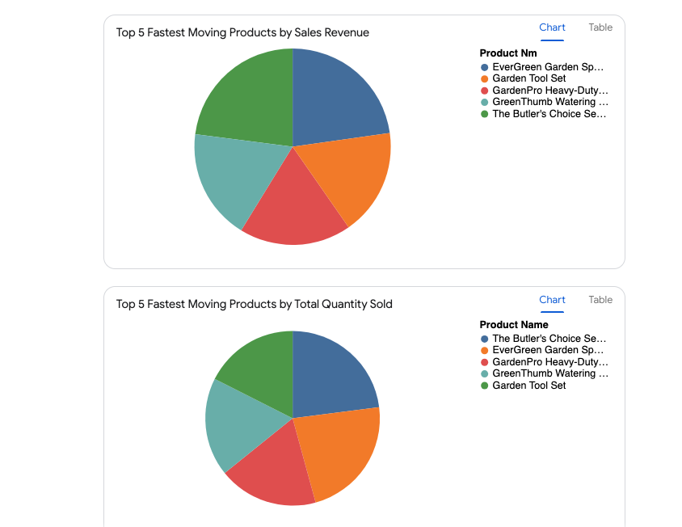  

<br><br>

<hr>

Ask additional questions including trying multi-turn to push the limits of this feature. Share feedback by using the thumbs up/down buttons.


<hr>

### This concludes Lab Module 05 - Conversational Analytics in BigQuery. Proceed to the next [lab module](Module-06-EDA-with-Data-Science-Agent.md).

<hr>


