# Module 06: Exploratory Data Analysis with Data Science Agent

## Motivation:
Shoonya, our hypothetical retail company has recently had to downsize their IT and data science staffing; Consequently, the workload for the remaining data analysts, ML engineers and data scientists has increased. Shoonya would like to embrace any out of the box capabilities that can accelerate speed to delivery for their data science staff.

## Module scope:

This module features the Data Science Agent available in Colab Enterprise for `out of the box exploratory data analysis` (EDA).

## About the Data Science Agent:

Colab Enterprise notebooks come with a built-in Data Science Agent to accelerate your data science development with agentic capabilities that facilitate data exploration, transformation, and machine learning modeling. With nothing but a simple prompt, the agent generates a detailed plan for your workflows – from data loading and cleaning to model training and evaluation.

The Data Science Agent helps you with tasks ranging from exploratory data analysis to generating machine learning predictions and forecasts. You can use the DSA for:

- Large-scale data processing: Use BigQuery ML, BigQuery DataFrames, or Serverless for Apache Spark to perform distributed data processing on large datasets. This lets you efficiently clean, transform, and analyze data that's too large to fit into memory on a single machine.
- Generating a plan: Generate and modify a plan to complete a particular task using common tools such as Python, SQL, Serverless for Apache Spark, and BigQuery DataFrames.
- Data exploration: Explore a dataset to understand its structure, identify potential issues like missing values and outliers, and examine the distribution of key variables using Python or SQL.
- Data cleaning: Clean your data. For example, remove data points that are outliers.
- Data wrangling: Convert categorical features into numerical representations using techniques like one-hot encoding or label encoding or by using BigQuery ML feature transformation tools. Create new features for analysis.
- Data analysis: Analyze the relationships between different variables. Calculate correlations between numerical features and explore distributions of categorical features. Look for patterns and trends in the data.
- Data visualization: Create visualizations such as histograms, box plots, scatter plots, and bar charts that represent the distributions of individual variables and the relationships between them. You can also create visualizations in Python for tables stored in BigQuery.
- Feature engineering: Engineer new features from a cleaned dataset.
- Data splitting: Split an engineered dataset into training, validation, and testing datasets.
- Model training: Train a model by using the training data in a pandas DataFrame (X_train, y_train), BigQuery DataFrames, a PySpark DataFrame, or by using the BigQuery ML CREATE MODEL statement with BigQuery tables.
- Model optimization: Optimize a model by using the validation set. Explore alternative models like DecisionTreeRegressor and RandomForestRegressor and compare their performance.
- Model evaluation: Evaluate model performance on a test dataset using a pandas DataFrame, BigQuery DataFrames, or a PySpark DataFrame. You can also assess model quality and compare models by using BigQuery ML model evaluation functions for models trained using BigQuery ML.
- Model inference: Perform inference with BigQuery ML trained models, imported models, and remote models using BigQuery ML inference functions. You can also use the BigFrames model.predict() method or PySpark transformers to make predictions.

## Public documentation

**Docs:**  
[https://docs.cloud.google.com/bigquery/docs/colab-data-science-agent](https://docs.cloud.google.com/bigquery/docs/colab-data-science-agent)  

**Recent blog**:  
[https://cloud.google.com/blog/products/data-analytics/data-science-agent-now-supports-bigquery-ml-dataframes-and-spark](https://cloud.google.com/blog/products/data-analytics/data-science-agent-now-supports-bigquery-ml-dataframes-and-spark)

## Duration:

This module should take no more than 10 minutes.

## Prerequisites:

Completion of Module 02 a-b-c.

## Table of contents

| # | Learning unit | 
| -- | :--- | 
| 1 | [Incremental permissions / configurations](Module-06-EDA-with-Data-Science-Agent.md#unit-1-incremental-permissions--configurations) |
| 2 | [Exploratory Data Analysis with the Data Science Agent - what to expect](Module-06-EDA-with-Data-Science-Agent.md#unit-2-exploratory-data-analysis-with-the-data-science-agent-available-in-colab-enterprise-notebooks) |
| 3 | [Actual lab](Module-06-EDA-with-Data-Science-Agent.md#3-execute-the-lab-notebook) |

# Lab module

## Unit 1: Incremental permissions, & configurations

### 1.1. Permissions needed

No incremental permissions are needed

### 1.2. APIs 

No incremental API enabling is needed

## Unit 2. Exploratory Data Analysis with the Data Science Agent available in Colab Enterprise notebooks

### 2.1. Upload the notebook

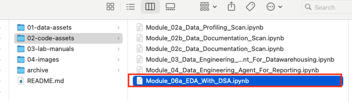  

  

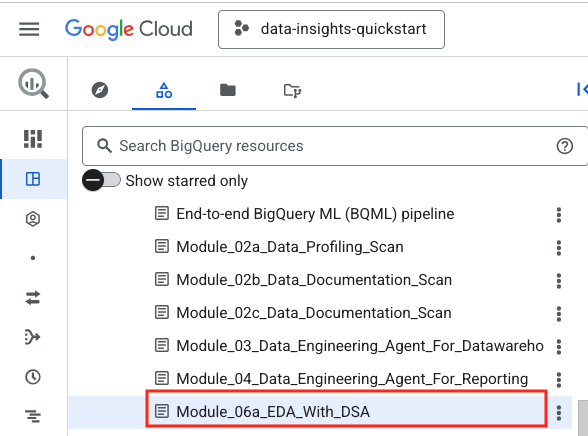  

### 2.2. Curate some data to explore

The next few screenshots show how to use the code 'generate' capability in Colab Enterprise.

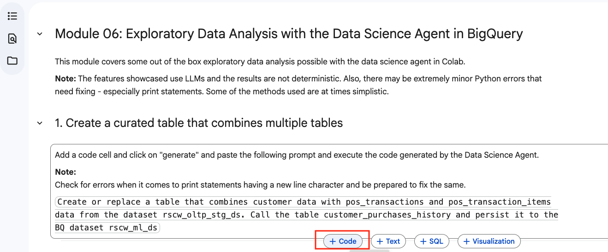  

  

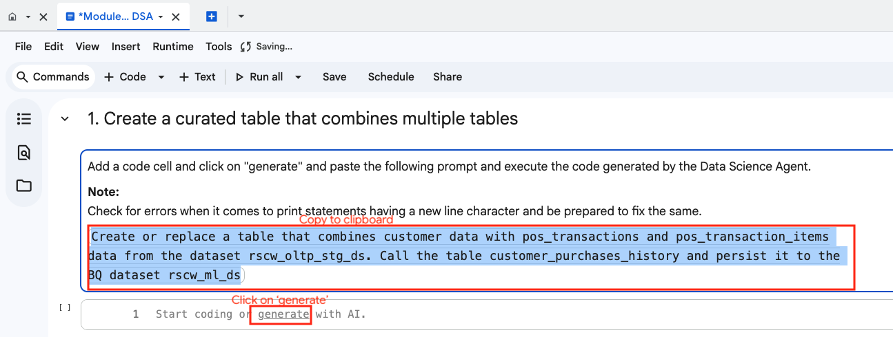  

  

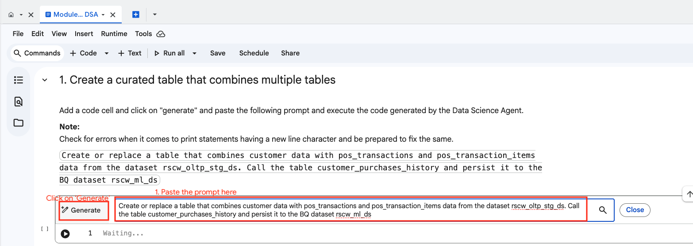  

  

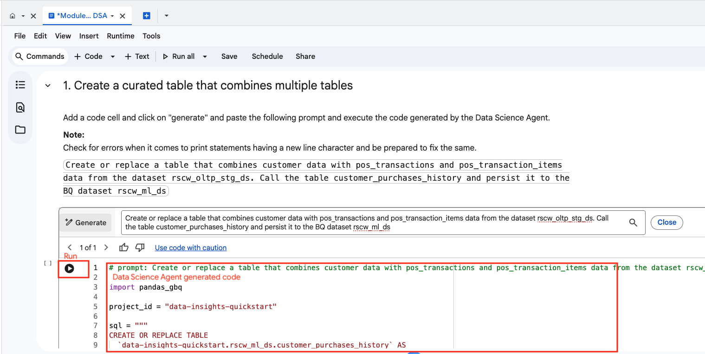  

  

### 2.3. Out of the box EDA with just a prompt

The next few screenshots show EDA out of the box.

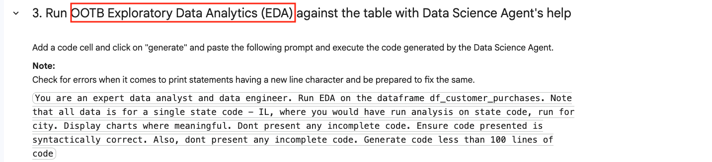  

  

  

  

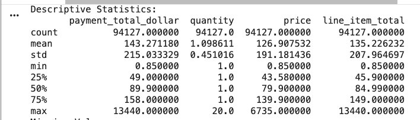  

  

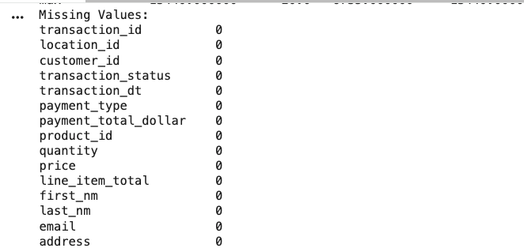  

  

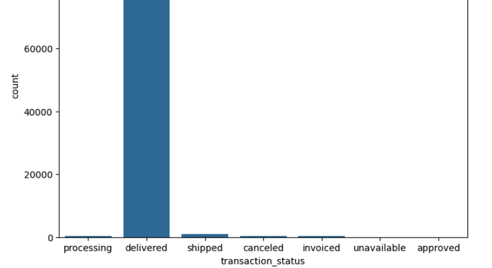  

  

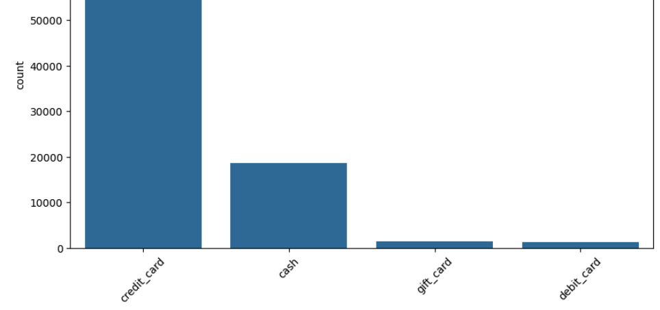  

  

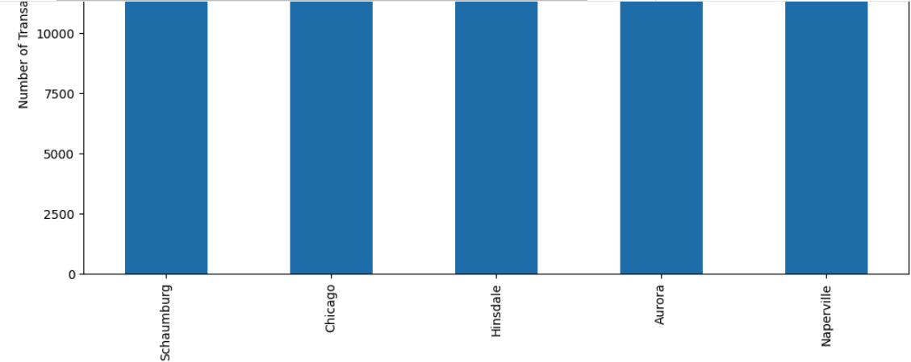  

  

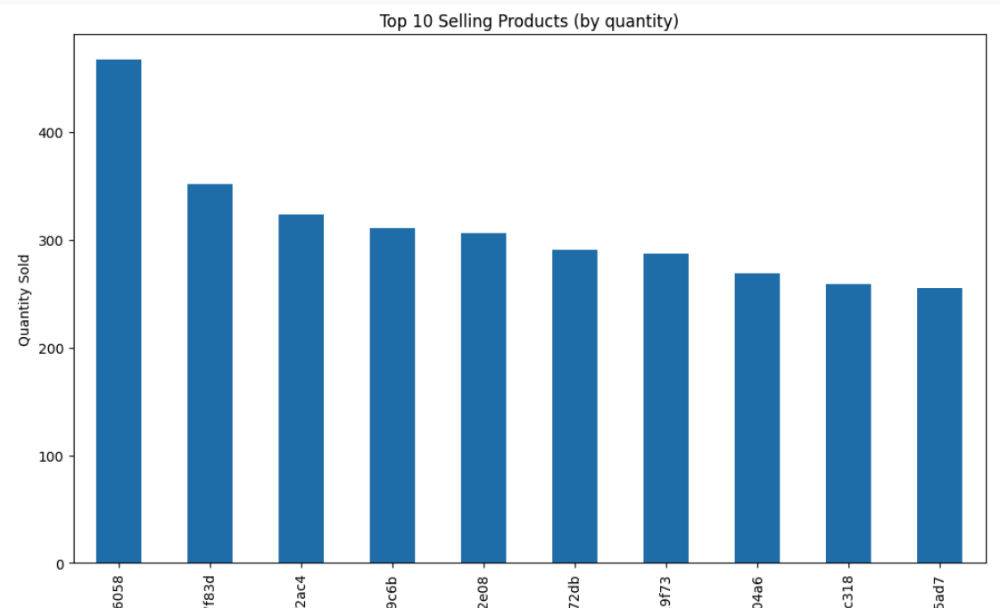  

  

### 2.4 Miscellaneous data exploration

The next few screenshots show miscellaneous user directed EDA.

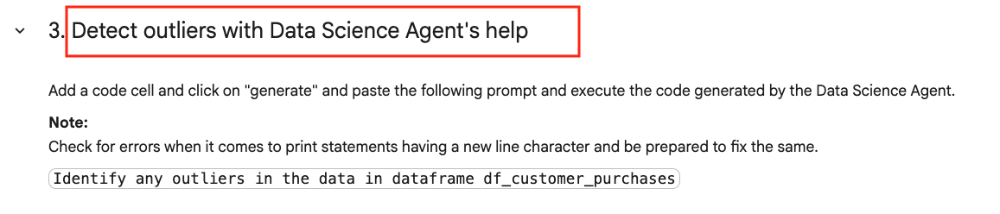  

  

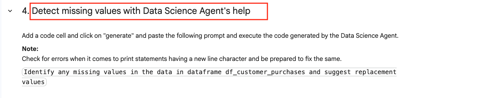  

  

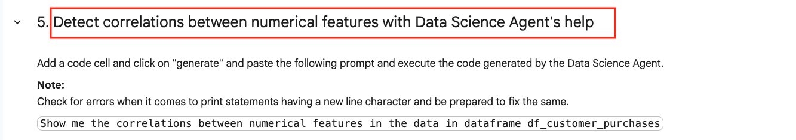  

  

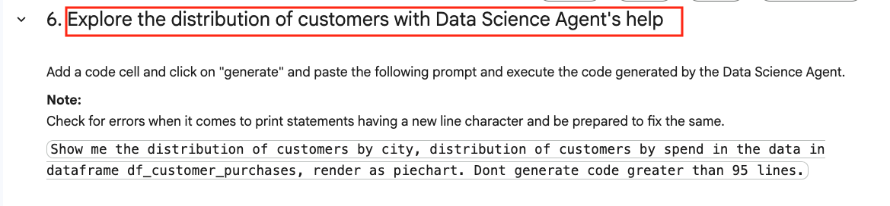  

  

  

### 2.5. Visualization out of the box

The next few screenshots show out of the box visualization with just a prompt.

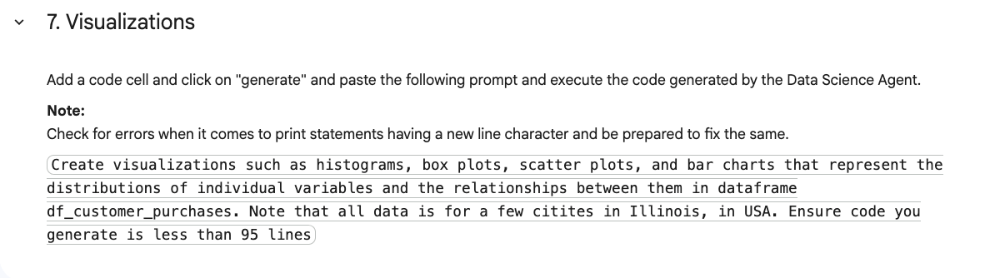  

  

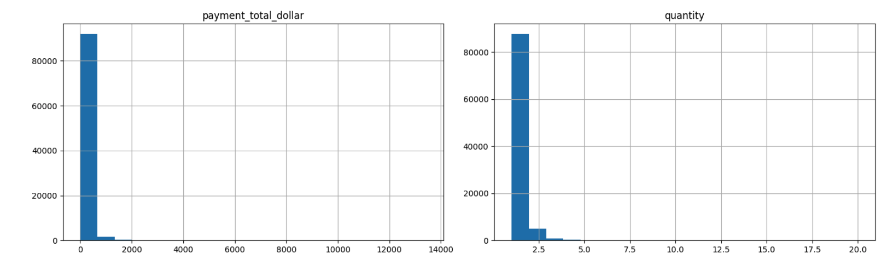  

  

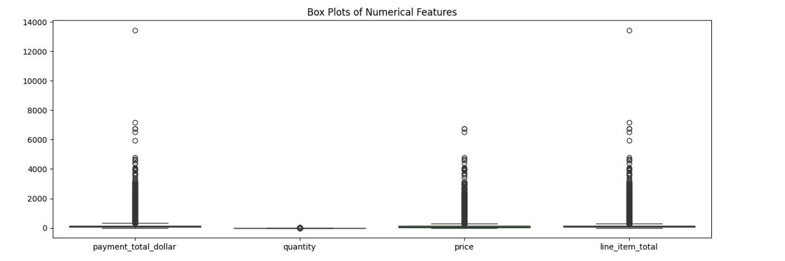  

  

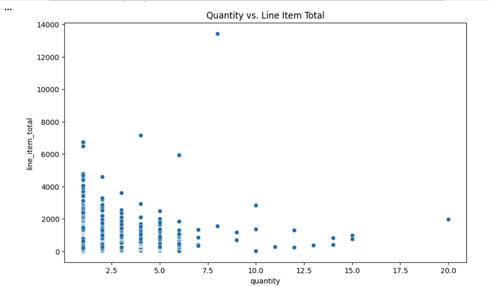  

  

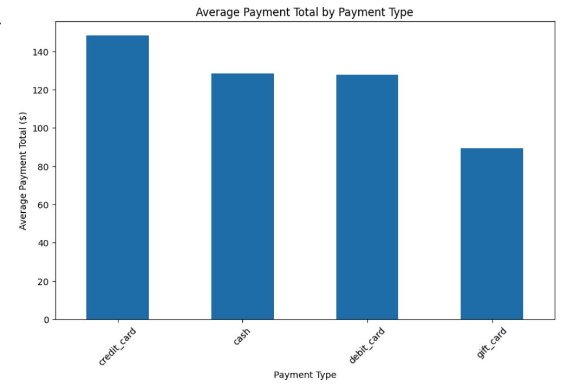  

  

## 3. Execute the lab notebook

Proceed to the BigQuery console and run through the notebook `Module_06_EDA_With_Data_Science_Agent`

### This concludes Lab Module 06 - EDA with Data Science Agent on Colab Enterprise in BigQuery. Proceed to the [next lab module](Module-07-Forecasting-WithTimesFM.md).

