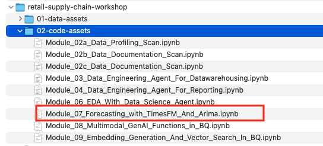
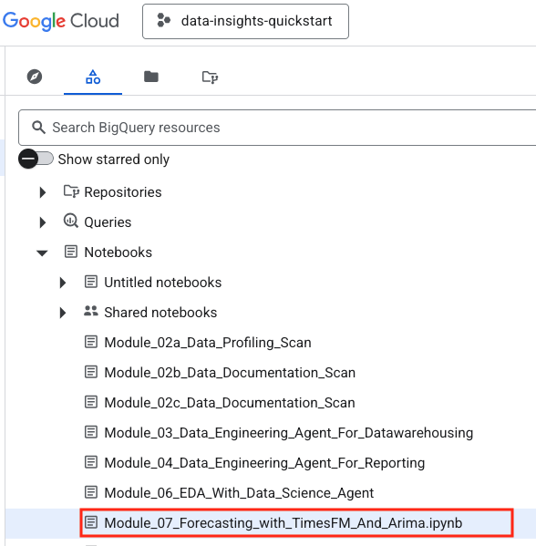

# Module 07: Forecasting with TimesFM in BigQuery

## Motivation:
Shoonya, our hypothetical retail company currently has forecasting modules developed by their data scientists that runs on batch weekly. Shoonya's data scientists would like to explore forecasting functionality within BigQuery - TimesFM (LLM powered) and Arima Plus. They are looking for quick samples on the sample retail data, so they can get hands on and learn what is supported and tuneable for forecast accuracy.

## Module scope:

Accurate and granular demand forecasting is critical for managing retail inventory, but forecasting for every individual item and location is a major operational challenge. This tutorial demonstrates how to perform scalable time series forecasting directly in BigQuery, using the retail supply chain (Kaggle base, then Gemini enriched data) `rscw_oltp_stg_ds` dataset as a practical example.

In this module, you will compare two distinct approaches to generate forecasts:

**A Trained Model:** train a traditional [ARIMA](https://cloud.google.com/bigquery/docs/reference/standard-sql/bigqueryml-syntax-create-time-series) model and generating predictions with [BigQuery Machine Learning](https://cloud.google.com/bigquery/docs/bqml-introduction). 
**A Zero Shot Model:** use [TimesFM](https://github.com/google-research/timesfm), a foundation model, to generate predictions directly from the data with no model training required. 
You will apply both methods to a single aggregated time series and then scale to multiple series to see how each performs at a granular level. 

**Objectives:**
You will learn to: 
1. Prepare raw data for time series forecasting scenarios in BigQuery 
2. Build a traditional forecasting model using `CREATE MODEL` AND generate predictions with `ML.FORECAST` (ARIMA) 
3. Generate zero-shot forecasts directly from data using the `AI.FORECAST function` (TimesFM) 
4. Scale your analysis from a single time series to multiple time series 
5. Visualize and compare the outputs to understand the tradeoffs between the two methods 
 
The focus is a gentle introduction versus a perfect forecasting solution. Tuning is an advanced exercise and out of scope for this lab module.

## Public documentation:

TimesFM in BigQuery: [https://docs.cloud.google.com/bigquery/docs/timesfm-model](https://docs.cloud.google.com/bigquery/docs/timesfm-model)  
Arima Plus in BigQuery:
  [Univariate forecatsing](https://docs.cloud.google.com/bigquery/docs/reference/standard-sql/bigqueryml-syntax-create-time-series)
  [Multivariate forecatsing](https://docs.cloud.google.com/bigquery/docs/reference/standard-sql/bigqueryml-syntax-create-multivariate-time-series)

## Duration:

This module should take no more than 5 minutes.

## Prerequisites:

Completion of Module 02 a-b-c.

## Table of contents:

| # | Learning unit | 
| -- | :--- | 
| 1 | [Incremental permissions / configurations & notebook upload](Module-07-Forecasting-WithTimesFM.md#1-incremental-permissions-api-enabling--notebook-upload) |
| 2 | [Preview of what is covered in the lab](Module-07-Forecasting-WithTimesFM.md#2-preview-of-what-is-covered-in-the-notebook) |
| 3 | [Actual lab](Module-07-Forecasting-WithTimesFM.md#3-the-actual-lab) |

# Lab module

## 1. Incremental permissions, API enabling & notebook upload

### 1.1. Incremental permissions
None whatsoever

### 1.2. Incremental API enabling
None whatsoever

### 1.3. Notebook upload to BigQuery

  

  

  

  

## 2. Preview of what is covered in the notebook

### 2.1. Data in scope

We will use the customer purchases history table from the previous lab module.

### 2.2. Data preparation

We will aggregate data for single and multiple time series forecasting.

1. For single time series forecasting, we will create a table that aggregates sales by transaction date - materialize to a physical table
2. For multiple time series forecasting, we will create a table that aggregates sales by transaction date and product - materialize to a physical table

### 2.3. Forecasting single time series

#### 2.3.1. Forecast with Arima Plus

We will create a model and then forecast with it

#### 2.3.2. Forecast with TimesFM

We will create a model and then forecast with it

#### 2.3.3. Visualize

We will plot the historical sales, and forecast with both model options and draw conclusions

### 2.4. Forecasting multiple time series

We will repeat what we did for the signle time series for multiple time series and draw conclusions.

### 2.5. Advanced forecasting

Tuning / configurations to improve forecast is a work in progress by the lab author and will be addressed in the future. The author invites the community to contrinute any improvements.

## 3. The actual lab

Proceed to the notebook and run through the same.

This concludes the lab module. Proceed to the [next module](Module-08-GenAI-Functions-In-BQ.md).

