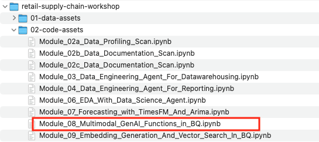
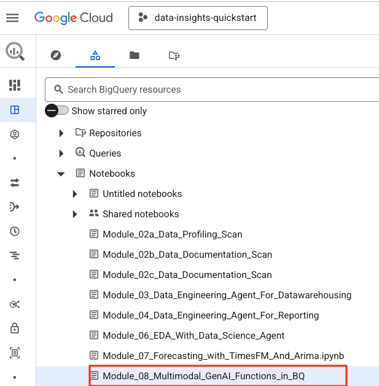
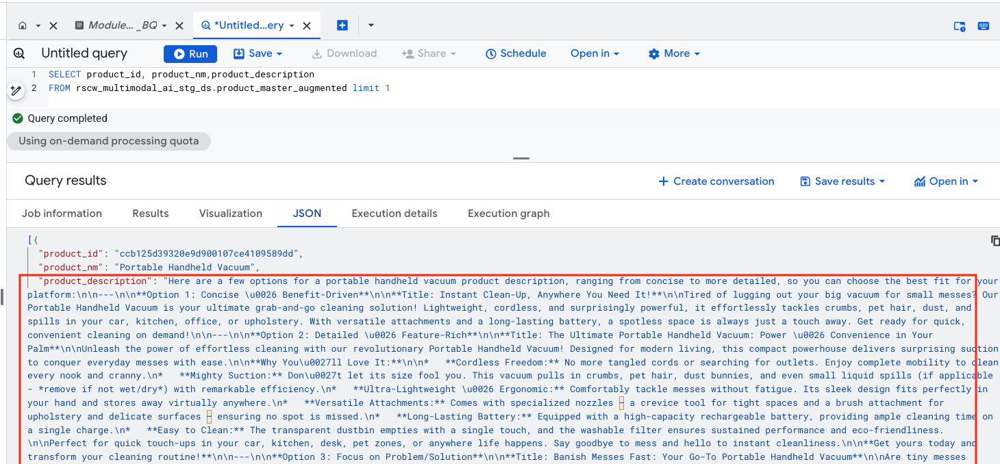
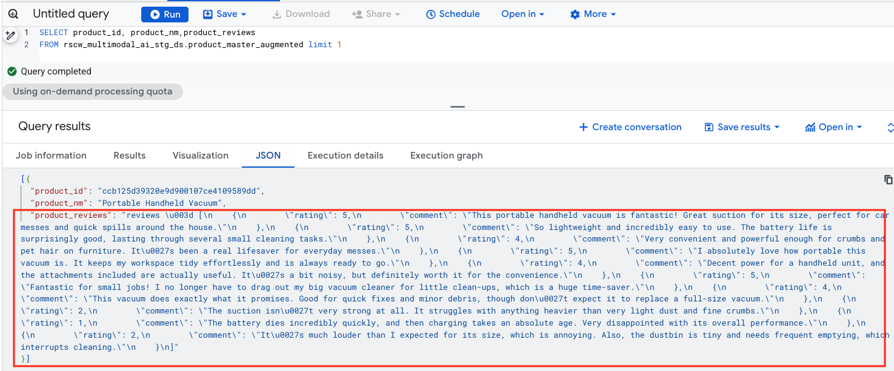
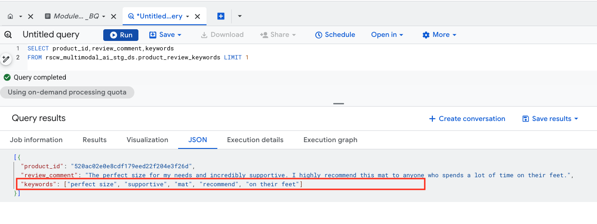
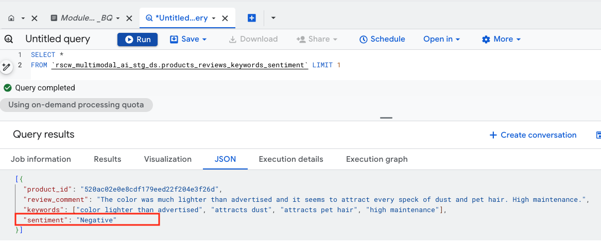
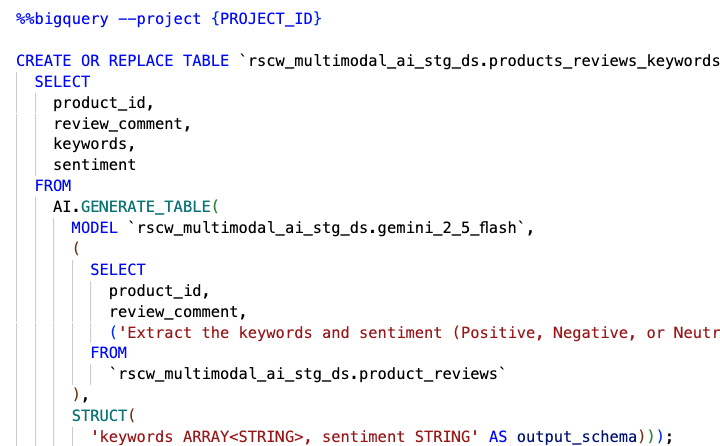

# Module 08: Generative AI functions in BigQuery

## Motivation:
Shoonya, our hypothetical retail company would like to take advantage of Generative AI functions in BigQuery. One area where they could clearly use help is encriching their product descriptions for search optimization. They currently use a third party company for product catalog enrichment and would like to explore the art of the possible with BigQuery.

## About Generative AI functions in BigQuery at a high-level:

There are a number of generative AI functions that BigQuery supports. These functions accept natural language inputs and use pre-trained Vertex AI models and built-in BigQuery models. 

These functions can help with tasks such as the following:
1. Generate creative content
2. Analyze, detect sentiment, and answer questions about text or unstructured data, such as images.
3. Summarize the key ideas or impressions conveyed by the content.
4. Extract structured data from text.
5. Classify text or unstructured data into user defined categories.
6. Generate embeddings to search for similar text, images, and video.
7. Rate inputs in order to rank them by quality, similarity, or other criteria.

 
There are two main categories of AI functions to help you accomplish these tasks: 

### 1. General-purpose AI functions

These functions give you full control and transparency on the choice of model, prompt, and parameters to use. 

- Perform inference, such as to answer questions about your data 
  `AI.GENERATE` is the most flexible inference function, which lets you analyze any combination of text and unstructured data, and lets you output structured data that matches your custom schema.
  
  If you require output of a specific type, select one of the following more specialized inference functions: 
    `AI.GENERATE_BOOL`  
    `AI.GENERATE_DOUBLE` 
    `AI.GENERATE_INT` 
  
- Generate structured output, such as extracting names and addresses from unstructured text

  `AI.GENERATE`, when you specify an `output_schema` 
  `AI.GENERATE_TABLE` 

- Generate text with a table-valued function version of `AI.GENERATE`
  
  `AI.GENERATE_TEXT`

- Generate embeddings for semantic search and clustering
  
  `AI.EMBED` 
  `AI.GENERATE_EMBEDDING` 
  `AI.SIMILARITY` 

### 2. Managed AI functions

These functions have a streamlined syntax and are optimized for cost and quality. BigQuery chooses a model for you. 

- Filter your data with natural language conditions
  `AI.IF`

- Rate input, such as by quality or sentiment
  `AI.SCORE`

- Classify input into user-defined categories
  `AI.CLASSIFY`

## Module scope:

The module covers general purpose GenAI functions-
1. `AI.GENERATE` to generate product descriptions
2. `AI.GENERATE` to extract keywords from product reviews
3. `AI.GENERATE` for sentiment analysis from product reviews
4. `AI.GENERATE_TABLE` for materializing the reviews, keywords and sentiments (unstructured) as a table (structured data)

The module also covers some knobs available to influence the content generation.

## Public documentation:

[Generative AI in BigQuery](https://docs.cloud.google.com/bigquery/docs/generative-ai-overview)

## Duration:

This module should take no more than 5 minutes.

## Prerequisites:

Completion of prior modules

## Table of contents:

| # | Learning unit | 
| -- | :--- | 
| 1 | [Incremental permissions / configurations & notebook upload](Module-08-GenAI-Functions-In-BQ.md#1-incremental-permissions-api-enabling--notebook-upload) |
| 2 | [Preview of what is covered in the lab](Module-08-GenAI-Functions-In-BQ.md#2-preview-of-what-is-covered-in-the-notebook) |
| 3 | [Actual lab](Module-08-GenAI-Functions-In-BQ.md#3-the-actual-lab) |

# Lab module

## 1. Incremental permissions, API enabling & notebook upload

### 1.1. Incremental permissions
None whatsoever

### 1.2. Incremental API enabling
None whatsoever

### 1.3. Notebook upload to BigQuery

  

  

  

  

## 2. Preview of what is covered in the notebook

### 2.1. Data in scope

We will use the `rscw_oltp_stg_ds.product_master` table from the previous lab modules.

### 2.2. Data preparation

We will generate fake product reviews with a 70-30 positive negative balance for the purpose of the lab

### 2.3. Generating product descriptions with `AI.GENERATE`

Here is a sample of product descriptions generated 

  

  

### 2.4. Generating (fake) product reviews with `AI.GENERATE`

Here is a sample of product reviews generated 

  

  

### 2.4. Keyword extraction from reviews with `AI.GENERATE`

Here is a sample of keywords extracted from a product review

  

  

### 2.5. Sentiment analysis from reviews with `AI.GENERATE`

Here is a sample of sentiment analysis off of the keywords extracted from a product review

  

  

### 2.6. Unstructured to structured with `AI.GENERATE_TABLE`

Here is a sample of sentiment analysis off of the keywords extracted from a product review

  

  

## 3. The actual lab

Proceed to the notebook and run through the same.

This concludes the lab module. Proceed to the [next module](Module-09-Embedding-Gen-And-Vector-Search-In-BQ.md).

