# Module 09: Embedding Generation and Vector Search in BigQuery

## Motivation:
Shoonya, our hypothetical retail company has a multitude of unstructured data in addition to structured, and needs the same to be easily searchable and with high accuracy. There are a number of vector store options available on Google Cloud and from third parties. Shoonya's enterprise architecture team is interested in learning the BigQuery embeddings & search capabilities while they work on options and considerations for vector stores and search on GCP and arrive at a decision tree and strategic recommendation as an enterprise standard.

## About Vector Search and Embeddings in general:

Vector search is a technique to compare similar objects using embeddings, and it is used to power Google products, including Google Search, YouTube, and Google Play. You can use vector search to perform searches at scale. When you use vector indexes with vector search, you can take advantage of foundational technologies like inverted file indexing (IVF) and the ScaNN algorithm. 

Vector search is built on embeddings. Embeddings are high-dimensional numerical vectors that represent a given entity, like a piece of text or an audio file. Machine learning (ML) models use embeddings to encode semantics about such entities to make it easier to reason about and compare them. For example, a common operation in clustering, classification, and recommendation models is to measure the distance between vectors in an embedding space to find items that are most semantically similar. 

This concept of semantic similarity and distance in an embedding space is visually demonstrated when you consider how different items might be plotted. For example, terms like cat, dog, and lion, which all represent types of animals, are grouped close together in this space due to their shared semantic characteristics. Similarly, terms like car, truck, and the more generic term vehicle would form another cluster. This is shown in the following image: 

  

  

You can see that the animal and vehicle clusters are positioned far apart from each other. The separation between the groups illustrates the principle that the closer objects are in the embedding space, the more semantically similar they are, and greater distances indicate greater semantic dissimilarity.
  

**Use cases**  
The combination of embedding generation and vector search enables many interesting use cases. Some possible use cases are as follows: 

- Retrieval-augmented generation (RAG): Parse documents, perform vector search on content, and generate summarized answers to natural language questions using Gemini models, all within BigQuery. For a notebook that illustrates this scenario, see [Build a Vector Search application using BigQuery DataFrames](https://github.com/googleapis/python-bigquery-dataframes/blob/main/notebooks/generative_ai/bq_dataframes_llm_vector_search.ipynb).
- Recommending product substitutes or matching products: Enhance ecommerce applications by suggesting product alternatives based on customer behavior and product similarity.
- Log analytics: Help teams proactively triage anomalies in logs and accelerate investigations. You can also use this capability to enrich context for LLMs, in order to improve threat detection, forensics, and troubleshooting workflows. For a notebook that illustrates this scenario, see [Log Anomaly Detection & Investigation with Text Embeddings + BigQuery Vector Search](https://github.com/GoogleCloudPlatform/generative-ai/blob/main/embeddings/use-cases/outlier-detection/bq-vector-search-outlier-detection-audit-logs.ipynb).
- Clustering and targeting: Segment audiences with precision. For example, a hospital chain could cluster patients using natural language notes and structured data, or a marketer could target ads based on query intent. For a notebook that illustrates this scenario, see Create-Campaign-Customer-Segmentation.
- Entity resolution and deduplication: Cleanse and consolidate data. For example, an advertising company could deduplicate personally identifiable information (PII) records, or a real estate company could identify matching mailing addresses.

## About Vector Search and Embeddings in BigQuery:

### Generate embeddings in BigQuery

#### Generate single embeddings

You can use the `AI.EMBED` function with Vertex AI embedding models to generate a single embedding of your input. 

The `AI.EMBED` function supports the following types of input: 

  Text data. 
  Image data represented by ObjectRef values. (Preview) 
  Image data represented by ObjectRefRuntime values. 
  
#### Generate a table of embeddings

You can use the `AI.GENERATE_EMBEDDING` to create a table that has embeddings for all of the data in a column of your input table. For all types of supported models, `AI.GENERATE_EMBEDDING` works with structured data in standard tables. For multimodal embedding models,   `AI.GENERATE_EMBEDDING`   also works with visual content from either standard table columns that contain ObjectRef values, or from object tables. 

For remote models, all inference occurs in Vertex AI. For other model types, all inference occurs in BigQuery. The results are stored in BigQuery. 

Use the following topics to try embedding generation in BigQuery ML: 

  - Generate [text](https://docs.cloud.google.com/bigquery/docs/generate-text-embedding), [images](https://docs.cloud.google.com/bigquery/docs/generate-visual-content-embedding), or [video](https://docs.cloud.google.com/bigquery/docs/generate-video-embedding) by using the `AI.GENERATE_EMBEDDING` function.
  - Generate and search multimodal embeddings](https://docs.cloud.google.com/bigquery/docs/generate-multimodal-embeddings)
  - [Perform semantic search and retrieval-augmented generation](https://docs.cloud.google.com/bigquery/docs/vector-index-text-search-tutorial) 

#### Autonomous embedding generation

You can use [autonomous embedding generation](https://docs.cloud.google.com/bigquery/docs/autonomous-embedding-generation) to simplify the process of creating, maintaining, and querying embeddings. BigQuery maintains a column of embeddings on your table based on a source column. When you add or modify data in the source column, BigQuery automatically generates or updates the embedding column for that data by using a Vertex AI embedding model. This is helpful if you want to let BigQuery maintain your embeddings when your source data is updated regularly.

### Search

The following search functions are available:  

- `VECTOR_SEARCH`: Perform a vector search by using SQL.

- `AI.SEARCH` (Preview): Search for results that are close to a string that you provide. You can use this function if your table has autonomous embedding generation enabled.

- `AI.SIMILARITY` (Preview): Compare two inputs by computing the cosine similarity between their embeddings. This function works well if you want to perform a small number of comparisons and you haven't precomputed any embeddings. You should use VECTOR_SEARCH when performance is critical and you're working with a large number of embeddings. Compare their functionality to choose the best function for your use case.

- Optionally, you can create a vector index by using the `CREATE VECTOR INDEX` statement. When a vector index is used, the VECTOR_SEARCH and AI.SEARCH functions use the `Approximate Nearest Neighbor` search technique to improve vector search performance, with the trade-off of reducing recall and so returning more approximate results. Without a vector index, these functions use brute force search to measure distance for every record. You can also choose to use brute force to get exact results even when a vector index is available.

## Module scope:

In this tutorial, you'll build a [**semantic search**](https://cloud.google.com/discover/what-is-semantic-search) utility for a Shoonya, our hypothetical retail store chain. You will use [BigQuery](https://cloud.google.com/bigquery/docs) and [Vertex AI](https://cloud.google.com/vertex-ai/docs), to go beyond simple keyword matching by generating [**vector embeddings**](https://cloud.google.com/vertex-ai/generative-ai/docs/embeddings) for product text descriptions _and_ for images. This allows customers to find products based on conceptual meaning, not just keywords, creating a more intuitive shopping experience.

By the end, you will know how to:

* **Generate embeddings (numerical representations)** for text and image data.

* **Perform text-to-text vector search** to find products with similar text descriptions

* **Perform text-to-image vector search** to find product images that visually match a text query

All within BigQuery!

The module also features the new automated embedding generation capability that is in public preview (as of Dec 8, 2025)

## Public documentation:

[Vector search in BigQuery](https://docs.cloud.google.com/bigquery/docs/vector-search-intro)  
[Autonomous embedding generation](https://docs.cloud.google.com/bigquery/docs/autonomous-embedding-generation)  

## Duration:

This module should take no more than 10 minutes.

## Prerequisites:

Completion of prior modules

## Table of contents:

| # | Learning unit | 
| -- | :--- | 
| 1 | [Incremental permissions / configurations & notebook upload](Module-08-GenAI-Functions-In-BQ.md#1-incremental-permissions-api-enabling--notebook-upload) |
| 2 | [Preview of what is covered in the lab](Module-08-GenAI-Functions-In-BQ.md#2-preview-of-what-is-covered-in-the-notebook) |
| 3 | [Actual lab](Module-08-GenAI-Functions-In-BQ.md#3-the-actual-lab) |

# Lab module

## 1. Incremental permissions, API enabling & notebook upload

### 1.1. Incremental permissions
None whatsoever

### 1.2. Incremental API enabling
None whatsoever

### 1.3. Notebook upload to BigQuery

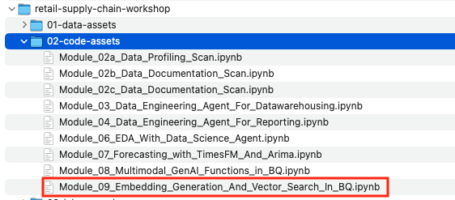  

  

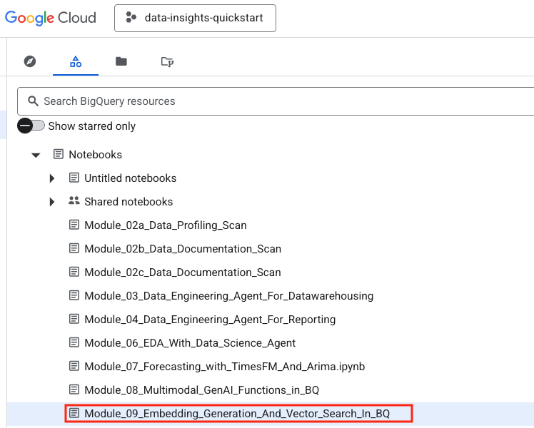  

  

## 2. Preview of what is covered in the notebook

### 2.1. Data in scope

We will use the `rscw_oltp_stg_ds.product_master` table from the previous lab modules.

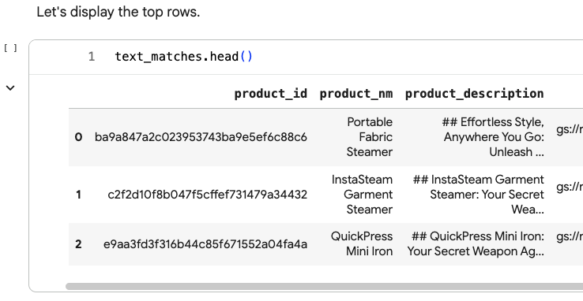  

  

### 2.2. Data preparation

- We will generate product images for the purpose of the lab

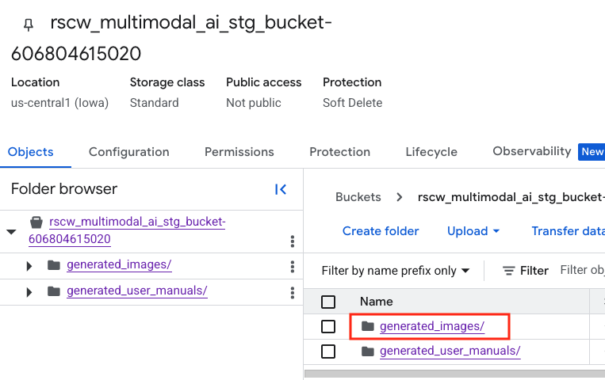  

  

  

  

- We will generate product user manuals for the purpose of a subsequent lab

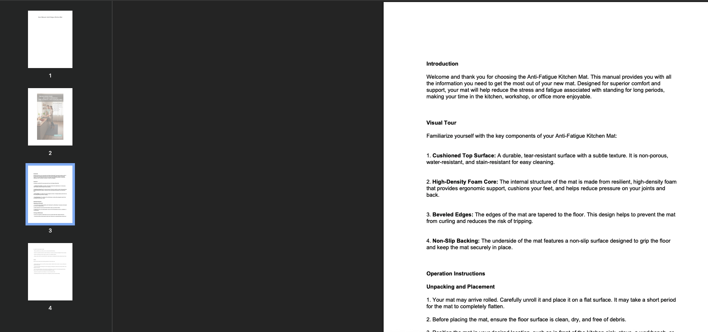  

  

- Here is what the table looks like after adding product image GCS URI and product user manual GCS URI

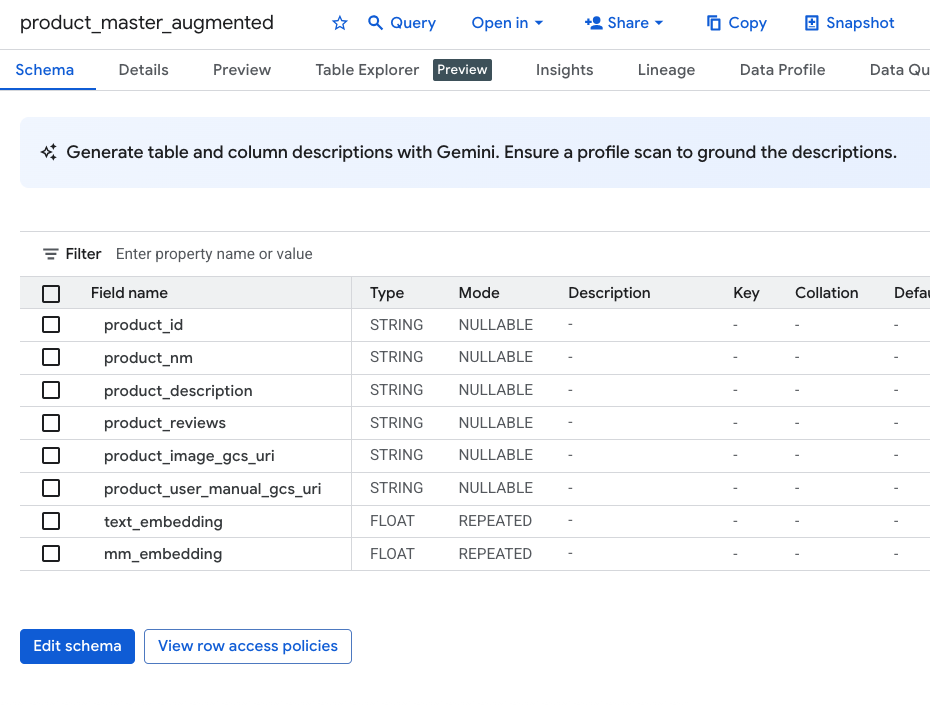  

  

### 2.3. Generating text embeddings and performing text to text searches

We will generate text embeddings for the product description and persist as a new column and perform searches against it

#### 2.3.1. We will create a remote model for text embeddings

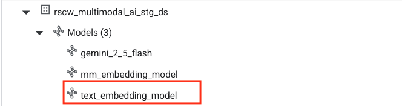  

  

#### 2.3.2. Generate text embeddings with `ML.GENERATE_EMBEDDING` for the product description

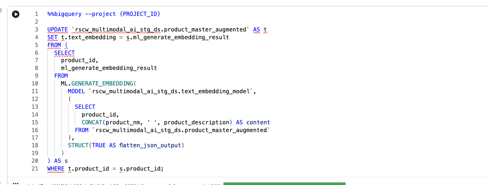  

  

  

  

#### 2.3.3. Use `VECTOR_SEARCH` in BigQuery for text-to-text search
We will search for a `fabric steamer`, view the matches and their distance, and then visualize the images associated with the products matched.

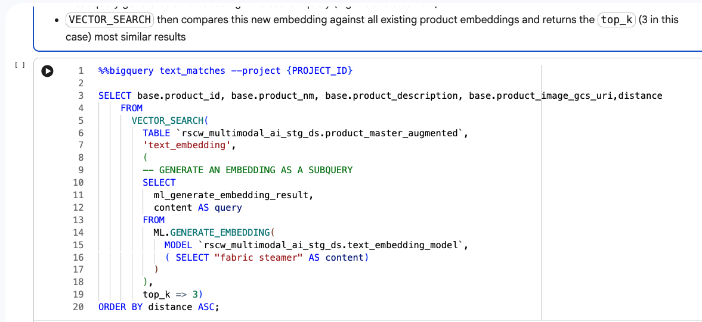  

  

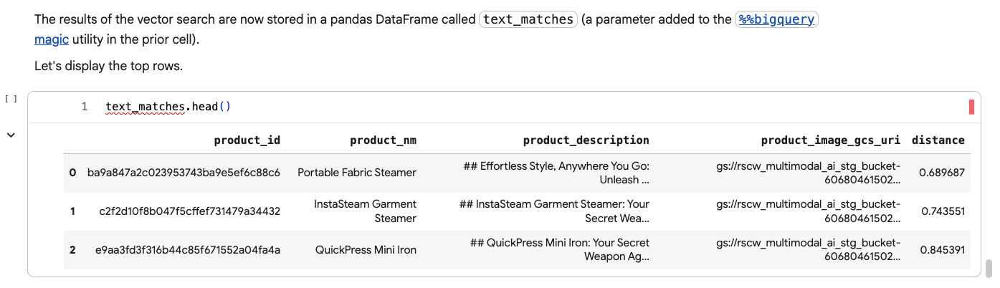  

  

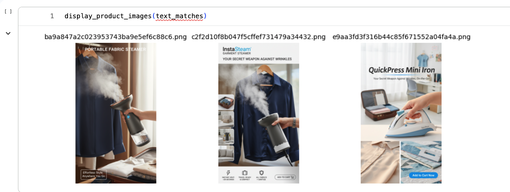  

  

### 2.4. Generating image embeddings and performing text to image searches

We will generate image embeddings for the product images and persist as a new column and perform searches against it with natural language

#### 2.4.1. Create a remote model for multimodal embedding

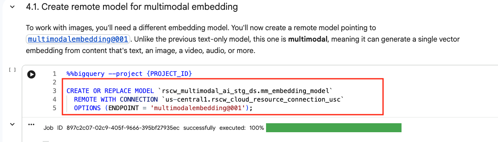  

  

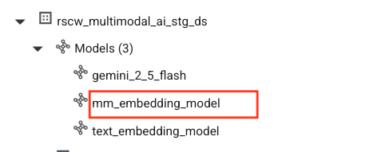  

  

#### 2.4.2. Generate multimodal embeddings with `ML.GENERATE_EMBEDDING` for product images

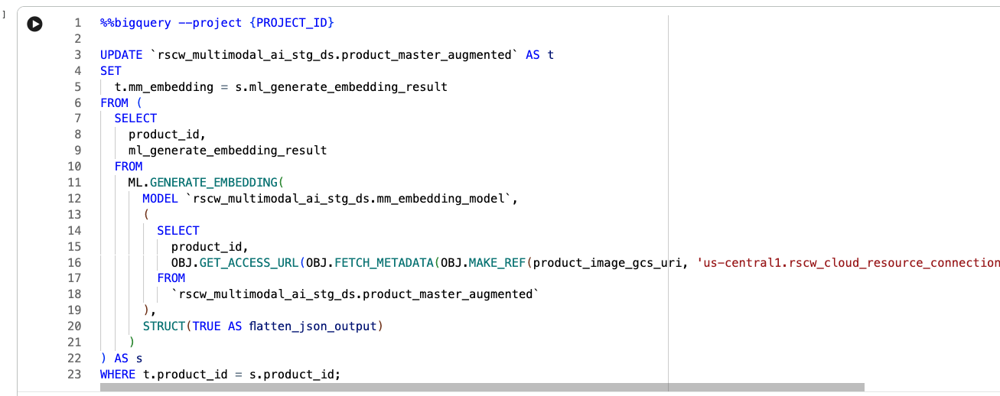  

  

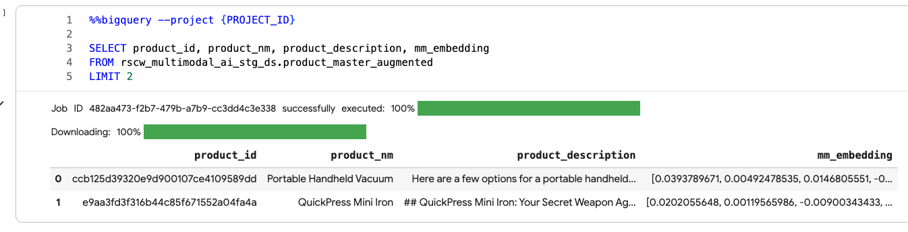  

  

#### 2.4.3. Perform a text-to-image search with BigQuery `VECTOR_SEARCH` & visualize the matches

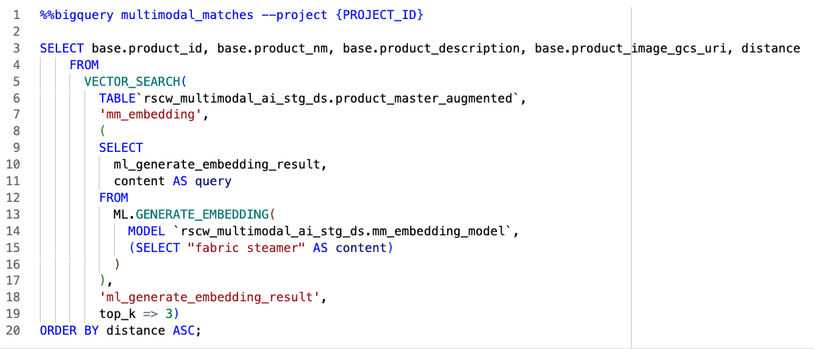  

  

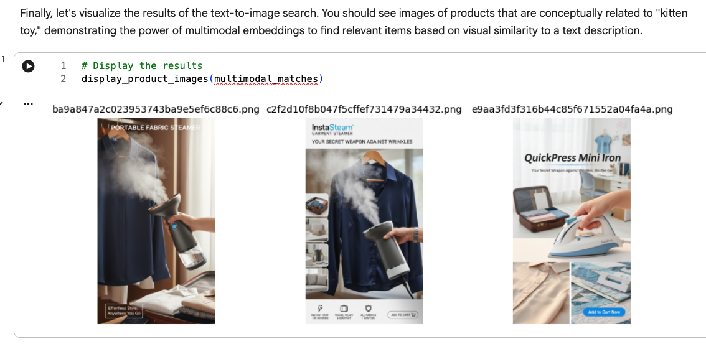  

  

### 2.5. We will finally try out the autonomous embedding generation feature in BigQuery

#### 2.5.1. Create a table for autonomous embedding generation with `AI.EMBED` for product_description column

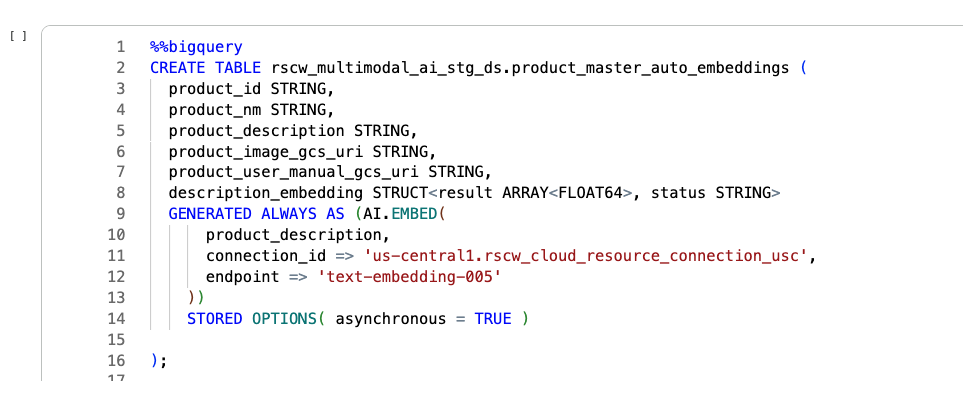  

  

#### 2.5.2. Insert some records into the table

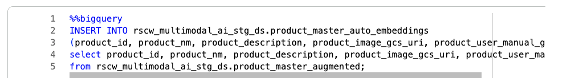  

  

#### 2.5.3. Review the embeddings automatically generated

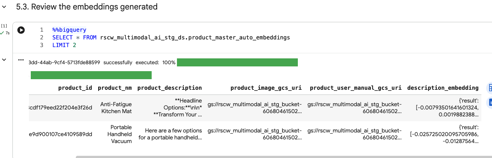  

  

#### 2.5.4. Use `AI.SEARCH` for a text-to-image search

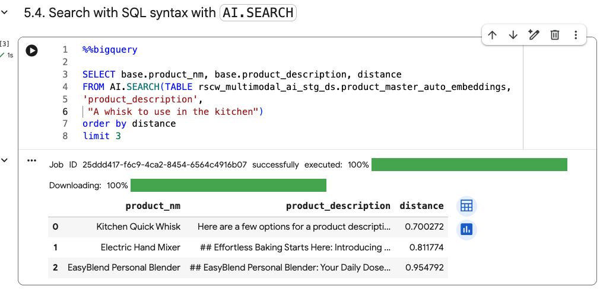  

  

## 3. The actual lab

Proceed to the notebook and run through the same.

This concludes the lab module. Proceed to the next module.

