# Module 10: Apache Iceberg Lakehouse and Apache Spark on Google Cloud

## Motivation:
Shoonya, our hypothetical retail company has a small set of IT teams that are partial to open source, to table formats - specifically Apache Iceberg, want minimal cloud lock-in, and have a lot of code assets using Apache Spark and with data in Apache Iceberg. Shoonya is interested in learning the options and architectural considerations for Apache Spark and Apache Iceberg on Google Cloud and get hands on experience.

## About managed Spark on Google Cloud

Google Cloud offers managed Apache Spark in `Cloud Dataproc` and boasts three form factors - serverless, server on compute engine and server on kubernetes engine. The serverless form factor runtime is available in Colab notebooks and is showcased in this lab module. Learn more about Dataproc [here](https://cloud.google.com/dataproc?hl=en).

## About Apache Iceberg on Google Cloud

**Managed Apache Iceberg BigQuery Tables:**  
Google Cloud offers managed Iceberg tables in BigQuery democratizing this powerful table format for non-Spark savvy but SQL savvy users and includes table maintenance out of the box. This module showcases this feature. 
[Learn more](https://docs.cloud.google.com/biglake/docs/biglake-iceberg-tables-in-bigquery#create-iceberg-tables)  

**Managed Apache Iceberg Catalog with BigLake Tables:**  
This feature will be covered in the next module.

## Module scope:

In this tutorial: 
1. You will learn to export BigQuery data to parquet format in Cloud Storage 
2. Learn to create managed BigQuery Apache Iceberg tables in BigQuery SQL 
3. Load data into these tables 
4. Run DML operations with BigQuery SQL 
5. Read the data in the tables from Apache Spark on Dataproc Serverless in Colab notebook 

By the end, you will know how to: 

* **Create load and run DML on BigQuery Managed Iceberg Tables** 

* **Read Iceberg in BigQuery Managed Iceberg Tables from Apache Spark on Dataproc Serverless** from Colab notebooks

## Duration:

This module should take no more than 10 minutes.

## Prerequisites:

Completion of prior modules

## Table of contents:

| # | Learning unit | 
| -- | :--- | 
| 1 | [Incremental permissions / configurations & notebook upload](Module-10a-Apache-Iceberg-Lakehouse.md#1-incremental-permissions-api-enabling--notebook-upload) |
| 2 | [Preview of what is covered in the lab](Module-10a-Apache-Iceberg-Lakehouse.md#2-preview-of-what-is-covered-in-the-notebook) |
| 3 | [Actual lab](Module-10a-Apache-Iceberg-Lakehouse.md#3-the-actual-lab) |

# Lab module

## 1. Incremental permissions, API enabling & notebook upload

### 1.1. Incremental permissions
None whatsoever

### 1.2. Incremental API enabling
None whatsoever

### 1.3. Notebook upload to BigQuery

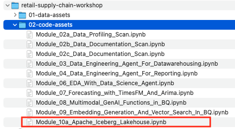  

  

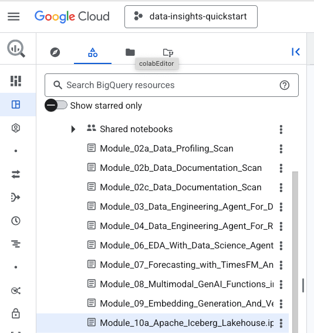  

  

## 2. Preview of what is covered in the notebook

### 2.1. Data in scope

We will use a few of the tables from `rscw_oltp_stg_ds` from the previous lab modules.

### 2.2. Export data as Parquet

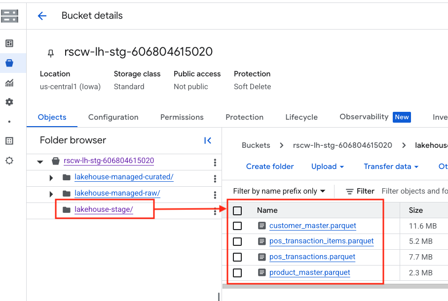  

  

### 2.2. Create Iceberg tables in the Lakehouse `raw` zone

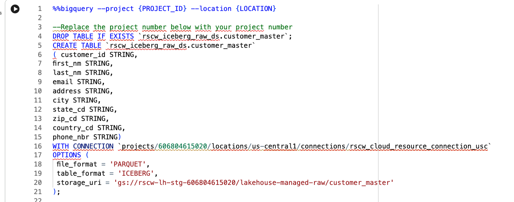  

  

### 2.3. Load Iceberg tables in the Lakehouse `raw` zone

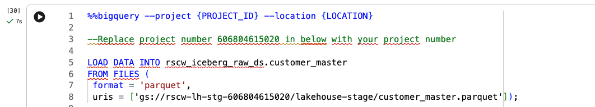  

  

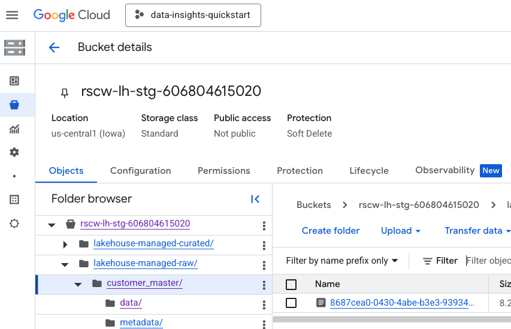  

  

### 2.4. Query Iceberg tables in the Lakehouse `raw` zone with GoogleSQL

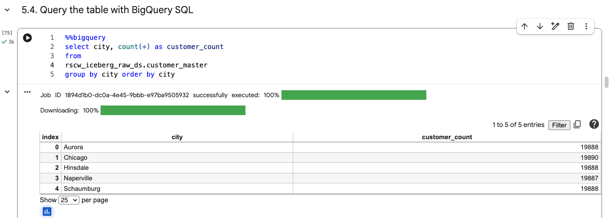  

  

### 2.5. Update Iceberg tables in the Lakehouse `curated` zone with GoogleSQL

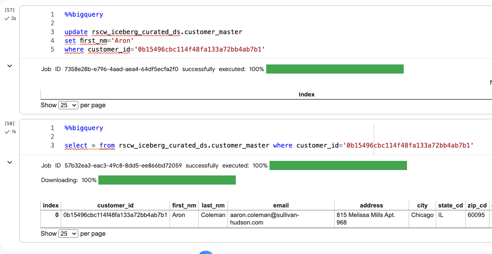  

  

### 2.6. Query Iceberg tables in the Lakehouse `curated` zone with Apache Spark on Dataproc Serverless

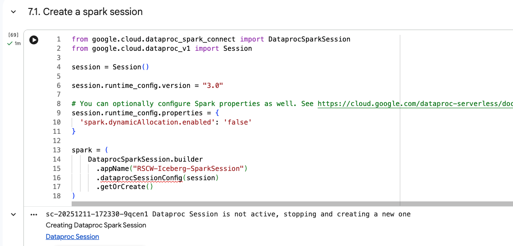  

  

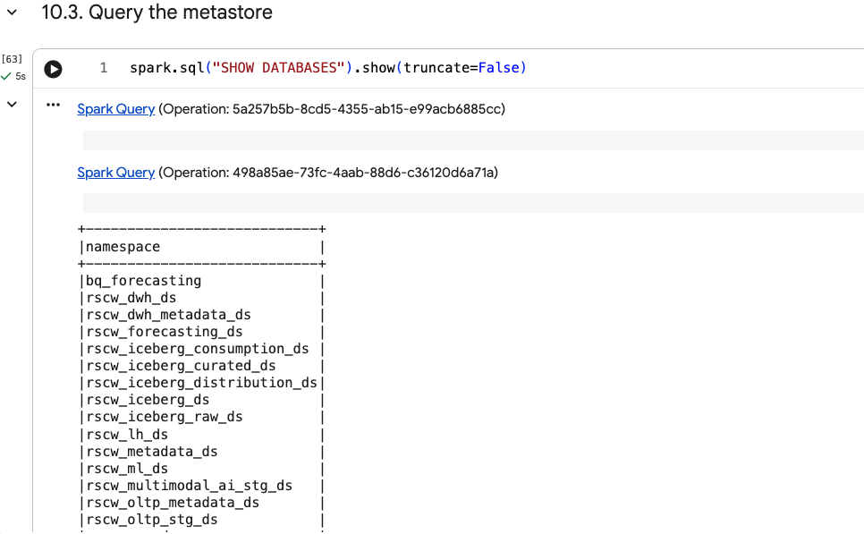  

  

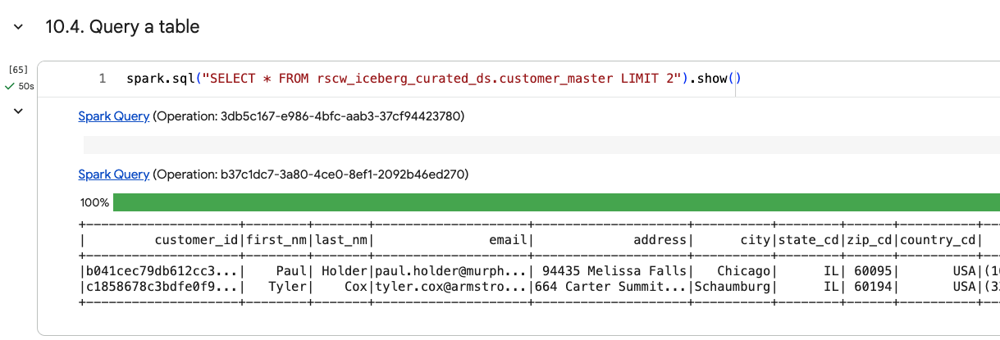  

  

### 2.7. Visualize data off of a PySpark dataframe

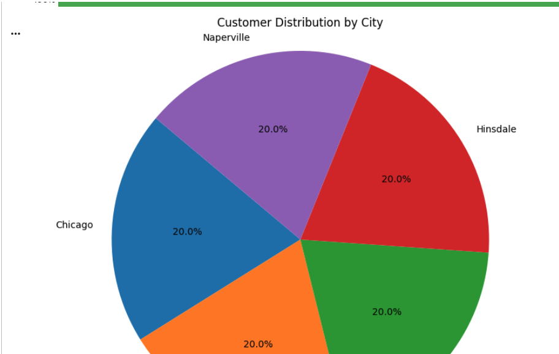  

  

## 3. The actual lab

Proceed to the notebook and run through the same.

This concludes the lab module. Proceed to the next module.

