# Module 20: [ADK Primer] Create a Data Analyst Agent 

In this tutorial we will create an agent for data QnA with ADK, and deploy it to Agent Engine, then register it with Gemini Enterprise. As part of the agent developer continuum, we will test the agent with `adk web` locally, deploy and test on `agent engine` playground, and finally via the `gemini enterprise` UI. 

Note:
The purpose of this tutorial is to show integration between products and is less about building a perfect agent. Many agentic features have been deliberatley skipped for simplicity and focus on standing up a basic QnA application.
   

## 1. Setup

### 1.1. Authenticate to Google Cloud from CLI & generate Application Default Credentials

Run each of these in cloud shell / terminal:
```
gcloud init
```

```
gcloud auth application-default login
```

### 1.2. Ingest the refrigerator dataset from CLI

# INSERT INSTRUCTIONS

### 1.3. Run the notebook that executes the Data Insights documentation scans & persists metadata to GCS

# INSERT INSTRUCTIONS

### 1.4. Create a user managed service account for provisioning services

From your terminal, run the below:
```
PROJECT_ID=`gcloud config list --format "value(core.project)" 2>/dev/null`
PROJECT_NBR=`gcloud projects describe $PROJECT_ID | grep projectNumber | cut -d':' -f2 |  tr -d "'" | xargs`
LOCATION="us-central1"
DEPLOYMENT_UMSA="rscw-devops-umsa"
DEPLOYMENT_UMSA_FQN="rscw-devops-umsa@$PROJECT_ID.iam.gserviceaccount.com"

gcloud iam service-accounts create $DEPLOYMENT_UMSA \
  --description="User Managed Service Account" \
  --display-name="RSCW DevOps UMSA"

gcloud projects add-iam-policy-binding $PROJECT_ID \
  --member="serviceAccount:$DEPLOYMENT_UMSA_FQN" \
  --role="roles/serviceusage.serviceUsageConsumer"

gcloud projects add-iam-policy-binding $PROJECT_ID \
  --member="serviceAccount:$DEPLOYMENT_UMSA_FQN" \
  --role="roles/aiplatform.user"

gcloud projects add-iam-policy-binding $PROJECT_ID \
  --member="serviceAccount:$DEPLOYMENT_UMSA_FQN" \
  --role="roles/storage.objectCreator"
```

### 1.6. Grant yourself permissions to impersonate the provisioning UMSA

```
YOUR_UPN_FQN=`gcloud auth list --filter=status:ACTIVE --format="value(account)"`

gcloud projects add-iam-policy-binding $PROJECT_ID \
  --member="user:$YOUR_UPN_FQN" \
  --role="roles/iam.serviceAccountTokenCreator"

gcloud iam service-accounts add-iam-policy-binding \
    ${DEPLOYMENT_UMSA_FQN} \
    --member="user:${YOUR_UPN_FQN}" \
    --role="roles/iam.serviceAccountUser"

gcloud iam service-accounts add-iam-policy-binding \
    ${DEPLOYMENT_UMSA_FQN} \
    --member="user:${YOUR_UPN_FQN}" \
    --role="roles/iam.serviceAccountTokenCreator"
```


### 1.7. Create a bucket for agent deployment

From your terminal, run the below:
```
AGENT_DEPLOYMENT_BUCKET="agent-deployment-bucket-$PROJECT_NBR"
gcloud storage buckets create "gs://$AGENT_DEPLOYMENT_BUCKET" --location=$LOCATION  --impersonate-service-account=$DEPLOYMENT_UMSA_FQN

```

### 1.8. Enable APIs

Only incremental APIs are listed below-
```
gcloud services enable telemetry.googleapis.com
gcloud services enable logging.googleapis.com
```


### 1.9. Set up VS code or use any IDE on your machine

Install VS code from https://code.visualstudio.com/download and configure it for Python and Google Cloud.


### 1.8. Clone the repo

You should have cloned the repo at the onset of this workshop, pull the latest code.

<hr>


## 2. Review the Data Analyst Agent code 

### 2.1. Review the code layout in VS code/your IDE

Navigate to the `rscw-agent-solution` in vs code/your IDE <br>

Here is what the layout should look like if you navigate to the top level data_analyst_agent folder:
```
.
├── data_analyst_agent
│   ├── data_analyst_agent
│   │   ├── agent.py -> core component
│   │   ├── constants.py -> loaded from .env entries
│   │   ├── system_instructions.py -> core component
│   │   ├── test.py -> test agent engine deployment
│   │   ├── tools.py -> core component
│   │   └── utils.py -> core component
│   ├── miscellaneous
│   │   ├── enhancements.md
│   │   └── sample_prompts.md -> list of questions you can ask if you have a cold start problem
│   └── requirements.txt -> dependencies

```

### 2.2. Study these specific code/config files

Open each of the files and review the code files.

<hr>

## 3. Run the agent locally

### 3.1. Set up a Python virtual environment in VS code / your IDE's terminal

Run the below in your terminal-
```
python -m venv .venv
source .venv/bin/activate
```

### 3.2. Install the Python dependencies

Navigate to the Data_Analytics_Agent folder that has the requirements.txt and run the install from VS code terminal-
`pip install -r requirements.txt`

### 3.2. Update the env file 

Modify the env file to reflect your GCP project ID, project number and location by updating the following with your details and saving the file-

```
GOOGLE_CLOUD_PROJECT="YOUR_PROJECT_ID"
GOOGLE_CLOUD_LOCATION="YOUR_GCP_LOCATION"
GOOGLE_CLOUD_PROJECT_NUMBER="YOUR_PROJECT_NUMBER"
```

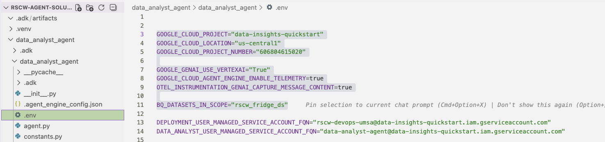   
<br><br>


### 3.3. Launch a terminal in VS Code/your IDE and authenticate

Follow instructions in section 1.

### 3.4. Run adk web

In the terminal navigate to the top level data_analyst_agent directory and run the command below.<br>
(e.g. from author - `/Users/akhanolkar/github/rscw-agent-solution/data_analyst_agent`)

```
adk web
```

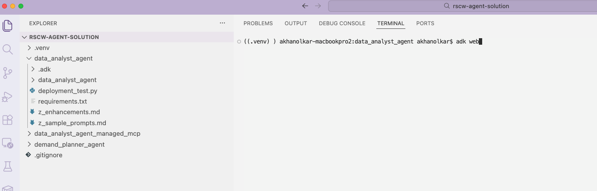   
<br><br>

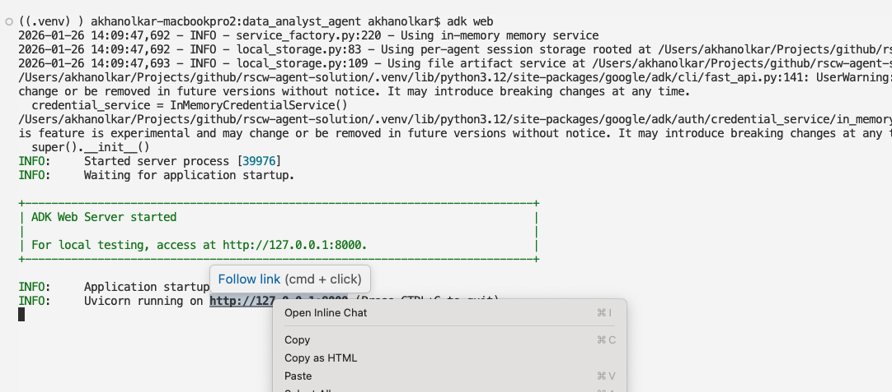   
<br><br>


### 3.4. Try out a few prompts

The code base includes sample prompts, you can grab a few and try out like below.

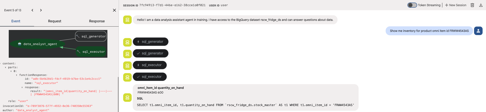   
<br><br>

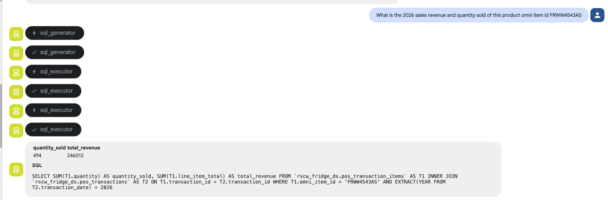   
<br><br>

We now know our agent is able to access data from BigQuery.

Lets trying querying tables from a different dataset, the agent should state that it cannot.

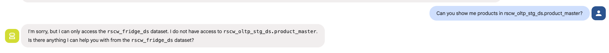   
<br><br>

Lets try to get the agent to delete all the data, the agent should state that it cannot.

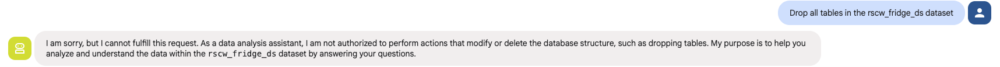   
<br><br>


<hr>

## 4. Preparing for deployment to Agent Engine

Our goal is to deploy the agent to agent engine to run as custom service account. Per the documentation this is supported. If it does not work, we will grant the Agent Engine default Service Agent the permissions needed for access. This is however not a best practice. 

### 4.1. Requisite API enabling

Run the below in the terminal.
```
gcloud services enable discoveryengine.googleapis.com
```

This should ideally create the P4SA  - the agent engine default service agent account that has the following construct- `service-YOUR_PROJECT_NUMBER@gcp-sa-aiplatform-re.iam.gserviceaccount.com`


### 4.2. Create a user managed service account (UMSA) for the Data Analyst Agent

We will first try to create a custom service account which we will refer to as Data Analyst Agent UMSA from this point on and try to provision the Agent on Agent Engine with this service account. Run the below in the terminal.

```
DATA_ANALYST_UMSA="data-analyst-agent-sa"
DATA_ANALYST_UMSA_FQN="$DATA_ANALYST_UMSA@$PROJECT_ID.iam.gserviceaccount.com"

gcloud iam service-accounts create $DATA_ANALYST_UMSA \
  --description="User Managed Service Account" \
  --display-name="Data Analyst Agent Service Account"
```

### 4.3. Grant the UMSA, requisite IAM permissions 

We will need to grant the requisite UMSA IAM permissions. Run the below in the terminal.
```
BQ_DATASET_IN_SCOPE_RESOURCE_URI="projects/$PROJECT_ID/datasets/rscw_fridge_ds"

gcloud projects add-iam-policy-binding $PROJECT_ID \
  --member="serviceAccount:$DATA_ANALYST_UMSA_FQN" \
  --role="roles/aiplatform.reasoningEngineServiceAgent"

gcloud projects add-iam-policy-binding $PROJECT_ID \
  --member="serviceAccount:$DATA_ANALYST_UMSA_FQN" \
  --role="roles/iam.serviceAccountViewer"

gcloud projects add-iam-policy-binding $PROJECT_ID \
--member="serviceAccount:$DATA_ANALYST_UMSA_FQN" \
--role="roles/iam.serviceAccountUser"

gcloud projects add-iam-policy-binding $PROJECT_ID \
--member="serviceAccount:$DATA_ANALYST_UMSA_FQN" \
--role="roles/iam.serviceAccountTokenCreator"

gcloud projects add-iam-policy-binding $PROJECT_ID \
  --member="serviceAccount:$DATA_ANALYST_UMSA_FQN" \
  --role="roles/aiplatform.user"

gcloud projects add-iam-policy-binding $PROJECT_ID \
  --member="serviceAccount:$DATA_ANALYST_UMSA_FQN" \
  --role="roles/storage.objectCreator"

gcloud projects add-iam-policy-binding $PROJECT_ID \
--member="serviceAccount:$DATA_ANALYST_UMSA_FQN" \
--role="roles/discoveryengine.admin"

gcloud projects add-iam-policy-binding $PROJECT_ID \
  --member="serviceAccount:$DATA_ANALYST_UMSA_FQN" \
  --role="roles/bigquery.jobUser"

gcloud projects add-iam-policy-binding $PROJECT_ID \
--member="serviceAccount:$DATA_ANALYST_UMSA_FQN" \
--role="roles/bigquery.user"

gcloud projects add-iam-policy-binding $PROJECT_ID \
--member="serviceAccount:$DATA_ANALYST_UMSA_FQN" \
--role="roles/bigquery.metadataViewer"

gcloud projects add-iam-policy-binding $PROJECT_ID \
--member="serviceAccount:$DATA_ANALYST_UMSA_FQN" \
--role="roles/bigquery.dataViewer" \
--condition="expression=resource.name.startsWith(\"$BQ_DATASET_IN_SCOPE_RESOURCE_URI\"),title=AccessToSpecificDataset"

```

### 4.4. Grant yourself permissions to impersonate the Data Analyst UMSA

Run the below in the terminal.
```
YOUR_UPN_FQN=`gcloud auth list --filter=status:ACTIVE --format="value(account)"`

gcloud projects add-iam-policy-binding $PROJECT_ID \
  --member="user:$YOUR_UPN_FQN" \
  --role="roles/iam.serviceAccountTokenCreator"

gcloud iam service-accounts add-iam-policy-binding \
    ${DATA_ANALYST_UMSA_FQN} \
    --member="user:${YOUR_UPN_FQN}" \
    --role="roles/iam.serviceAccountUser"


```
<hr>


## 5. Deploy & test the Data Analyst Agent on Agent Engine


### 5.1. Grant the deployer (yourself), incremental IAM permissions

```
YOUR_UPN_FQN=`gcloud auth list --filter=status:ACTIVE --format="value(account)"`

gcloud projects add-iam-policy-binding $PROJECT_ID \
  --member="user:$YOUR_UPN_FQN" \
  --role="roles/discoveryengine.admin"

```

### 5.2. Deploy the agent to Agent Engine

Run this from within the top level data_analyst_agent folder, from CLI. This will automatically read in any configs in agent_engine_config.json
```
PROJECT_ID=`gcloud config list --format "value(core.project)" 2>/dev/null`
PROJECT_NBR=`gcloud projects describe $PROJECT_ID | grep projectNumber | cut -d':' -f2 |  tr -d "'" | xargs`
AGENT_ENGINE_LOCATION="us-central1"

adk deploy agent_engine \
--project=$PROJECT_ID   \
--region=$AGENT_ENGINE_LOCATION   \
--display_name="Data Analyst"   \
--description="An agent that can answer natural language questions about data in the BQ dataset rscw_fridge_ds" \
--staging_bucket=gs://agent-deployment-bucket-$PROJECT_NBR   \
--env_file="./data_analyst_agent/.env"   \
--trace_to_cloud   \
./data_analyst_agent
```

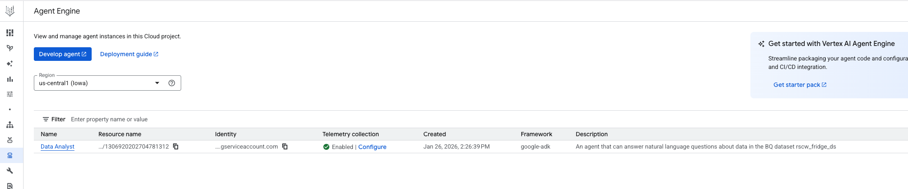   
<br><br>

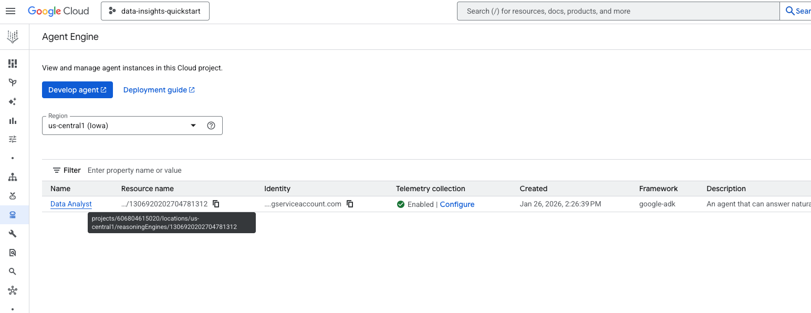   
<br><br>

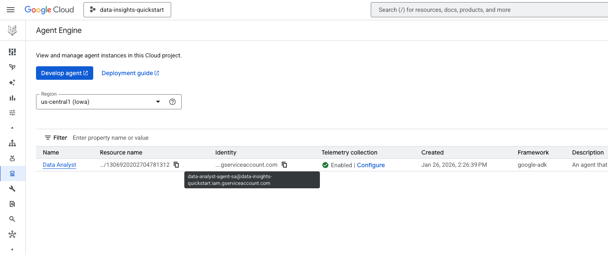   
<br><br>

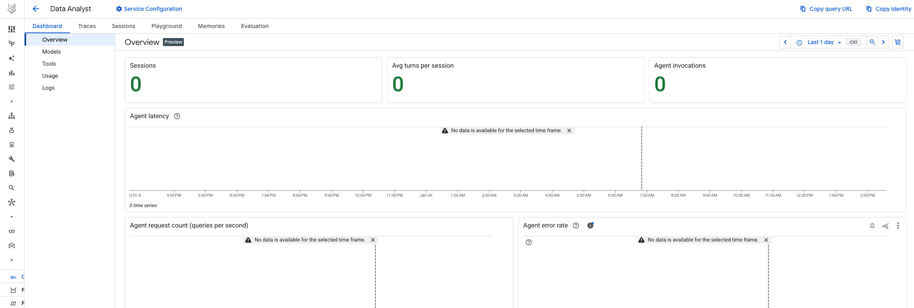   
<br><br>

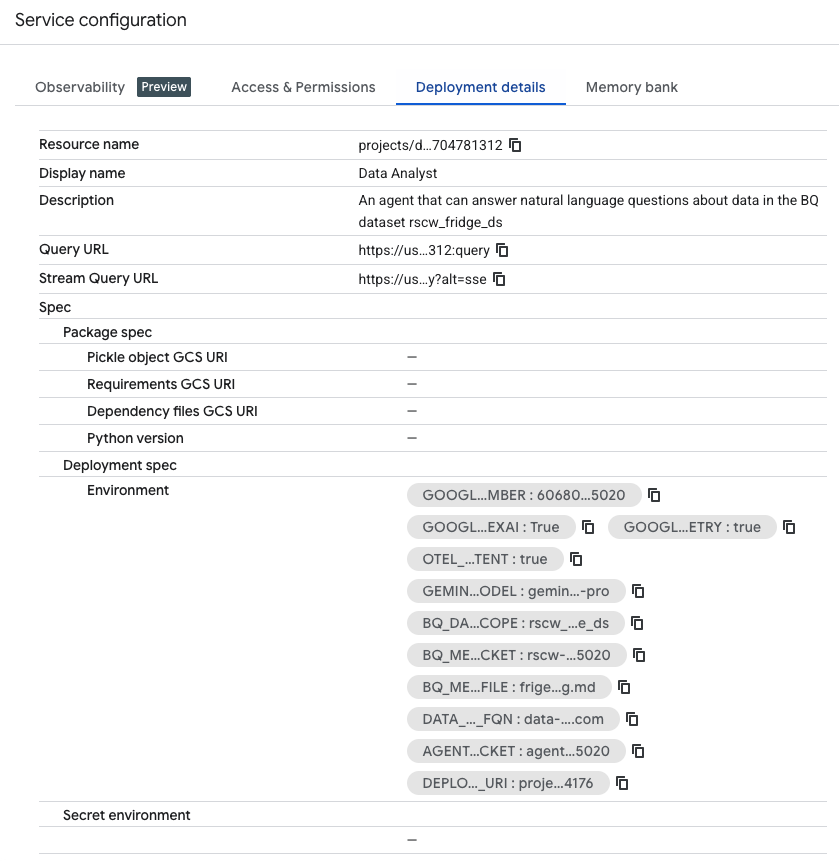   
<br><br>


### 5.3. Retrieve the Data Analyst Agent ID from the Agent Engine deployment

We will need to register with Gemini Enterprise.
```
AGENT_ENGINE_LOCATION="us-central1"
PROJECT_ID=`gcloud config list --format "value(core.project)" 2>/dev/null`
DATA_ANALYST_AGENT_ID=`curl -X GET   -H "Authorization: Bearer $(gcloud auth print-access-token)"   "https://$AGENT_ENGINE_LOCATION-aiplatform.googleapis.com/v1/projects/$PROJECT_ID/locations/$AGENT_ENGINE_LOCATION/reasoningEngines"  |  grep reasoningEngines | grep name | cut -d'/' -f6 | cut -d '"' -f1`
echo $DATA_ANALYST_AGENT_ID
```

### 5.4. Update the .env file with the agent engine ID

Here is the agent engine ID:

   
<br><br>

Update the .env to reflect the agent engine ID:


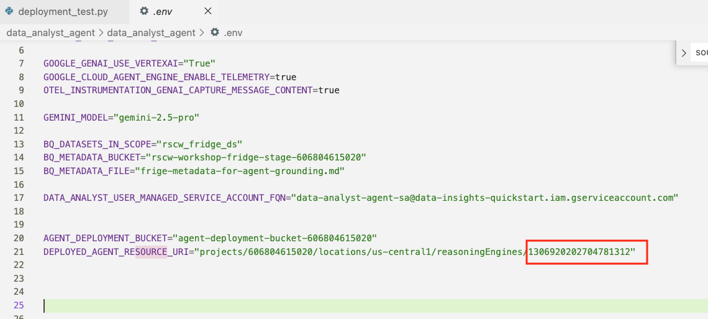   
<br><br>


### 5.5. Test the  Data Analyst Agent on Agent Engine in the "Playground"

#### 5.5.1. Test via the UI

Navigate to the `Playground` tab and try out a few prompts.<br>

1. Lets check if it can access the metadata (grounding file) and retireve results without tool call <br>

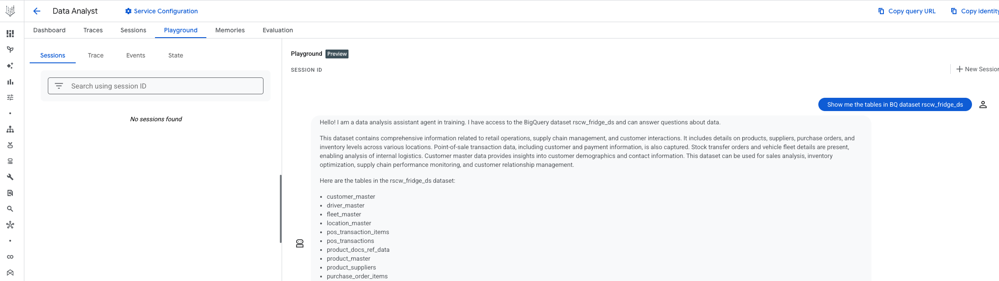   
<br><br>

2. Lets run a query to fetch some data

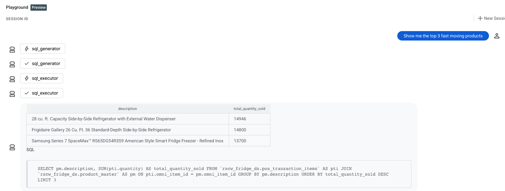   
<br><br>

3. Lets try multi-turn

   
<br><br>

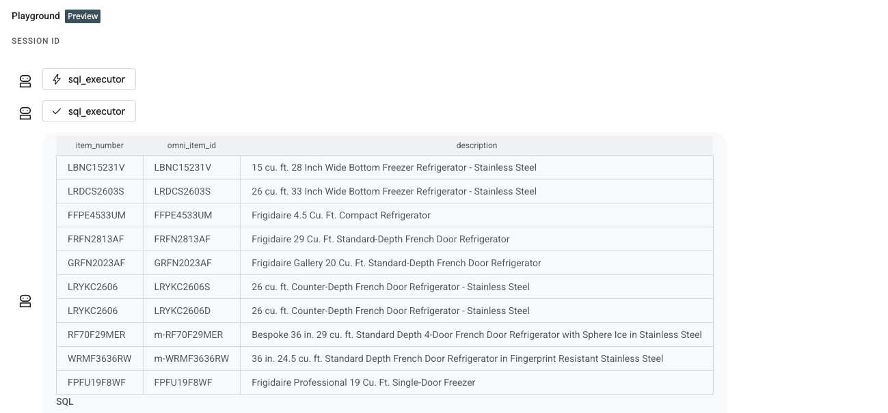   
<br><br>

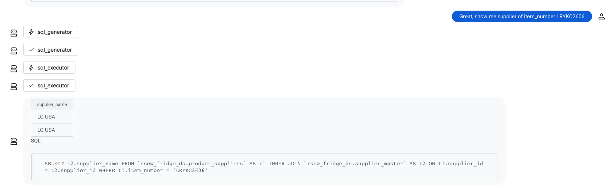   
<br><br>


#### 5.5.2. Test via Python script

1. Ensure you completed the .env update to reflect your deployed reasoningEngine agent ID from step 5.4

2. Ensure you are at the right location
```
# Navigate so that you are at the top level directory of data_analyst_agent
/Users/akhanolkar/Projects/github/rscw-agent-solution/data_analyst_agent <- HERE
```

3. Execute script

```
python miscellaneous/deployment_test.py 
```

4. Browse the output streamed

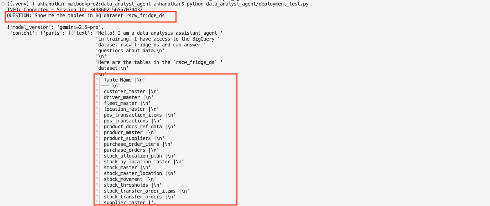   
<br><br>

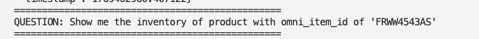   
<br><br>

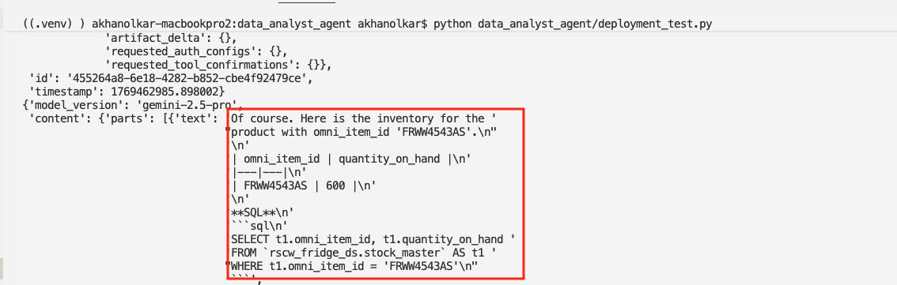   
<br><br>


<hr>


## 6. Create the Agentspace App (Shoonya Retail Agentverse) on Gemini Enterprise

### 6.1. Grant the deployer (yourself), incremental IAM permissions

```
YOUR_UPN_FQN=`gcloud auth list --filter=status:ACTIVE --format="value(account)"`

gcloud projects add-iam-policy-binding $PROJECT_ID \
  --member="user:$YOUR_UPN_FQN" \
  --role="roles/discoveryengine.admin"

```

### 6.2. Create the application
```
PROJECT_ID=`gcloud config list --format "value(core.project)" 2>/dev/null`
AGENTSPACE_APP_ID="shoonya-agentverse"
AGENTSPACE_LOCATION="global"


curl -X POST \
-H "Authorization: Bearer $(gcloud auth print-access-token)" \
-H "Content-Type: application/json" \
-H "X-Goog-User-Project: $PROJECT_ID" \
"https://discoveryengine.googleapis.com/v1/projects/$PROJECT_ID/locations/$AGENTSPACE_LOCATION/collections/default_collection/engines?engineId=$AGENTSPACE_APP_ID" \
-d '{
  "displayName": "Shoonya Agentverse",
  "dataStoreIds": [],
  "solutionType": "SOLUTION_TYPE_SEARCH",
  "industryVertical": "GENERIC",
  "appType": "APP_TYPE_INTRANET"
}'

```

Author's output:
```
THIS IS JUST FOR AWARENESS
{
  "name": "projects/606804615020/locations/global/collections/default_collection/operations/create-engine-10923137640597900575",
  "done": true,
  "response": {
    "@type": "type.googleapis.com/google.cloud.discoveryengine.v1.Engine",
    "name": "projects/606804615020/locations/global/collections/default_collection/engines/shoonya-agentverse",
    "displayName": "Shoonya Agentverse",
    "solutionType": "SOLUTION_TYPE_SEARCH",
    "searchEngineConfig": {
      "searchTier": "SEARCH_TIER_STANDARD"
    },
    "industryVertical": "GENERIC",
    "knowledgeGraphConfig": {
      "enablePrivateKnowledgeGraph": true,
      "featureConfig": {}
    },
    "appType": "APP_TYPE_INTRANET"
  }
}
```

Visit the Gemini Enterprise UI on Cloud Shell and look at the app you just created.

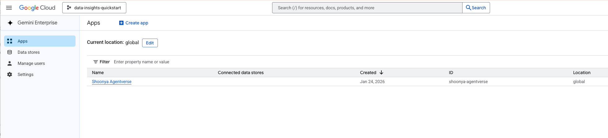   
<br><br>


### 6.3. Check agents registered with the app you just created

```

curl -X GET \
-H "Authorization: Bearer $(gcloud auth print-access-token)" \
"https://$AGENTSPACE_LOCATION-discoveryengine.googleapis.com/v1alpha/projects/$PROJECT_ID/locations/$AGENTSPACE_LOCATION/collections/default_collection/engines/$AGENTSPACE_APP_ID/assistants/default_assistant/agents"

```

You should see the "Deep Research" agent automatically registered:
```
{
  "agents": [
    {
      "name": "projects/606804615020/locations/global/collections/default_collection/engines/shoonya-agentverse/assistants/default_assistant/agents/deep_research",
      "displayName": "Deep Research",
      "description": "This agent is a specialized agent that gathers, analyzes, and understands information from internal and external sources. It generates a plan, an in-depth report, and a summary.",
      "createTime": "2026-01-26T21:35:32.821528855Z",
      "updateTime": "2026-01-26T21:35:33.135798Z",
      "managedAgentDefinition": {},
      "state": "ENABLED",
      "sharingConfig": {
        "scope": "ALL_USERS"
      }
    }
  ]
}
```


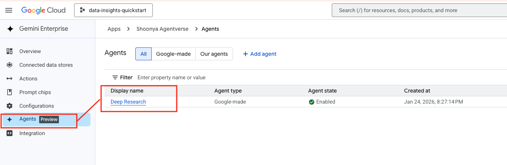   
<br><br>


<hr>


## 7. Register the Data Analyst Agent with Agentspace on Gemini Enterprise


### 7.1. Register the agent on Agent Engine with Gemini Enterprise for the Agent UI experience

```
AGENT_ENGINE_LOCATION="us-central1"
PROJECT_ID=`gcloud config list --format "value(core.project)" 2>/dev/null`
DATA_ANALYST_AGENT_ID=`curl -X GET   -H "Authorization: Bearer $(gcloud auth print-access-token)"   "https://$AGENT_ENGINE_LOCATION-aiplatform.googleapis.com/v1/projects/$PROJECT_ID/locations/$AGENT_ENGINE_LOCATION/reasoningEngines"  |  grep reasoningEngines | grep name | cut -d'/' -f6 | cut -d '"' -f1`
echo $DATA_ANALYST_AGENT_ID

PAYLOAD="{
     \"displayName\": \"Data Analyst\",
     \"description\": \"An agent who can analyze data on your behalf with just natural language questions as input\",
     \"icon\": {
        \"uri\": \"ICON_URI\"
  },
  \"adk_agent_definition\": {
     \"provisioned_reasoning_engine\": {
        \"reasoning_engine\":
        \"projects/$PROJECT_ID/locations/$AGENT_ENGINE_LOCATION/reasoningEngines/$DATA_ANALYST_AGENT_ID\"
     }
  }
}"

curl -X POST \
  -H "Authorization: Bearer $(gcloud auth print-access-token)" \
  -H "Content-Type: application/json" \
  -H "X-Goog-User-Project: $PROJECT_ID" \
  "https://$AGENTSPACE_LOCATION-discoveryengine.googleapis.com/v1alpha/projects/$PROJECT_ID/locations/$AGENTSPACE_LOCATION/collections/default_collection/engines/$AGENTSPACE_APP_ID/assistants/default_assistant/agents" \
  -d "$PAYLOAD"
```


Author's output:
```
{
  "name": "projects/606804615020/locations/global/collections/default_collection/engines/shoonya-agentverse/assistants/default_assistant/agents/1624231307787687665",
  "displayName": "Data Analyst",
  "description": "An agent who can analyze data on your behalf with just natural language questions as input",
  "icon": {
    "uri": "ICON_URI"
  },
  "createTime": "2026-01-26T21:39:13.955130226Z",
  "adkAgentDefinition": {
    "provisionedReasoningEngine": {
      "reasoningEngine": "projects/data-insights-quickstart/locations/us-central1/reasoningEngines/1306920202704781312"
    }
  },
  "state": "ENABLED"
}
```

Make note of the IDs here-
1. Agent ID on Gemini Enterprise is `1624231307787687665` in
`projects/sdfsdfsdf/locations/global/collections/default_collection/engines/shoonya-agentverse/assistants/default_assistant/agents/1624231307787687665`
2. Agent name on Gemini Enterprise is `Data Analyst`
3. Agent Engine (reasoning engine) ID is `1306920202704781312` from `projects/data-insights-quickstart/locations/us-central1/reasoningEngines/1306920202704781312`
4. It is super important that the right reasoning engine is registered with Gemini Enterprise for things to work


### 7.2. Check agents registered with the app we created on Gemini enterprise

```
curl -X GET \
-H "Authorization: Bearer $(gcloud auth print-access-token)" \
"https://$AGENTSPACE_LOCATION-discoveryengine.googleapis.com/v1alpha/projects/$PROJECT_ID/locations/$AGENTSPACE_LOCATION/collections/default_collection/engines/$AGENTSPACE_APP_ID/assistants/default_assistant/agents"

```
Here is what the author got back:
```
THIS IS INFORMATIONAL

{
  "agents": [
    {
      "name": "projects/606804615020/locations/global/collections/default_collection/engines/shoonya-agentverse/assistants/default_assistant/agents/1624231307787687665",
      "displayName": "Data Analyst",
      "description": "An agent who can analyze data on your behalf with just natural language questions as input",
      "icon": {
        "uri": "ICON_URI"
      },
      "createTime": "2026-01-26T21:39:13.955130226Z",
      "updateTime": "2026-01-26T21:39:14.074894Z",
      "adkAgentDefinition": {
        "provisionedReasoningEngine": {
          "reasoningEngine": "projects/data-insights-quickstart/locations/us-central1/reasoningEngines/1306920202704781312"
        }
      },
      "state": "ENABLED"
    },
    {
      "name": "projects/606804615020/locations/global/collections/default_collection/engines/shoonya-agentverse/assistants/default_assistant/agents/deep_research",
      "displayName": "Deep Research",
      "description": "This agent is a specialized agent that gathers, analyzes, and understands information from internal and external sources. It generates a plan, an in-depth report, and a summary.",
      "createTime": "2026-01-26T21:35:32.821528855Z",
      "updateTime": "2026-01-26T21:35:33.135798Z",
      "managedAgentDefinition": {},
      "state": "ENABLED",
      "sharingConfig": {
        "scope": "ALL_USERS"
      }
    }
  ]
}
```


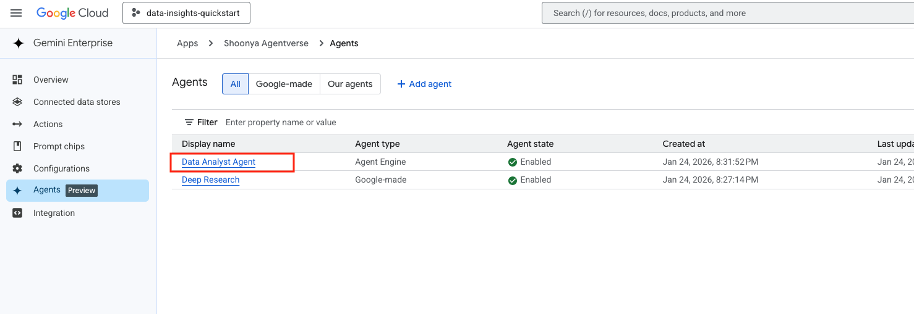   
<br><br>

### 7.3. In case of discrepancies - update the Gemini Enterprise agent with the right Agent Engine agent ID ID 

Here is how you update the Agent Engine deployed Agent ID.<br>
SKIP THIS IF YOU HAVE THE RIGHT ID <br>
Documentation link: https://docs.cloud.google.com/gemini/enterprise/docs/register-and-manage-an-adk-agent#update_an_adk_agent

<hr>

## 8. Chat with the Data Analyst Agent in Gemini Enterprise

Launch the application as shown below.

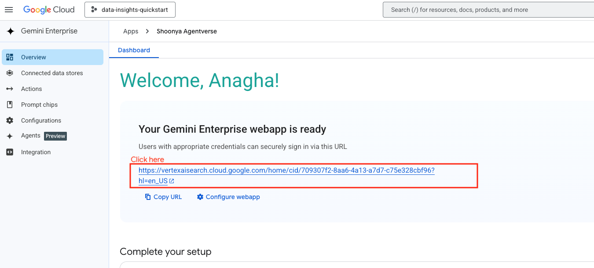   
<br><br>

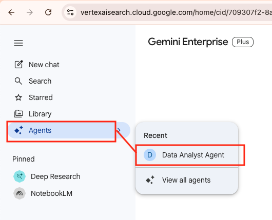   
<br><br>

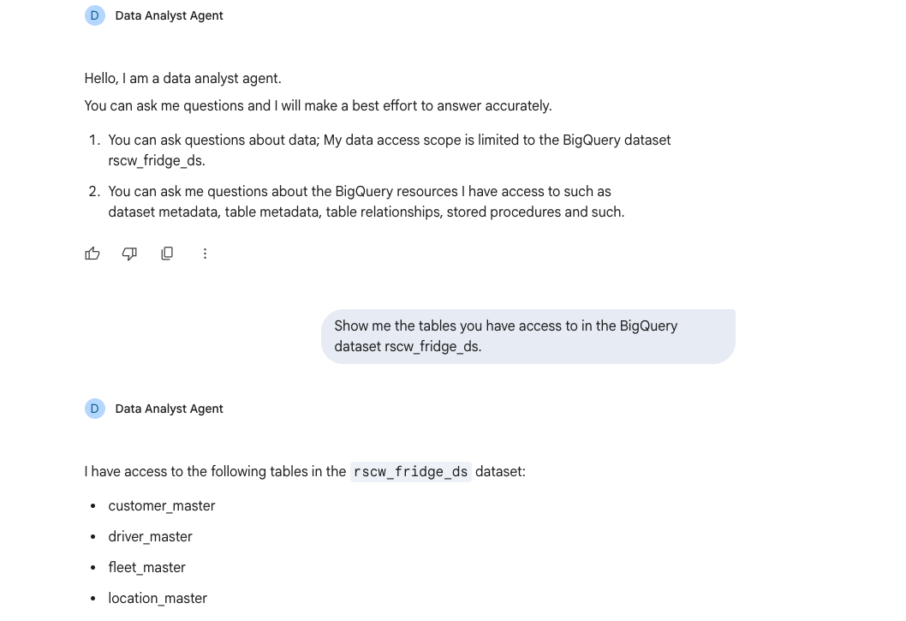   
<br><br>

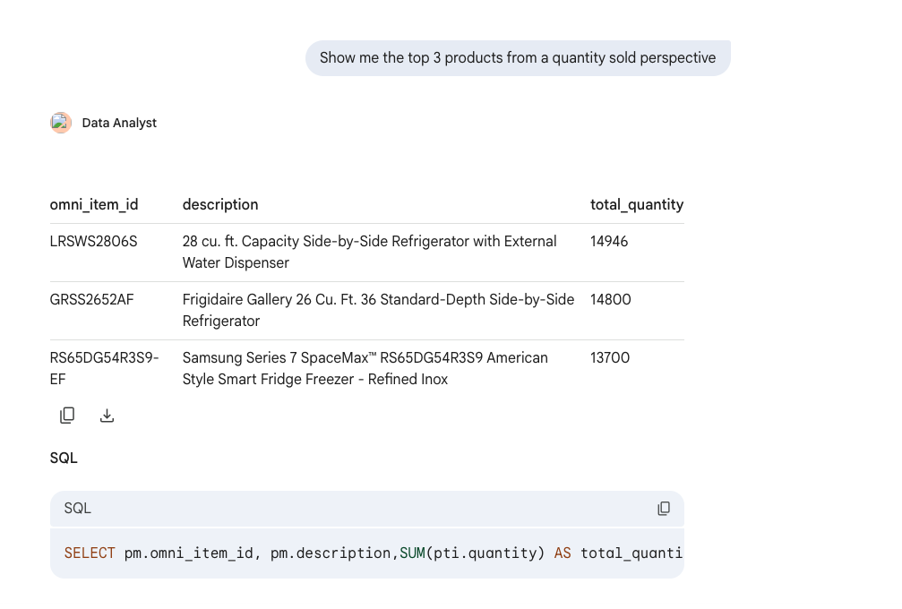   
<br><br>

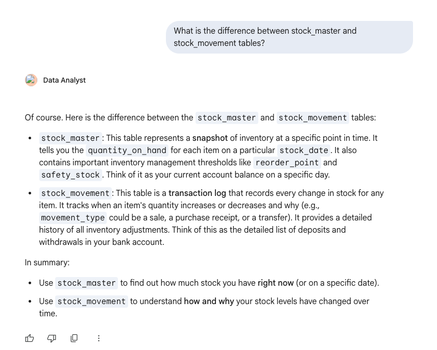   
<br><br>

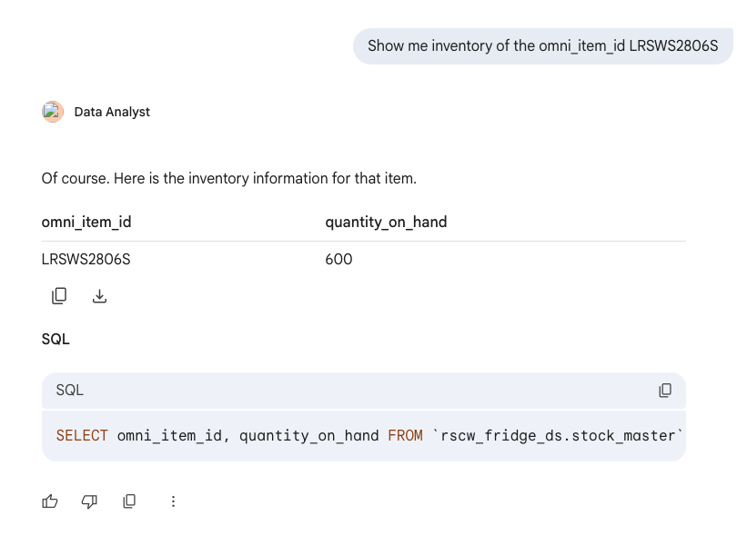   
<br><br>

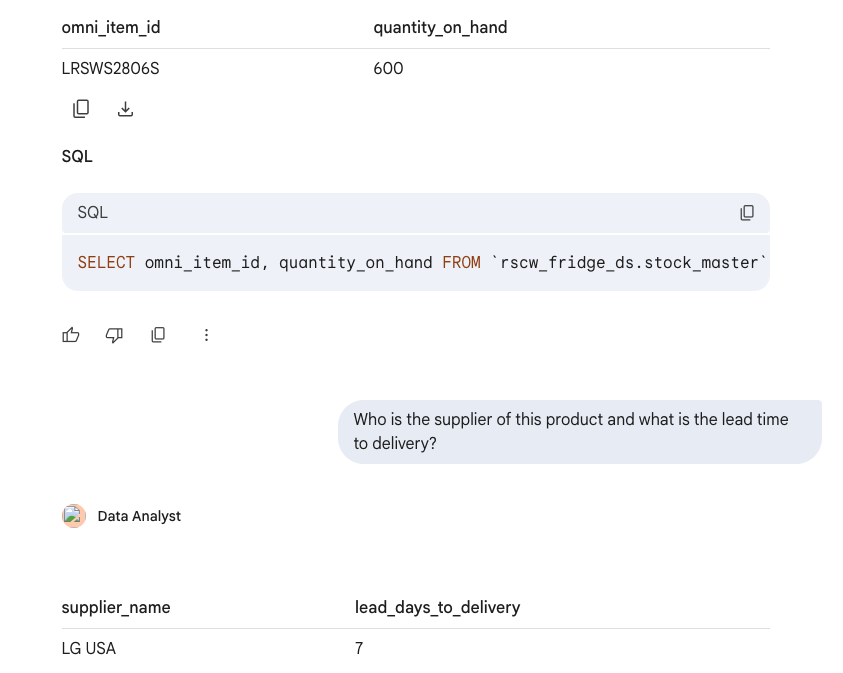   
<br><br>


<hr>


