# Module 20: Capstone Setup

## 1. Motivation
The IT leadership of Shoonya, our fictitious retail chain would like to see a functional prototype of an agentic solution for demand, inventory, procurement and logistics, so that they can get business buy-in for building an agent ensemble that can serve as digital counterparts of their human personas. They also want to explore what autonomous agent action looks like and what guardrails can be put in place. The capstone modules provides exactly such an immersive learning experience with refrigerators as the focus product category.

### Scenario we are developing to demonstrate

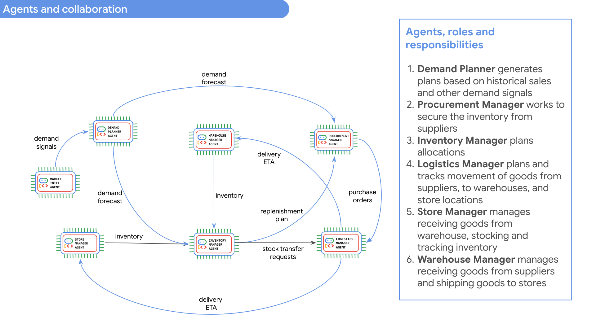  
<br><br>

<hr>

## 2. Module scope
This module provides the data foundations for the capstone. <br>
1. Create BigQuery datasets
2. Create tables and views
3. Load data
4. Create astored procedures
5. Run Data Insights table and dataset documentation scans.
6. Create a file with Data Insights (dataset, table and column descriptions, and relationships) and persist to a GCS bucket

<hr>

## 3. Duration and prerequisites

1. This module should take about 30-45 minutes or so, largely due to the time taken for Data Insights (and the 45 or so database objects) and the Gemini limits enforced for Data Insights
2. This capstone can be run indepenently - without any dependency on the previous learning modules

<hr>

## 4. Enable APIs

From cloud shell, run the below:
```
gcloud services enable orgpolicy.googleapis.com
gcloud services enable aiplatform.googleapis.com
gcloud services enable discoveryengine.googleapis.com
gcloud services enable bigquery.googleapis.com
gcloud services enable cloudresourcemanager.googleapis.com
gcloud services enable dataplex.googleapis.com
gcloud services enable datalineage.googleapis.com
gcloud services enable generativelanguage.googleapis.com
gcloud services enable cloudaicompanion.googleapis.com
gcloud services enable bigqueryunified.googleapis.com
gcloud services enable servicenetworking.googleapis.com
gcloud services enable compute.googleapis.com
```

<hr>

## 5. IAM permissions for yourself

```
PROJECT_ID=`gcloud config list --format "value(core.project)" 2>/dev/null`
UPN_FQN=`gcloud auth list --filter=status:ACTIVE --format="value(account)"`

gcloud projects add-iam-policy-binding $PROJECT_ID \
  --member="user:$UPN_FQN" \
  --role="roles/bigquery.admin"

gcloud projects add-iam-policy-binding $PROJECT_ID \
  --member="user:$UPN_FQN" \
  --role="roles/bigquery.studioAdmin"

gcloud projects add-iam-policy-binding $PROJECT_ID \
  --member="user:$UPN_FQN" \
  --role="roles/dataplex.admin"

gcloud projects add-iam-policy-binding $PROJECT_ID \
  --member="user:$UPN_FQN" \
  --role="roles/dataplex.dataScanAdmin"

gcloud projects add-iam-policy-binding $PROJECT_ID \
  --member="user:$UPN_FQN" \
  --role="roles/storage.admin"

gcloud projects add-iam-policy-binding $PROJECT_ID \
  --member="user:$UPN_FQN" \
  --role="roles/dataplex.catalogEditor"

gcloud projects add-iam-policy-binding $PROJECT_ID \
  --member="user:$UPN_FQN" \
  --role="roles/aiplatform.admin"

gcloud projects add-iam-policy-binding $PROJECT_ID \
  --member="user:$UPN_FQN" \
  --role="roles/discoveryengine.admin"


gcloud projects add-iam-policy-binding $PROJECT_ID \
  --member="user:$UPN_FQN" \
  --role="roles/compute.admin"

gcloud projects add-iam-policy-binding $PROJECT_ID \
  --member="user:$UPN_FQN" \
  --role="roles/compute.networkAdmin"

```

<hr>

## 6. Update Organization Policies 

**(needed for Argolis environment on GCP)** <br><br>

The organization policies include the superset applicable for modules in development, and required in Argolis.<br>
Paste these and run in cloud shell-

### 6.a. Relax require OS Login
```
rm os_login.yaml

cat > os_login.yaml << ENDOFFILE
name: projects/${PROJECT_ID}/policies/compute.requireOsLogin
spec:
  rules:
  - enforce: false
ENDOFFILE

gcloud org-policies set-policy os_login.yaml 

rm os_login.yaml
```

### 6.b. Disable Serial Port Logging

```
rm disableSerialPortLogging.yaml

cat > disableSerialPortLogging.yaml << ENDOFFILE
name: projects/${PROJECT_ID}/policies/compute.disableSerialPortLogging
spec:
  rules:
  - enforce: false
ENDOFFILE

gcloud org-policies set-policy disableSerialPortLogging.yaml 

rm disableSerialPortLogging.yaml
```

### 6.c. Disable Shielded VM requirement

```
shieldedVm.yaml 

cat > shieldedVm.yaml << ENDOFFILE
name: projects/$PROJECT_ID/policies/compute.requireShieldedVm
spec:
  rules:
  - enforce: false
ENDOFFILE

gcloud org-policies set-policy shieldedVm.yaml 

rm shieldedVm.yaml 
```

### 6.d. Disable VM can IP forward requirement

```
rm vmCanIpForward.yaml

cat > vmCanIpForward.yaml << ENDOFFILE
name: projects/$PROJECT_ID/policies/compute.vmCanIpForward
spec:
  rules:
  - allowAll: true
ENDOFFILE

gcloud org-policies set-policy vmCanIpForward.yaml

rm vmCanIpForward.yaml
```

### 6.e. Enable VM external access

```
rm vmExternalIpAccess.yaml

cat > vmExternalIpAccess.yaml << ENDOFFILE
name: projects/$PROJECT_ID/policies/compute.vmExternalIpAccess
spec:
  rules:
  - allowAll: true
ENDOFFILE

gcloud org-policies set-policy vmExternalIpAccess.yaml

rm vmExternalIpAccess.yaml
```

### 6.f. Enable restrict VPC peering

```
rm restrictVpcPeering.yaml

cat > restrictVpcPeering.yaml << ENDOFFILE
name: projects/$PROJECT_ID/policies/compute.restrictVpcPeering
spec:
  rules:
  - allowAll: true
ENDOFFILE

gcloud org-policies set-policy restrictVpcPeering.yaml

rm restrictVpcPeering.yaml
```

<br><br>

<hr>


## 7. Create a VCP and Subnet

We will need this for BigQuery notebook runtime

```
VPC_NM="capstone-vpc"
SUBNET_NM_CATCHALL="capstone-catchall-snet"
SUBNET_CATCHALL_FQN="projects/$PROJECT_ID/global/networks/$VPC_NM"
SUBNET_CIDR_CATCHALL="10.0.0.0/16"
PEERING_NM="capstone-vpc-peering-to-service-networking"
PEERING_RANGE_NAME="capstone-vpc-peering-reserved-range"

# Create subnet
gcloud compute networks subnets create $SUBNET_NM_CATCHALL \
 --network $VPC_NM \
 --range $SUBNET_CIDR_CATCHALL  \
 --region $LOCATION \
 --enable-private-ip-google-access \
 --project $PROJECT_ID 

# Create subnet firewall rules for open intra-VPC 
gcloud compute --project=$PROJECT_ID firewall-rules create allow-intra-$SUBNET_NM_CATCHALL \
--direction=INGRESS \
--priority=1000 \
--network=$VPC_NM \
--action=ALLOW \
--rules=all \
--source-ranges=$SUBNET_CIDR_CATCHALL 

# Create firewall rules
gcloud compute firewall-rules create allow-ssh-$SUBNET_NM_CATCHALL \
--project=$PROJECT_ID \
--network=$VPC_NM \
--direction=INGRESS \
--priority=65534 \
--source-ranges=0.0.0.0/0 \
--action=ALLOW \
--rules=tcp:22 

gcloud compute firewall-rules create allow-rdp-$SUBNET_NM_CATCHALL \
--project=$PROJECT_ID \
--network=$VPC_NM \
--allow tcp:3389 

gcloud compute firewall-rules create allow-icmp-$SUBNET_NM_CATCHALL \
--project=$PROJECT_ID \
--network=$VPC_NM \
--allow icmp 

# tcp source IP ranges could be the same as previous subnet IP range
gcloud compute firewall-rules create $VPC_NM-priority --network $VPC_NM --allow tcp:0-65535,udp:0-65535,icmp --source-ranges 10.0.0.0/24 --priority 65534

# Allow SSH with IAP proxy
gcloud compute firewall-rules create allow-ssh-ingress-from-iap-$VPC_NM  --direction=INGRESS --action=allow --rules=tcp:22 --network=$VPC_NM --source-ranges=35.235.240.0/20

# Public internet egress
gcloud compute firewall-rules create allow-all-egress-for-all \
    --network=$VPC_NM \
    --direction=EGRESS \
    --priority=1000 \
    --action=ALLOW \
    --rules=all \
    --destination-ranges=0.0.0.0/0

# Create peeering range
gcloud compute addresses create $PEERING_RANGE_NAME \
  --global \
  --prefix-length=16 \
  --description="Peering range for Google service" \
  --network=$VPC_NM \
  --purpose=VPC_PEERING 

# Create the VPC peering
gcloud services vpc-peerings connect \
  --service=servicenetworking.googleapis.com \
  --network=$VPC_NM \
  --ranges=$PEERING_RANGE_NAME \
  --project=$PROJECT_ID 

```


## 8. Clone the repo if you have not already
```
git clone https://github.com/GoogleCloudPlatform/retail-data-to-ai-workshop.git
```

## 9. Create buckets 

```
PROJECT_ID=`gcloud config list --format "value(core.project)" 2>/dev/null`
PROJECT_NBR=`gcloud projects describe $PROJECT_ID | grep projectNumber | cut -d':' -f2 |  tr -d "'" | xargs`
LOCATION="us-central1"
DATA_BUCKET="capstone_stage_$PROJECT_NBR"
AGENT_DEPLOYMENT_BUCKET="agent-deployment-bucket-$PROJECT_NBR"

gcloud storage buckets create "gs://$AGENT_DEPLOYMENT_BUCKET" --location=$LOCATION  
gcloud storage buckets create gs://$DATA_BUCKET --location=$LOCATION 
```


## 10. Prepare the data for upload to the data bucket

Switch to the `retail-data-to-ai-workshop` directory and run the below.

```
cd 01-data-assets/
mv capstone_data_1 capstone_data
mv capstone_data_2/* capstone_data/
mv capstone_data_3/fridge_userguides/* capstone_data/fridge_userguides/
mv capstone_data_4/fridge_userguides/* capstone_data/fridge_userguides/
rm -rf capstone_data_1
rm -rf capstone_data_2
rm -rf capstone_data_3
rm -rf capstone_data_4
cd capstone_data/fridge_userguides
tar -xvzf bottom-freezer.tgz 
tar -xvzf compact.tgz 
tar -xvzf french-door.tgz 
tar -xvzf one-door.tgz 
tar -xvzf side-by-side.tgz
tar -xvzf top-freezer.tgz
tar -xvzf wine-cellar.tgz
rm -rf *.tgz
rm -rf 
```

## 11. Upload to the data bucket

Again, navigate on cloud shell to retail-data-to-ai-workshop

```
gsutil -m cp -r 01-data-assets/capstone_data/* gs://$DATA_BUCKET/
```

## 12. Quick review of the scoped assets for this capstone

```
.
├── 01-data-assets
│   └── capstone_data
│       ├── fridge_tabular_data
│       └── metadata
│           └── captone_database_metadata_grounding.md
├── 02-code-assets
│   ├── capstone-retail-solution <-- Custom agent code
│   └── Module_20_Capstone_Setup.ipynb <-- Setup notebook
├── 03-lab-manuals
│   ├── Module_20_Capstone_Setup.md
│   ├── Module_21_ADK_Primer_Data_Analyst_Agent.md
│   ├── Module_22_Demand_Planner_Agent.md
│   ├── Module_23_Inventory_Manager_Agent.md
│   ├── Module_24_Procurement_Manager_Agent.md
│   ├── Module_25_Logistics_Manager_Agent.md
│   └── ..
...
```


## 13. Run the setup notebook in BigQuery to complete all else

Upload the `Module_20_Capstone_Setup.md` notebook to BQ and run it.<br>
Expect this to take 30 minutes to complete.

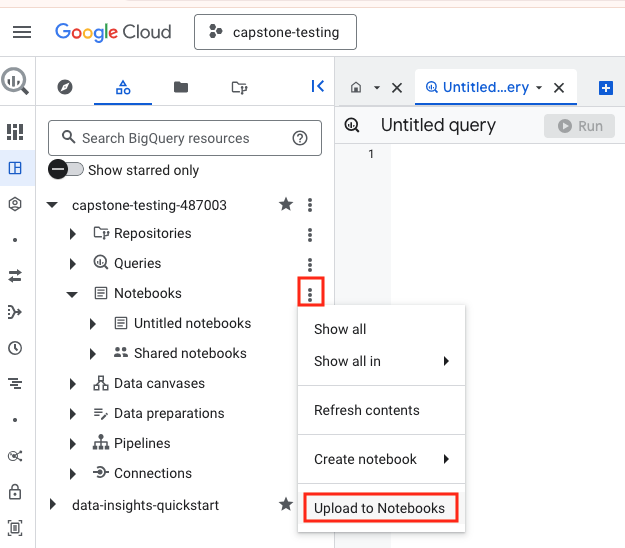  
<br><br>


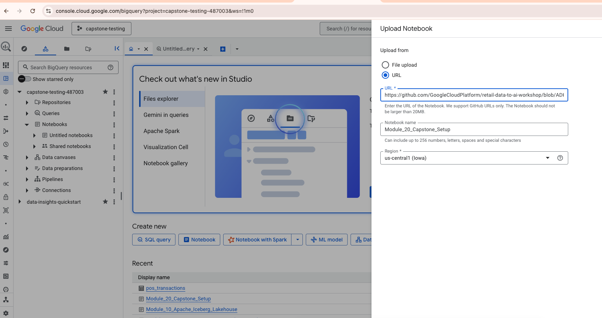  
<br><br>


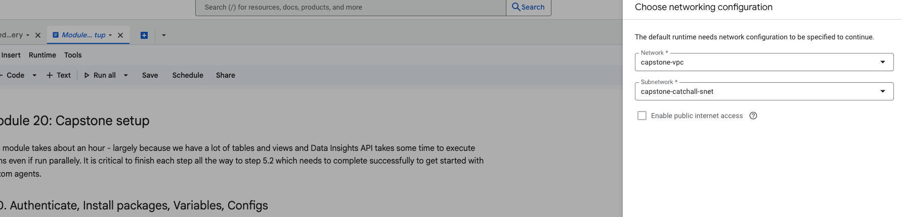  
<br><br>

<hr>

## 14. About the data 

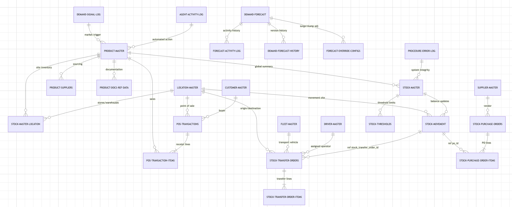  
<br><br>


The data consists of refrigerator products and associated retail and supply chain synthetic data. 


agent_activity_log:This table tracks actions performed on items. It records the type of action taken and provides additional details about each action. The table also captures the date and time when each action occurred. It identifies the agent responsible for performing each action.

customer_master:This table stores core information about customers. It serves as a central repository for customer contact details. The table facilitates customer identification and management. It supports customer-related analysis and reporting.

demand_forecast:This table stores demand forecasts for various items at different locations. It includes the predicted demand values, along with associated confidence levels and prediction intervals. The table tracks when the forecasts were generated and by whom. It also provides a status indicator for AI-driven forecasts.

demand_forecast_history:This table stores historical demand forecast data. It tracks forecasts generated for various items and locations over time. The data includes forecast values, confidence levels, and prediction intervals. This information is used for analyzing forecast accuracy and trends.

demand_signal_log:This table logs demand signals related to items. It tracks when a signal is triggered for an item. The table records details about the signal, including who triggered it. It also indicates whether the signal is currently active.

driver_master:This table stores core information about drivers. It serves as a central repository for driver identification. The table facilitates linking drivers to employee records. It supports efficient driver management and tracking.

fleet_master:This table serves as a central repository of information about the vehicle fleet. It maintains key attributes for each vehicle in the fleet. The table facilitates tracking and management of vehicles. It supports reporting and analysis related to fleet composition

forecast_activity_log:This table tracks activities related to forecasting. It records details about when forecast-related actions occur. The table also captures who performed these actions. This enables auditing and monitoring of the forecasting process. It provides a log of changes and events related to specific forecasts.

forecast_override_configs:This table stores configuration settings used to override demand forecasts. It holds adjustment factors that can be applied to forecasts in specific situations. These adjustments account for temporary increases or decreases in expected demand. The table also tracks when and by whom these configurations were last modified.

location_master:This table stores information about various locations. It serves as a central repository for location-related details. The table provides a way to identify and categorize locations. It includes address and contact information for each location.

pos_transaction_items:This table stores information about individual items sold within point-of-sale transactions. It captures the details of each item purchased during a transaction. The data includes the quantity sold, the price, and the total value for each item. This table facilitates analysis of sales at the item level.

pos_transactions:This table stores records of point-of-sale transactions. It captures details about each transaction, including the location where it occurred. The table also tracks customer information and the status of each transaction. Payment details, such as the payment method and total amount, are recorded as well.

procedure_error_log:This table stores information about errors encountered during the execution of stored procedures. It records the time the error occurred. The table also captures the specific procedure that generated the error. This data is useful for debugging and monitoring stored procedure execution.

product_docs_ref_data:This table serves as a reference for product documentation. It links products to their associated documentation files. The table facilitates the retrieval of relevant documents for specific products. It also allows for categorization and identification of different types of product documents.

product_master:This table serves as a comprehensive product catalog. It stores key attributes and identifiers for each product. The table facilitates product lookups and comparisons. It also supports inventory management and sales analysis.

product_suppliers:This table stores information about the relationship between products and their suppliers. It identifies the various suppliers for each product. The table also includes details on supplier types. It contains data pertaining to the expected time it takes for a supplier to deliver a 
product.

stock_allocation_plan:This table stores planned stock allocations for items across different locations. It tracks the quantity of each item intended for a specific location. The data includes the date the allocation was planned. It also indicates whether the allocation plan is the most current one. This table supports analysis of stock distribution strategies.

stock_master_location:This table tracks inventory levels across different locations. It provides a snapshot of stock quantities for various items. The data is recorded on a specific date. This allows for analysis of inventory distribution. It supports inventory management and supply chain optimization.

stock_master:This table tracks inventory levels for various items. It provides a snapshot of stock quantities at specific points in time. The data allows for monitoring inventory and managing reorder points. It supports analysis of stock availability.

stock_movement:This table tracks changes in stock levels. It records each instance of inventory adjustment. The table captures the date of the movement, the items affected, and the magnitude of the change. It also includes reference information for auditing purposes.

stock_purchase_order_items:This table stores information about items included in stock purchase orders. It provides a breakdown of each purchase order. The table includes details on the quantity and price of each item ordered. This data is used to track and manage stock procurement.

stock_purchase_orders:This table stores details about stock purchase orders. It tracks orders placed with suppliers, including order dates and expected delivery dates. The table also records the total cost of each order and its current status. This data is used to manage and analyze the procurement process.

stock_thresholds:This table stores calculated stock level thresholds for various items. It is used to monitor inventory levels across different locations. The table facilitates the determination of optimal stock levels. It supports the identification of items needing reordering. This data is essential for maintaining adequate stock and preventing shortages.

stock_transfer_order_items:This table stores details about items included in stock transfer orders. It serves as a record of the specific items transferred between locations. The table tracks the quantity of each item involved in a transfer order. This data is useful for inventory management and order fulfillment processes.

stock_transfer_orders:This table tracks the movement of stock between different locations. It records details about each transfer order, including origination and destination points. The table also captures the status of each order, along with any associated references. It provides a history of stock transfers and supports analysis of transfer efficiency.

supplier_master:This table stores comprehensive information about suppliers. It serves as a central repository for supplier contact details and location data. The table facilitates efficient supplier management and enables streamlined communication. It supports analysis of supplier distribution across different geographic regions.


<hr>

## 15. About the Data Insights scans 

You can go to BigQuery Studio in the Cloud Console and look at the table scans and dataset scans - samples below.

### 15.1. Table documentation scans

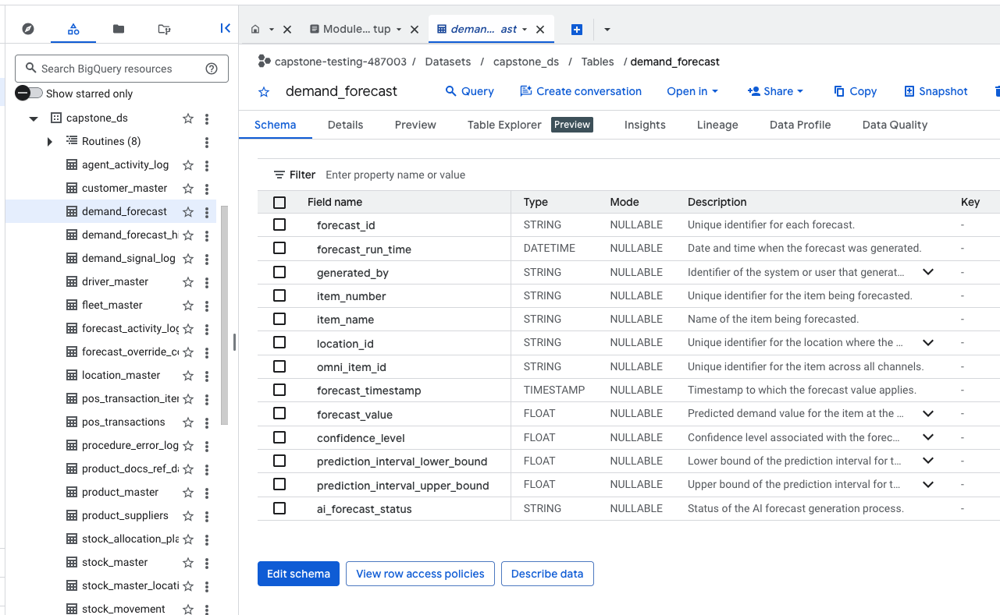  
<br><br>

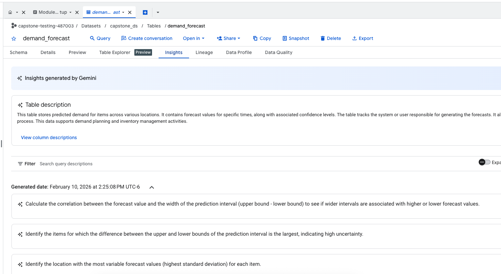  
<br><br>

  
<br><br>

### 15.2. Dataset documentation scans

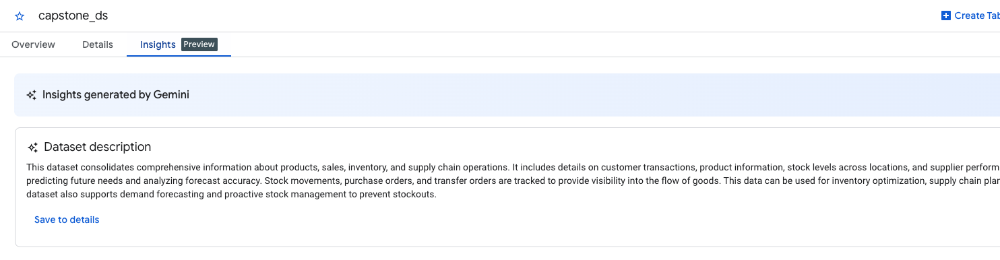  
<br><br>

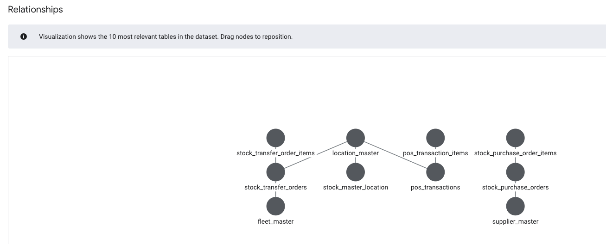  
<br><br>

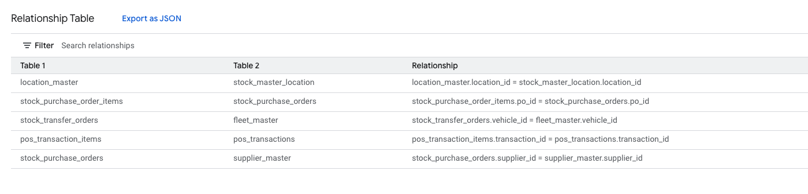  
<br><br>

  
<br><br>

<hr>

## 16. About the BigQuery metadata persisted to GCS for agentic grounding

As part of the notebook, we generate the BigQuery metadata and persist it to GCS. This metadata is provided to the agents in the subsequent modules for improving accuracy of answers generated.

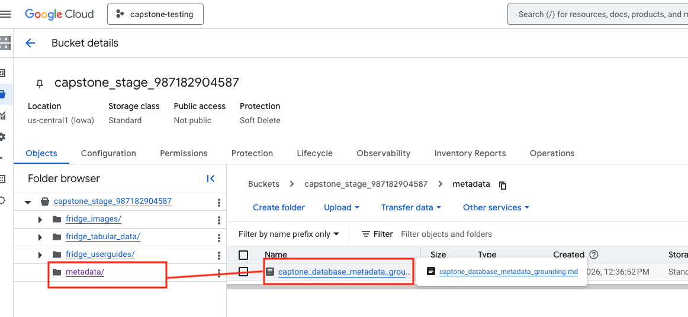  
<br><br>

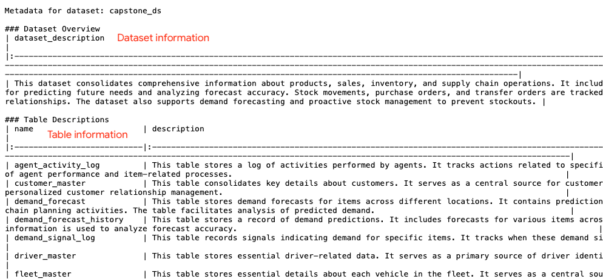  
<br><br>

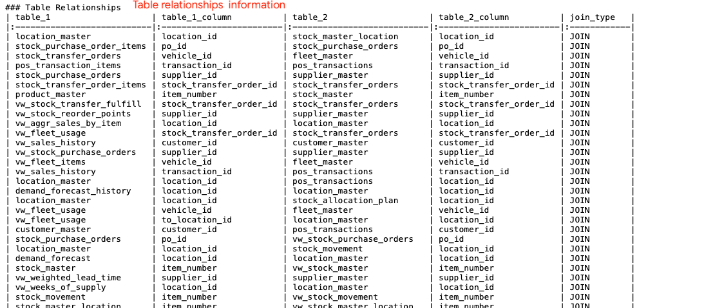  
<br><br>

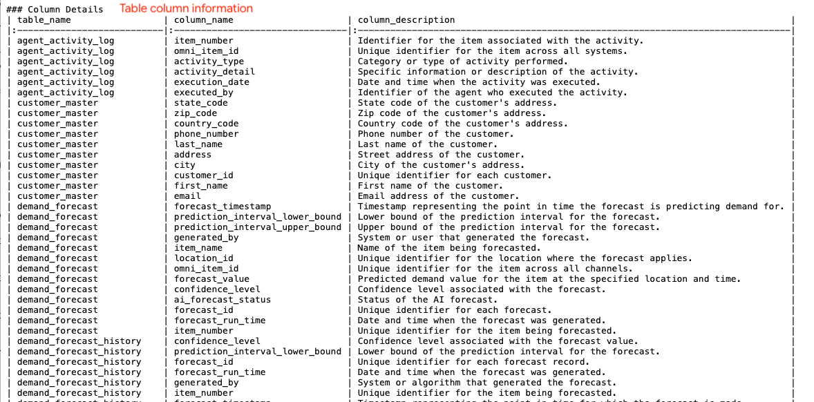  
<br><br>

<hr>

We have completed the data foundations for the capstone, proceed to the [next module](Module_21_ADK_Primer_Data_Analyst_Agent.md).

<hr>
