# Module 21: [ADK Primer] Create a Data Analyst Agent 

In this tutorial we will create an agent for data QnA with ADK, and deploy it to Agent Engine, then register it with Gemini Enterprise. As part of the agent developer continuum, we will test the agent with `adk web` locally, deploy and programmatically test, test on `agent engine` playground for a UI, and finally via the `gemini enterprise` UI. 

Note:
The purpose of this tutorial is to show integration between products and is less about building a perfect agent. Many agentic features have been deliberatley skipped for simplicity and focus on standing up a basic QnA application.


## 1. Setup

### 1.1. Authenticate to Google Cloud from CLI & generate Application Default Credentials

Run each of these in cloud shell / terminal:
```
gcloud init
```

```
gcloud auth application-default login
```

```
gcloud config set project YOUR_ACTUAL_PROJECT_ID
```

<hr>

### 1.2. Enable APIs

Only incremental APIs are listed below-
```
gcloud services enable telemetry.googleapis.com
gcloud services enable logging.googleapis.com
```

<hr>

### 1.3. Create a user managed service account (UMSA) for the Data Analyst Agent

#### 1.3.1. Create the UMSA
We will first try to create a custom service account which we will refer to as Data Analyst Agent UMSA from this point on and try to provision the Agent on Agent Engine with this service account. Our goal is to ensure the agent has exactly the permissions provided to this UMSA and not any more.<br><br>Run the below in the terminal.

```
PROJECT_ID=`gcloud config list --format "value(core.project)" 2>/dev/null`
PROJECT_NBR=`gcloud projects describe $PROJECT_ID | grep projectNumber | cut -d':' -f2 |  tr -d "'" | xargs`
LOCATION="us-central1"

DATA_ANALYST_UMSA="data-analyst-agent-sa"
DATA_ANALYST_UMSA_FQN="$DATA_ANALYST_UMSA@$PROJECT_ID.iam.gserviceaccount.com"

gcloud iam service-accounts create $DATA_ANALYST_UMSA \
  --description="User Managed Service Account" \
  --display-name="Data Analyst Agent Service Account"
```

#### 1.3.2. Grant the UMSA, requisite IAM permissions 

We will need to grant the requisite UMSA IAM permissions. Run the below in the terminal.
```
BQ_DATASET_IN_SCOPE_RESOURCE_URI="projects/$PROJECT_ID/datasets/capstone_ds"

gcloud projects add-iam-policy-binding $PROJECT_ID \
  --member="serviceAccount:$DATA_ANALYST_UMSA_FQN" \
  --role="roles/aiplatform.reasoningEngineServiceAgent"

gcloud projects add-iam-policy-binding $PROJECT_ID \
  --member="serviceAccount:$DATA_ANALYST_UMSA_FQN" \
  --role="roles/aiplatform.user"

gcloud projects add-iam-policy-binding $PROJECT_ID \
  --member="serviceAccount:$DATA_ANALYST_UMSA_FQN" \
  --role="roles/storage.objectCreator"

gcloud projects add-iam-policy-binding $PROJECT_ID \
  --member="serviceAccount:$DATA_ANALYST_UMSA_FQN" \
  --role="roles/bigquery.jobUser"

gcloud projects add-iam-policy-binding $PROJECT_ID \
--member="serviceAccount:$DATA_ANALYST_UMSA_FQN" \
--role="roles/bigquery.user"

gcloud projects add-iam-policy-binding $PROJECT_ID \
--member="serviceAccount:$DATA_ANALYST_UMSA_FQN" \
--role="roles/bigquery.metadataViewer"

gcloud projects add-iam-policy-binding $PROJECT_ID \
--member="serviceAccount:$DATA_ANALYST_UMSA_FQN" \
--role="roles/iam.serviceAccountUser"

gcloud projects add-iam-policy-binding $PROJECT_ID \
--member="serviceAccount:$DATA_ANALYST_UMSA_FQN" \
--role="roles/iam.serviceAccountTokenCreator"

gcloud projects add-iam-policy-binding $PROJECT_ID \
--member="serviceAccount:$DATA_ANALYST_UMSA_FQN" \
--role="roles/discoveryengine.admin"

gcloud projects add-iam-policy-binding $PROJECT_ID \
--member="serviceAccount:$DATA_ANALYST_UMSA_FQN" \
--role="roles/bigquery.dataViewer" \
--condition="expression=resource.name.startsWith(\"$BQ_DATASET_IN_SCOPE_RESOURCE_URI\"),title=AccessToSpecificDataset"
```

#### 1.3.3. Grant yourself permissions to impersonate the Data Analyst UMSA

Run the below in the terminal.
```
YOUR_UPN_FQN=`gcloud auth list --filter=status:ACTIVE --format="value(account)"`

# Enter the option for 'None' if asked about conditional access
gcloud projects add-iam-policy-binding $PROJECT_ID \
  --member="user:$YOUR_UPN_FQN" \
  --role="roles/iam.serviceAccountTokenCreator"

# Enter the option for 'None' if asked about conditional access
gcloud iam service-accounts add-iam-policy-binding \
    ${DATA_ANALYST_UMSA_FQN} \
    --member="user:${YOUR_UPN_FQN}" \
    --role="roles/iam.serviceAccountUser"
```

### 1.4. Set up a python virtual environment to use for ADK & install dependencies

Run the below in cloud shell terminal

#### 1.4.1. Create a python virtual environment

```
cd ~
python -m venv .venv
source .venv/bin/activate
```

#### 1.4.2. Install dependencies
```
cd ~/
pip install -r retail-data-to-ai-workshop/02-code-assets/capstone-retail-solution/data_analyst_agent/requirements.txt 
```

<hr>


## 2. Review the Data Analyst Agent code 

### 2.1. Review the code layout in VS code/your IDE

Navigate to the `capstone-retail-solution` in Cloud Shell editor <br>

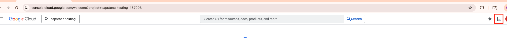  
<br><br>

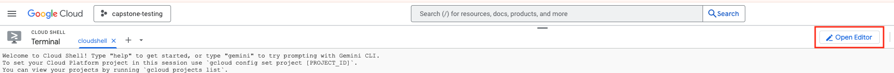  
<br><br>

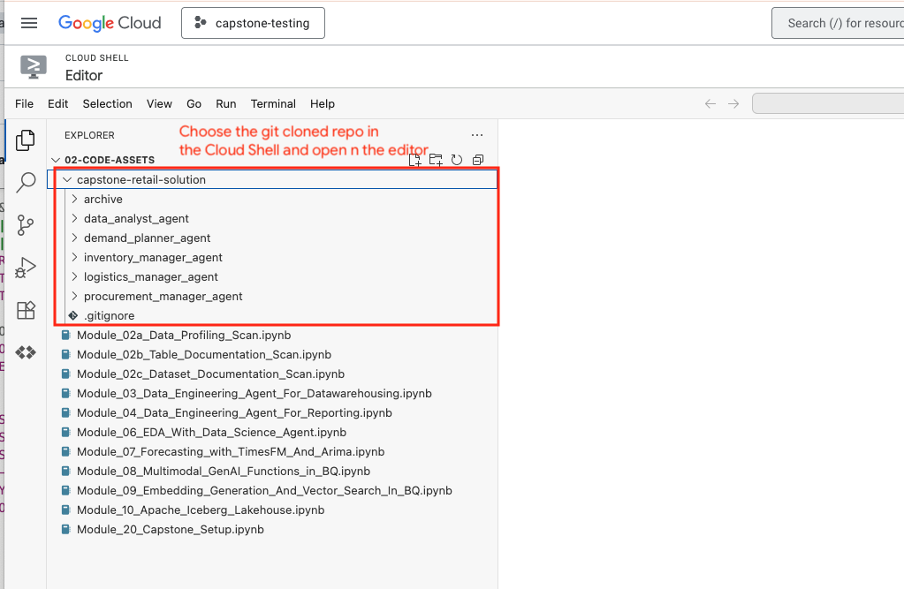  
<br><br>

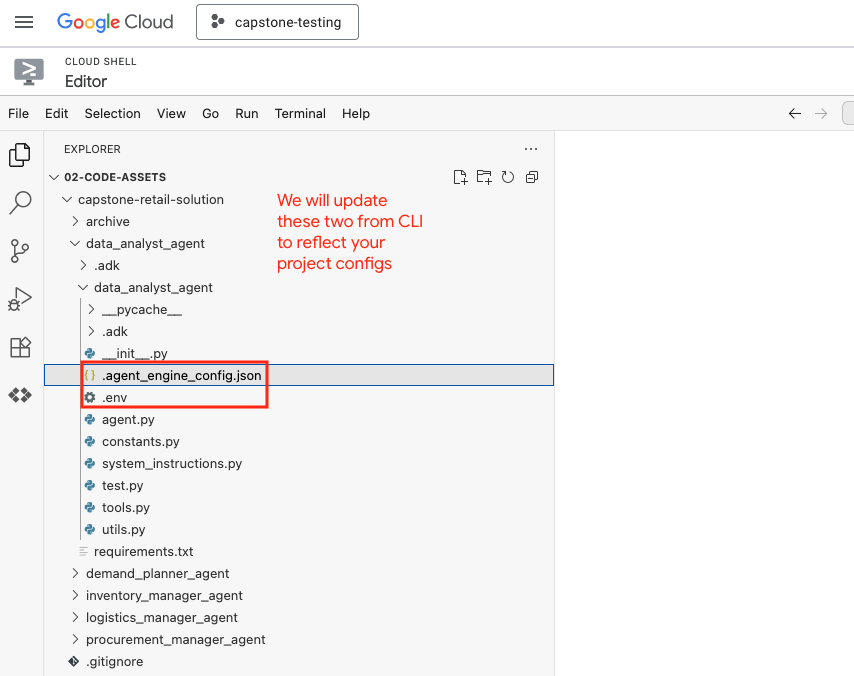  
<br><br>

Here is what the layout should look like if you navigate to the top level data_analyst_agent folder:
```
.
├── data_analyst_agent
│   ├── data_analyst_agent
│   │   ├── __init__.py
│   │   ├── .agent_engine_config.json -> for any configs not supported by ADK command line
│   │   ├── agent.py -> core component
│   │   ├── constants.py -> loaded from .env entries
│   │   ├── .env -> needs configuration from you
│   │   ├── system_instructions.py -> core component
│   │   ├── test.py -> test agent engine deployment
│   │   ├── tools.py -> core component
│   │   └── utils.py -> core component
│   ├── miscellaneous
│   │   ├── enhancements.md
│   │   └── sample_prompts.md -> list of questions you can ask if you have a cold start problem
│   └── requirements.txt -> dependencies
..other agents

```

### 2.2. Study the data_analyst_agent specific code/config files

Open each of the files and review the code files.

### 2.3. Study the BQ metadata grounding file from the previous module yet again

This file is critical for accuracy of agent response to adhoc questions involving data


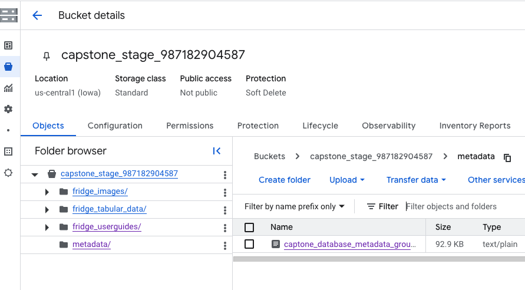  
<br><br>


### 2.4. Update the config files to reflect your GCP project details from Cloud Shell terminal

Run the below in Cloud Shell-
```
PROJECT_ID=`gcloud config list --format "value(core.project)" 2>/dev/null`
PROJECT_NBR=`gcloud projects describe $PROJECT_ID | grep projectNumber | cut -d':' -f2 |  tr -d "'" | xargs`
LOCATION="us-central1"

cd ~/retail-data-to-ai-workshop/02-code-assets/capstone-retail-solution

sed -i s/'LOCATION'/$LOCATION/g data_analyst_agent/data_analyst_agent/.env
sed -i s/'PROJECT_ID'/$PROJECT_ID/g data_analyst_agent/data_analyst_agent/.env
sed -i s/'PROJECT_NBR'/$PROJECT_NBR/g data_analyst_agent/data_analyst_agent/.env
sed -i s/'PROJECT_ID'/$PROJECT_ID/g data_analyst_agent/data_analyst_agent/.agent_engine_config.json
```

Open the file in Cloud Shell editor and ensure they are updated accurately or `cat` the files

<hr>


## 3. Run the agent with `adk web` from Cloud Shell

### 3.1. Navigate to the top level directory for the agent

```
cd ~/retail-data-to-ai-workshop/02-code-assets/capstone-retail-solution/data_analyst_agent
```

### 3.2. Launch `adk web`

1. Ensure your virtual environment is activated
2. Ensure you have run `gcloud auth application-default login`
3. Configure your project and location in your cloud shell
```
export GOOGLE_CLOUD_PROJECT="$PROJECT_ID"
export GOOGLE_CLOUD_LOCATION="$LOCATION"
```

4. Launch adk web in your cloud shell
```
adk web
```


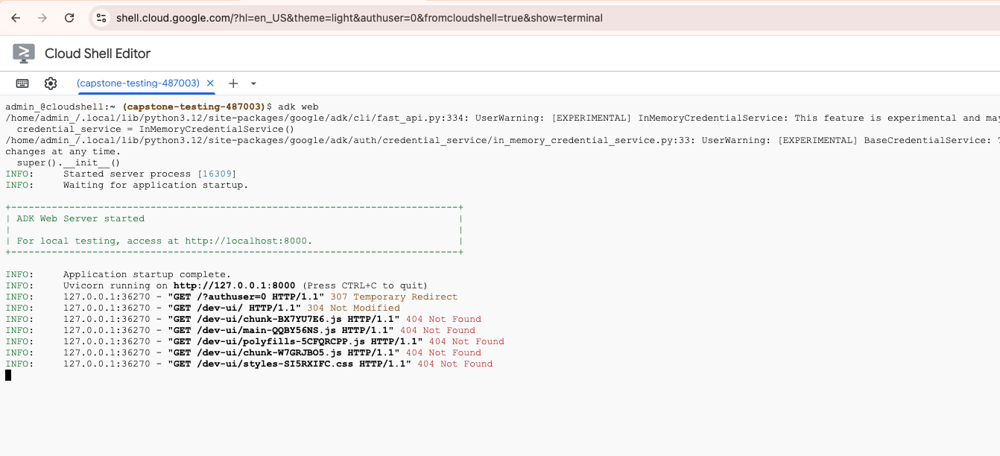  
<br><br>

5. Click on the URL that shows up
6. Keep the terminal you started adk web on open, you can refer this for behind the scenes peek
7. Interact with the agent in the tab that opened

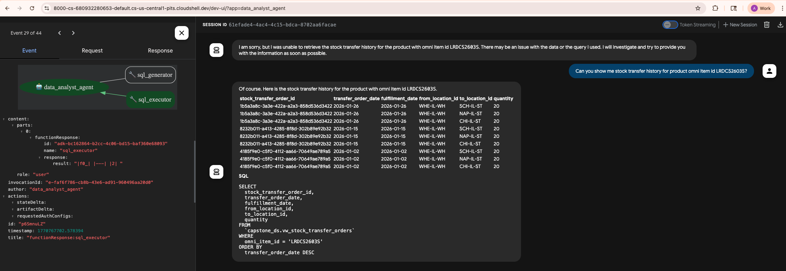  
<br><br>

### 3.3. Sample prompts

```
1. I dont know where to start. Can you show me what the BigQuery datasets available are first?
2. Can you show me any 5 tables in the capstone_ds dataset? Include the table name and description
3. Can you describe what stock_movement table is about?
4. Can you show me columns of this table?
5. Can you show me some data in this table?
6. How does this table relate to other tables?
7. What is the difference between stock_movement table and stock_master table?
8. Can you show me a few customers?
9. Can you show me orders for this customer ID 00f8ac751ae484a82adb20b42ad1aca7?
10. What is the total spend by customer ID 00f8ac751ae484a82adb20b42ad1aca7?
11. Can you show me a few products?
12. What are the categories of products available?
13. How many active refrigerator SKUs do we currently carry?
14. Do we sell any products in the wine cellar category?
13. Show me sales, and inventory for product omni item id LRDCS2603S
14. Are there comparable active products we carry?
15. Show me fast moving products
16. What are the top 5 best-selling products by revenue?
17. What is the average price of products in the 'wine cellar' category?
18. Show me inventory for product omni item id LRDCS2603S
19. What are products where we are short of inventory?
20. Can you show me the inventory forecast for product omni item id LRDCS2603S?
21. Which products have the highest inventory levels right now?
22. Who is the supplier for product omni item id LRDCS2603S?
23. What are other products supplied by the same supplier?
24. Which supplier's products account for the most sales?
25. Which city has the most customers?
26. Which is the city by customer location from a sales perspective?
27. Can you segment customers into 'high-value', 'medium-value', and 'low-value' based on their total spending, and show the count of customers in each segment?
28. What is the month-over-month growth rate of sales revenue for the 'french door' category?
29. Is there a correlation between the lead time of a product from its supplier and its sales volume? Show the top 10 products with the longest lead times and their corresponding sales.
31. What is the average order value for each payment type?
32. Can you show me purchase order history for product omni item id LRDCS2603S?
33. Can you show me stock movement history for product omni item id LRDCS2603S?
34. Can you show me stock transfer history for product omni item id LRDCS2603S?

```

<hr>


## 4. Deploy & test the Data Analyst Agent on Agent Engine


### 4.1. Deploy the agent to Agent Engine

Run this from within the top level data_analyst_agent folder, from CLI.  This will automatically read in any configs in agent_engine_config.json. (your Python virtual environment needs to be activated - we already did this).
```
PROJECT_ID=`gcloud config list --format "value(core.project)" 2>/dev/null`
PROJECT_NBR=`gcloud projects describe $PROJECT_ID | grep projectNumber | cut -d':' -f2 |  tr -d "'" | xargs`
AGENT_ENGINE_LOCATION="us-central1"
AGENT_DEPLOYMENT_BUCKET="agent-deployment-bucket-$PROJECT_NBR"

cd ~/retail-data-to-ai-workshop/02-code-assets/capstone-retail-solution/data_analyst_agent/

adk deploy agent_engine \
--project=$PROJECT_ID   \
--region=$AGENT_ENGINE_LOCATION   \
--display_name="Data Analyst"   \
--description="An agent that can answer natural language questions about data in the BQ dataset capstone_ds" \
--staging_bucket=gs://agent-deployment-bucket-$PROJECT_NBR   \
--env_file="./data_analyst_agent/.env"   \
--trace_to_cloud   \
./data_analyst_agent
```

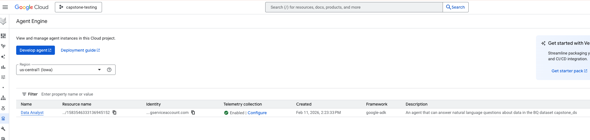  
<br><br>

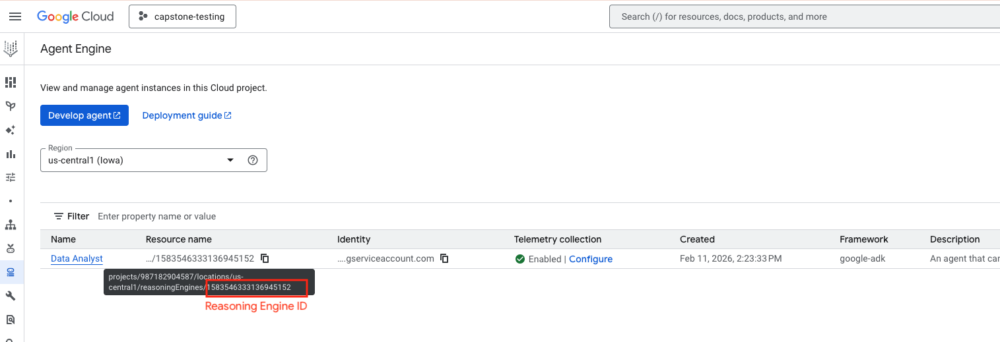  
<br><br>

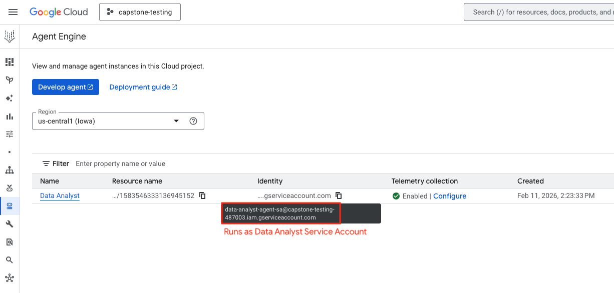  
<br><br>

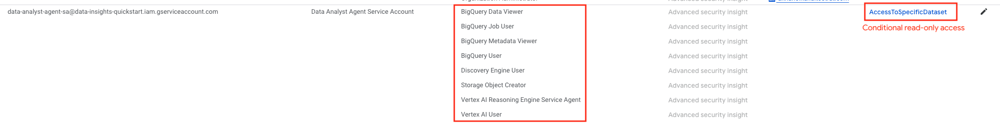  
<br><br>

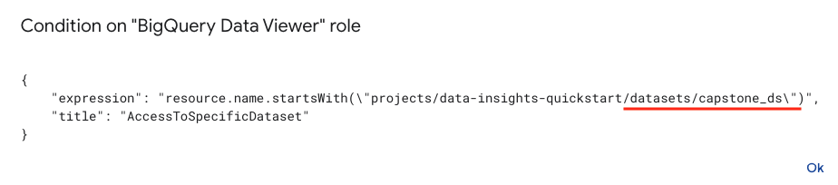  
<br><br>

<hr>

### 4.2. Retrieve the Data Analyst Agent ID from the Agent Engine deployment

We will need to register with Gemini Enterprise.
```
AGENT_ENGINE_LOCATION="us-central1"
PROJECT_ID=`gcloud config list --format "value(core.project)" 2>/dev/null`
DATA_ANALYST_AGENT_ID=`curl -X GET   -H "Authorization: Bearer $(gcloud auth print-access-token)"   "https://$AGENT_ENGINE_LOCATION-aiplatform.googleapis.com/v1/projects/$PROJECT_ID/locations/$AGENT_ENGINE_LOCATION/reasoningEngines"  |  grep reasoningEngines | grep name | cut -d'/' -f6 | cut -d '"' -f1`
echo $DATA_ANALYST_AGENT_ID
```

### 4.3. Update the .env file with the agent engine ID

Here is the agent engine ID:

   
<br><br>

Update the .env to reflect the agent engine ID:


   
<br><br>

# REDO IMAGE ABOVE


### 4.4. Test the  Data Analyst Agent on Agent Engine in the "Playground"

#### 4.4.1. Test via the UI

Navigate to the `Playground` tab and try out a few prompts.<br>

1. Lets check if it can access the metadata (grounding file) and retireve results without tool call <br>

   
<br><br>

2. Lets run a query to fetch some data

   
<br><br>

3. Lets try multi-turn

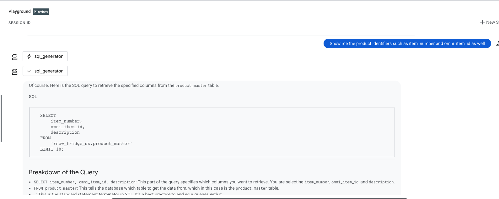   
<br><br>

   
<br><br>

   
<br><br>


#### 4.5.2. Test via Python script

1. Ensure you completed the .env update to reflect your deployed reasoningEngine agent ID from step 5.4

2. Ensure you are at the right location
```
# Navigate so that you are at the top level directory of data_analyst_agent
/Users/akhanolkar/Projects/github/rscw-agent-solution/data_analyst_agent <- HERE
```

3. Execute script

```
python miscellaneous/deployment_test.py 
```

4. Browse the output streamed

   
<br><br>

   
<br><br>

   
<br><br>


<hr>


## 5. Create the Agentspace App (Shoonya Retail Agentverse) on Gemini Enterprise

### 5.1. Grant the deployer (yourself), incremental IAM permissions

```
YOUR_UPN_FQN=`gcloud auth list --filter=status:ACTIVE --format="value(account)"`

gcloud projects add-iam-policy-binding $PROJECT_ID \
  --member="user:$YOUR_UPN_FQN" \
  --role="roles/discoveryengine.admin"

```

### 5.2. Create the application
```
PROJECT_ID=`gcloud config list --format "value(core.project)" 2>/dev/null`
AGENTSPACE_APP_ID="shoonya-agentverse"
AGENTSPACE_LOCATION="global"


curl -X POST \
-H "Authorization: Bearer $(gcloud auth print-access-token)" \
-H "Content-Type: application/json" \
-H "X-Goog-User-Project: $PROJECT_ID" \
"https://discoveryengine.googleapis.com/v1/projects/$PROJECT_ID/locations/$AGENTSPACE_LOCATION/collections/default_collection/engines?engineId=$AGENTSPACE_APP_ID" \
-d '{
  "displayName": "Shoonya Agentverse",
  "dataStoreIds": [],
  "solutionType": "SOLUTION_TYPE_SEARCH",
  "industryVertical": "GENERIC",
  "appType": "APP_TYPE_INTRANET"
}'

```

Author's output:
```
THIS IS JUST FOR AWARENESS
{
  "name": "projects/606804615020/locations/global/collections/default_collection/operations/create-engine-10923137640597900575",
  "done": true,
  "response": {
    "@type": "type.googleapis.com/google.cloud.discoveryengine.v1.Engine",
    "name": "projects/606804615020/locations/global/collections/default_collection/engines/shoonya-agentverse",
    "displayName": "Shoonya Agentverse",
    "solutionType": "SOLUTION_TYPE_SEARCH",
    "searchEngineConfig": {
      "searchTier": "SEARCH_TIER_STANDARD"
    },
    "industryVertical": "GENERIC",
    "knowledgeGraphConfig": {
      "enablePrivateKnowledgeGraph": true,
      "featureConfig": {}
    },
    "appType": "APP_TYPE_INTRANET"
  }
}
```

Visit the Gemini Enterprise UI on Cloud Shell and look at the app you just created.

   
<br><br>


### 5.3. Check agents registered with the app you just created

```

curl -X GET \
-H "Authorization: Bearer $(gcloud auth print-access-token)" \
"https://$AGENTSPACE_LOCATION-discoveryengine.googleapis.com/v1alpha/projects/$PROJECT_ID/locations/$AGENTSPACE_LOCATION/collections/default_collection/engines/$AGENTSPACE_APP_ID/assistants/default_assistant/agents"

```

You should see the "Deep Research" agent automatically registered:
```
{
  "agents": [
    {
      "name": "projects/606804615020/locations/global/collections/default_collection/engines/shoonya-agentverse/assistants/default_assistant/agents/deep_research",
      "displayName": "Deep Research",
      "description": "This agent is a specialized agent that gathers, analyzes, and understands information from internal and external sources. It generates a plan, an in-depth report, and a summary.",
      "createTime": "2026-01-26T21:35:32.821528855Z",
      "updateTime": "2026-01-26T21:35:33.135798Z",
      "managedAgentDefinition": {},
      "state": "ENABLED",
      "sharingConfig": {
        "scope": "ALL_USERS"
      }
    }
  ]
}
```


   
<br><br>


<hr>


## 6. Register the Data Analyst Agent with Agentspace on Gemini Enterprise


### 6.1. Register the agent on Agent Engine with Gemini Enterprise for the Agent UI experience

```
AGENT_ENGINE_LOCATION="us-central1"
PROJECT_ID=`gcloud config list --format "value(core.project)" 2>/dev/null`
DATA_ANALYST_AGENT_ID=`curl -X GET   -H "Authorization: Bearer $(gcloud auth print-access-token)"   "https://$AGENT_ENGINE_LOCATION-aiplatform.googleapis.com/v1/projects/$PROJECT_ID/locations/$AGENT_ENGINE_LOCATION/reasoningEngines"  |  grep reasoningEngines | grep name | cut -d'/' -f6 | cut -d '"' -f1`
echo $DATA_ANALYST_AGENT_ID

PAYLOAD="{
     \"displayName\": \"Data Analyst\",
     \"description\": \"An agent who can analyze data on your behalf with just natural language questions as input\",
     \"icon\": {
        \"uri\": \"ICON_URI\"
  },
  \"adk_agent_definition\": {
     \"provisioned_reasoning_engine\": {
        \"reasoning_engine\":
        \"projects/$PROJECT_ID/locations/$AGENT_ENGINE_LOCATION/reasoningEngines/$DATA_ANALYST_AGENT_ID\"
     }
  }
}"

curl -X POST \
  -H "Authorization: Bearer $(gcloud auth print-access-token)" \
  -H "Content-Type: application/json" \
  -H "X-Goog-User-Project: $PROJECT_ID" \
  "https://$AGENTSPACE_LOCATION-discoveryengine.googleapis.com/v1alpha/projects/$PROJECT_ID/locations/$AGENTSPACE_LOCATION/collections/default_collection/engines/$AGENTSPACE_APP_ID/assistants/default_assistant/agents" \
  -d "$PAYLOAD"
```


Author's output:
```
{
  "name": "projects/606804615020/locations/global/collections/default_collection/engines/shoonya-agentverse/assistants/default_assistant/agents/1624231307787687665",
  "displayName": "Data Analyst",
  "description": "An agent who can analyze data on your behalf with just natural language questions as input",
  "icon": {
    "uri": "ICON_URI"
  },
  "createTime": "2026-01-26T21:39:13.955130226Z",
  "adkAgentDefinition": {
    "provisionedReasoningEngine": {
      "reasoningEngine": "projects/data-insights-quickstart/locations/us-central1/reasoningEngines/1306920202704781312"
    }
  },
  "state": "ENABLED"
}
```

Make note of the IDs here-
1. Agent ID on Gemini Enterprise is `1624231307787687665` in
`projects/sdfsdfsdf/locations/global/collections/default_collection/engines/shoonya-agentverse/assistants/default_assistant/agents/1624231307787687665`
2. Agent name on Gemini Enterprise is `Data Analyst`
3. Agent Engine (reasoning engine) ID is `1306920202704781312` from `projects/data-insights-quickstart/locations/us-central1/reasoningEngines/1306920202704781312`
4. It is super important that the right reasoning engine is registered with Gemini Enterprise for things to work


### 6.2. Check agents registered with the app we created on Gemini enterprise

```
curl -X GET \
-H "Authorization: Bearer $(gcloud auth print-access-token)" \
"https://$AGENTSPACE_LOCATION-discoveryengine.googleapis.com/v1alpha/projects/$PROJECT_ID/locations/$AGENTSPACE_LOCATION/collections/default_collection/engines/$AGENTSPACE_APP_ID/assistants/default_assistant/agents"

```
Here is what the author got back:
```
THIS IS INFORMATIONAL

{
  "agents": [
    {
      "name": "projects/606804615020/locations/global/collections/default_collection/engines/shoonya-agentverse/assistants/default_assistant/agents/1624231307787687665",
      "displayName": "Data Analyst",
      "description": "An agent who can analyze data on your behalf with just natural language questions as input",
      "icon": {
        "uri": "ICON_URI"
      },
      "createTime": "2026-01-26T21:39:13.955130226Z",
      "updateTime": "2026-01-26T21:39:14.074894Z",
      "adkAgentDefinition": {
        "provisionedReasoningEngine": {
          "reasoningEngine": "projects/data-insights-quickstart/locations/us-central1/reasoningEngines/1306920202704781312"
        }
      },
      "state": "ENABLED"
    },
    {
      "name": "projects/606804615020/locations/global/collections/default_collection/engines/shoonya-agentverse/assistants/default_assistant/agents/deep_research",
      "displayName": "Deep Research",
      "description": "This agent is a specialized agent that gathers, analyzes, and understands information from internal and external sources. It generates a plan, an in-depth report, and a summary.",
      "createTime": "2026-01-26T21:35:32.821528855Z",
      "updateTime": "2026-01-26T21:35:33.135798Z",
      "managedAgentDefinition": {},
      "state": "ENABLED",
      "sharingConfig": {
        "scope": "ALL_USERS"
      }
    }
  ]
}
```


   
<br><br>

### 6.3. In case of discrepancies - update the Gemini Enterprise agent with the right Agent Engine agent ID ID 

Here is how you update the Agent Engine deployed Agent ID.<br>
SKIP THIS IF YOU HAVE THE RIGHT ID <br>
Documentation link: https://docs.cloud.google.com/gemini/enterprise/docs/register-and-manage-an-adk-agent#update_an_adk_agent

<hr>

## 7. Chat with the Data Analyst Agent in Gemini Enterprise

**Note:** At the time of authoring of this content, the agent when accessed via Gemini Enterprise hallucinated, even crashed while this did not surface on Agent Engine playground or ADK web. Subsequent modules will not include Gemini Enterprise integration.

Launch the application as shown below.

   
<br><br>

   
<br><br>

   
<br><br>

   
<br><br>

   
<br><br>

   
<br><br>

   
<br><br>


<hr>

Now that you know how to build a basic agent, lets head into the capstone work of building a multi-agent, autonomous agent solution. Proceed to the [next module](Module_22_Demand_Planner_Agent.md).


