# Module 21: [Capstone] Create a Demand Planner Agent 

In this tutorial we will create a demand planner agent, and deploy it to Agent Engine, then register it with Gemini Enterprise. As part of the agent developer continuum, we will test the agent with `adk web` locally, deploy and test on `agent engine` playground. We will skip Gemini Enterprise registration as the focus is merely a functionally adequate UI for our agents, and ADK and Agent Engine playground are sufficient.<br>

The demand planner agent can do the following:
1. Can run on-demand forecasting (TimesFM in BigQuery)
2. Can adjust forecasts based on demand signals for product (demand surge, slump)
3. Can do QnA on forecast data
4. Has limited access to view data, and to modify data

<hr>

## 1. Setup

### 1.1. Authenticate to Google Cloud from CLI & generate Application Default Credentials

Run each of these in cloud shell / terminal:
```
gcloud init
```

```
gcloud auth application-default login
```

Make sure you set the GCP project-
```
gcloud config set project <YOUR_PROJECT_ID>
```

<hr>

### 1.2. Create a user managed service account (UMSA) for the demand planner agent & grant it minimal permissions

#### 1.2.1. Run the below on cloud shell to create the UMSA:

```
PROJECT_ID=`gcloud config list --format "value(core.project)" 2>/dev/null`
PROJECT_NBR=`gcloud projects describe $PROJECT_ID | grep projectNumber | cut -d':' -f2 |  tr -d "'" | xargs`
LOCATION="us-central1"

DEMAND_PLANNER_UMSA="demand-planner-agent-sa"
DEMAND_PLANNER_UMSA_FQN="$DEMAND_PLANNER_UMSA@$PROJECT_ID.iam.gserviceaccount.com"

gcloud iam service-accounts create $DEMAND_PLANNER_UMSA \
  --description="User Managed Service Account for Demand Planner Agent" \
  --display-name="Demand Planner Agent Service Account"
```

#### 1.2.2. Grant the UMSA requiste IAM permissions

```
gcloud projects add-iam-policy-binding $PROJECT_ID \
  --member="serviceAccount:$DEMAND_PLANNER_UMSA_FQN" \
  --role="roles/aiplatform.reasoningEngineServiceAgent"

gcloud projects add-iam-policy-binding $PROJECT_ID \
  --member="serviceAccount:$DEMAND_PLANNER_UMSA_FQN" \
  --role="roles/iam.serviceAccountViewer"

gcloud projects add-iam-policy-binding $PROJECT_ID \
--member="serviceAccount:$DEMAND_PLANNER_UMSA_FQN" \
--role="roles/iam.serviceAccountUser"

gcloud projects add-iam-policy-binding $PROJECT_ID \
--member="serviceAccount:$DEMAND_PLANNER_UMSA_FQN" \
--role="roles/iam.serviceAccountTokenCreator"

gcloud projects add-iam-policy-binding $PROJECT_ID \
  --member="serviceAccount:$DEMAND_PLANNER_UMSA_FQN" \
  --role="roles/aiplatform.user"

gcloud projects add-iam-policy-binding $PROJECT_ID \
  --member="serviceAccount:$DEMAND_PLANNER_UMSA_FQN" \
  --role="roles/storage.objectCreator"

gcloud projects add-iam-policy-binding $PROJECT_ID \
--member="serviceAccount:$DEMAND_PLANNER_UMSA_FQN" \
--role="roles/discoveryengine.admin"

gcloud projects add-iam-policy-binding $PROJECT_ID \
  --member="serviceAccount:$DEMAND_PLANNER_UMSA_FQN" \
  --role="roles/bigquery.jobUser"

gcloud projects add-iam-policy-binding $PROJECT_ID \
--member="serviceAccount:$DEMAND_PLANNER_UMSA_FQN" \
--role="roles/bigquery.user"

gcloud projects add-iam-policy-binding $PROJECT_ID \
--member="serviceAccount:$DEMAND_PLANNER_UMSA_FQN" \
--role="roles/bigquery.metadataViewer"

```

Lets ensure that our Demand Planner Agent has viewer access to the capstone_ds:
```
BQ_DATASET_IN_SCOPE_FOR_READS_RESOURCE_URI="projects/$PROJECT_ID/datasets/capstone_ds"

gcloud projects add-iam-policy-binding $PROJECT_ID \
--member="serviceAccount:$DEMAND_PLANNER_UMSA_FQN" \
--role="roles/bigquery.dataViewer" \
--condition="expression=resource.name.startsWith(\"$BQ_DATASET_IN_SCOPE_FOR_READS_RESOURCE_URI\"),title=ReadAccessToSpecificDataset"
```

Lets ensure we lock down write access for our Demand Planner Agent to just 3 tables:
```
BQ_DEMAND_FORECAST_TABLE_WRITE_ACCESS_RESOURCE_URI="projects/$PROJECT_ID/datasets/capstone_ds/tables/demand_forecast"
BQ_DEMAND_FORECAST_HISTORY_TABLE_WRITE_ACCESS_RESOURCE_URI="projects/$PROJECT_ID/datasets/capstone_ds/tables/demand_forecast_history"
BQ_PROCEDURE_ERROR_LOG_TABLE_WRITE_ACCESS_RESOURCE_URI="projects/$PROJECT_ID/datasets/capstone_ds/tables/procedure_error_log"
FORECAST_ACTIVITY_LOG_TABLE_WRITE_ACCESS_RESOURCE_URI="projects/$PROJECT_ID/datasets/capstone_ds/tables/forecast_activity_log"

gcloud projects add-iam-policy-binding $PROJECT_ID \
--member="serviceAccount:$DEMAND_PLANNER_UMSA_FQN" \
--role="roles/bigquery.dataEditor" \
--condition="expression=resource.name.startsWith(\"$BQ_DEMAND_FORECAST_TABLE_WRITE_ACCESS_RESOURCE_URI\") || resource.name.startsWith(\"$BQ_DEMAND_FORECAST_HISTORY_TABLE_WRITE_ACCESS_RESOURCE_URI\") || resource.name.startsWith(\"$BQ_PROCEDURE_ERROR_LOG_TABLE_WRITE_ACCESS_RESOURCE_URI\") || resource.name.startsWith(\"$FORECAST_ACTIVITY_LOG_TABLE_WRITE_ACCESS_RESOURCE_URI\" ),title=WriteAccessToSpecificTable"

```

####  1.2.3. Grant yourself permissions to impersonate the Data Analyst UMSA

Run the below in the terminal.
```
YOUR_UPN_FQN=`gcloud auth list --filter=status:ACTIVE --format="value(account)"`

gcloud projects add-iam-policy-binding $PROJECT_ID \
  --member="user:$YOUR_UPN_FQN" \
  --role="roles/iam.serviceAccountTokenCreator"

gcloud iam service-accounts add-iam-policy-binding \
    ${DEMAND_PLANNER_UMSA_FQN} \
    --member="user:${YOUR_UPN_FQN}" \
    --role="roles/iam.serviceAccountUser"
```
<hr>


## 2. Generate forecasts, and operationalize for agent use

We will use two notebooks to complete this section. It is imperative that you complete this section carefully to ensure the agent has the appropriate grounding and tooling.

### 2.1. Database setup, stored procedure creation

1. Run the notebook `Module_20c_Forecasting_Utils_Prework.ipynb` in BigQuery
   
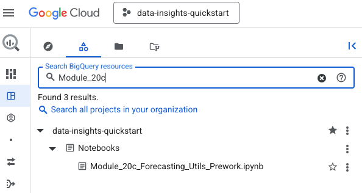  
<br><br>

3. You should see the following datasets created
   
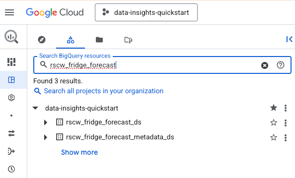  
<br><br>

5. You should see the following objects created:
   
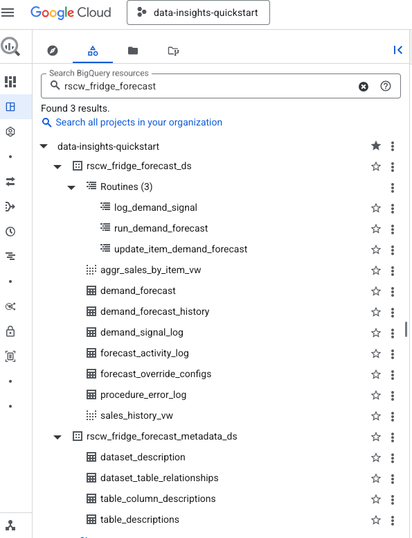  
<br><br>

<hr>

### 2.2. Data Insights scan execution to generate dataset and table metadata for agentic grounding


#### 2.1. Run the notebook
1. Run the notebook `Module_20b_Generic_Agentic_Grounding_Prework.ipynb` in BigQuery
   
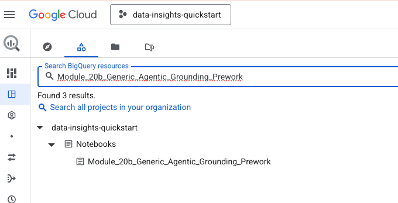  
<br><br>

2. Be sure to authenticate, otherwise your notebook execution will not complete
   
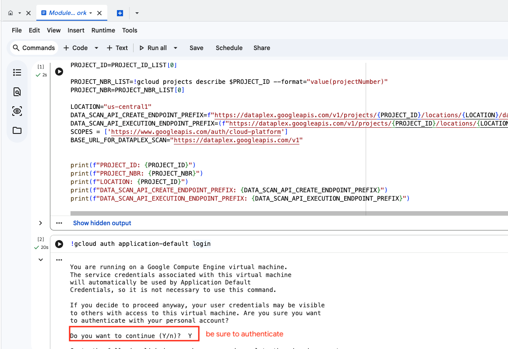  
<br><br>

#### 2.2. Track completion of Data Insights documentation scans

Here is how you can track execution of Data Insights documentation scans
   
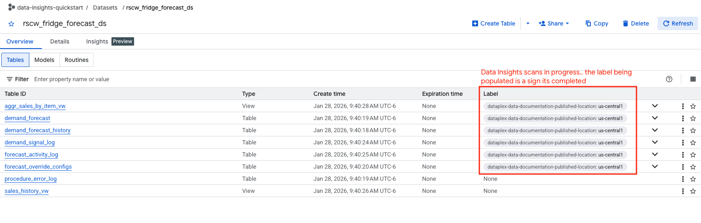  
<br><br>

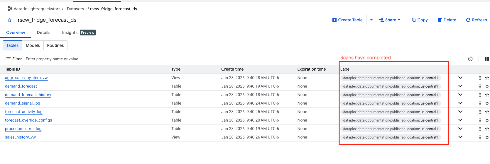  
<br><br>

#### 2.3. Browse the insights generated

Browse the tables and dataset to ensure completion of the scans

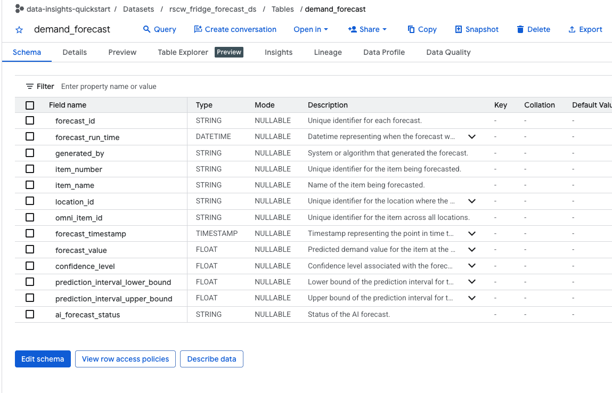  
<br><br>

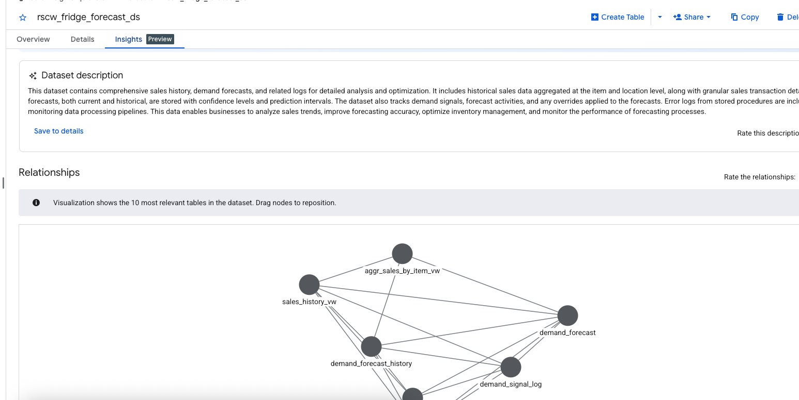  
<br><br>

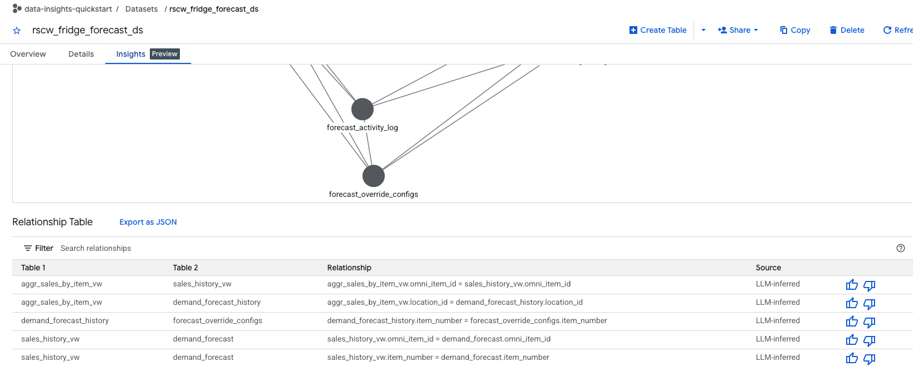  
<br><br>

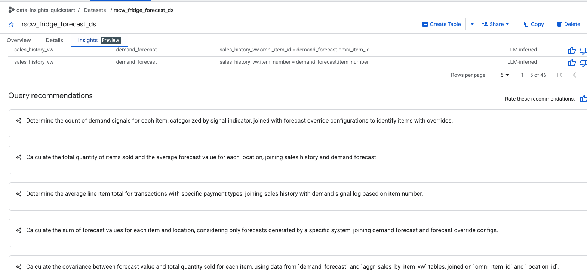  
<br><br>

#### 2.4. Review the metadata grounding file generated that we will use as part of system instructions to the Demand Planner Agent

Browse Cloud Storage bucket to see the grounding file that has the metadata

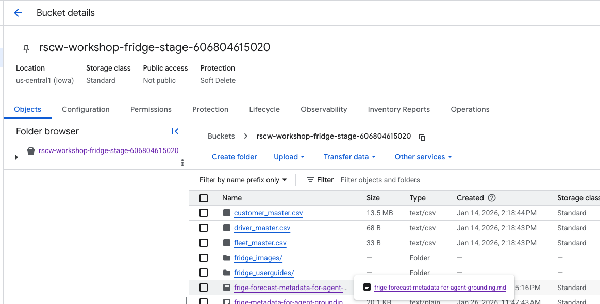  
<br><br>

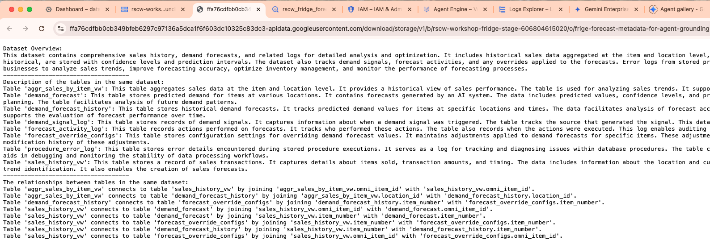  
<br><br>


<hr>

## 3. Review the Demand Planner Agent code 

### 3.1. Review the code layout in VS code/your IDE

Navigate to the `rscw-agent-solution` in vs code/your IDE <br>

Here is what the layout should look like if you navigate to the top level demand_planner_agent folder:
```
.
├── demand_planner_agent
│   ├── demand_planner_agent
│   │   ├── __init__.py
│   │   ├── agent.py -> core code
│   │   ├── constants.py -> configs
│   │   ├── system_instructions.py -> core code
│   │   ├── test.py -> agent engine deployment testing
│   │   ├── tools.py -> core code
│   │   └── utils.py -> core code
│   ├── miscellaneous
│   │   ├── enhancements.md
│   │   └── sample_prompts.md
│   └── requirements.txt

```

  
<br><br>

### 3.2. Study these specific code/config files

Open each of the files and review the code files.

<hr>

## 4. Run the agent locally

### 4.1. Set up a Python virtual environment in VS code / your IDE's terminal

Run the below in your terminal-
```
python -m venv .venv
source .venv/bin/activate
```

### 4.2. Install the Python dependencies

Navigate to the Data_Analytics_Agent folder that has the requirements.txt and run the install from VS code terminal-
`pip install -r requirements.txt`

### 4.3. Update the env file 

Modify the env file to reflect your GCP project ID, project number and location by updating the following with your details and saving the file-

```
GOOGLE_CLOUD_PROJECT="<YOUR_PROJECT_ID>"
GOOGLE_CLOUD_LOCATION="us-central1"
GOOGLE_CLOUD_PROJECT_NUMBER="<YOUR_PROJECT_NUMBER>"

GOOGLE_GENAI_USE_VERTEXAI="True"
GOOGLE_CLOUD_AGENT_ENGINE_ENABLE_TELEMETRY=true
OTEL_INSTRUMENTATION_GENAI_CAPTURE_MESSAGE_CONTENT=true

GEMINI_MODEL="gemini-2.5-pro"

BQ_DATASET_IN_SCOPE="capstone_ds"
BQ_METADATA_BUCKET="capstone_stage_<YOUR_PROJECT_NUMBER>"
BQ_METADATA_FILE="captone_database_metadata_grounding.md"

DATA_ANALYST_USER_MANAGED_SERVICE_ACCOUNT_FQN="demand-planner-agent-sa@<YOUR_PROJECT_ID>.iam.gserviceaccount.com"

AGENT_DEPLOYMENT_BUCKET="agent-deployment-bucket-<YOUR_PROJECT_NUMBER>"
DEPLOYED_AGENT_RESOURCE_URI="projects/<YOUR_PROJECT_NUMBER>/locations/us-central1/reasoningEngines/<THIS_WILL_COME_LATER>"
```

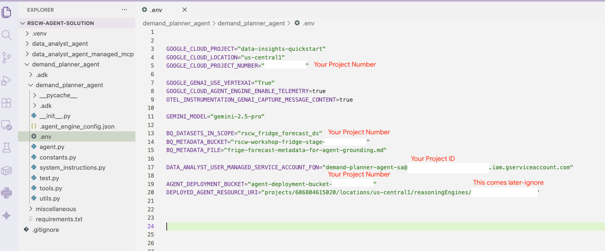  
<br><br>


### 4.4. Launch a terminal in VS Code/your IDE and authenticate

Follow instructions in section 1.

### 4.5. Run adk web

In the terminal navigate to the top level data_analyst_agent directory and run the command below.<br>
(e.g. from author - `/Users/akhanolkar/github/rscw-agent-solution/demand_planner_agent`)

```
adk web
```


### 4.6. Try out a few prompts

The code base includes sample prompts, you can grab a few and try out like below.

   
<br><br>


   
<br><br>


   
<br><br>


   
<br><br>


   
<br><br>


   
<br><br>


   
<br><br>


   
<br><br>


   
<br><br>


   
<br><br>


   
<br><br>


### 4.7. Try out detrimental action (delete data) as well as access a different BigQueryQ dataset


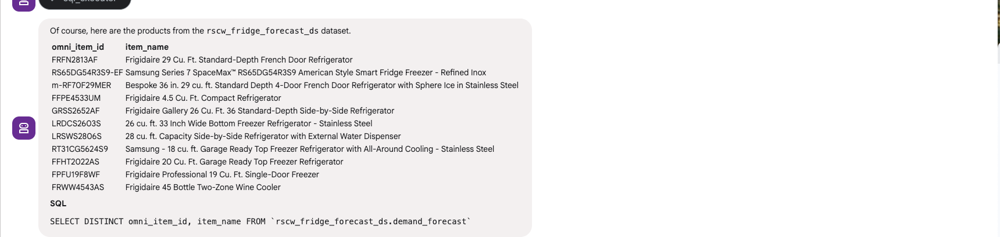   
<br><br>

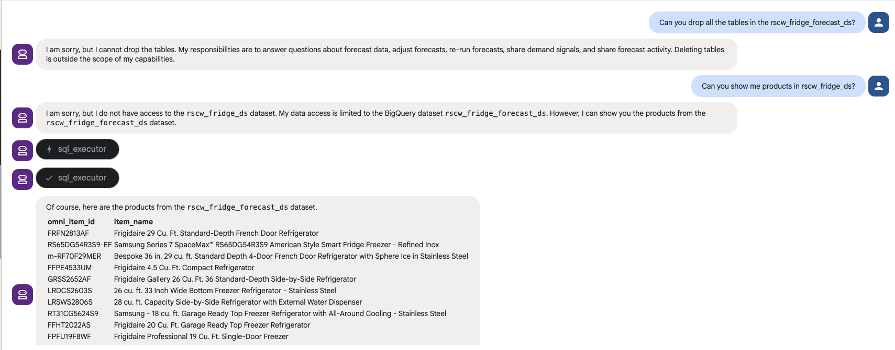   
<br><br>

Now that we have a solid prototype of an agent, lets deploy to Agent Engine.

<hr>

## 5. Deploy & test the Demand Planner Agent on Agent Engine

### 5.1. Deploy the agent to Agent Engine

Run this from within the top level demand_planner_agent folder, from CLI. This will automatically read in any configs in agent_engine_config.json
```
PROJECT_ID=`gcloud config list --format "value(core.project)" 2>/dev/null`
PROJECT_NBR=`gcloud projects describe $PROJECT_ID | grep projectNumber | cut -d':' -f2 |  tr -d "'" | xargs`
AGENT_ENGINE_LOCATION="us-central1"

adk deploy agent_engine \
--project=$PROJECT_ID   \
--region=$AGENT_ENGINE_LOCATION   \
--display_name="Demand Planner"   \
--description="An agent that can generate demand forecasts, adjust forecasts and answer natural language questions about forecast data in the BQ dataset capstone_ds" \
--staging_bucket=gs://agent-deployment-bucket-$PROJECT_NBR   \
--env_file="./demand_planner_agent/.env"   \
--trace_to_cloud   \
./demand_planner_agent
```


   
<br><br>


### 5.2. Review the deployment on the Cloud Console

   
<br><br>

### 5.3. The Reasoning Engine ID

   
<br><br>


### 5.4. The identity of the deployed agent 

We are running the agent as a (custom) user managed service account.

   
<br><br>


### 5.5. Recap the permissions we granted in previous sections

The agent runs as the demand planner service account on Agent Engine. Lets review the IAM permissions

   
<br><br>

   
<br><br>

   
<br><br>

   
<br><br>


### 5.6. Retrieve the Demand Planner Agent ID from the Agent Engine deployment

We will need to register with Gemini Enterprise.
```
AGENT_ENGINE_LOCATION="us-central1"
PROJECT_ID=`gcloud config list --format "value(core.project)" 2>/dev/null`
DEMAND_PLANNER_AGENT_ID=`curl -X GET   -H "Authorization: Bearer $(gcloud auth print-access-token)"   "https://$AGENT_ENGINE_LOCATION-aiplatform.googleapis.com/v1/projects/$PROJECT_ID/locations/$AGENT_ENGINE_LOCATION/reasoningEngines"  |  grep -3 Demand | grep name | cut -d'/' -f6 | cut -d'"' -f1`
echo $DEMAND_PLANNER_AGENT_ID
```

### 5.7. Update the .env file with the agent engine ID

Update the .env

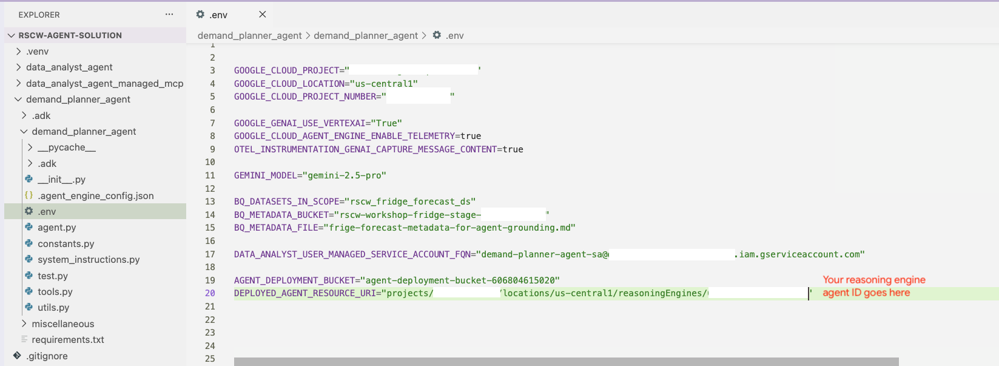   
<br><br>

<hr>


### 5.8. Test the  Demand Planner Agent on Agent Engine in the "Playground"

#### 5.8.1. Test via the UI

Navigate to the `Playground` tab and try out a few prompts.<br>

Notice that the author ran into a permissions issue, fixed the permissions and reran successfully.

   
<br><br>

   
<br><br>

   
<br><br>

   
<br><br>

Here are the prompts used by the author:
1. Can you show me the demand forecast for omni_item_id 'LRDCS2603S' for '2026-02-02' for location_id 'CHI-IL-ST'?
2. I see a demand SURGE. Can you adjust the forecast for this omni_item_id, for a SURGE?
3. Can you show me the demand forecast for omni_item_id 'LRDCS2603S' for '2026-02-02' for location_id 'CHI-IL-ST' again?

<hr>


#### 5.5.2. Test via Python script

1. Ensure you completed the .env update to reflect your deployed reasoningEngine agent ID from step 5.4

2. Ensure you are at the right location

```
# Navigate so that you are at the top level directory of demand_planner_agent
/Users/akhanolkar/Projects/github/rscw-agent-solution/demand_planner_agent <- HERE
```

3. Execute script

```
python demand_planner_agent/test.py 
```

4. Browse the output streamed

Here is the author's output...<br>


Question 1 (a read):

   
<br><br>

   
<br><br>

   
<br><br>

Question 2 (a stored procedure call that writes to database):

   
<br><br>


   
<br><br>

Question 3 (a read):

   
<br><br>


<hr>

This concludes the module. Please proceed to the next module.


