# Module 22: [Capstone] Create a Demand Planner Agent 

In this tutorial we will create a demand planner agent, and deploy it to Agent Engine. If you recall, we are to demonstrate to Shoonya executive leadership autonomous, multi-agent solutions on Google Cloud. As part of the agent developer continuum, we will test the agent with `adk web` locally, deploy and test on `agent engine` playground. We will skip Gemini Enterprise registration as the focus is merely a functionally adequate UI for our agents, and ADK and Agent Engine playground are sufficient.<br>

The demand planner agent can do the following:
1. Can run on-demand forecasting (TimesFM in BigQuery)
2. Can adjust forecasts based on demand signals for product (demand surge, slump)
3. Can do QnA on forecast data
4. Run a number of reports
5. Has limited access to view data, and to modify data

The agent can run the following reports:
1. Average Rate of Sale (per day)
2. Weeks of Supply
3. Inventory Reconciliation
4. On Hand Inventory
5. Available to Promise
6. Demand Signal Log (from the Market Intelligence Agent)
7. Agent Activity Log (from other agents)

And has access to several others.

<hr>

## 1. Setup

The setup is the same as for the previous agent.

### 1.1. Authenticate to Google Cloud from CLI & generate Application Default Credentials

Run each of these in cloud shell / terminal:
```
gcloud init
```

```
gcloud auth application-default login
```

Make sure you set the GCP project-
```
gcloud config set project <YOUR_PROJECT_ID>
```

<hr>

### 1.2. Create a user managed service account (UMSA) for the demand planner agent & grant it minimal permissions

#### 1.2.1. Run the below on cloud shell to create the UMSA:

```
PROJECT_ID=`gcloud config list --format "value(core.project)" 2>/dev/null`
PROJECT_NBR=`gcloud projects describe $PROJECT_ID | grep projectNumber | cut -d':' -f2 |  tr -d "'" | xargs`
LOCATION="us-central1"

 AGENT_UMSA="demand-planner-agent-sa"
AGENT_UMSA_FQN="$AGENT_UMSA@$PROJECT_ID.iam.gserviceaccount.com"

gcloud iam service-accounts create $AGENT_UMSA \
  --description="User Managed Service Account for Demand Planner Agent" \
  --display-name="Demand Planner Agent Service Account"
```

#### 1.2.2. Grant the UMSA requiste IAM permissions

```
gcloud projects add-iam-policy-binding $PROJECT_ID \
  --member="serviceAccount:$AGENT_UMSA_FQN" \
  --role="roles/aiplatform.reasoningEngineServiceAgent"

gcloud projects add-iam-policy-binding $PROJECT_ID \
  --member="serviceAccount:$AGENT_UMSA_FQN" \
  --role="roles/iam.serviceAccountViewer"

gcloud projects add-iam-policy-binding $PROJECT_ID \
--member="serviceAccount:$AGENT_UMSA_FQN" \
--role="roles/iam.serviceAccountUser"

gcloud projects add-iam-policy-binding $PROJECT_ID \
--member="serviceAccount:$AGENT_UMSA_FQN" \
--role="roles/iam.serviceAccountTokenCreator"

gcloud projects add-iam-policy-binding $PROJECT_ID \
  --member="serviceAccount:$AGENT_UMSA_FQN" \
  --role="roles/aiplatform.user"

gcloud projects add-iam-policy-binding $PROJECT_ID \
  --member="serviceAccount:$AGENT_UMSA_FQN" \
  --role="roles/storage.objectCreator"

gcloud projects add-iam-policy-binding $PROJECT_ID \
--member="serviceAccount:$AGENT_UMSA_FQN" \
--role="roles/discoveryengine.admin"

gcloud projects add-iam-policy-binding $PROJECT_ID \
  --member="serviceAccount:$AGENT_UMSA_FQN" \
  --role="roles/bigquery.jobUser"

gcloud projects add-iam-policy-binding $PROJECT_ID \
--member="serviceAccount:$AGENT_UMSA_FQN" \
--role="roles/bigquery.user"

gcloud projects add-iam-policy-binding $PROJECT_ID \
--member="serviceAccount:$AGENT_UMSA_FQN" \
--role="roles/bigquery.metadataViewer"

```

Lets ensure that our Demand Planner Agent has viewer access to the capstone_ds:
```
BQ_DATASET_IN_SCOPE_FOR_READS_RESOURCE_URI="projects/$PROJECT_ID/datasets/capstone_ds"

gcloud projects add-iam-policy-binding $PROJECT_ID \
--member="serviceAccount:$AGENT_UMSA_FQN" \
--role="roles/bigquery.dataViewer" \
--condition="expression=resource.name.startsWith(\"$BQ_DATASET_IN_SCOPE_FOR_READS_RESOURCE_URI\"),title=ReadAccessToSpecificDataset"
```

Lets ensure we lock down write access for our Demand Planner Agent to just 3 tables:
```
BQ_DEMAND_FORECAST_TABLE_WRITE_ACCESS_RESOURCE_URI="projects/$PROJECT_ID/datasets/capstone_ds/tables/demand_forecast"
BQ_DEMAND_FORECAST_HISTORY_TABLE_WRITE_ACCESS_RESOURCE_URI="projects/$PROJECT_ID/datasets/capstone_ds/tables/demand_forecast_history"
BQ_PROCEDURE_ERROR_LOG_TABLE_WRITE_ACCESS_RESOURCE_URI="projects/$PROJECT_ID/datasets/capstone_ds/tables/procedure_error_log"
FORECAST_ACTIVITY_LOG_TABLE_WRITE_ACCESS_RESOURCE_URI="projects/$PROJECT_ID/datasets/capstone_ds/tables/forecast_activity_log"

gcloud projects add-iam-policy-binding $PROJECT_ID \
--member="serviceAccount:$AGENT_UMSA_FQN" \
--role="roles/bigquery.dataEditor" \
--condition="expression=resource.name.startsWith(\"$BQ_DEMAND_FORECAST_TABLE_WRITE_ACCESS_RESOURCE_URI\") && resource.name.startsWith(\"$BQ_DEMAND_FORECAST_HISTORY_TABLE_WRITE_ACCESS_RESOURCE_URI\") && resource.name.startsWith(\"$BQ_PROCEDURE_ERROR_LOG_TABLE_WRITE_ACCESS_RESOURCE_URI\") && resource.name.startsWith(\"$FORECAST_ACTIVITY_LOG_TABLE_WRITE_ACCESS_RESOURCE_URI\" ),title=WriteAccessToSpecificTable"

```

####  1.2.3. Grant yourself permissions to impersonate the Data Analyst UMSA

Run the below in the terminal.
```
YOUR_UPN_FQN=`gcloud auth list --filter=status:ACTIVE --format="value(account)"`

gcloud projects add-iam-policy-binding $PROJECT_ID \
  --member="user:$YOUR_UPN_FQN" \
  --role="roles/iam.serviceAccountTokenCreator"

gcloud iam service-accounts add-iam-policy-binding \
    ${AGENT_UMSA_FQN} \
    --member="user:${YOUR_UPN_FQN}" \
    --role="roles/iam.serviceAccountUser"
```
<hr>

## 2. Data & routines overview

### 2.1. Stored Procedures
There are a number of stored procedures. Review the below-

| # | Stored Procedure  |  |
| -- | :-- |  :--- |
| 1. | capstone_ds.run_demand_forecast
 | This generates the demand forecast based on historical data using TimesFM in BigQuery |
| 2. | capstone_ds.update_item_demand_forecast | Updates the latest demand forecast for a specific products for a SURGE or a SLUMP.  |

### 2.2. Data
The captone setup module details all the tables in the BigQuery dataset. Some tables you may want to browse take a look at are:

| # | Table  |  |
| -- | :-- |  :--- |
| 1. | demand_forecast | This table stores demand forecasts for various items at different locations. It includes the predicted demand values, along with associated confidence levels and prediction intervals. The table tracks when the forecasts were generated and by whom. It also provides a status indicator for AI-driven forecasts.|
| 2. | demand_signal_log | This table logs demand signals related to items. It tracks when a signal is triggered for an item. The table records details about the signal, including who triggered it. It also indicates whether the signal is currently active.|
| 3. | forecast_activity_log | This table tracks activities related to forecasting. It records details about when forecast-related actions occur. The table also captures who performed these actions. This enables auditing and monitoring of the forecasting process. It provides a log of changes and events related to specific forecasts.|
| 4. | forecast_override_configs | This table stores configuration settings used to override demand forecasts. It holds adjustment factors that can be applied to forecasts in specific situations. These adjustments account for temporary increases or decreases in expected demand. The table also tracks when and by whom these configurations were last modified.|
| 5. | agent_activity_log | This table tracks actions performed on items. It records the type of action taken and provides additional details about each action. The table also captures the date and time when each action occurred. It identifies the agent responsible for performing each action.|

### 2.3. Report SQLs

Review the [constants.py](../02-code-assets/capstone-retail-solution/demand_planner_agent/demand_planner_agent/constants.py) for the report SQL.


<hr>

## 3. Agent code layout


Navigate to the `capstone-retail-solution`<br>

Here is what the layout should look like if you navigate to the top level demand_planner_agent folder:
```
.
├── demand_planner_agent
│   ├── demand_planner_agent
│   │   ├── __init__.py
│   │   ├── .agent_engine_config.json -> for any configs not supported by ADK command line
│   │   ├── agent.py -> core component
│   │   ├── constants.py -> loaded from .env entries
│   │   ├── .env -> needs configuration from you
│   │   ├── system_instructions.py -> core component
│   │   ├── test.py -> test agent engine deployment
│   │   ├── tools.py -> core component
│   │   └── utils.py -> core component
│   └── requirements.txt
```

## 4. Agent tooling overview


<hr>

## 5. Agent grounding overview

Browse Cloud Storage bucket to see the grounding file that has the metadata


<hr>

## 6. Agent instructions overview

Browse Cloud Storage bucket to see the grounding file that has the metadata


<hr>

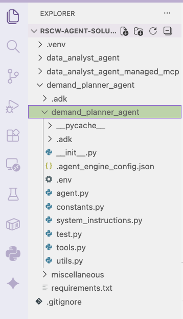  
<br><br>


<hr>

## 7. Prep for running agent locally

### 7.1. Set up a Python virtual environment in VS code / your IDE's terminal

Run the below in your terminal-
```
python -m venv .venv
source .venv/bin/activate
```

### 7.2. Install the Python dependencies

Navigate to the Data_Analytics_Agent folder that has the requirements.txt and run the install from VS code terminal-
`pip install -r requirements.txt`

### 7.3. Update the env file 


<hr>

## 8. Run `adk web` and test the agent locally/cloud shell

### 8.1. Launch `adk web`

In the terminal navigate to the top level data_analyst_agent directory and run the command below.<br>
(e.g. from author - `/Users/akhanolkar/github/rscw-agent-solution/demand_planner_agent`)

```
adk web
```

### 8.2. Try out a few prompts

The code base includes sample prompts, you can grab a few and try out like below.

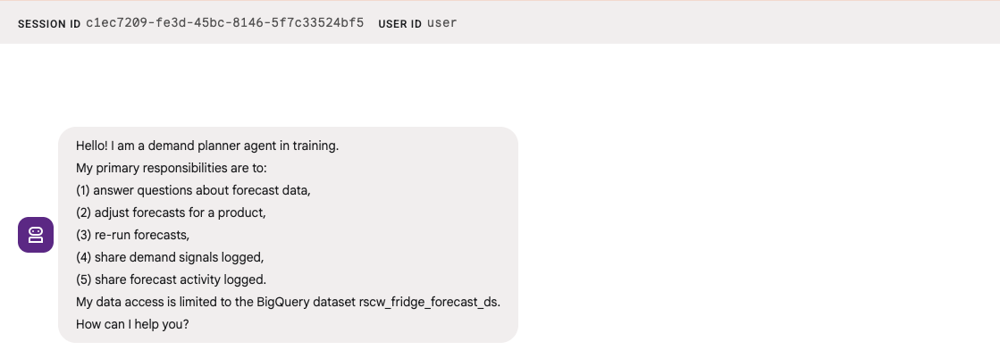   
<br><br>


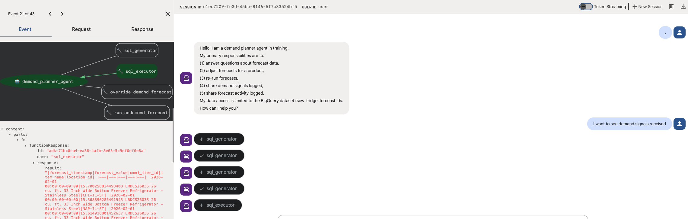   
<br><br>


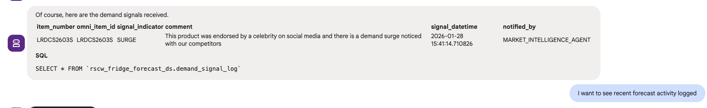   
<br><br>


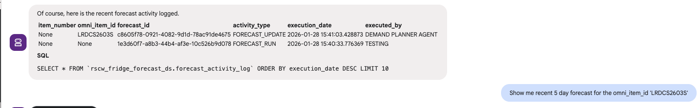   
<br><br>


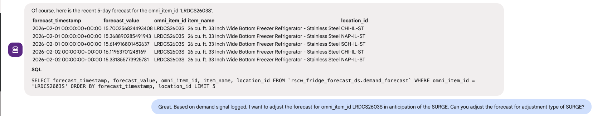   
<br><br>


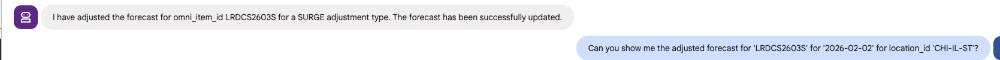   
<br><br>


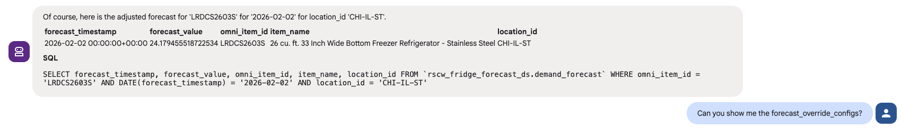   
<br><br>


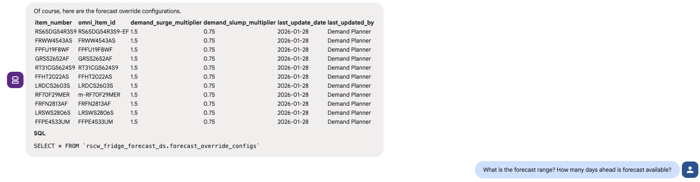   
<br><br>


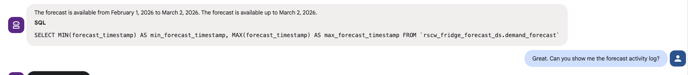   
<br><br>


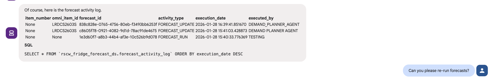   
<br><br>


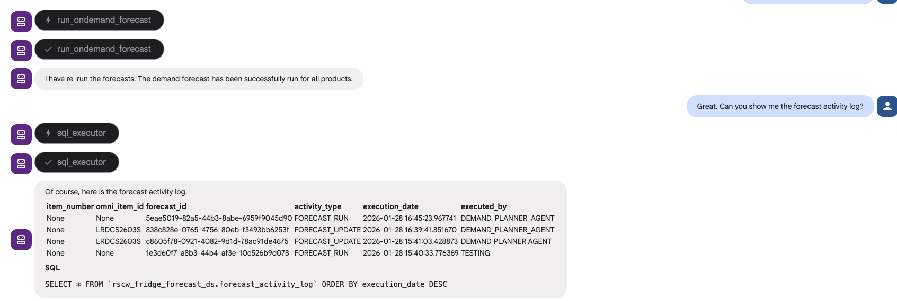   
<br><br>


Now that we have a solid prototype of an agent, lets deploy to Agent Engine.

<hr>

## 9. Deploy & test the Demand Planner Agent on Agent Engine

### 9.1. Deploy the agent to Agent Engine

Run this from within the top level demand_planner_agent folder, from CLI. This will automatically read in any configs in agent_engine_config.json
```
PROJECT_ID=`gcloud config list --format "value(core.project)" 2>/dev/null`
PROJECT_NBR=`gcloud projects describe $PROJECT_ID | grep projectNumber | cut -d':' -f2 |  tr -d "'" | xargs`
AGENT_ENGINE_LOCATION="us-central1"

adk deploy agent_engine \
--project=$PROJECT_ID   \
--region=$AGENT_ENGINE_LOCATION   \
--display_name="Demand Planner"   \
--description="An agent that can generate demand forecasts, adjust forecasts and answer natural language questions about forecast data in the BQ dataset capstone_ds" \
--staging_bucket=gs://agent-deployment-bucket-$PROJECT_NBR   \
--env_file="./demand_planner_agent/.env"   \
--trace_to_cloud   \
./demand_planner_agent
```


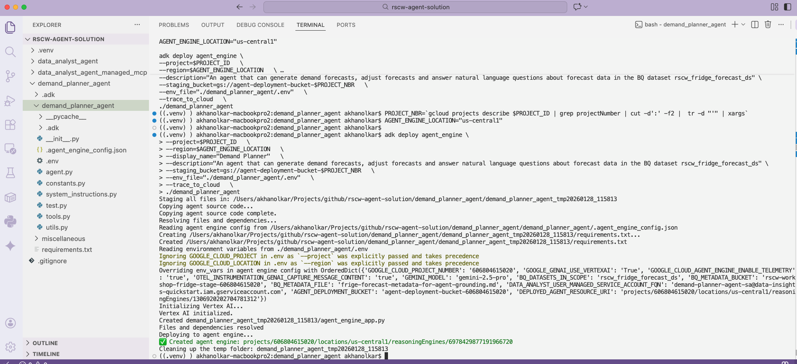   
<br><br>


### 9.2. Review the deployment on the Cloud Console

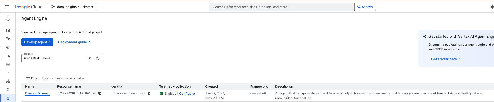   
<br><br>

### 9.3. The Reasoning Engine ID

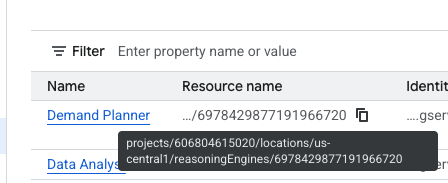   
<br><br>


### 9.4. The identity of the deployed agent 

We are running the agent as a (custom) user managed service account.

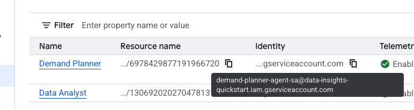   
<br><br>


### 9.5. Recap the permissions we granted in previous sections

The agent runs as the demand planner service account on Agent Engine. Lets review the IAM permissions

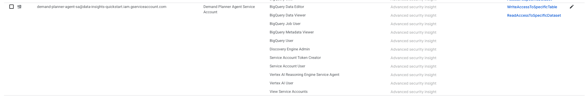   
<br><br>

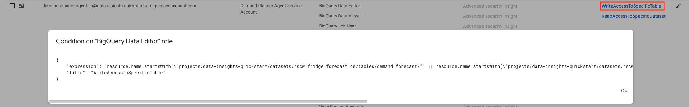   
<br><br>

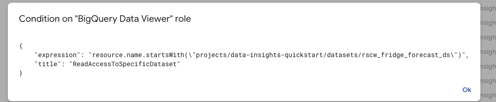   
<br><br>

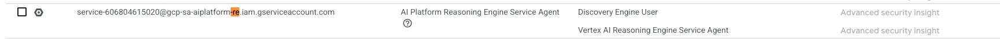   
<br><br>


### 9.6. Retrieve the Demand Planner Agent ID from the Agent Engine deployment

We will need to register with Gemini Enterprise.
```
AGENT_ENGINE_LOCATION="us-central1"
PROJECT_ID=`gcloud config list --format "value(core.project)" 2>/dev/null`
DEMAND_PLANNER_AGENT_ID=`curl -X GET   -H "Authorization: Bearer $(gcloud auth print-access-token)"   "https://$AGENT_ENGINE_LOCATION-aiplatform.googleapis.com/v1/projects/$PROJECT_ID/locations/$AGENT_ENGINE_LOCATION/reasoningEngines"  |  grep -3 Demand | grep name | cut -d'/' -f6 | cut -d'"' -f1`
echo $DEMAND_PLANNER_AGENT_ID
```


### 9.7 Test the  Demand Planner Agent on Agent Engine in the "Playground"

Navigate to the `Playground` tab and try out a few prompts.<br>

Notice that the author ran into a permissions issue, fixed the permissions and reran successfully.

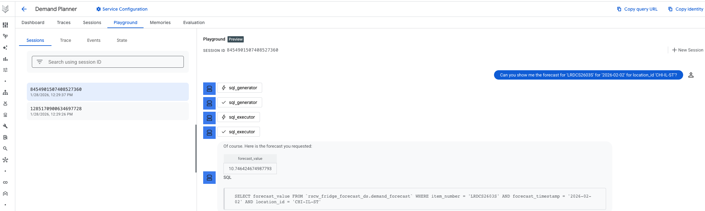   
<br><br>

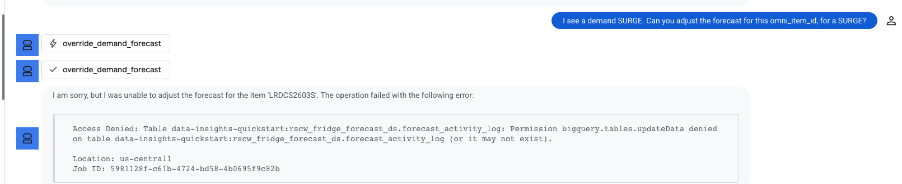   
<br><br>

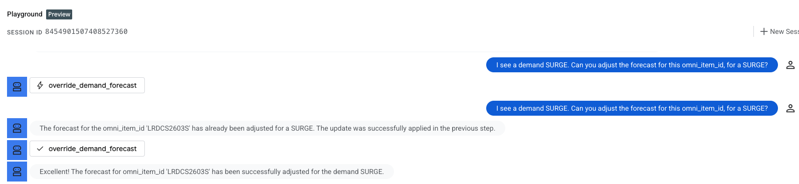   
<br><br>

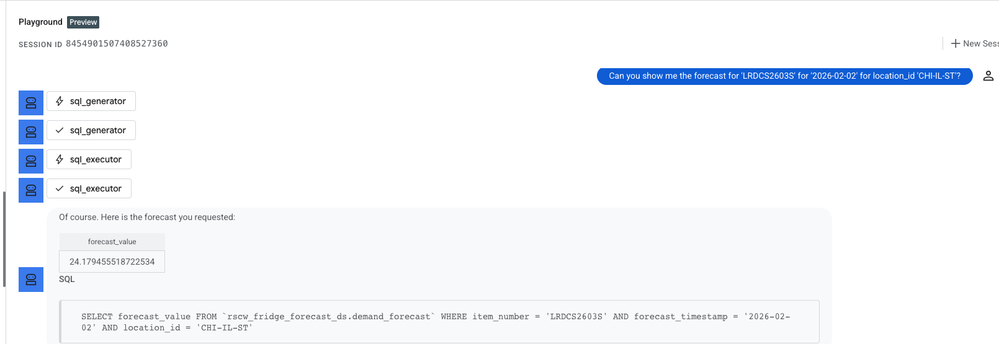   
<br><br>

Here are the prompts used by the author:
1. Can you show me the demand forecast for omni_item_id 'LRDCS2603S' for '2026-02-02' for location_id 'CHI-IL-ST'?
2. I see a demand SURGE. Can you adjust the forecast for this omni_item_id, for a SURGE?
3. Can you show me the demand forecast for omni_item_id 'LRDCS2603S' for '2026-02-02' for location_id 'CHI-IL-ST' again?

<hr>


#### 5.5.2. Test via Python script

1. Ensure you completed the .env update to reflect your deployed reasoningEngine agent ID from step 5.4

2. Ensure you are at the right location

```
# Navigate so that you are at the top level directory of demand_planner_agent
/Users/akhanolkar/Projects/github/rscw-agent-solution/demand_planner_agent <- HERE
```

3. Execute script

```
python demand_planner_agent/test.py 
```

4. Browse the output streamed

Here is the author's output...<br>


Question 1 (a read):

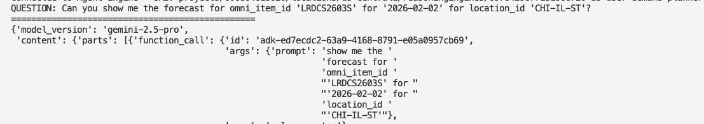   
<br><br>

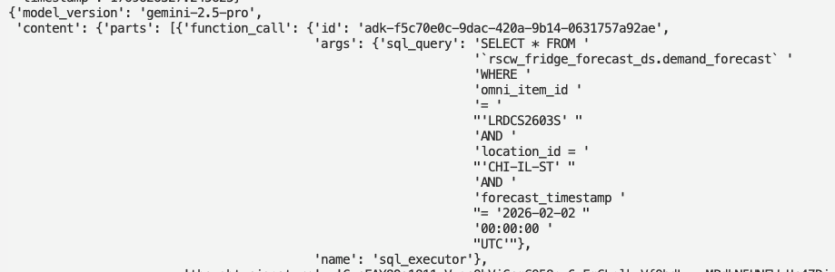   
<br><br>

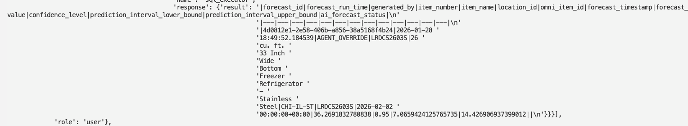   
<br><br>

Question 2 (a stored procedure call that writes to database):

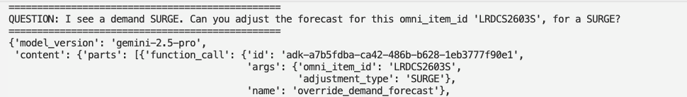   
<br><br>


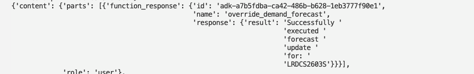   
<br><br>

Question 3 (a read):

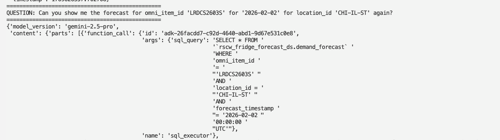   
<br><br>


<hr>

This concludes the module. Please proceed to the next module.


