# Module 23: [Capstone] Create an Inventory Manager Agent 

You are already familiar with agent development from the previous modules. This module is identical, we are merely creating a different persona. The drill is the same - as part of the agent developer continuum, we will test the agent with `adk web` locally, deploy and test on `agent engine` playground. We will skip Gemini Enterprise registration as the focus is merely a functionally adequate UI for our agents, and ADK and Agent Engine playground are sufficient.<br>

The inventory manager agent can do the following:
1. Generate the default inventory allocation plan
2. Adjust inventory allocation across stores and warehouse
3. Answer any adhoc questions (best effort)
<br><br>
4. Generate a variety of canned reports:<br>
a) Inventory Reconciliation Report<br>
b) On Hand Inventory Report<br>
c) Available to Promise Report<br>
d) Low Stock Report<br>
e) Stock Movement Summary Report<br>
f) Out of Stock Report<br>
g) Reorder Point Report<br>
h) Inventory Aging Report<br>
i) Inventory Allocation Report<br>
j) Under-performing Inventory Report<br>
<br>And has access to more that are not listed here.
<hr>

## 1. Setup

### 1.2. Create a user managed service account (UMSA) for the agent & grant it minimal permissions

#### 1.2.1. Run the below on cloud shell to create the UMSA:

```
PROJECT_ID=`gcloud config list --format "value(core.project)" 2>/dev/null`
PROJECT_NBR=`gcloud projects describe $PROJECT_ID | grep projectNumber | cut -d':' -f2 |  tr -d "'" | xargs`
LOCATION="us-central1"

AGENT_UMSA="inventory-manager-agent-sa"
AGENT_UMSA_FQN="$AGENT_UMSA@$PROJECT_ID.iam.gserviceaccount.com"

gcloud iam service-accounts create $AGENT_UMSA \
  --description="User Managed Service Account for Inventory Manager Agent" \
  --display-name="Inventory Manager Agent Service Account"
```

#### 1.2.2. Grant the UMSA requiste IAM permissions

```
gcloud projects add-iam-policy-binding $PROJECT_ID \
  --member="serviceAccount:$AGENT_UMSA_FQN" \
  --role="roles/aiplatform.reasoningEngineServiceAgent"

gcloud projects add-iam-policy-binding $PROJECT_ID \
  --member="serviceAccount:$AGENT_UMSA_FQN" \
  --role="roles/aiplatform.user"

gcloud projects add-iam-policy-binding $PROJECT_ID \
  --member="serviceAccount:$AGENT_UMSA_FQN" \
  --role="roles/storage.objectCreator"

gcloud projects add-iam-policy-binding $PROJECT_ID \
  --member="serviceAccount:$AGENT_UMSA_FQN" \
  --role="roles/bigquery.jobUser"

gcloud projects add-iam-policy-binding $PROJECT_ID \
--member="serviceAccount:$AGENT_UMSA_FQN" \
--role="roles/bigquery.user"

gcloud projects add-iam-policy-binding $PROJECT_ID \
--member="serviceAccount:$AGENT_UMSA_FQN" \
--role="roles/bigquery.metadataViewer"


gcloud projects add-iam-policy-binding $PROJECT_ID \
--member="serviceAccount:$AGENT_UMSA_FQN" \
--role="roles/iam.serviceAccountUser"

gcloud projects add-iam-policy-binding $PROJECT_ID \
--member="serviceAccount:$AGENT_UMSA_FQN" \
--role="roles/iam.serviceAccountTokenCreator"

Select 'None' if prompted to choose IAM condition

```

Lets ensure that our inventory manager Agent has viewer access to the capstone_ds:
```

BQ_DATASET_IN_SCOPE_FOR_READS_RESOURCE_URI="projects/$PROJECT_ID/datasets/capstone_ds"

gcloud projects add-iam-policy-binding $PROJECT_ID \
--member="serviceAccount:$AGENT_UMSA_FQN" \
--role="roles/bigquery.dataViewer" \
--condition="expression=resource.name.startsWith(\"$BQ_DATASET_IN_SCOPE_FOR_READS_RESOURCE_URI\"),title=ReadAccessToSpecificDatasets"
```

Lets ensure we lock down write access for our agent to just a few tables:
```
BQ_STOCK_ALLOC_TABLE_WRITE_ACCESS_RESOURCE_URI="projects/$PROJECT_ID/datasets/capstone_ds/tables/inventory_allocation"
BQ_PROCEDURE_ERROR_LOG_TABLE_WRITE_ACCESS_RESOURCE_URI="projects/$PROJECT_ID/datasets/capstone_ds/tables/procedure_error_log"
BQ_ACTIVITY_LOG_TABLE_WRITE_ACCESS_RESOURCE_URI="projects/$PROJECT_ID/datasets/capstone_ds/tables/activity_log"

gcloud projects add-iam-policy-binding $PROJECT_ID \
--member="serviceAccount:$AGENT_UMSA_FQN" \
--role="roles/bigquery.dataEditor" \
--condition="expression=resource.name.startsWith(\"$BQ_STOCK_ALLOC_TABLE_WRITE_ACCESS_RESOURCE_URI\") && resource.name.startsWith(\"$BQ_PROCEDURE_ERROR_LOG_TABLE_WRITE_ACCESS_RESOURCE_URI\") && resource.name.startsWith(\"$BQ_ACTIVITY_LOG_TABLE_WRITE_ACCESS_RESOURCE_URI\" ),title=WriteAccessToSpecificTables"

```

####  1.2.3. Grant yourself permissions to impersonate the UMSA

Run the below in the terminal.
```
YOUR_UPN_FQN=`gcloud auth list --filter=status:ACTIVE --format="value(account)"`

gcloud projects add-iam-policy-binding $PROJECT_ID \
  --member="user:$YOUR_UPN_FQN" \
  --role="roles/iam.serviceAccountTokenCreator"

gcloud iam service-accounts add-iam-policy-binding \
    ${AGENT_UMSA_FQN} \
    --member="user:${YOUR_UPN_FQN}" \
    --role="roles/iam.serviceAccountUser"
```
<hr>


## 2. Data & routines overview

### 2.1. Stored Procedures
There are a number of stored procedures. Review the below-

| # | Stored Procedure  |  Purpose |
| -- | :-- |  :-- |  
| 1. | capstone_ds.generate_inventory_allocation_plan| Generates the inventory allocation plan that dictates stock in the store versus warehouse each day  |
| 2. | capstone_ds.adjust_inventory_allocation | Updates inventory allocation across each store and the warehouse  |

### 2.2. Data
The captone setup module details all the tables in the BigQuery dataset. Some tables you may want to browse are:

| # | Table  | Purpose  |
| -- | :-- |  :--- |
| 1. | stock_allocation_plan| This table stores planned stock allocations for items across different locations. It tracks the quantity of each item intended for a specific location. The data includes the date the allocation was planned. It also indicates whether the allocation plan is the most current one. This table supports analysis of stock distribution strategies. |
| 2. | stock_master_location|This table tracks inventory levels across different locations. It provides a snapshot of stock quantities for various items. The data is recorded on a specific date. This allows for analysis of inventory distribution. It supports inventory management and supply chain optimization.|
| 3. | stock_master | This table tracks inventory levels for various items. It provides a snapshot of stock quantities at specific points in time. The data allows for monitoring inventory and managing reorder points. It supports analysis of stock availability. |
| 4. | stock_movement | This table tracks changes in stock levels. It records each instance of inventory adjustment. The table captures the date of the movement, the items affected, and the magnitude of the change. It also includes reference information for auditing purposes.|
| 5. | stock_thresholds | This table stores calculated stock level thresholds for various items. It is used to monitor inventory levels across different locations. The table facilitates the determination of optimal stock levels. It supports the identification of items needing reordering. This data is essential for maintaining adequate stock and preventing shortages.|

### 2.3. Report SQLs

Review the [constants.py](../02-code-assets/capstone-retail-solution/inventory_manager_agent/inventory_manager_agent/constants.py) for the report SQL listing. Run the SQL to familiarize yourself.


<hr>

## 3. Agent code layout


Navigate to the `capstone-retail-solution`<br>
Here is what the layout should look like if you navigate to the top level inventory_manager_agent folder:
```
.
├── inventory_manager_agent
│   ├── inventory_manager_agent
│   │   ├── __init__.py
│   │   ├── .agent_engine_config.json -> for any configs not supported by ADK command line
│   │   ├── agent.py -> core component
│   │   ├── constants.py -> loaded from .env entries
│   │   ├── .env -> needs configuration from you
│   │   ├── system_instructions.py -> core component
│   │   ├── test.py -> test agent engine deployment
│   │   ├── tools.py -> core component
│   │   └── utils.py -> core component
│   └── requirements.txt
```

## 4. Agent tooling overview

The agent has 4 tools as shown below. Study the code to understand what each has to offer.

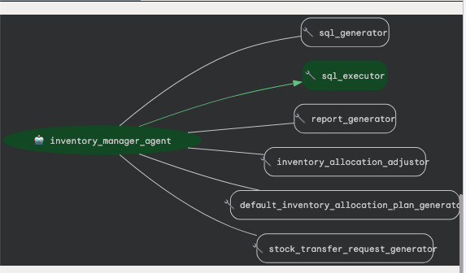  
<br><br>

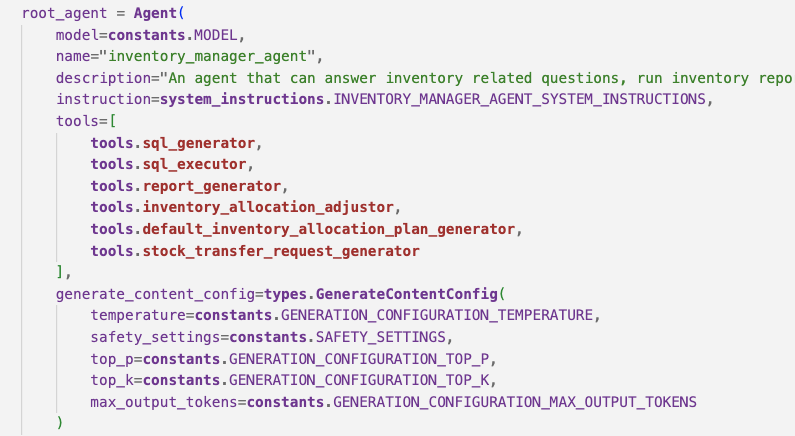  
<br><br>

<hr>

## 5. Agent grounding overview

Browse Cloud Storage bucket to see the grounding file that has the metadata. [We covered this in Module 20.](https://github.com/GoogleCloudPlatform/retail-data-to-ai-workshop/blob/ADK-MCP-Primer/03-lab-manuals/Module_20_Capstone_Setup.md#16-about-the-bigquery-metadata-persisted-to-gcs-for-agentic-grounding)


<hr>

## 6. Agent instructions overview

Review the [agent instructions](../02-code-assets/capstone-retail-solution/inventory_manager_agent/inventory_manager_agent/system_instructions.py).

<hr>

## 7. Prep for running agent locally

### 7.1. Set up a Python virtual environment in VS code / your IDE's terminal

Run the below in your terminal-
```
python -m venv .venv
source .venv/bin/activate
```

### 7.2. Install the Python dependencies

You dont need any incremental dependencies.


### 7.3. Update the env file 

Run the below in the terminal:
```
PROJECT_ID=`gcloud config list --format "value(core.project)" 2>/dev/null`
PROJECT_NBR=`gcloud projects describe $PROJECT_ID | grep projectNumber | cut -d':' -f2 |  tr -d "'" | xargs`
LOCATION="us-central1"

cd ~/retail-data-to-ai-workshop/02-code-assets/capstone-retail-solution

sed -i s/'LOCATION'/$LOCATION/g inventory_manager_agent/inventory_manager_agent/.env
sed -i s/'PROJECT_ID'/$PROJECT_ID/g inventory_manager_agent/inventory_manager_agent/.env
sed -i s/'PROJECT_NBR'/$PROJECT_NBR/g inventory_manager_agent/inventory_manager_agent/.env
sed -i s/'PROJECT_ID'/$PROJECT_ID/g inventory_manager_agent/inventory_manager_agent/.agent_engine_config.json
```

<hr>

## 8. Run `adk web` and test the agent locally/cloud shell

### 8.1. Launch `adk web`

In the terminal navigate to the top level inventory_manager_agent directory and run the command below.<br>

```
adk web
```

### 8.2. Try out a few prompts

See the screenshots below and try out a few prompts.

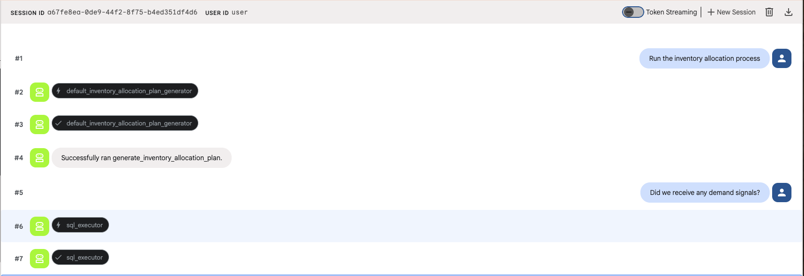  
<br><br>

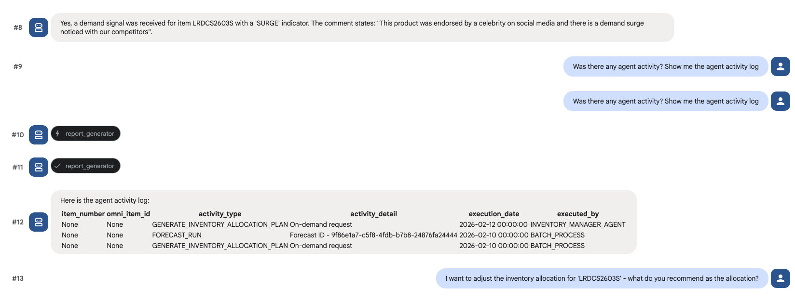  
<br><br>

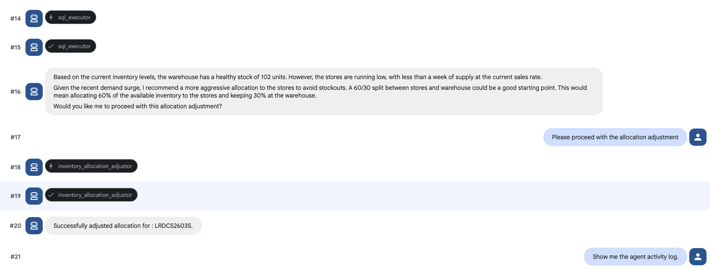  
<br><br>

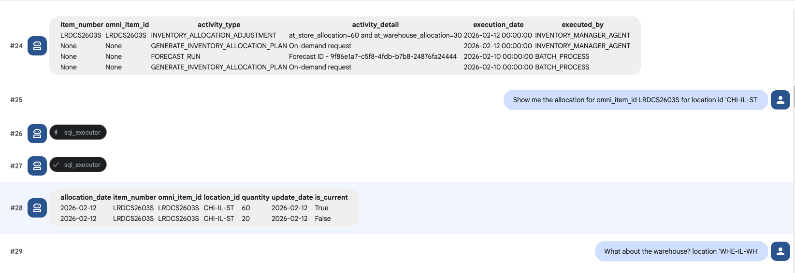  
<br><br>

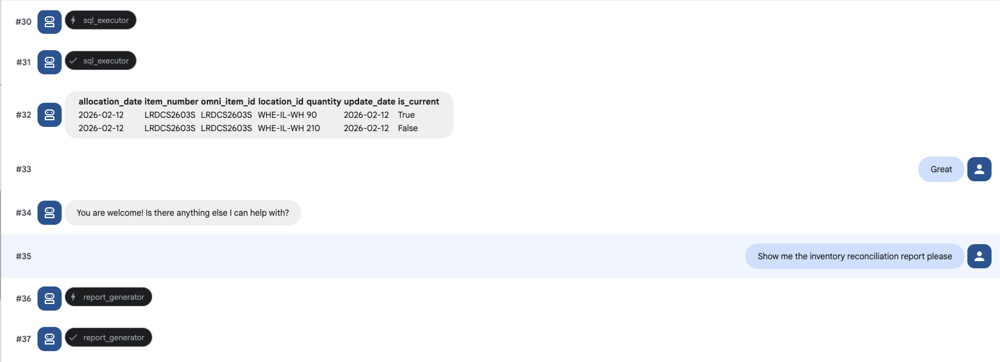  
<br><br>

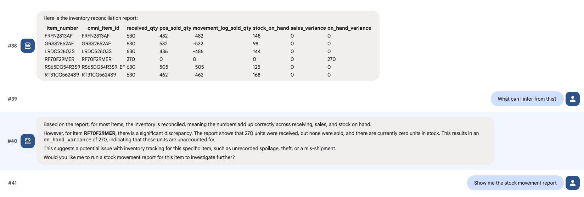  
<br><br>

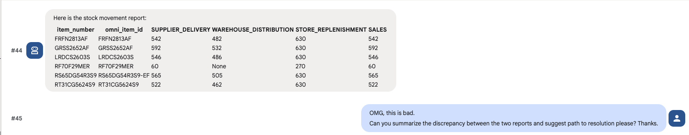  
<br><br>

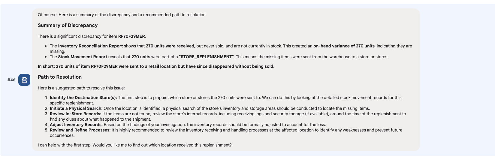  
<br><br>

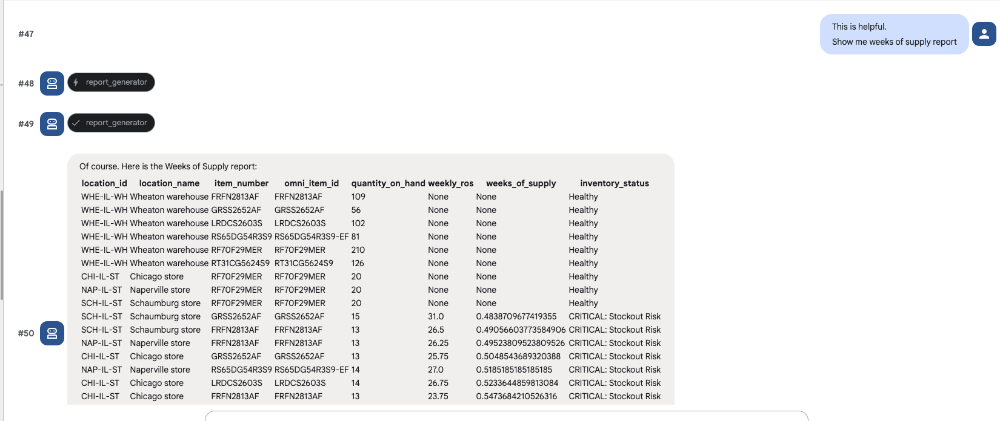  
<br><br>

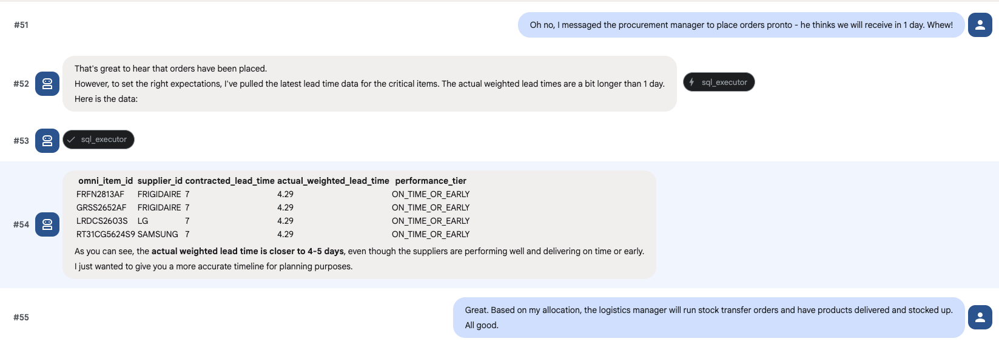  
<br><br>

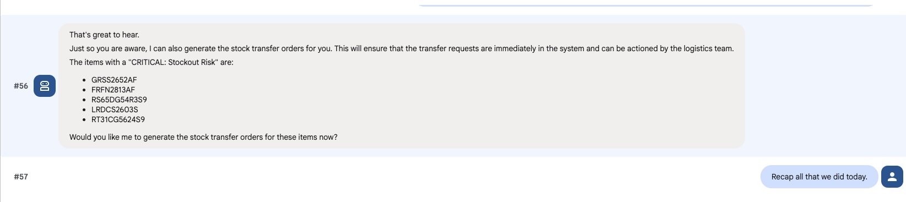  
<br><br>

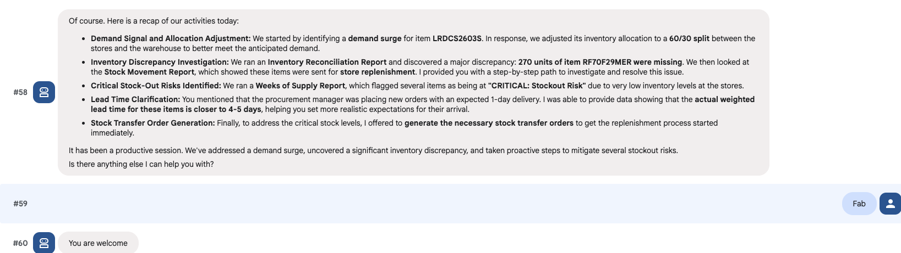  
<br><br>

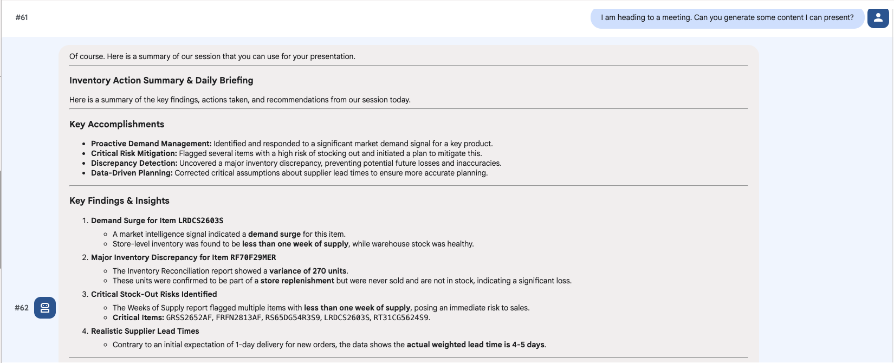  
<br><br>

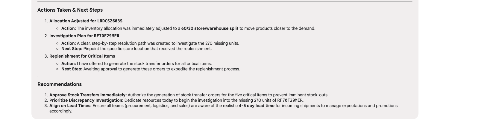  
<br><br>

Now that we have a solid prototype of an agent, lets deploy to Agent Engine.

<hr>

## 9. Deploy & test the inventory manager Agent on Agent Engine

### 9.1. Deploy the agent to Agent Engine

Run this from within the top level inventory_manager_agent folder, from CLI. This will automatically read in any configs in agent_engine_config.json
```
PROJECT_ID=`gcloud config list --format "value(core.project)" 2>/dev/null`
PROJECT_NBR=`gcloud projects describe $PROJECT_ID | grep projectNumber | cut -d':' -f2 |  tr -d "'" | xargs`
AGENT_ENGINE_LOCATION="us-central1"

adk deploy agent_engine \
--project=$PROJECT_ID   \
--region=$AGENT_ENGINE_LOCATION   \
--display_name="Inventory Manager"   \
--description="An agent that can generate inventory allocation plan, adjust allocation, run a number of canned reports and answer adhoc natural language questions about inventory data in the BQ dataset capstone_ds" \
--staging_bucket=gs://agent-deployment-bucket-$PROJECT_NBR   \
--env_file="./inventory_manager_agent/.env"   \
--trace_to_cloud   \
./inventory_manager_agent
```


### 9.2. Review the deployment on the Cloud Console

   
<br><br>

### 9.3. The Reasoning Engine ID

   
<br><br>


### 9.4. The identity of the deployed agent 

We are running the agent as a (custom) user managed service account.

   
<br><br>


### 9.5. Recap the permissions we granted in previous sections

The agent runs as the inventory manager service account on Agent Engine. Lets review the IAM permissions

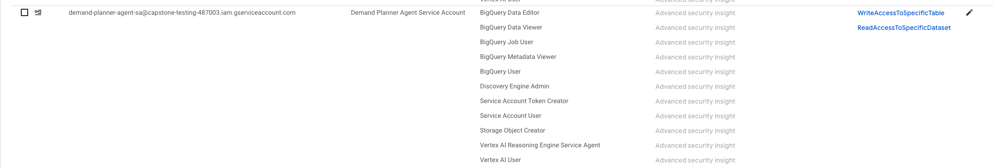   
<br><br>

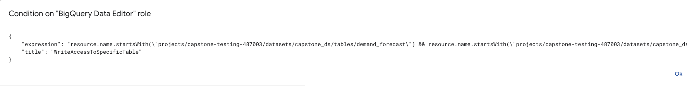   
<br><br>

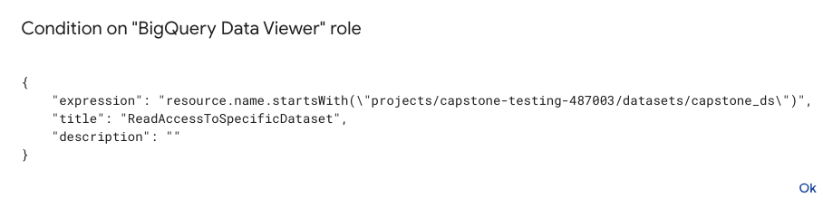   
<br><br>


### 9.6. Retrieve the inventory manager Agent ID from the Agent Engine deployment

We will need to register with Gemini Enterprise.
```
AGENT_ENGINE_LOCATION="us-central1"
PROJECT_ID=`gcloud config list --format "value(core.project)" 2>/dev/null`
inventory_manager_agent_ID=`curl -X GET   -H "Authorization: Bearer $(gcloud auth print-access-token)"   "https://$AGENT_ENGINE_LOCATION-aiplatform.googleapis.com/v1/projects/$PROJECT_ID/locations/$AGENT_ENGINE_LOCATION/reasoningEngines"  |  grep -3 Demand | grep name | cut -d'/' -f6 | cut -d'"' -f1`
echo $inventory_manager_agent_ID
```

### 9.7. Update the .env file with the agent ID retrieved

Run the below in the terminal:
```
sed -i s/'TBD'/$inventory_manager_agent_ID/g ~/retail-data-to-ai-workshop/02-code-assets/capstone-retail-solution/inventory_manager_agent/inventory_manager_agent/.env
```

### 9.8. Test the  inventory manager Agent on Agent Engine in the "Playground"

Navigate to the `Playground` tab and try out a few prompts.<br>

Notice that the author ran into a permissions issue, fixed the permissions and reran successfully.

   
<br><br>

   
<br><br>

   
<br><br>

   
<br><br>

Here are the prompts used by the author:
1. Can you show me the demand forecast for omni_item_id 'LRDCS2603S' for '2026-02-02' for location_id 'CHI-IL-ST'?
2. I see a demand SURGE. Can you adjust the forecast for this omni_item_id, for a SURGE?
3. Can you show me the demand forecast for omni_item_id 'LRDCS2603S' for '2026-02-02' for location_id 'CHI-IL-ST' again?

<hr>


#### 5.5.2. Test via Python script

1. Ensure you completed the .env update to reflect your deployed reasoningEngine agent ID from step 5.4

2. Ensure you are at the right location

```
# Navigate so that you are at the top level directory of inventory_manager_agent
~/retail-data-to-ai-workshop/capstone-retail-solution/inventory_manager_agent <- HERE
```

3. Execute script

```
python inventory_manager_agent/test.py 
```

4. Browse the output streamed

Here is the author's output...<br>


Question 1 (a read):

   
<br><br>

   
<br><br>

   
<br><br>

Question 2 (a stored procedure call that writes to database):

   
<br><br>


   
<br><br>

Question 3 (a read):

   
<br><br>


<hr>

This concludes the module. Please proceed to the [next module](Module_24_Procurement_Manager_Agent.md).


