# Module 24: [Capstone] Create a Logistics Manager Agent 

You are already familiar with agent development from the previous modules. This module is identical, we are merely creating a different persona. The drill is the same - as part of the agent developer continuum, we will test the agent with `adk web` locally, deploy and test on `agent engine` playground. We will skip Gemini Enterprise registration as the focus is merely a functionally adequate UI for our agents, and ADK and Agent Engine playground are sufficient.<br>

The logistics manager agent can do the following:
1. Generate stock transfer orders from warehouse to stores based on stock allocation plan
2. Answer any adhoc questions (best effort)
3. Generate a variety of canned reports:<br>
a) Stock Transfer Fulfillment report<br>
b) Location-based Transfer Volume Summary report<br>
c) Fleet Usage Summary report<br>
d) Fleet Items Delivery Summary report<br>
e) + more

<hr>


## 1. Setup

### 1.2. Create a user managed service account (UMSA) for the agent & grant it minimal permissions

#### 1.2.1. Run the below on cloud shell to create the UMSA:

```
PROJECT_ID=`gcloud config list --format "value(core.project)" 2>/dev/null`
PROJECT_NBR=`gcloud projects describe $PROJECT_ID | grep projectNumber | cut -d':' -f2 |  tr -d "'" | xargs`
LOCATION="us-central1"

AGENT_UMSA="logistics-manager-agent-sa"
AGENT_UMSA_FQN="$AGENT_UMSA@$PROJECT_ID.iam.gserviceaccount.com"

gcloud iam service-accounts create $AGENT_UMSA \
  --description="User Managed Service Account for Logistics Manager Agent" \
  --display-name="Logistics Manager Agent Service Account"
```

#### 1.2.2. Grant the UMSA requiste IAM permissions

```
gcloud projects add-iam-policy-binding $PROJECT_ID \
  --member="serviceAccount:$AGENT_UMSA_FQN" \
  --role="roles/aiplatform.reasoningEngineServiceAgent"

gcloud projects add-iam-policy-binding $PROJECT_ID \
  --member="serviceAccount:$AGENT_UMSA_FQN" \
  --role="roles/aiplatform.user"

gcloud projects add-iam-policy-binding $PROJECT_ID \
  --member="serviceAccount:$AGENT_UMSA_FQN" \
  --role="roles/storage.objectCreator"

gcloud projects add-iam-policy-binding $PROJECT_ID \
  --member="serviceAccount:$AGENT_UMSA_FQN" \
  --role="roles/bigquery.jobUser"

gcloud projects add-iam-policy-binding $PROJECT_ID \
--member="serviceAccount:$AGENT_UMSA_FQN" \
--role="roles/bigquery.user"

gcloud projects add-iam-policy-binding $PROJECT_ID \
--member="serviceAccount:$AGENT_UMSA_FQN" \
--role="roles/bigquery.metadataViewer"


gcloud projects add-iam-policy-binding $PROJECT_ID \
--member="serviceAccount:$AGENT_UMSA_FQN" \
--role="roles/iam.serviceAccountUser"

gcloud projects add-iam-policy-binding $PROJECT_ID \
--member="serviceAccount:$AGENT_UMSA_FQN" \
--role="roles/iam.serviceAccountTokenCreator"

Select 'None' if prompted to choose IAM condition

```

Lets ensure that our Logistics Manager Agent has viewer access to the capstone_ds:
```
BQ_DATASET_IN_SCOPE_FOR_READS_RESOURCE_URI="projects/$PROJECT_ID/datasets/capstone_ds"

gcloud projects add-iam-policy-binding $PROJECT_ID \
--member="serviceAccount:$AGENT_UMSA_FQN" \
--role="roles/bigquery.dataViewer" \
--condition="expression=resource.name.startsWith(\"$BQ_DATASET_IN_SCOPE_FOR_READS_RESOURCE_URI\"),title=ReadAccessToSpecificDatasets"
```

Lets ensure we lock down write access for our agent to just a few tables:
```
BQ_STOCK_TRANSFER_TABLE_WRITE_ACCESS_RESOURCE_URI="projects/$PROJECT_ID/datasets/capstone_ds/tables/stock_transfer_orders"
BQ_STOCK_TRANSFER_ITEMS_TABLE_WRITE_ACCESS_RESOURCE_URI="projects/$PROJECT_ID/datasets/capstone_ds/tables/stock_transfer_order_items"
BQ_PROCEDURE_ERROR_LOG_TABLE_WRITE_ACCESS_RESOURCE_URI="projects/$PROJECT_ID/datasets/capstone_ds/tables/procedure_error_log"
BQ_ACTIVITY_LOG_TABLE_WRITE_ACCESS_RESOURCE_URI="projects/$PROJECT_ID/datasets/capstone_ds/tables/agent_activity_log"


gcloud projects add-iam-policy-binding $PROJECT_ID \
--member="serviceAccount:$AGENT_UMSA_FQN" \
--role="roles/bigquery.dataEditor" \
--condition="expression=resource.name.startsWith(\"$BQ_STOCK_TRANSFER_TABLE_WRITE_ACCESS_RESOURCE_URI\") && resource.name.startsWith(\"$BQ_STOCK_TRANSFER_ITEMS_TABLE_WRITE_ACCESS_RESOURCE_URI\") && resource.name.startsWith(\"$BQ_PROCEDURE_ERROR_LOG_TABLE_WRITE_ACCESS_RESOURCE_URI\") && resource.name.startsWith(\"$BQ_ACTIVITY_LOG_TABLE_WRITE_ACCESS_RESOURCE_URI\" ),title=WriteAccessToSpecificTables"

```

####  1.2.3. Grant yourself permissions to impersonate the UMSA

Run the below in the terminal.
```
YOUR_UPN_FQN=`gcloud auth list --filter=status:ACTIVE --format="value(account)"`

gcloud projects add-iam-policy-binding $PROJECT_ID \
  --member="user:$YOUR_UPN_FQN" \
  --role="roles/iam.serviceAccountTokenCreator"

gcloud iam service-accounts add-iam-policy-binding \
    ${AGENT_UMSA_FQN} \
    --member="user:${YOUR_UPN_FQN}" \
    --role="roles/iam.serviceAccountUser"
```
<hr>


## 2. Data & routines overview

### 2.1. Stored Procedures
There are a number of stored procedures. Review the below-

| # | Stored Procedure  |  Purpose |
| -- | :-- |  :-- |  
| 1. | capstone_ds.generate_stock_purchase_order| Generates stock purchase orders with suppliers  |


### 2.2. Data
The captone setup module details all the tables in the BigQuery dataset. Some tables you may want to browse are:

| # | Table  | Purpose  |
| -- | :-- |  :--- |
| 1. | stock_purchase_orders | This table stores details about stock purchase orders. It tracks orders placed with suppliers, including order dates and expected delivery dates. The table also records the total cost of each order and its current status. This data is used to manage and analyze the procurement process. |
| 2. | stock_purchase_order_items |This table stores information about items included in stock purchase orders. It provides a breakdown of each purchase order. The table includes details on the quantity and price of each item ordered. This data is used to track and manage stock procurement.|

### 2.3. Report SQLs

Review the [constants.py](../02-code-assets/capstone-retail-solution/logistics_manager_agent/logistics_manager_agent/constants.py) for the report SQL listing. Run the SQL to familiarize yourself.


<hr>

## 3. Agent code layout


Navigate to the `capstone-retail-solution`<br>
Here is what the layout should look like if you navigate to the top level logistics_manager_agent folder:
```
.
├── logistics_manager_agent
│   ├── logistics_manager_agent
│   │   ├── __init__.py
│   │   ├── .agent_engine_config.json -> for any configs not supported by ADK command line
│   │   ├── agent.py -> core component
│   │   ├── constants.py -> loaded from .env entries
│   │   ├── .env -> needs configuration from you
│   │   ├── system_instructions.py -> core component
│   │   ├── test.py -> test agent engine deployment
│   │   ├── tools.py -> core component
│   │   └── utils.py -> core component
│   └── requirements.txt
```

## 4. Agent tooling overview

The agent has 4 tools as shown below. Study the code to understand what each has to offer.

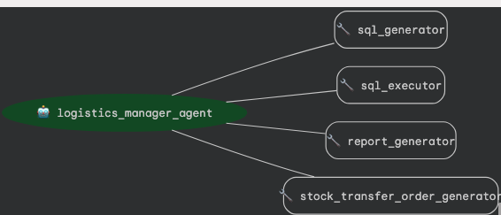  
<br><br>

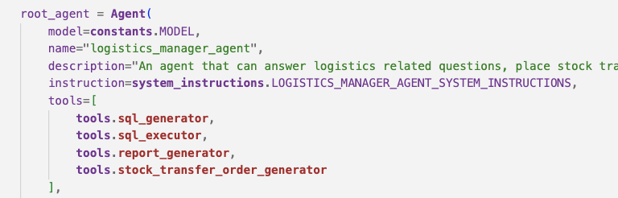  
<br><br>

<hr>

## 5. Agent grounding overview

Browse Cloud Storage bucket to see the grounding file that has the metadata. [We covered this in Module 20.](https://github.com/GoogleCloudPlatform/retail-data-to-ai-workshop/blob/ADK-MCP-Primer/03-lab-manuals/Module_20_Capstone_Setup.md#16-about-the-bigquery-metadata-persisted-to-gcs-for-agentic-grounding)


<hr>

## 6. Agent instructions overview

Review the [agent instructions](../02-code-assets/capstone-retail-solution/logistics_manager_agent/logistics_manager_agent/system_instructions.py).

<hr>

## 7. Prep for running agent locally

### 7.1. Set up a Python virtual environment in VS code / your IDE's terminal

Run the below in your terminal-
```
python -m venv .venv
source .venv/bin/activate
```

### 7.2. Install the Python dependencies

You dont need any incremental dependencies.


### 7.3. Update the env file 

Run the below in the terminal:
```
PROJECT_ID=`gcloud config list --format "value(core.project)" 2>/dev/null`
PROJECT_NBR=`gcloud projects describe $PROJECT_ID | grep projectNumber | cut -d':' -f2 |  tr -d "'" | xargs`
LOCATION="us-central1"

cd ~/retail-data-to-ai-workshop/02-code-assets/capstone-retail-solution

sed -i s/'LOCATION'/$LOCATION/g logistics_manager_agent/logistics_manager_agent/.env
sed -i s/'PROJECT_ID'/$PROJECT_ID/g logistics_manager_agent/logistics_manager_agent/.env
sed -i s/'PROJECT_NBR'/$PROJECT_NBR/g logistics_manager_agent/logistics_manager_agent/.env
sed -i s/'PROJECT_ID'/$PROJECT_ID/g logistics_manager_agent/logistics_manager_agent/.agent_engine_config.json
```

<hr>

## 8. Run `adk web` and test the agent locally/cloud shell

### 8.1. Launch `adk web`

In the terminal navigate to the top level logistics_manager_agent directory and run the command below.<br>

```
adk web
```

### 8.2. Try out a few prompts

See the screenshots below and try out a few prompts.

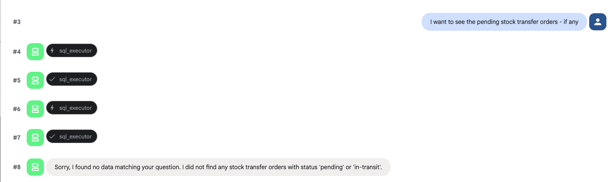  
<br><br>

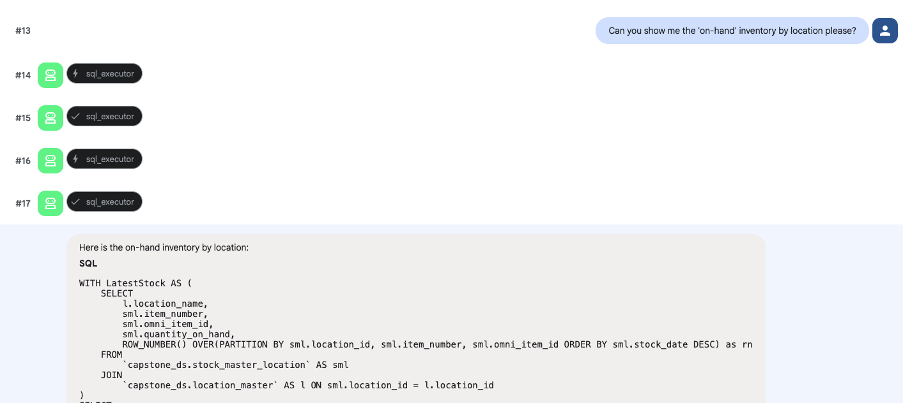  
<br><br>

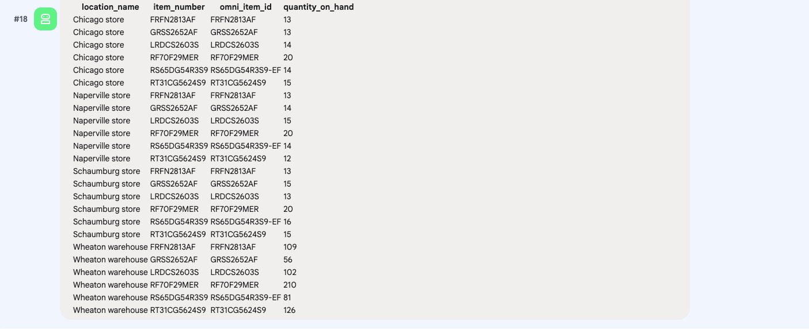  
<br><br>

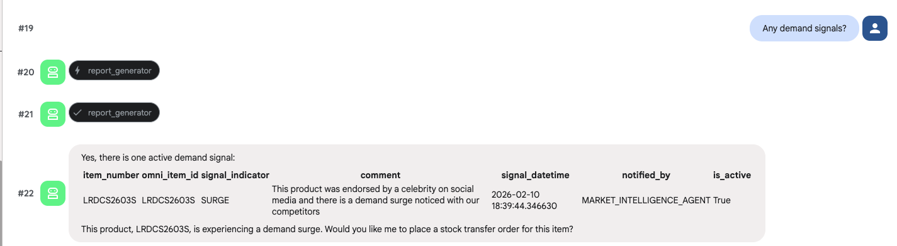  
<br><br>

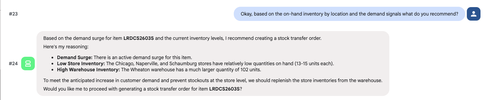  
<br><br>

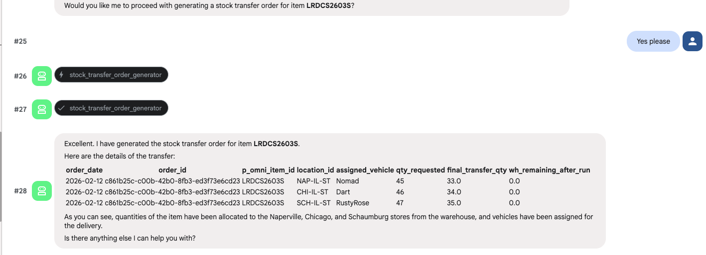  
<br><br>

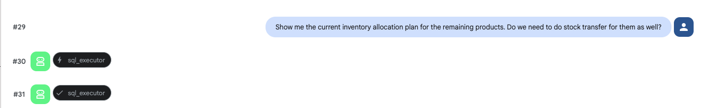  
<br><br>

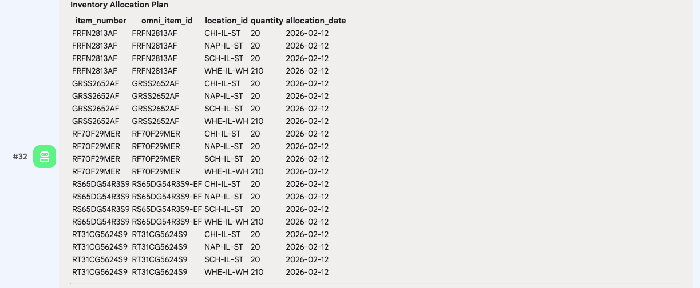  
<br><br>

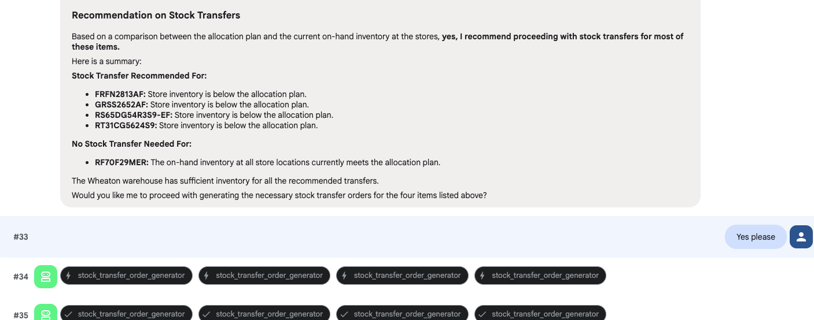  
<br><br>

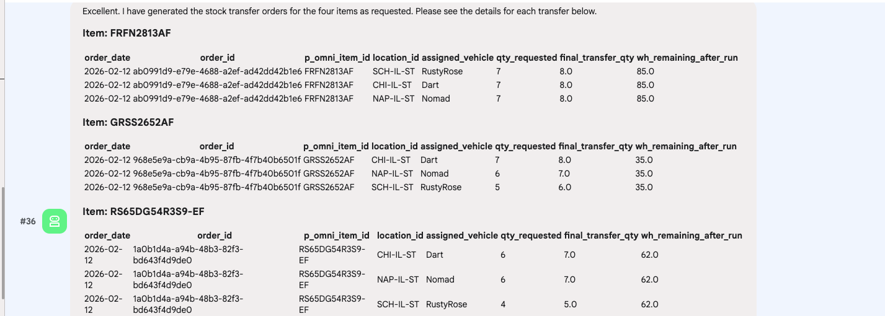  
<br><br>

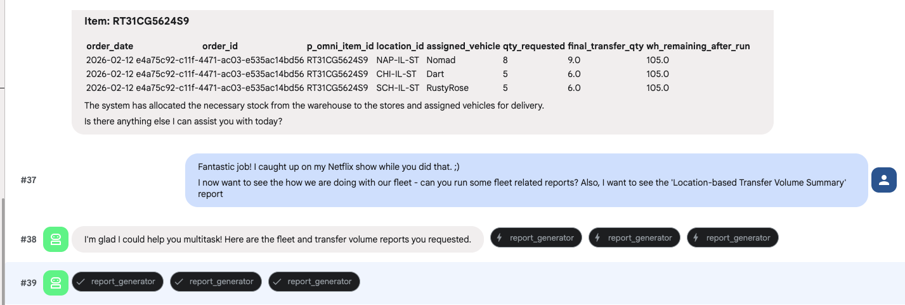  
<br><br>

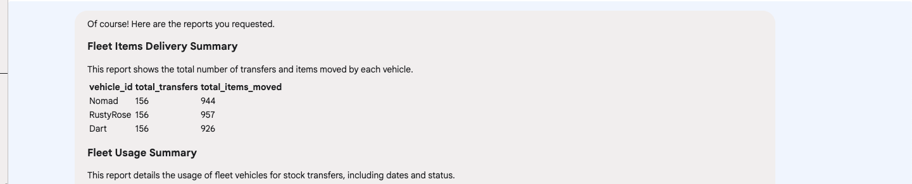  
<br><br>

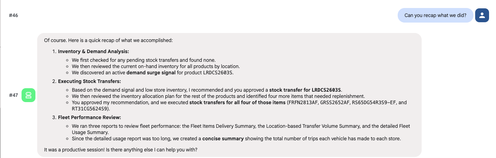  
<br><br>

  
<br><br>

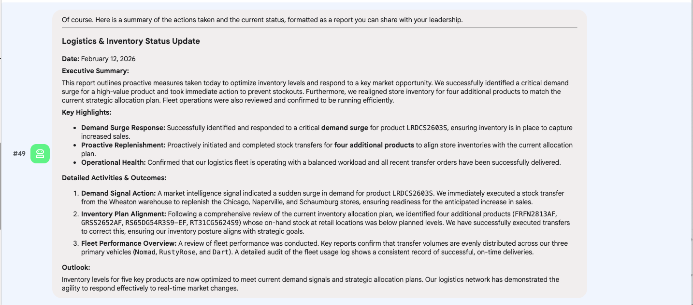  
<br><br>

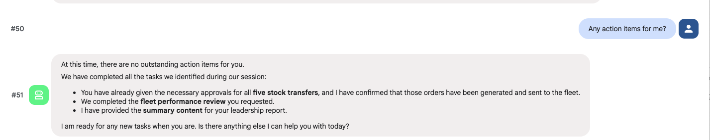  
<br><br>

Now that we have a solid prototype of an agent, lets deploy to Agent Engine.

<hr>

## 9. Deploy & test the Logistics Manager Agent on Agent Engine

### 9.1. Deploy the agent to Agent Engine

Run this from within the top level logistics_manager_agent folder, from CLI. This will automatically read in any configs in agent_engine_config.json
```
PROJECT_ID=`gcloud config list --format "value(core.project)" 2>/dev/null`
PROJECT_NBR=`gcloud projects describe $PROJECT_ID | grep projectNumber | cut -d':' -f2 |  tr -d "'" | xargs`
AGENT_ENGINE_LOCATION="us-central1"

adk deploy agent_engine \
--project=$PROJECT_ID   \
--region=$AGENT_ENGINE_LOCATION   \
--display_name="Logistics Manager"   \
--description="An agent that can generate place pruchase orders with suppliers and run a a variety of reports and answer adhoc questions" \
--staging_bucket=gs://agent-deployment-bucket-$PROJECT_NBR   \
--env_file="./logistics_manager_agent/.env"   \
--trace_to_cloud   \
./logistics_manager_agent
```


### 9.2. Review the deployment on the Cloud Console

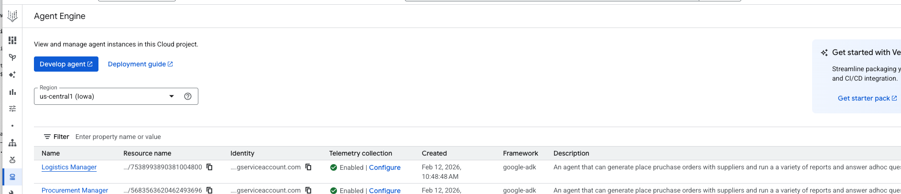  
<br><br>

### 9.3. The Reasoning Engine ID

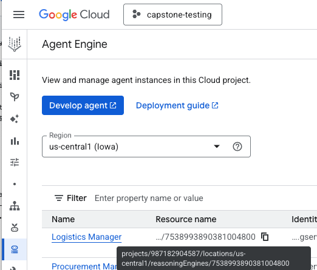  
<br><br>


### 9.4. The identity of the deployed agent 

We are running the agent as a (custom) user managed service account.

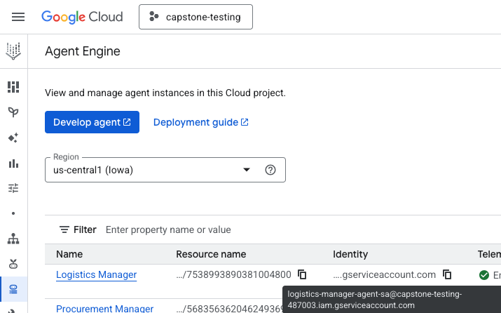  
<br><br>


### 9.5. Recap the permissions we granted in previous sections

The agent runs as the Logistics Manager service account on Agent Engine. Lets review the IAM permissions

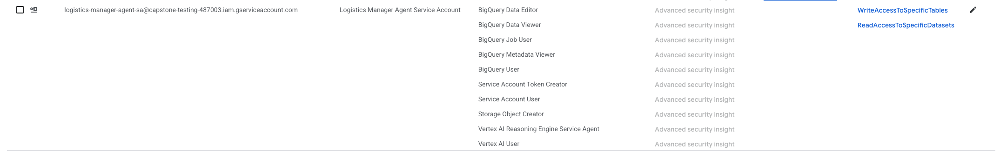  
<br><br>

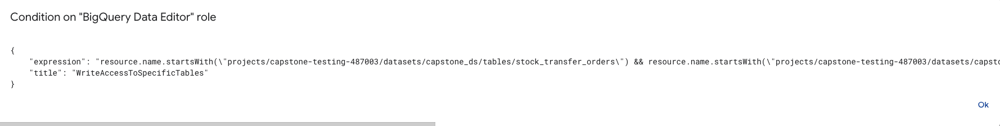  
<br><br>

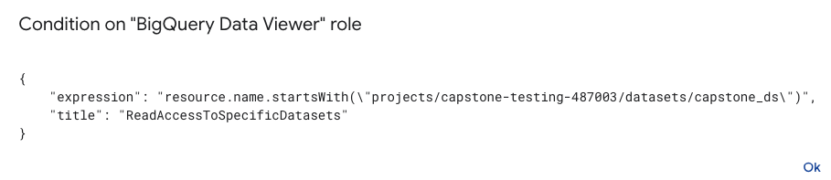  
<br><br>


### 9.6. Retrieve the Logistics Manager Agent ID from the Agent Engine deployment

We will need to test via Python..
```
AGENT_ENGINE_LOCATION="us-central1"
PROJECT_ID=`gcloud config list --format "value(core.project)" 2>/dev/null`
logistics_manager_agent_ID=`curl -X GET   -H "Authorization: Bearer $(gcloud auth print-access-token)"   "https://$AGENT_ENGINE_LOCATION-aiplatform.googleapis.com/v1/projects/$PROJECT_ID/locations/$AGENT_ENGINE_LOCATION/reasoningEngines"  |  grep -3 Demand | grep name | cut -d'/' -f6 | cut -d'"' -f1`
echo $logistics_manager_agent_ID
```

### 9.7. Update the .env file with the agent ID retrieved

This is useful to test prorammatically with test.py in the codebase. Run the below in the terminal:
```
sed -i s/'TBD'/$logistics_manager_agent_ID/g ~/retail-data-to-ai-workshop/02-code-assets/capstone-retail-solution/logistics_manager_agent/logistics_manager_agent/.env
```

### 9.8. Test the  Logistics Manager Agent on Agent Engine in the "Playground"

Navigate to the `Playground` tab and try out a few prompts.<br>
Here is a prompt you can try out:
1. Show me the pending Stock Transfer Orders


<hr>

This concludes the module. Please proceed to the [next module](Module_26_Autonomous_Agentic_action.md).


