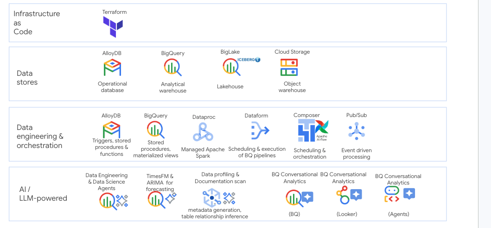
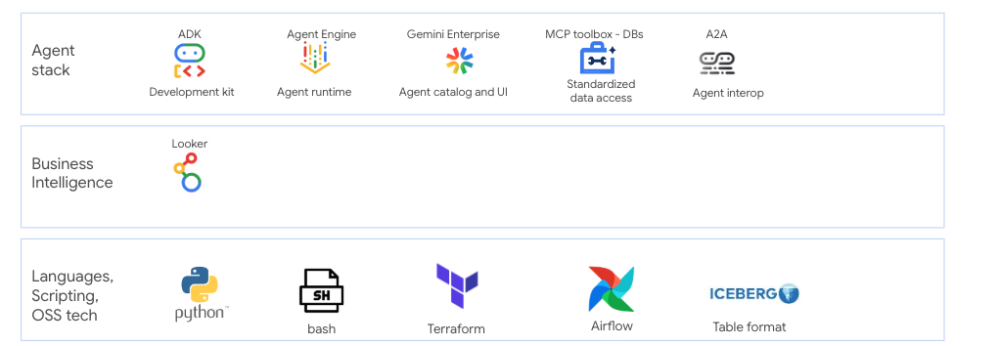
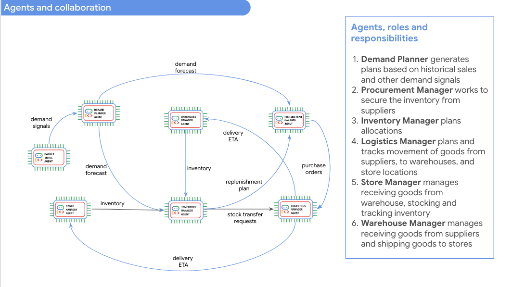
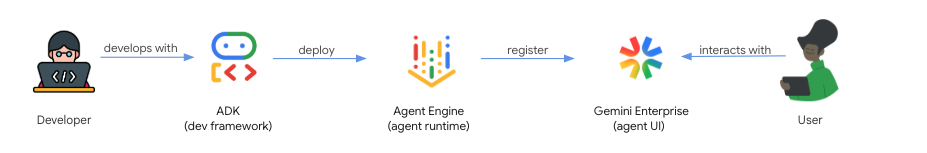

# Demystifying Google Cloud Products for Retail & Supply Chain - Data & AI applications

This repository hosts `tutorials for LLM powered data & AI products` that can be leveraged in a Data-to-AI estate on Google Cloud. 

## Features  
(1) **Learning modules** - each covering a practical problem to be solved, architecture & considerations, code and configuration, and comprehensive instruction manuals, links to product documentation, and best practices for an immersive learning experience.   

(2) **Primer on creating custom agents** with Agent Development Kit (ADK), hosting on Agent Engine with UI on Gemini Enterprise and leveraging MCP toolbox for databases   

(3) **Fully functional multi-agent, autonomous agent `retail supply chain solution` (with public/synthetic data) for preventing stockouts** featuring the best of breed data and agent development techncial stack on Google Cloud.   
In some cases, the latest features are showcased, in public preview, and may also include features in private preview. 

Note: This repository will be kept current and new features will be steadily added, you can stay tuned by following the [roadmap](ROADMAP.md).

## Objective
The objective is to demystify Google Cloud products and services for data and agentic development through a fully scripted hands-on and immersive learning experience with a relatable use case. 

##  Disclaimer
1. This repository and its contents are not an official Google Product.
2. The code in this repository ***is intended for educational purposes***. While it can be used to quickstart development by enterprises, due diligence and hardening of the code is required for deployment to higher environments
3. The architecture showcased ***does not dictate*** retail and supply chain architecture, but merely how to use Google Cloud products to solve business problems.

## Audience
The intended audience is anyone with interest in learning Google Cloud products. 

## Format & Duration
The tutorials are fully scripted (no research needed), with (fully automated) environment setup (coming soon), data, code, commands, notebooks, orchestration, and configuration. 

**Option 1 - DIY:**   
Clone the repo and follow the step by step instructions for an end to end developer experience. 

**Option 2 - Instructor-led workshop:**  
If you are a Google Cloud customer, you can reach out to your Google account team, and ask for an (no-cost) instructor-led workshop running on your GCP project (you will be responsible for GCP consumption). 

**Option 3 - Strapped for time / no GCP environment / dont need to try out but interested in knowing:**  
Just read the content like a book, there are pictorial overviews and screenshots of exactly what each module covers.

**Time commitment:**  
Expect to spend ~12 hours to fully understand, read product documentation and execute the tutorials. 

## Dependencies

1. A Google Cloud project
2. IAM permissions to provision services, and grant IAM permissions
3. Basic knowledge of Google Cloud is useful, as is knowledge of comparabale platforms and techical stacks, but not required as comprehensive instructions are included
4. If a feature showcased is not accessible by you, it is likely a private preview feature and needs explicit allow-listing by the responsible product team. Reach out to your Google Cloud account team for help with allow-listing.

## Level

L200 - L300

## Technical Stack

  
  

  
  

## [Optional] Learning Modules
These learning modules give you a gentle introduction to Google Cloud's portfolio of LLM powered products. These modules are optional to try out if strapped for time. You can directly go to the capstone modules.

### Learning Modules - series

| Module # | Focus  |
| -- | :-- | 
|   0. | [**Provisioning**](03-lab-manuals/Module-00-Provisioning.md)  gcloud commands Terraform - coming soon | 
|   1. | [**BigQuery and AlloyDB interoperability**](03-lab-manuals/Module-01-AlloyDB-BQ-Interop.md)  BigQuery federation into AlloyDB AlloyDB foriegn Data Wrapper for BigQuery  | 
|  2a. | [**Data profiling with Dataplex**](03-lab-manuals/Module-02a-Data-Insights-API.md)   Summary statistics generation and persistence| 
|  2b. | [**Data Insights at a table level for agentic grounding**](03-lab-manuals/Module-02b-Data-Insights-API.md)   LLM-powered table description generation  LLM-powered table column description generation   LLM-powered golden query generation (question and SQL pairs) | 
|  2c. | [**Data Insights at a dataset level for agentic grounding**](03-lab-manuals/Module-02c-Data-Insights-API.md)   LLM-powered dataset description generation  LLM-powered table relationships inference   LLM-powered cross table golden query generation (question and SQL pairs) | 
|   3. | [**(No code) Data Warehouse star schema code generation with BigQuery Data Engineering Agent**](03-lab-manuals/Module-03-Data-Engineering-Agent-For-Warehousing.md)  Have the Data Engineering Agent generate baseline Data Warehouse star schema with just prompts. Then run the same on Dataform and validate.  |
|   4. | [**(No code) Reporting Data Mart code generation with BigQuery Data Engineering Agent**](03-lab-manuals/Module-04-Data-Engineering-Agent-For-Reporting.md)  Have the Data Engineering Agent generate baseline Reporting Data Mart reports with just prompts. Then run the same on Dataform and validate.  | 
|   5. | [**(No code) Data QnA Agent standup in a minute with Conversational Analytics API**](03-lab-manuals/Module-05-Conversational-Analytics.md)   Zero code data QnA agent standup in the BigQuery UI with just instructions.  | 
|   6. | [**(No code) Exploratory Data Analysis with just prompts powered by BigQuery Data Science Agent on Colab Enterprise notebooks**](03-lab-manuals/Module-06-EDA-with-Data-Science-Agent.md)  Have the Data Science Agent on Colab Enterprise run Exploratory Data Analytics with just prompts. You can then enhance this as needed, include update data with code generated by Data Science Agent.  | 
|   7. | [**Time series forecasting with TimesFM and ArimaPlus in BigQuery**](03-lab-manuals/Module-07-Forecasting-WithTimesFM.md)  Zero shot forecasting with TimesFM in BigQuery SQL and comparing with ArimaPlus in BigQuery. We will forecast retail sales and also item sales.  | 
|   8. | [**Generate content with SQL with Generative AI functions in BigQuery**](03-lab-manuals/Module-08-GenAI-Functions-In-BQ.md)  Using Generative AI functions in BigQuery - we will generate product descriptions and user manuals. We will learn to do keyword extraction, play with knobs for te same, then do sentiment analysis of product reviews   | 
|   9. | [**Embedding generation and vector search in BigQuery with just SQL**](03-lab-manuals/Module-09-Embedding-Gen-And-Vector-Search-In-BQ.md)   We will generate product images based on descriptions. We will then generate embeddings for the product description and images and learn to do text-to-text search as well as text-to-image search - all from within BigQuery with SQL  | 
| 10a. | [**Apache Iceberg Lakehouse in BigQuery with managed Iceberg tables**](https://github.com/anagha-google/retail-supply-chain-workshop/blob/main/03-lab-manuals/Module-10a-Apache-Iceberg-Lakehouse.md)   We will learn to create an Apache Iceberg lakehouse with BigQuey managed Iceberg tables, and learn to run DML operations on Iceberg with BigQuery SQL. We will also query these tables with Apache Spark on Dataproc Servereless to fetch the freshest data.  | 

### Learning Modules - getting started

1. Review the dependencies and ensure they are met
2. Proceed to the [provisioning module](03-lab-manuals/Module-00-Provisioning.md).
3. Follow along each page of the user manual

### Learning Modules - roadmap
If you would like additional features to be showcased, log an issue with details. 
To see what is coming, click [here](ROADMAP.md).

## Capstone - Autonomous Multi-agent Retail Supply Chain Solution

In the capstone modules you will use some of the learnings from the modules above, and stand up a minimum viable multi-agent, autonomous retail supply chain agent solution with the best of breed Google Cloud services.

### Capstone Agents and their collaboration

  
  

### Capstone Technical Stack

  
  

### Capstone Agent Development Continuum

  
  

### Capstone Agent Capabilities

  
  

### Capstone Agent Roadmap

## Issues

Share you feedback, and issues encountered, by logging issues.

## Cleanup

If you provisioned a GCP project to run through this content, you can simply shut down the project to stop spend. Alternately, you can delete instances, shut down individual services. Terraform for cleanup is on the roadmap and will be made available.

## Contributing

Contributions to this library are always welcome and highly encouraged.

See [CONTRIBUTING](CONTRIBUTING.md) for more information on how to get started.

Please note that this project is released with a Contributor Code of Conduct. By participating in
this project you agree to abide by its terms. See [Code of Conduct](CODE_OF_CONDUCT.md) for more
information.

## Authors

This repository and content is maintained by the Google AI Ready Data Cloud Solution Architect team.

| # | Contributor  | Role |
| -- | :-- |  :--- |
| 1. | Anagha Khanolkar | Vision, primary author & technical architect |
| 2. | Ashwin Sridhar | Industry subject matter expertise - Supply Chain |
| 3. | Ryan Price | Industry subject matter expertise - Retail |

## License

Apache 2.0 - See [LICENSE](LICENSE) for more information.

